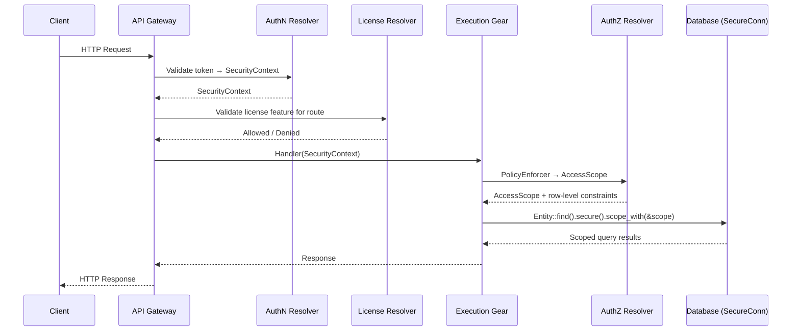

# Constructor Fabric Gears Architecture Manifest

> This document describes the architectural direction and the implemented architectural foundations of the Constructor Fabric Gears repository. It is intended as a readable blueprint for architects and contributors who want to understand how the platform is structured, why the main technical decisions were made, and which capabilities are already present in the codebase.
>
> Status markers use repository evidence. An item is marked `[x]` only when logic is implemented in this repository today.

## 1. Overview

Constructor Fabric Gears is a secure, modular XaaS development framework and middleware. It sits between low-level infrastructure and product-specific logic, providing reusable toolkit, runtime foundations, and service-level gears that teams compose into services, applications and platforms.

This repository contains the **Rust implementation**. The Constructor Fabric Gears ecosystem may include additional repositories in other languages (e.g. C#, Go) sharing the same architecture patterns, API conventions, and security model.

Constructor Fabric Gears is not a ready-to-use service — it is a set of well-integrated libraries (gears) that XaaS vendors compose into their own products. Vendors decide which gears to include, how to combine them into services, and on what infrastructure to run. Every gear owns its API surface and database, communicates with other gears via a Rust-native SDK that facades local vs. remote calls, and is fully infrastructure- and deployment-agnostic.

## 2. Non-goals

1. Constructor Fabric Gears doesn't optimize for **minimalism** or the lowest barrier to entry

Constructor Fabric Gears does not aim to be the simplest or smallest framework for building SaaS or AI applications. It intentionally prioritizes explicit structure, security, scalability,governance, composability, and long-term evolvability over quick-start simplicity or minimal configuration.

2. Constructor Fabric Gears doesn't provide a **rich catalog of end-user services** out of the box

Constructor Fabric Gears does not aim to ship a comprehensive set of ready-made, end-user SaaS services (e.g. CRM, ticketing, billing products) as part of its core. Its primary focus is the foundational layer — runtime, control plane, GenAI capabilities, workflows, and extensibility — on top of which vendors and product teams build their own complete SaaS offerings.

3. Constructor Fabric Gears doesn't attempt to replace **cloud infrastructure or PaaS layers**

Constructor Fabric Gears is not a replacement for cloud providers or infrastructure platforms such as AWS, Azure, GCP, or on-prem orchestration stacks. It does not offer physical infrastructure, networking, container orchestration, or low-level resource scheduling. Instead, Constructor Fabric Gears intentionally positions itself above IaaS/PaaS and below vendor-developed SaaS, focusing on application-level services, governance, and GenAI enablement.

## 3. Architectural principles

These patterns describe the repository's architectural direction. Most are enforced in the codebase today; forward-looking items explicitly state that status.


### 3.1. Secure XaaS framework with defense-in-depth

Constructor Fabric Gears allows building XaaS services using ready-to-use building blocks, domain model elements, and APIs where security is structural, not opt-in. Every API handler enforces authentication, authorization, tenant isolation, and scoped database access by default. The platform owns the security data path — from token validation through policy enforcement to row-level database scoping — so gear developers get multi-tenancy and granular access control without implementing it themselves.

#### 3.1.1. Secure-by-default data path

The architecture makes the insecure path harder than the secure one. Gear developers get tenant-scoped, authorized database access by default.

**How.** The security data-path is a linear chain:

1. **Static checks** — Custom lints and CI workflows catch violations at build time (e.g. domain layer importing infra, raw SQL outside migrations).
2. **Authentication** — API Gateway validates tokens and injects `SecurityContext` into every request. Gears never parse tokens.
3. **Authorization** — Handlers call `PolicyEnforcer`, which queries the PDP plugin. The PDP returns a decision plus row-level constraints, compiled into an `AccessScope`.
4. **Database scoping** — Gears access the database through `SecureConn`, which applies `AccessScope` as automatic WHERE clauses to implement tenant-level isolation and ABAC. Raw connections are not exposed.
5. **Credentials storage** — vendors can use the `credstore` gear to manage secrets.
6. **Outbound traffic** — External HTTP goes through `oagw`, which centralizes credential injection and egress policy.

**Why.** There is no "unscoped" shortcut to accidentally use.

#### 3.1.2. Architecture enforced at compile time

Constructor Fabric Gears treats custom static analysis as a core architectural mechanism, not a best-effort coding aid. Architectural boundaries, API conventions, GTS usage rules, and security restrictions are enforced during builds through repository-specific Dylint rules.

**How.** The workspace includes `tools/dylint_lints/`, a dedicated Dylint suite that checks contract-layer purity, DTO placement and schema derives, domain-layer isolation, direct SQL restrictions, versioned REST paths, mandatory `OperationBuilder` metadata, OData extension usage, GTS identifier correctness, and other cross-cutting rules. These lints run alongside the normal Rust toolchain and CI checks, which means architectural violations fail fast before review or runtime.

This is a shift-left quality mechanism: the repository pushes correctness, consistency, and architecture conformance into compile-time and CI-time validation rather than relying only on code review.

**Why.** In a large modular platform, architecture decays quickly if it lives only in markdown. Dylint makes the desired structure executable and keeps both human contributors and AI-assisted changes inside the intended design envelope.

### 3.2. Three-tier gear hierarchy

Constructor Fabric Gears organizes its codebase into three tiers:

- **Toolkit** (`libs/`) — a set of libraries providing the low-level substrate: API middleware, DB access, error definitions, transport abstractions, security primitives, observability, macros, and shared utilities.
- **System gears** (`gears/system/`) — Pre-built system gears that form the control plane: inbound/outbound API gateway, authn/authz resolvers, tenant resolver, resource groups, type registry, node registry, usage collection, and related cross-cutting services.
- **Service gears** (`gears/`) — Ready-to-use and vendor-developed business gears built on top of the platform: serverless runtime, GenAI subsystems, event system, chat engine, file parser, and domain-specific services.

See: [GEARS.md](GEARS.md)

#### 3.2.1. DDD-light layer isolation

Constructor Fabric Gears follows a DDD-light structure in which domain logic is kept free from transport and infrastructure details, while REST/gRPC adapters and infra layers handle boundary-specific concerns.

**How.** The standard gear layout separates SDK contracts, gear bootstrap, domain logic, API adapters, and infrastructure. Domain types and services live under `domain/`, REST DTOs and route wiring stay in API-facing layers, and persistence/integration logic stays in infra. This boundary is reinforced not only by structure but also by custom Dylints and the `#[domain_model]` macro requirement for domain-layer types.

**Why.** Business logic stays easier to test, reuse, and evolve because it is not entangled with HTTP, database, or framework details. At the same time, adapter code remains explicit about where transport translation and persistence concerns begin.

#### 3.2.2. Declarative gear discovery and composition

Constructor Fabric Gears composes systems by declaration and discovery rather than by hand-written assembly code. Gears declare capabilities and dependencies; the runtime discovers them, builds a dependency-ordered registry, and wires the system from those declarations.

**How.** ToolKit uses the `inventory` crate to collect gear registrators across the workspace and feed them into `GearRegistry::discover_and_build()`. The resulting registry is topologically sorted from declared dependencies before the host runtime starts executing phases. This means a gear contributes its capabilities once, in its own crate, and then becomes available to any host binary without bespoke composition glue.

**Why.** This keeps composition scalable as the repository grows. Adding a gear does not require editing a central switchboard, and dependency ordering becomes a platform guarantee rather than an application-specific convention.

#### 3.2.3. Platform-owned gear lifecycle

Gears do not invent their own startup and shutdown semantics. The platform defines an explicit lifecycle with ordered phases, barrier points, and dependency-aware teardown, and gears integrate into that lifecycle through capabilities.

**How.** `HostRuntime` runs a shared sequence of phases including `pre_init`, DB migration, `init`, `post_init`, REST wiring, gRPC wiring, start/stop, and OoP orchestration. System gears run first where required, `post_init` is a barrier phase that begins only after all `init` hooks complete, and shutdown runs in reverse dependency order with a platform deadline for graceful stop. Cancellation tokens propagate through the runtime so background work cooperates with shutdown rather than outliving the host.

**Why.** This gives all gears one predictable operational model. Contributors can rely on stable ordering guarantees, shared cancellation semantics, and consistent startup/shutdown behavior instead of encoding lifecycle assumptions ad hoc in each gear.

#### 3.2.4. Gear-owned schema, runtime-owned privilege

Persistence follows the same separation-of-concerns model as APIs and security: a gear owns its schema and migrations, but the runtime owns privileged execution of those migrations and withholds raw privileged DB access from gear code.

**How.** Gears expose migrations through `DatabaseCapability::migrations()`. During the DB phase, `HostRuntime` resolves the underlying database handle from the runtime-managed `DbManager`, collects migrations from each gear, and executes them through the migration runner. Gear code typically works with `DBProvider`, `SecureConn`, or higher-level repository abstractions rather than direct privileged connections, while migration history is tracked per gear.

**Why.** Schema evolution remains modular and local to the owning gear, but privilege stays centralized in the runtime. That reduces the chance of accidental cross-gear interference and keeps persistence governance aligned with the repository's secure-by-default posture.

### 3.3. Composable libraries, vendor-controlled deployment

Constructor Fabric Gears does not ship ready-to-use services. It ships a set of well-integrated libraries that vendors compose into their own service binaries. Each gear is infrastructure-agnostic and deployment-agnostic, supporting three deployment shapes:

- **Single-node** — all gears in one process. Suitable for edge devices, on-prem appliances, development, and testing.
- **Multi-node** — gears distributed across processes or machines over REST API or gRPC, without container orchestration. Suitable for bare-metal on-prem or small-scale deployments.
- **Kubernetes cluster** — gears as containerized services with full orchestration and cloud-native operations.

Gears talk to each other through a Rust-native SDK that facades the communication interface (local vs. remote) and encapsulates internal logic. The platform provides DB-agnostic persistence (SeaORM-based) and infrastructure-agnostic cluster primitives (distributed cache, distributed locks, leader election, service discovery).

#### 3.3.1. SDK-first contract separation

Every gear's public API lives in a dedicated SDK package (`<gear>-sdk/`) containing only the interface definition, transport-agnostic models, and error types. The implementation depends on the SDK, never the other way around.

**How.** The compiler enforces this boundary — implementation-private types are not in scope for consumers. REST endpoints use `OperationBuilder`, which requires each route to declare its method, path, auth posture, request/response schemas, and error types at registration time. `OpenApiRegistry` collects these declarations and generates `/openapi.json` automatically. Because metadata lives next to handler wiring (not in a separate spec file), it stays in sync with the code by construction.

**Why.** Refactoring gear internals is safe as long as the SDK interface stays compatible. Consumers can develop and test against SDK types alone. The OpenAPI spec is always consistent with the running code.

#### 3.3.2. Infrastructure-agnostic deployment model

Constructor Fabric Gears separates service logic from service packaging. Gear logic lives in libraries; final service binaries compose those libraries for a specific deployment shape.

**How.** Gear contracts are transport-agnostic: in-process gears register local adapters in `ClientHub`; out-of-process gears register REST/gRPC clients implementing the same SDK interface. A YAML config field (`runtime.type: local | oop`) switches modes without code changes. The platform provides DB-agnostic persistence through a SeaORM-based `SecureConn` abstraction and infrastructure-agnostic cluster primitives (distributed cache, distributed locks, leader election, service discovery) that resolve against operator-selected backends at startup.

**Why.** This makes Constructor Fabric Gears not just cloud-provider-agnostic, but deployment-topology-agnostic. Teams develop and test locally in single-node mode, deploy bare-metal services for on-prem or edge products, and scale to Kubernetes when needed — all from the same gear code and contracts.

#### 3.3.3. Consistent API syntax and semantics

Constructor Fabric Gears does not treat HTTP shape, query conventions, and API description as local stylistic choices. Gears follow one API style built around versioned paths, typed route registration, shared middleware, OpenAPI generation, and standard query patterns such as OData for filtering and ordering.

**How.** `OperationBuilder` is the authoritative route-registration mechanism in ToolKit. A route declares method, versioned path, auth posture, license posture, request schema, response schema, tags, summary, and registered error responses in one place. `OpenApiRegistry` collects these declarations into the generated `/openapi.json`. For query shape, ToolKit exposes OData helpers such as `with_odata_filter`, `with_odata_orderby`, and `with_odata_select`, and workspace Dylints enforce that REST endpoints use the standardized extension methods rather than ad-hoc query conventions.

This produces one recognizable API dialect across gears:

- Versioned endpoints such as `/resource-group/v1/groups`
- Uniform OpenAPI publication through the gateway
- Shared pagination/filter/order conventions
- OData-style filtering for collection resources where applicable
- Consistent auth, rate-limit, timeout, and observability behavior at the gateway
- [x] Rate limiting — governor-based rate limiter with policy headers and inflight semaphores is implemented in the API Gateway middleware stack (`gears/system/api-gateway/src/middleware/rate_limit.rs`). OAGW has a separate rate-limiting implementation for outbound traffic.
- [~] License posture declaration — OperationBuilder declaration and base-license gate implemented; per-feature entitlement validation against license resolver pending.

**Why.** Consumers, SDK authors, tests, docs, and gateway behavior all stay predictable. A gear does not invent its own filtering language, pagination rules, or error envelope, so cross-gear tooling and client generation remain feasible.

#### 3.3.4. Canonical error taxonomy across transports

Constructor Fabric Gears is converging on one platform-wide error vocabulary instead of each gear inventing its own transport-level failure categories. The canonical error model aligns with the 16 standard gRPC categories and maps them into REST via RFC-9457 `Problem` documents while preserving machine-readable type identity through GTS.

**Status.** Foundation implemented; repository-wide migration still in progress.

**How.** `libs/toolkit-canonical-errors/` defines `CanonicalError` with the following 16 categories: `Cancelled`, `Unknown`, `InvalidArgument`, `DeadlineExceeded`, `NotFound`, `AlreadyExists`, `PermissionDenied`, `ResourceExhausted`, `FailedPrecondition`, `Aborted`, `OutOfRange`, `Unimplemented`, `Internal`, `ServiceUnavailable`, `DataLoss`, and `Unauthenticated`. Each category has typed context, an HTTP mapping, and a stable GTS type identifier. The canonical error stack then renders these errors as RFC-9457 `Problem` responses for HTTP while keeping the underlying category model suitable for future gRPC and internal SDK alignment.

This gives the platform one error taxonomy across:

- REST wire responses
- gear and SDK boundaries
- future gRPC transport
- observability and retry classification
- schema registration and contract validation

**Why.** Standardized error categories reduce drift, make retry behavior machine-readable, and keep API, SDK, and transport layers aligned. The same architectural decision also enables generated documentation and stronger static enforcement of allowed error patterns.

See more: [docs/arch/errors/DESIGN.md](arch/errors/DESIGN.md)

#### 3.3.5. Distributed coordination primitives

The next major architectural addition is a unified cluster coordination capability for distributed Constructor Fabric Gears deployments. The intent is to make cross-instance coordination a first-class platform concern rather than something each gear reinvents with ad-hoc locks, local registries, or deployment-specific glue.

**How.** The cluster gear is intended to provide four platform-level primitives behind stable contracts: distributed cache, leader election, distributed locks, and service discovery. Consumer gears will declare what they need and the platform will resolve those primitives against operator-selected backends. The design direction already visible in repository docs is that backends may vary by primitive, capability requirements will be validated at startup, cache-backed defaults will exist for other primitives, and watch/lifecycle semantics will be standardized across the coordination surface.

**Why.** Existing gears already show the need for shared coordination patterns such as node discovery, leader-elected background work, distributed rate limiting, and backend-dependent service location. Elevating these into one platform primitive keeps gear contracts stable across deployment shapes and prevents each gear from inventing incompatible coordination behavior.

### 3.4. Pre-integrated XaaS backbone

Gears and their API handlers have deep integration with the typical XaaS platform backbone: multi-tenancy, licensing and quota management, usage collection, event systems, credential management, and so on. Constructor Fabric Gears provides its own backbone gears for these concerns, but they are designed as replaceable — vendors can integrate with their existing backbone via the plugin system (e.g. connect an existing product catalog, provisioning system, or license enforcement engine) so the entire Gears fleet works with the vendor's own platform infrastructure.

#### 3.4.1. Cross-cutting services as replaceable gears

Authorization, authentication, tenancy, ingress, outbound traffic, type registries, and runtime orchestration are each implemented as a regular gear with its own SDK, lifecycle, and API surface — not hidden inside the framework.

**How.** Each concern publishes a public interface in an SDK package. The implementation registers itself in `ClientHub` (the typed service locator). Consumers resolve the interface at runtime and never depend on the implementation package. Example: `authz-resolver-sdk` defines the authorization interface; consumer gears resolve it from `ClientHub` without importing the resolver's internals. The same pattern applies to `authn-resolver`, `tenant-resolver`, `types-registry`, `oagw`, etc.

**Why.** Concerns can be swapped, tested in isolation, or deployed out-of-process without touching callers. The runtime assembles only the gears a given deployment needs.

### 3.5. Extensible domain model via Global Type System

The majority of Gears define an extensible domain model. Object metadata, types, and behavior can be customized through the [Global Type System (GTS)](https://github.com/globaltypesystem/gts-spec) — define new event types, user settings, LLM model attributes, permission schemas, and more without modifying existing gears or endpoints. CRUD API handlers can be further customized via API hooks and callbacks implemented as serverless functions and workflows, enabling vendors to inject domain-specific logic at well-defined extension points.

#### 3.5.1. Open-closed extensibility via plugins

New implementations are added without changing existing gears.

**How.** A host gear defines a plugin interface in its SDK and registers the plugin schema in the type registry. Plugin gears implement the interface and register as scoped clients in `ClientHub`, keyed by GTS instance ID. The host discovers plugins at runtime and routes to the selected one via a `vendor` config field. Adding a new backend (e.g. a custom auth provider) means writing a new plugin — the host and all its consumers stay unchanged.

**Why.** Third-party integrations are isolated with no dependency on platform internals beyond the SDK. Host gear tests remain stable when plugins are added or removed.

#### 3.5.2. GTS type extensibility

New data types are added without modifying existing gears or endpoints.

**How.** The [Global Type System](https://github.com/GlobalTypeSystem/gts-spec) provides versioned, schema-validated type definitions. New data types (event formats, document schemas, serverless workflows and functions, permissions, license types, custom attributes) can appear in the system without modifying existing endpoints or storage. In Rust, Constructor Fabric Gears derives GTS definitions directly from source code types and then registers the resulting JSON Schemas in the Types Registry. That means event schemas, plugin contracts, and other typed contracts can be generated from Rust code in the same way OpenAPI is generated from route declarations, instead of being maintained as hand-written side artifacts.

**Why.** Incompatible schema changes are caught at registration time. The type surface grows without code changes to existing gears, and contracts stay machine-verifiable.

See more in: [docs/REPO_PLAYBOOK.md](REPO_PLAYBOOK.md)

## 4. Why Rust

Rust is a strong fit for CF/Gears implementation because this repository is building a platform layer for long-lived XaaS systems, where concurrency, correctness, and maintainability matter more than short-term implementation speed alone.

- **Compile-time safety**
  - Rust eliminates broad classes of memory and concurrency failures before runtime.

- **Refactoring confidence**
  - Strong typing and compiler diagnostics make large architectural changes safer, especially when contracts span multiple crates.

- **Good fit for reusable platform code**
  - Libraries such as ToolKit, security layers, transport layers, and registries benefit from predictable performance and explicit interfaces.

- **Static analysis as part of architecture**
  - Rust's ecosystem, combined with Clippy and custom Dylints, allows many project rules to become enforceable at build time.

- **Operational efficiency**
  - A low-footprint runtime makes it practical to run realistic local/edge systems, end-to-end tests, and service combinations without depending on heavyweight environments.

## 5. Why a monorepo

The monorepo model is a natural fit because Constructor Fabric Gears is a co-evolving platform rather than a loose collection of unrelated packages.

- **Atomic contract evolution**
  - Core contracts and all consumers can be updated together.

- **Shared quality gates**
  - Lints, CI checks, testing flows, and security scanning stay consistent across the entire platform.

- **Integrated architecture validation**
  - Requirements, design, code, tests and examples can be validated in one workspace.

- **Better support for generated and assisted development**
  - A single repository context improves the feedback loop for architectural changes that cut across many crates.

## 6. Repository structure

The repository maps directly to the three-tier gear hierarchy described in §3.2:

- **`libs/` - Gears Toolkit**
  - Libraries providing the low-level substrate: API middleware, DB access, error definitions, transport abstractions, security primitives, observability, macros, and shared utilities.
  - This layer defines the engineering rules and runtime substrate that higher tiers reuse.

- **`gears/system/` — System gears**
  - Control-plane and cross-cutting system gears: API ingress, gear orchestration, authn/authz, tenancy, resource groups, types registry, nodes registry, outbound API gateway, and related services.
  - These gears carry much of the architectural weight of the repository because they establish the runtime model and platform guarantees.

- **`gears/` — Service gears**
  - Outside `gears/system/`, the broader `gears/` tree contains business and domain gears that deliver product functionality: serverless runtime, GenAI subsystems, event system, chat engine, file parser, and more (see [GEARS.md ](GEARS.md ) for the full inventory and roadmap).
  - All service gears follow the same ToolKit patterns, SDK conventions, and security model established by the toolkit and system gear tiers.

Additional assembly lives in `apps/`, where executable applications compose gears into examples of runnable systems.

## 7. ToolKit

ToolKit is the central framework of this repository. It turns the gear architecture into a reusable runtime discipline.

### 7.1 Toolkit capabilities

The `cf-gears-toolkit` crate and adjacent libraries provide the common substrate on which the rest of the repository is built.

What ToolKit provides:

- [x] **Inventory-based gear discovery**
  - Gears are discovered via the `inventory` crate and assembled into a registry.

- [x] **Gears lifecycle orchestration**
  - `HostRuntime` executes explicit phases such as `pre_init`, DB migrations, `init`, `post_init`, REST wiring, gRPC wiring, start/stop, and OoP orchestration.

- [x] **Type-safe in-process communication**
  - `ClientHub` registers and resolves typed gear clients without leaking transport details.

- [x] **REST and OpenAPI composition**
  - `OperationBuilder` and `OpenApiRegistry` make route metadata part of the architecture rather than an afterthought.

- [x] **Gear-owned database migrations executed by the runtime**
  - Gears provide migrations; the runtime executes them without handing out raw privileged DB access to gears.

- [x] **Security primitives**
  - `SecurityContext`, `AccessScope`, secure ORM patterns, and policy-enforcement integration are part of the stack.

- [x] **Observability primitives**
  - Tracing, OpenTelemetry integration, request IDs, and health endpoints are implemented in foundation and system layers.

- [x] **Transport flexibility**
  - In-process, REST, and gRPC all fit the same modular model.

- [x] **SSE streaming infrastructure**
  - ToolKit provides `SseBroadcaster<T>` for typed server-sent event fan-out over tokio broadcast channels, and `OperationBuilder::sse_json<T>()` for first-class SSE route registration with automatic OpenAPI schema generation. Gears use this for real-time streaming (e.g. AI token delivery) without implementing low-level event-stream plumbing.

- [x] **Transactional outbox**
  - `toolkit-db` includes a multi-stage transactional outbox pipeline (enqueue → sequence → process) with two processing strategies: transactional (exactly-once, in-DB) and leased (at-least-once, idempotent). The outbox supports partition-based parallelism, dead-letter lifecycle, and multi-database backends (PostgreSQL, MySQL, SQLite). Gears enqueue domain events inside the caller's transaction and the outbox pipeline delivers them asynchronously with reliable ordering.

- [x] **Typed gear configuration**
  - `GearCtx` provides `config::<T>()` and `config_expanded::<T>()` for typed, per-gear configuration loaded from YAML sections. Gears that can operate with defaults use `gear_config_or_default`; gears that require configuration use `gear_config_required`. The `#[derive(ExpandVars)]` macro expands `${VAR}` placeholders from environment variables in marked fields, keeping secrets out of config files.

See more: [docs/toolkit_unified_system/README.md](toolkit_unified_system/README.md)

### 7.2 Request Lifecycle

Constructor Fabric Gears defines how every authenticated request flows through a fixed platform-owned sequence before reaching gear business logic. This pattern is typical for XaaS control plane services: the platform resolves cross-cutting concerns such as authentication, authorization, and license validation up front, and provides explicit placeholders where that processing can be customized through plugins or extensions defined with GTS, for example to add a new licenseable feature or a new user role.



> The API Gateway owns authentication (token → `SecurityContext`) and license validation. Gear domain services own authorization: they call `PolicyEnforcer`, which queries the AuthZ Resolver and compiles the result into an `AccessScope`. The gear then passes that scope to `SecureConn` for row-level database filtering. Gear code never performs token parsing or tenant resolution directly. License validation is currently implemented at the base-license level; per-feature entitlement is pending. Usage collection (`gears/system/usage-collector/`) is planned but not yet implemented.

## 8. Gear model


See [GEARS.md ](GEARS.md ) for the full gear inventory.

### 8.1. Gear capabilities

In Constructor Fabric Gears, a gear is a logical runtime component with explicit dependencies, capabilities, API surface, and lifecycle.

- [x] Gears are registered and discovered through ToolKit.
- [x] Gears can expose typed SDK APIs.
- [x] Gears can expose REST endpoints.
- [x] Gears can own database schema and migrations.
- [x] Gears can participate in background runtime lifecycle.
- [x] Gears can run in-process or out-of-process.

### 8.2. DDD-light gear layout

The standard gear layout follows a Domain-Driven Design (DDD-light) structure:

- SDK crate for stable contracts
- gear crate for bootstrap and capability declaration
- domain layer for core logic
- API adapters for REST/gRPC boundaries
- infra layer for persistence and integration

- [x] SDK pattern is documented and used.
- [x] REST DTOs and transport concerns are separated from domain logic.
- [x] Domain-layer rules are reinforced by architectural lints.

## 9. Execution model

Constructor Fabric Gears supports both in-process and out-of-process gear execution. The logical gear model and contracts remain the same regardless of the physical deployment boundary.

### 9.1. In-process execution

The default mode is in-process composition: gears share one runtime, communicate through typed clients, and are wired together by ToolKit.

- [x] `ClientHub` implements typed in-process client resolution.
- [x] Gear lifecycle and REST/gRPC assembly are handled by the shared runtime.

### 9.2. Out-of-process execution

Gears can also run as separate processes communicating via gRPC.

- [x] `HostRuntime` contains explicit OoP orchestration hooks.
- [x] `toolkit-transport-grpc` exists as a transport library.
- [x] `docs/toolkit_unified_system/09_oop_grpc_sdk_pattern.md` documents the pattern.
- [x] `examples/oop-gears/` demonstrates the model with calculator examples.

## 10. Security architecture

Security in Constructor Fabric Gears spans the language choice, gear boundaries, DB access rules, policy enforcement, and CI controls. See [docs/security/SECURITY.md](security/SECURITY.md) for the full security architecture.

### 10.1 Security foundations:

- [x] **Rust safety baseline**
  - Memory safety, strong typing, and strict lint posture are part of the default development model.

- [x] **Secure ORM / compile-time scoping**
  - Secure DB access and scoping rules are enforced through ToolKit DB patterns and macros.

- [x] **Split AuthN/AuthZ architecture**
  - Authentication resolution and authorization resolution are modeled as separate system services.

- [x] **`SecurityContext` propagation model**
  - Request identity and scope flow through the platform as explicit data rather than thread-local magic.

- [x] **Policy-based tenant and group scoping**
  - Tenant hierarchy and resource groups act as platform inputs to authorization decisions.

- [x] **Outbound API security boundary**
  - OAGW (Outbound API Gateway) centralizes outbound HTTP policy, credential resolution, and egress hardening.

- [x] **Credential handling architecture**
  - `credstore` (`gears/credstore/`) and secrecy-aware types are present for secret handling.

- [x] **Static and CI security gates**
  - Clippy, custom Dylints, `cargo-deny`, CodeQL, fuzzing, and related scanners are part of the repo.

### 10.2 Tenant Data Model

Constructor Fabric Gears's authorization model is built on explicit tenant-owned data boundaries. The tenant topology is a hierarchical single-root tree: every resource belongs to exactly one tenant, tenant isolation is the default posture, and parent-to-child visibility can be constrained by barriers such as `self_managed`. Authorization distinguishes the subject's home tenant from the context tenant used for an operation, and resource groups add an optional grouping layer for access control within tenant boundaries rather than replacing tenant ownership.

- [x] Tenant topology is documented as a single-root hierarchy with parent/child relationships.
- [x] Tenant ownership is a first-class authorization dimension, typically carried as `owner_tenant_id`.
- [x] Barrier semantics exist for restricting parent visibility into subtrees.
- [x] Resource groups are tenant-scoped and act as an additional access-control structure, not a replacement for tenant isolation.

See more in: [arch/authorization/TENANT_MODEL.md](arch/authorization/TENANT_MODEL.md) and [arch/authorization/RESOURCE_GROUP_MODEL.md](arch/authorization/RESOURCE_GROUP_MODEL.md)

### 10.3 Authorization and Role Model

Constructor Fabric Gears uses a PEP → PDP → `AccessScope` pipeline for authorization. Domain services act as the PEP: they receive `SecurityContext`, build an `AccessRequest`, and call `PolicyEnforcer`, which delegates to the AuthZ resolver client. The PDP returns a decision plus constraints, and those constraints are compiled into an `AccessScope` that the secure DB layer applies as scoped query conditions. In practice, this means gear business logic does not embed policy engines or hard-code role semantics; it consumes platform authorization results expressed as tenant, resource, owner, and type filters.

- [x] `gears/system/authz-resolver/` provides a PDP client abstraction via `authz-resolver-sdk`.
- [x] `PolicyEnforcer` wraps `AuthZResolverClient`; domain services call `policy_enforcer.access_scope_with(ctx, resource_type, action, resource_id, properties)`.
- [x] `AccessScope` carries four constraint dimensions: tenant, resource, owner, and type.
- [x] `ScopableEntity` requires each DB entity to declare which column maps to each scope dimension.
- [x] `pep_properties` defines `OWNER_TENANT_ID` and `RESOURCE_ID`, and these properties are used in current gears.
- [x] `authz-resolver` plugs in via `ClientHub`; the platform does not hard-code a specific PDP.

- [ ] A default `authz-resolver` implementation with a built-in role model.
- [ ] Custom role definition by tenant admins.
- [ ] Documentation for attaching existing policy managers to Constructor Fabric Gears.
- [ ] Documentation of which resource types and actions each system gear exposes.
- [ ] A platform-level role catalog with roles available out of the box.

Example PEP call pattern from `gears/simple-user-settings/simple-user-settings/src/domain/service.rs`:

```rust
let scope = self
    .policy_enforcer
    .access_scope_with(
        ctx,
        &SETTINGS_RESOURCE,
        actions::GET,
        Some(user_id),
        &AccessRequest::new().resource_property(pep_properties::OWNER_TENANT_ID, tenant_id),
    )
    .await?;
```

> The `authz-resolver-sdk` crate defines the enforcement interface used by PEPs, including `AuthZResolverClient`, `PolicyEnforcer`, request/response models, and constraint compilation helpers. The PDP implementation is pluggable: Constructor Fabric Gears resolves it through `ClientHub` and plugin registration rather than bundling a single mandatory authorization engine in core.

See more details in: [arch/authorization/DESIGN.md](arch/authorization/DESIGN.md)

## 11. API, type, and error contracts

### 11.1. REST and OpenAPI

- [x] API Gateway builds a unified HTTP surface with health endpoints, middleware, auth, request IDs, tracing, timeouts, and docs endpoints.
- [x] Rate limiting — governor-based rate limiter with policy headers and inflight semaphores is implemented in the API Gateway middleware stack. OAGW has a separate rate-limiting implementation for outbound traffic.
- [~] License posture declaration — OperationBuilder declaration and base-license gate implemented; per-feature entitlement validation against license resolver pending.
- [x] `OpenApiRegistry` and `OperationBuilder` are implemented in ToolKit.
- [x] `/openapi.json` and `/docs` are served by the API gateway.
- [x] OData extensions are implemented in `OperationBuilder` for standardized `$filter`, `$select`, and `$orderby` support.
- [x] Workspace Dylints enforce versioned endpoints and standardized OData extension usage.

The important architectural point is that OpenAPI is generated from the same Rust route declarations that wire the running service. Constructor Fabric Gears does not maintain a separate hand-authored HTTP contract description.

### 11.2. GTS contracts and schema generation

- [x] GTS schemas can be generated directly from Rust types
- [x] Plugin specifications already use this pattern in SDK crates such as `authn-resolver-sdk` and `mini-chat-sdk`.
- [x] Generated GTS JSON Schemas are intended for registration in the Types Registry.
- [x] GTS-specific Dylints validate identifier correctness and prevent unsupported schema-generation patterns such as `schema_for!` on GTS structs.

This is the non-HTTP counterpart to OpenAPI generation. OpenAPI describes REST endpoints; GTS-generated JSON Schema describes platform contracts and typed data beyond REST, including plugin specs, events, and other globally identified contracts. Together they let Constructor Fabric Gears derive both API and non-API contracts from Rust source rather than duplicating schemas manually.

### 11.3. RFC-9457 and canonical errors

- [x] RFC-9457 `Problem` handling is implemented in the ToolKit/API stack.
- [x] `libs/toolkit-canonical-errors/` provides typed canonical categories.
- [x] `libs/toolkit-canonical-errors-macro/` provides resource-scoped error helpers.
- [x] The canonical error foundation covers the 16 gRPC-aligned categories used as the platform-wide failure vocabulary.
- [ ] Repository-wide migration to canonical errors is not complete yet.

The canonical error model stabilizes failure semantics, improves machine-readability, reduces ad-hoc error drift, and aligns REST, future gRPC, and internal domain errors. It also connects failure semantics to GTS-backed type identity, so error categories become part of the platform contract surface rather than just human-readable messages.

## 12. Observability and operations

- [x] OpenTelemetry tracing initialization exists in `libs/toolkit/src/telemetry/`.
- [x] API Gateway implements request IDs, tracing, timeout layers, body limits, and structured access logging.
- [x] API Gateway exposes `/health` and `/healthz`.
- [x] Rate limiting — governor-based rate limiter is implemented in the API Gateway middleware stack. OAGW has a separate rate-limiting implementation for outbound traffic.
- [x] The repo contains CI workflows and test infrastructure aligned with operational quality.

## 13. Testing architecture

Constructor Fabric Gears defines a dual-layer testing strategy with an explicit zero-overlap rule between tiers. **Unit and integration tests** run in-process against SQLite `:memory:` with mocked AuthZ, covering domain invariants, validation, error chains, DTO conversions, and seeding logic — no HTTP, no real database. **End-to-end tests** (pytest against a running `cf-gears-server` with real Database) verify only integration seams that unit tests cannot see: JSON wire format, real AuthZ wiring, DB-specific SQL, and cross-gear SDK boundaries. Each unit test must pass three gating questions: (1) does it verify deterministic domain logic, (2) is it atomic and fast, and (3) does removing it reduce confidence in domain correctness.

See more: [docs/toolkit_unified_system/12_unit_testing.md](toolkit_unified_system/12_unit_testing.md) and [docs/toolkit_unified_system/13_e2e_testing.md](toolkit_unified_system/13_e2e_testing.md)