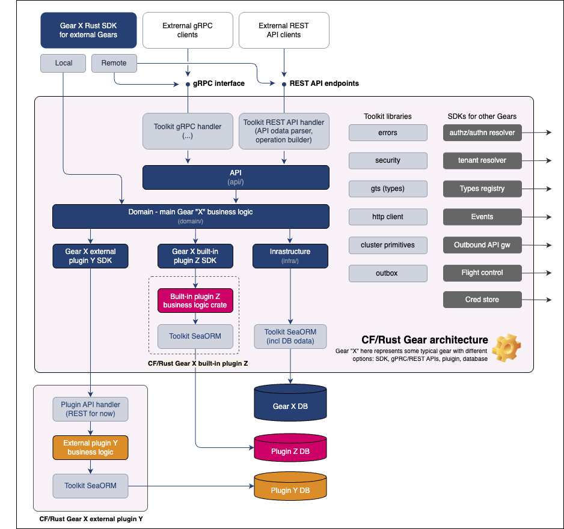
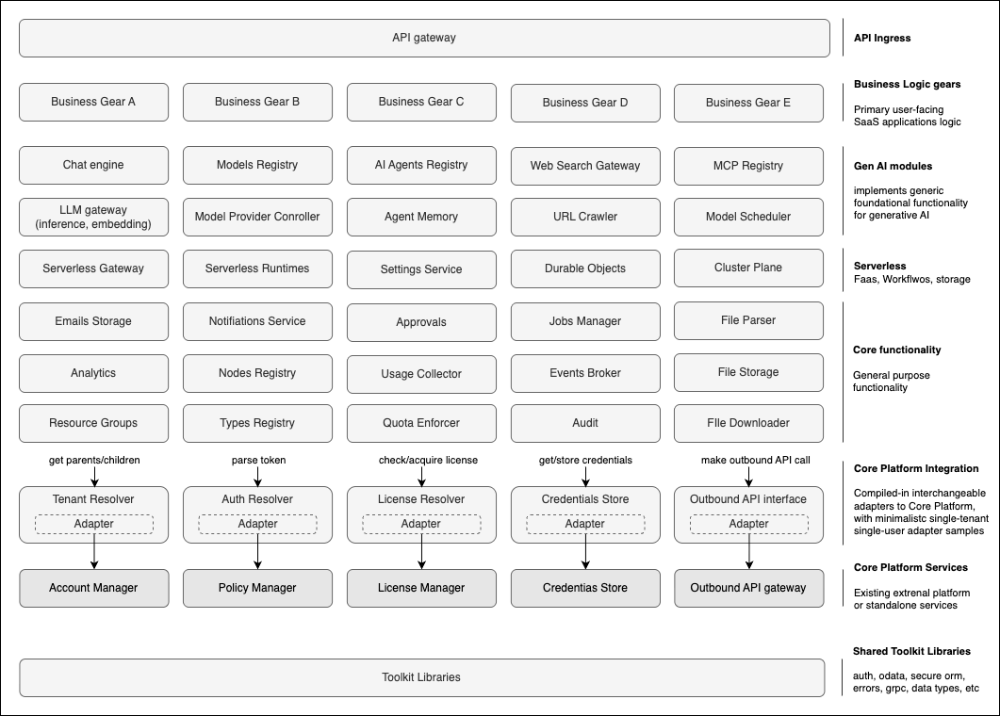
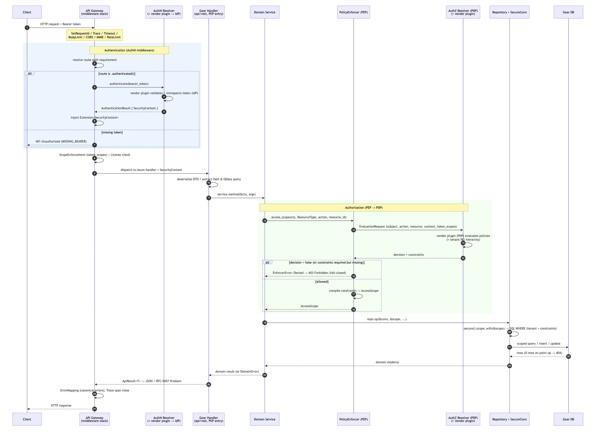

<!-- _class: lead -->

# Constructor Fabric Gears (Rust)

### A secure, modular XaaS development framework & middleware

By the **Cyber Fabric Foundation** · Apache-2.0

*Composable building blocks · Defense-in-depth · Multi-tenancy · GenAI-ready*

---

## Agenda

- **What & Why** — what Constructor Gears is, for whom, non-goals
- **Principles & Philosophy** — defense-in-depth, XaaS backbone, composability
- **Foundations** — why Rust, why monorepo, deployment shapes
- **Gears** — architecture overview, anatomy, execution
- **Gears Toolkit** — the runtime substrate & features
- **Cross-cutting** — request lifecycle, security, GTS, errors, observability
- **Engineering** — dev experience, spec-driven dev, testing
- **Getting started** — build, run, test, contribute

---

<!-- _class: lead -->

# Part 1 — What & Why

---

## What is Constructor Gear?

A **Gear** is the unit of composition in Constructor Gears.

Constructor Gears is a **secure, modular XaaS development framework and middleware** that helps you build XaaS products by composing gears:

- **Toolkit libraries** for reusable platform building blocks — OData, canonical
  errors, secure DB ORM, API middleware, security, and more
- **System gears** for platform and control-plane capabilities — events, API
  gateway, auth, tenant resolution, registries, and outbound integration
- **Domain gears** for business capabilities — GenAI, OSS, and BSS services with
  ready-to-use public APIs

Every layer has built-in **Defense-in-depth** - multi-tenancy, granular access control

> It is **not** a ready-to-use service — it is a set of well-integrated libraries
> that XaaS vendors **compose into their own services and products**.

---

## For whom?

- **XaaS / SaaS vendors** building products on a governed, multi-tenant backbone
- **Platform & product teams** who want security and tenancy *for free*
- **GenAI builders** needing chat, RAG, model management, agents, tools
- **On-prem / edge vendors** shipping single-binary appliances
- **Enterprises** embedding Gears into an existing platform via plugins

Vendors who use Gears decide **which gears to include**, **how to combine them**,
and **where to run them** — from edge devices to Kubernetes clusters.

---

## Non-goals

Constructor Gears deliberately does **not**:

1. **Optimize for minimalism / lowest barrier to entry**
   - Prioritizes explicit structure, security, governance, and evolvability.
2. **Ship a rich catalog of end-user services**
   - It is the *foundation* on which vendors build complete SaaS offerings.
3. **Replace cloud infrastructure or PaaS**
   - Gears are libraries and building blocks, not a ready PaaS

---

## Key defining characteristics

1. **Secure by default (defense-in-depth)** — security is structural, not opt-in, validated at build time.
2. **Architecture enforced at compile time** - use custom lint rules via `dylint`
3. **Three-tier gears hierarchy** — toolkit, System gears, Service gears.
4. **Composable libraries, vendor-controlled deployment** — own API + DB, SDK facades local vs. remote.
5. **Local-first shift-left development** - run and test everything locally, LLM-friendly
6. **Pre-integrated XaaS backbone** — tenancy, licensing, quota, usage, events — all replaceable via plugins.
7. **Extensible domain model and API data types** via the Global Type System (GTS).

---

<!-- _class: lead -->

# Part 2 — Architecture Principles & Philosophy

---

## Principle 1 — Secure by default (defense-in-depth)

The architecture makes the **insecure path harder than the secure one**.
The platform owns a **linear security data-path**:

1. **Static checks** — lints + CI catch violations at build time
2. **Authentication** — gateway validates tokens → injects `SecurityContext`
3. **Authorization** — `PolicyEnforcer` → PDP → decision + constraints → `AccessScope`
4. **DB scoping** — `SecureConn` applies `AccessScope` as automatic `WHERE` clauses
5. **Credentials** — `credstore`; **Outbound** — `oagw` egress policy

> There is no "unscoped" shortcut to accidentally use.

---

## Principle 2 — Architecture enforced at compile time

Custom static analysis is a **core architectural mechanism**, not a coding aid.

- `tools/dylint_lints/` — a dedicated Dylint suite that checks:
  - contract-layer purity, DTO placement & schema derives
  - domain-layer isolation, direct-SQL restrictions
  - versioned REST paths, mandatory `OperationBuilder` metadata
  - OData extension usage, GTS* identifier correctness
- Runs alongside Clippy + CI → **violations fail fast, before review or runtime**

> "Shift-left": architecture that lives in markdown decays; Dylint makes it executable.
> GTS* = Global Type System identifers like `gts.cf.core.events.v1~a.b.c.d.v1~`

---

## Dylint — compile-time architecture validation

Repository-specific lints in `tools/dylint_lints/` make the design **executable** — not just documented - code won't compile in case of violation:

- **Domain-layer isolation** — no infra imports (`sqlx`, `sea_orm`, ...) in `domain/`
- **Direct-SQL restriction** — raw SQL only in migration infrastructure
- **Versioned REST paths** — endpoints must be `/<gear>/v1/...`
- **Contract-layer purity** — SDK/contract crates stay transport-agnostic
- **Mandatory `OperationBuilder` metadata** — auth posture, error responses, schemas declared
- **OData extension usage** — standardized `$filter` / `$orderby` / `$select` helpers
- **GTS identifier correctness** — valid IDs; no `schema_for!` on GTS structs
- ...

> Runs Dylint in CI → architecture violations **fail the build** before review or runtime.

---

## Principle 3 — Three-tier gears hierarchy

| Tier | Path | Role |
|------|------|------|
| **Toolkit** | `libs/` | Low-level substrate: API middleware, DB access, errors, transport, security, observability, macros |
| **System gears** | `gears/system/` | Control plane: API gateway, authn/authz, tenancy, events, resource groups, type registry |
| **Service gears** | `gears/` | Business/domain: serverless runtime, GenAI subsystems, chat, file parser |

All tiers follow the **same** Toolkit patterns, SDK conventions, and security model.

---

## Principle 4 — Composable libraries, vendor-controlled deployment

- Constructor Gears **ships libraries, not services**
- Each gear is **infrastructure-, DB- and deployment-agnostic**
- Gears talk via a **Rust-native SDK** that facades local vs. remote calls
- DB-agnostic persistence (SeaORM `SecureConn`) + infra-agnostic cluster primitives

> Refactor internals freely — as long as the **SDK contract** stays compatible.

---

## Principle 5 — Local-first shift-left development

Composable libraries make it possible to run the full business logic locally on a
developer machine.

- Run gears locally to exercise real business logic — no Jenkins, Ansible, K8s
- AI-assisted tooling can inspect the diff and suggest which tests should run
- Coverage is easy to collect, and diff coverage makes it clear whether tests
  actually touched changed code
- Fast feedback keeps regressions visible before CI and before any deployment

> If it runs locally, it fails locally — long before a pipeline or release stage.

---

## Principle 6 — Pre-integrated XaaS backbone

Deep, *built-in* integration with the typical XaaS backbone:

- Multi-tenancy · permissions & roles· licensing & quota · usage collection

Every backbone concern is a **regular, replaceable gear** with its own SDK:

- Swap Constructor Gears' `authn-resolver`, `tenant-resolver`, etc. for **vendor systems**
- Integrate an existing product catalog / provisioning / license engine via **plugins**

---

## Principle 7 — Extensible domain model via GTS

- Most gears expose an **extensible domain model**
- The [Global Type System](https://github.com/globaltypesystem/gts-spec) provides
  versioned, schema-validated type definitions
- Add new **event types, settings, model attributes, permissions, license types** —
  *without modifying existing gears*
- **Open-closed via plugins**: host defines a plugin interface in its SDK; plugins
  register as scoped `ClientHub` clients keyed by GTS instance ID
- CRUD handlers customizable via **hooks/callbacks** as serverless functions/workflows

---

## Engineering principles (how we work)

- **Spec-Driven Development** — PRD → Design & ADR → Feature *before* code
- **Code validation** — custom Dylints + Clippy + tests + fuzzing + audits in CI
- **Quality First** — 90%+ coverage target across unit / integration / E2E / perf / security
- **Core in Rust** — compile-time safety + deep static analysis
- **Monorepo** — atomic refactors, consistent tooling, realistic local E2E

---

<!-- _class: lead -->

# Part 3 — Foundations

---

## Why Rust?

Building a **platform layer for long-lived XaaS systems** — concurrency,
correctness, and maintainability matter more than raw implementation speed.

- **Compile-time safety** — eliminates broad classes of memory & concurrency bugs
- **Great fit for reusable platform code** — predictable perf, explicit interfaces
- **Static analysis as architecture** — Clippy + custom Dylints enforce rules at build
- **Operational efficiency** — low footprint → realistic local/edge runs & E2E
- **AI-friendly** - great compiler and linters assistant to catch problems early
- **Universal language** — cloud/on-prem/edge, kernel + even frontend, mobile

---

## Why a monorepo?

Constructor Gears is a **co-evolving platform**, not a loose collection of packages.

- **Atomic contract evolution** — core contracts + all consumers updated together
- **Shared quality gates** — one set of lints, CI, tests, security scanning
- **Integrated architecture validation** — reqs, design, code and tests in one place
- **AI-friendly development** — single context improves the feedback loop
- **Full traceability and index** - suitable for autonomous & LLM-assisted development

---

## Deployment shapes (FUTURE)

Same gear code & API — three physical shapes via `runtime.type: local | oop`:

- **Single-node** — all gears in one process → edge, on-prem appliances, dev/test
- **Multi-node** — gears across processes/machines over REST/gRPC, no orchestration → bare-metal on-prem
- **Kubernetes** — containerized services, full orchestration, cloud-native ops

> Develop locally single-node → deploy bare-metal → scale to K8s, no rewrites.

---

## Repository structure

```text
cyberware-rust/
├─ libs/            # Toolkit — runtime substrate (middleware, DB, errors, security, macros)
├─ gears/
│  ├─ system/       # Control plane (api-gateway, authn/authz, tenant, registries, oagw)
│  └─ <service>/    # Business/domain & GenAI gears (mini-chat, file-parser, ...)
├─ apps/            # Executable apps composing gears (example server)
├─ examples/        # Reference gears (users-info, oop-gears, fips-probe)
├─ tools/           # Dylints, CI scripts, fuzz targets
└─ docs/            # Manifest, gears registry, toolkit_unified_system, arch, security
```

---

<!-- _class: lead -->

# Part 4 — What is a Gear in a nutshell?

---

## Gear = independent capability domain

> A **Gear** is a self-contained, composable unit of business capability that plugs
> into the platform. Directory is still `gears/<name>/`.

A Gear:

- **Owns its public API** via an SDK crate (`<name>-sdk`) — traits, models, errors
- **Owns its data** behind `SecureConn` + `AccessScope` (no raw DB access)
- **Is discovered at link time** via `inventory`, initialized in dependency order
- **Composes** through the typed `ClientHub` (in-proc) or gRPC SDKs (remote)
- **Is extensible** via built-in or external plugins
- **Published at crates.io** independently with it's own version

---

## Gear architecture (the big picture)



---

## Planned Gears map



---

## Gear anatomy — DDD-light layers

| Layer | Path | Responsibility |
|-------|------|----------------|
| **API** | `src/api/rest/` | DTOs, Axum handlers, `OperationBuilder` routes + OpenAPI. **PEP entry point** |
| **Domain** | `src/domain/` | Business logic, SDK trait impl, `#[domain_model]` types, **PEP enforcement** |
| **Infra** | `src/infra/` | SeaORM entities, repositories, migrations, adapters |

- **SDK-first**: implementation depends on the SDK, never the reverse
- `#[domain_model]` macro **rejects infra types** (sqlx, axum, reqwest...) in domain

---

## Gear execution model

The **logical model stays identical** regardless of the physical boundary.

- **In-process (default)** — gears share one runtime; communicate via typed `ClientHub` clients; wired by Tookit
- **Out-of-process** — gears as separate processes over **gRPC**
  - `HostRuntime` OoP orchestration hooks
  - `toolkit-transport-grpc` transport library
  - `examples/oop-gears/` demonstrates the pattern

> Switch modes with a YAML field (`runtime.type`) — **no code changes**.

---

## Gear composition — compiled-in vs selectable

Constructor Gears favors **explicit, reproducible composition** over opaque runtime magic.

- **Core system gears** are linked into the host binary and discovered via `inventory`
- **Optional gears/plugins** are included by Cargo feature flags such as
  `mini-chat`, `static-authn`, `static-authz`, `static-credstore`
- **Feature flags decide what code is present**; runtime config decides which vendor,
  plugin instance, or capability is used
- **Built-in plugins** run in-process and register scoped `ClientHub` clients
- **External plugins/gears** keep the same SDK contract but can run out-of-process over gRPC

> Result: small vendor-specific binaries, deterministic SBOMs, and the same extension model locally or remotely.

---

## Gear lifecycle (platform-owned)

`HostRuntime` runs a shared, ordered phase sequence:

```text
pre_init → DB migration → init → post_init(barrier)
        → REST wiring → gRPC wiring → start → ... → stop
```

- System gears run first where required
- `post_init` begins only after **all** `init` hooks complete
- Shutdown runs in **reverse dependency order** with a graceful-stop deadline
- **Cancellation tokens** propagate so background work cooperates with shutdown

---

## Gear categories


*API Ingress · Business Logic · GenAI · Serverless · Core Functionality ·
Core Platform Integration · Core Platform Services.* See `docs/GEARS.md`.

---

## Plugins & extensibility

- **Gateway Gear** defines a plugin interface in its SDK + registers the plugin schema in the Types Registry
- **Plugin Gears** implement the interface, register as **scoped `ClientHub` clients** keyed by GTS instance ID
- Host discovers plugins at runtime, routes to the selected one via a `vendor` config field
- **Built-in plugin** — compiled in, own business-logic crate + optional dedicated DB
- **External plugin** — separate deployable, own API handler + business logic + DB

> Add a new backend (e.g. a custom auth provider) = write a plugin. Host stays unchanged.

---

<!-- _class: lead -->

# Part 5 — Gears Toolkit

---

## Gears Toolkit — mission

Gears Toolkit is the **central framework** that turns the gear architecture into a **reusable runtime discipline**.

- Defines **how gears are declared, discovered, wired, and operated**
- Provides the **secure-by-default** substrate every Gear builds on
- Makes route metadata, schemas, and contracts **part of the architecture**, not afterthoughts

> One predictable operational model for every gear across every deployment shape.

---

## Tookit — features

- **Inventory-based gear discovery** → dependency-ordered registry
- **Lifecycle orchestration** (`HostRuntime` phases)
- **Type-safe in-process communication** (`ClientHub`)
- **REST + OpenAPI composition** (`OperationBuilder`, `OpenApiRegistry`)
- **Gear-owned migrations**, runtime-executed
- **Security primitives** (`SecurityContext`, `AccessScope`, secure ORM)
- **SSE streaming** (`SseBroadcaster<T>`, `sse_json<T>()`)
- **Transactional outbox** (exactly-once / leased, multi-DB)
- **Observability** (tracing, OTel, request IDs, health) · **Typed config** (`ExpandVars`)

---

## Consistent API dialect

`OperationBuilder` is the authoritative route-registration mechanism — one place declares:

- HTTP method + **versioned path** (`/resource-group/v1/groups`)
- **Auth posture** (`.authenticated()` / `.public()`) + **license posture**
- Request/response schemas, tags, summary, registered error responses

Result:

- Uniform **OpenAPI** publication through the gateway
- Same pagination / filter / order (**OData** `$filter`, `$select`, `$orderby`)
- Consistent auth, rate-limit, timeout, and observability behavior

---

## API handler registration example

```rust
pub fn register_routes(
    mut router: Router,
    openapi: &dyn OpenApiRegistry,
    service: Arc<ConcreteService>,
) -> Router {
    router = OperationBuilder::get("/simple-user-settings/v1/settings")
        .operation_id("simple_user_settings.get_settings")
        .summary("Get user settings")
        .authenticated()
        .require_license_features::<License>([])
        .handler(handlers::get_settings)
        .json_response_with_schema::<dto::SimpleUserSettingsDto>(
            openapi,
            StatusCode::OK,
            "Settings retrieved",
        )
        .error_401(openapi)
        .error_500(openapi)
        .register(router, openapi);

    router.layer(Extension(service))
}
```

---

<!-- _class: lead -->

# Part 6 — Cross-cutting Concerns

---

## Request lifecycle



---

## Request lifecycle — who owns what

- **API Gateway** owns **authentication** (token → `SecurityContext`) and fast **license** validation
- **Gear domain services** own **licensing** and **authorization** — call `PolicyEnforcer` (PEP)
- **AuthZ Resolver** (PDP) returns a decision + **row-level constraints**
- Constraints compile to an **`AccessScope`** → `SecureConn` applies SQL `WHERE`
- Gear code **never** parses tokens or resolves tenancy directly

Gateway middleware order:
`SetRequestId → Trace → Timeout → BodyLimit → CORS → MIME → RateLimit → ErrorMapping → Auth → ScopeEnforcement → License → Router`

---

## Security — PDP/PEP authorization

**PDP** — the Policy Decision Point that evaluates authorization policies.
**PEP** — the Policy Enforcement Point that applies the decision in the gear.

**NIST SP 800-162 PDP/PEP** model, built on OpenID **AuthZEN** + query-level constraints.

- **PDP** (AuthZ Resolver plugin) — evaluates policies (RBAC/ABAC/ReBAC, vendor's choice)
- **PEP** (domain gear) — compiles constraints into SQL `WHERE` clauses
- Returns **predicates**, not resource IDs → O(1) authz overhead, correct pagination, accurate counts
- **Fail-closed**: denied / unreachable PDP / missing constraints → **403**

> `effective_access = min(token_scopes, user_permissions)`

---

## Security — Secure ORM & tenancy

- Entities derive **`Scopable`** with `#[secure(tenant_col, resource_col, owner_col, type_col)]`
- `AccessScope` carries four dimensions: **tenant, resource, owner, type**
- `SecureConn` auto-maps PEP properties → columns → `WHERE` clauses
- **Tenant topology**: single-root hierarchy; every resource has `owner_tenant_id`
- **Barriers** (e.g. `self_managed`) restrict parent visibility into subtrees
- **Resource groups** add optional access-control grouping within tenants

---

## Security — defense across the lifecycle

- **Rust safety baseline** — memory safety, strict lints
- **Split AuthN / AuthZ** as separate system services
- **`SecurityContext` propagation** — explicit data, no thread-local magic
- **Outbound boundary** — `oagw` centralizes egress policy + credential injection
- **Credential handling** — `credstore` + `secrecy`-aware types
- **Static & CI gates** — Clippy, Dylints, `cargo-deny`, CodeQL, fuzzing, Scorecard/Snyk/Aikido

---

## Security — FIPS 140-3

Build with `--features fips` to route TLS crypto through a **FIPS 140-3 validated module**:

| Target | Validated module |
|--------|------------------|
| macOS | Apple `corecrypto` (per-OS CMVP cert) |
| Windows | Microsoft Windows CNG |
| Linux | AWS-LC FIPS Provider |

- One `rustls 0.23` state machine, pluggable `CryptoProvider` per OS
- Offers **only** FIPS-approved suites (AES-GCM, P-256/384, SHA-256/384)
- **Fails closed** on Windows when OS FIPS mode is off

---

## Global Type System (GTS)

A powerful **extension-point architecture** — virtually every API can be extended
without modifying core code.

- Globally unique, human-readable, **versioned** identifiers for types & instances
- `gts.cf.core.events.event.v1~` style IDs as a **platform contract surface**
- GTS **JSON Schemas generated directly from Rust types** → registered in Types Registry
- The non-HTTP counterpart to OpenAPI: describes **plugin specs, events, permissions**
- GTS-specific **Dylints** validate identifier correctness

---

## Errors — canonical taxonomy

One platform-wide error vocabulary, aligned with the **16 gRPC categories**:

- `NotFound`, `AlreadyExists`, `PermissionDenied`, `InvalidArgument`, `Unauthenticated`, ... (16 total)
- Each category: typed context + HTTP mapping + **stable GTS type identifier**
- Rendered as **RFC-9457 `Problem`** documents over HTTP
- Aligns REST · SDK boundaries · future gRPC · retry classification

> Foundation implemented (`libs/toolkit-canonical-errors`); repo-wide migration in progress.

---

## Observability & operations

- **OpenTelemetry** tracing (`libs/toolkit/src/telemetry/`)
- **API Gateway**: request IDs, tracing, timeout layers, body limits, structured access logs
- **Health endpoints**: `/health` (detailed JSON) and `/healthz` (liveness)
- **Governor-based rate limiting** with policy headers + inflight semaphores
- CI workflows + test infrastructure aligned with operational quality

---

<!-- _class: lead -->

# Part 7 — Engineering & Developer Experience

---

## Developer experience

- **Golden path** templates for new Gears (SDK + gear crate scaffolding)
- **Type-safe REST** — `OperationBuilder` prevents half-wired routes at compile time
- **OpenAPI auto-generated** from the same route declarations that run the service
- **`GET /cw/docs`** live Swagger UI on the example server
- **Architectural Dylints** enforce design rules and patterns at build time
- **Rich docs**: `docs/toolkit_unified_system/` (13 topic files) + per-gear specs

---

## Spec-Driven Development (SDD)

Large features start with **specs that live alongside the code**:

- **PRD** — vision, actors, capabilities, use cases, FR/NFR
- **DESIGN** — architecture, principles, constraints, domain model, API contracts
- **ADR** — decisions, options, trade-offs, consequences
- **FEATURE** — flows, algorithms, states, requirements
- **UPSTREAM_REQS** — incoming technical requirements from other gears

> Templates in `docs/spec-templates/`. Every gear is well documented.

---

## Testing architecture

A **dual-layer** strategy with an explicit **zero-overlap** rule:

- **Unit & integration** — in-process, SQLite `:memory:`, **mocked AuthZ**
  - domain invariants, validation, error chains, DTO conversions, seeding — *no HTTP, no real DB*
- **End-to-end** — pytest vs. a running `cyberware-server` with a **real DB**
  - JSON wire format, real AuthZ wiring, DB-specific SQL, cross-gear SDK boundaries

Unit-test gate: (1) deterministic domain logic? (2) atomic & fast? (3) removing it lowers confidence?

---

<!-- _class: lead -->

# Part 8 — Getting Started

---

## Prerequisites

- **Rust stable** with Cargo (Edition 2024, MSRV 1.95.0)
- **`protoc`** (Protocol Buffers compiler)
  - macOS: `brew install protobuf` · Linux: `apt-get install protobuf-compiler`
- **MariaDB / PostgreSQL / SQLite** or in-memory database
- **Agentic IDE**: VS Code with **rust-analyzer** or similar

---

## How to build & run

```bash
git clone --recurse-submodules <repository-url>
cd cyberware-rust

make build      # build libs + example server
make example    # run the example server
# → API docs at http://127.0.0.1:8087/cw/docs

# Health checks
curl http://127.0.0.1:8087/cw/health   # detailed JSON
curl http://127.0.0.1:8087/healthz      # liveness "ok"
```

Run modes: SQLite (`config/quickstart.yaml`), no-DB (`config/no-db.yaml`), or `--mock`.

---

## Configuration

```yaml
server:   { home_dir: "~/.cyberware" }
database: { url: "sqlite://database/database.db", max_conns: 10 }
gears:
  api_gateway:
    config: { bind_addr: "127.0.0.1:8087", enable_docs: true }
  users_info:
    database: { server: "sqlite_users", file: "users_info.db" }
    config:   { default_page_size: 5, max_page_size: 100 }
```

Env overrides with `CYBERFABRIC_` prefix, e.g.
`CYBERFABRIC_DATABASE_URL=postgres://...`

---

## How to run tests

```bash
make check           # full quality gate: fmt + clippy + test + security
make test            # unit tests (workspace)
make test-sqlite     # integration tests (SQLite, no external DB)
make e2e-local       # E2E — builds + starts server automatically
make coverage-unit   # unit-test coverage
make fuzz            # fuzz smoke tests (30s/target)
```

On **Windows** (no `make`): `python tools/scripts/ci.py check`

> Full strategy & CI details: `docs/TESTING.md`.

---

## How to contribute

1. **Branch / fork** — `feature/<name>`, `fix/<name>`, `docs/<name>`
2. **Spec-first** for large features (PRD/DESIGN/ADR/FEATURE templates)
3. **Code** to guidelines (`guidelines/DNA/...`), kebab-case gear dirs, add tests
4. **Quality gate** — `make check` (or `ci.py check`); aim high on coverage
5. **DCO sign-off** — `git commit -s`
6. **Conventional commits** — `feat(auth): ...`, `fix(ui): ...`
7. **Open PR** → CI green + 1 maintainer approval + conversations resolved
8. **Local AI review** — `cypilot review PR <number>`

---

## Documentation map

- **Architecture Manifest** — `docs/ARCHITECTURE_MANIFEST.md`defining characteristics
- **Gears inventory** — `docs/GEARS.md`
- **Toolkit guide (13 topics)** — `docs/toolkit_unified_system/README.md`
- **Gear overview** — `docs/toolkit_unified_system/00_gear_overview.md`
- **Authorization design** — `docs/arch/authorization/DESIGN.md`
- **Security overview** — `docs/security/SECURITY.md`
- **Testing** — `docs/TESTING.md` · **Contributing** — `CONTRIBUTING.md`
- **Repo playbook** — `docs/REPO_PLAYBOOK.md`

---

## Why Constructor Gears is a good choice for your project

1. **XaaS-friendly** - built-in multi-tenancy, licensing, usage, etc
2. **Security by architecture** — AuthN/AuthZ, tenancy, scoped DB access, FIPS 140-3
3. **Compile-time governance** — linters and Dylints detect violations before runtime
4. **Composable gear model** — single code - multiple builds and deployments
5. **Shift-left productivity** — all-in-one gears process for local build and test
6. **Extensible by design** — custom API data types, plugins, serverless gears
7. **Operations friendly** — OpenAPI, OData, canonical errors, observability, migrations, and lifecycle are standard

---

<!-- _class: lead -->

# Thank you

### Constructor Gears (Rust)

*Secure · Modular · Composable · GenAI-ready*

Start: `make example` → http://127.0.0.1:8087/cw/docs

Apache-2.0 · Cyber Fabric Foundation
