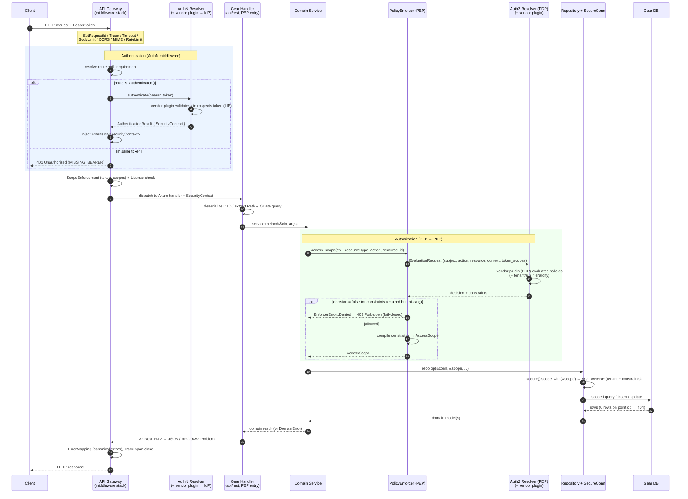

<!-- Updated: 2026-06-04 by Constructor Tech -->

# Gear Overview

> **Terminology**: A **Gear** is the new name for a **gear**. The two terms are
> interchangeable across the codebase and docs: the directory is still
> `gears/<name>/`, the macro is still `#[modkit::gear]`, and the runtime
> still discovers "gears". Conceptually, a Gear is a self-contained,
> composable unit of business capability that plugs into the Cyber Fabric / Rust
> (CF/Rust) platform.

## What a Gear is

A Gear is a **vertically-sliced, self-contained capability** built on top of
ModKit. Each Gear:

- **Owns its public API** through an SDK crate (`<name>-sdk`) — transport-agnostic
  traits, models, and errors. Consumers never depend on a Gear's internals.
- **Owns its data** behind a secure ORM layer. A Gear cannot touch a raw DB
  connection; all access flows through `SecureConn` + `AccessScope`.
- **Is discovered at link time** via `inventory` and initialized in dependency
  order by the runtime.
- **Composes with other Gears** through the typed `ClientHub` (in-process) or
  gRPC SDKs (out-of-process / remote Gears).
- **Can be extended by plugins** — built-in plugins (compiled in) or external
  plugins (separate crates with their own API handler, business logic, and DB).
- **Can extend it's API data schema** through GTS schema extensions.

A Gear is intentionally a **DDD-light** structure with clear layers:

| Layer | Path | Responsibility |
|-------|------|----------------|
| **API** | `src/api/rest/` | HTTP DTOs, Axum handlers, `OperationBuilder` route + OpenAPI wiring. Acts as the **PEP entry point**. |
| **Domain** | `src/domain/` | Business logic, the SDK trait implementation (local client), `#[domain_model]` types, and **PEP enforcement** via `PolicyEnforcer`. |
| **Infra** | `src/infra/` | SeaORM entities, repositories, migrations, adapters — everything "low-level" (DB, IO, external clients). |

See `02_gear_layout_and_sdk_pattern.md` for the full canonical layout and the
SDK pattern.

## Core Architecture

The diagram below shows a typical Gear "X" with every option in play: an SDK for
external Gears, gRPC and REST APIs, a built-in plugin, an external plugin, and a
database. It also shows the shared **ModKit libraries** (errors, security, GTS
types, HTTP client, cluster primitives, outbox) and the **SDKs for other system
Gears** (authz/authn resolver, tenant resolver, types registry, events, outbound
API gateway, flight control, cred store).


**Key points from the architecture:**

- **Two inbound transports** — external clients reach a Gear via **REST API
  endpoints** (Modkit REST handler with OData parser + `OperationBuilder`) or via
  the **gRPC interface** (Modkit gRPC handler). Both feed into the same `api/`
  layer.
- **`api/` → `domain/` → `infra/`** is the one-directional dependency flow. The
  domain holds the "main Gear X business logic".
- **Plugins** attach to the domain:
  - A **built-in plugin** (e.g. plugin Z) ships its business-logic crate plus its
    own `Modkit SeaORM` access and an optional dedicated DB.
  - An **external plugin** (e.g. plugin Y) is a separate deployable with its own
    REST API handler, business logic, `Modkit SeaORM`, and DB.
- **Infra** uses `Modkit SeaORM (incl. DB OData)` to reach the Gear's own DB
  through the secure ORM layer.
- **ModKit libraries** and **system-Gear SDKs** are available to every Gear as
  shared, reusable building blocks.

### Gear categories

Gears fall into a few categories depending on their role in the platform —
system Gears (resolvers, gateways, registries), domain Gears (business
capabilities), and plugins:


## Typical REST API Request Trajectory

This section traces a typical authenticated REST request end-to-end, based on the
authorization model in `docs/arch/authorization/DESIGN.md` (PDP/PEP per NIST
SP 800-162). The concrete code references come from the `mini-chat` Gear, which is
representative of the golden path.

### Actors

- **API Gateway** (`gears/system/api-gateway`) — owns the Axum router and the
  middleware stack; hosts the **AuthN middleware**.
- **AuthN Resolver** (`gears/system/authn-resolver`) — validates the bearer
  token via a vendor plugin and produces a `SecurityContext`.
- **Gear Handler (PEP)** — the Gear's Axum handler in `src/api/rest/handlers/`,
  which extracts `Extension<SecurityContext>` and delegates to the domain service.
- **Domain Service** — business logic that uses `PolicyEnforcer` (the PEP) to ask
  the PDP for an `AccessScope`.
- **AuthZ Resolver (PDP)** (`gears/system/authz-resolver`) — evaluates policies
  and returns a decision plus query-level constraints.
- **Repository + SecureConn** — compiles the `AccessScope` into SQL `WHERE`
  clauses and runs the scoped query against the Gear DB.

### Middleware stack (request order)

The API Gateway applies a Tower middleware stack. Request execution order
(outermost → innermost), per `apply_middleware_stack` in
`@gears/system/api-gateway/src/gear.rs:248-251`:

```
SetRequestId → PropagateRequestId → Trace → push_req_id_to_extensions
  → Timeout → BodyLimit → CORS → MIME validation → RateLimit
  → ErrorMapping → Auth (AuthN) → ScopeEnforcement → License → Router → Handler
```

- **Auth (AuthN middleware)** — `authn_middleware` resolves the route's auth
  requirement (`OperationBuilder::authenticated()` registers the route as
  `Required`), extracts the bearer token, calls the AuthN Resolver, and injects
  `SecurityContext` as a request `Extension`. See
  `@gears/system/api-gateway/src/middleware/auth.rs:205-251`.
- **ScopeEnforcement** — optional coarse-grained `token_scopes` gate (see
  *Gateway Scope Enforcement* in the authorization DESIGN); rejects early without
  calling the PDP.
- **License** — `require_license_features([...])` on the route is enforced here.

### Sequence diagram



### Step-by-step walkthrough

1. **Inbound + pre-auth middleware** — Request ID, tracing span, timeout, body
   limit, CORS, MIME validation, and rate limiting run before anything
   security-related.
2. **Authentication (AuthN)** — `authn_middleware` checks the route policy. For an
   `.authenticated()` route it extracts the bearer token and calls
   `AuthNResolverClient::authenticate(token)`. The AuthN Resolver delegates to a
   vendor plugin (JWT validation / introspection against the IdP) and returns an
   `AuthenticationResult`. The middleware injects the resulting `SecurityContext`
   into request extensions. Missing/invalid token → `401`.
3. **Scope + license gates** — Optional coarse `token_scopes` enforcement and
   per-route license-feature checks (`require_license_features`) run next, before
   the handler.
4. **Handler (PEP entry)** — The Gear's Axum handler extracts
   `Extension<SecurityContext>`, the shared `Arc<AppServices>`, path params, the
   JSON body, and/or the parsed `OData` query, then calls the domain service.
   Example: `create_chat` / `list_chats` in
   `@gears/mini-chat/mini-chat/src/api/rest/handlers/chats.rs:14-43`.
5. **Domain service + PEP** — The service calls
   `PolicyEnforcer::access_scope(...)` (or `access_scope_with(...)` with extra
   resource properties such as `OWNER_TENANT_ID` / `OWNER_ID`). The enforcer
   builds an `EvaluationRequest` and calls the AuthZ Resolver. See
   `@gears/mini-chat/mini-chat/src/domain/service/chat_service.rs:66-111`
   and the enforcer at
   `@gears/system/authz-resolver/authz-resolver-sdk/src/pep/enforcer.rs:356-409`.
6. **Authorization (PDP)** — The AuthZ Resolver delegates to a vendor plugin (the
   PDP), which evaluates policies (optionally querying tenant / resource-group
   hierarchies) and returns a `decision` plus query-level `constraints`.
7. **Fail-closed / compile to scope** — If `decision = false` (or constraints are
   required but absent), the enforcer returns `Denied` → `403`. Otherwise it
   compiles the constraints into an `AccessScope` (predicates within a constraint
   are AND'd; multiple constraints are OR'd; unknown predicates fail closed). See
   *Fail-Closed Rules* in `docs/arch/authorization/DESIGN.md`.
8. **Secure DB access** — The service passes the `AccessScope` to the repository,
   which applies `.secure().scope_with(&scope)` (or `secure_insert` /
   `secure_update_with_scope`) so the mandatory tenant predicate plus PDP
   constraints become SQL `WHERE` clauses. See
   `@gears/mini-chat/mini-chat/src/infra/db/repo/chat_repo.rs:40-107`.
   For point operations, `0` rows means `404` (hides existence from unauthorized
   subjects); LIST applies constraints before `LIMIT` for correct pagination.
9. **Response** — Domain models map back to REST DTOs; the handler returns
   `ApiResult<T>`. Errors become RFC-9457 `Problem` responses via the canonical
   error-mapping middleware on the way out.

### Plugins in the trajectory

- **Built-in plugin** — Invoked from the domain layer through its own
  business-logic crate; uses its own `Modkit SeaORM` scope and optional dedicated
  DB (see plugin Z in the architecture diagram).
- **External plugin** — A separate deployable; the host Gear reaches it through
  the plugin's API handler (REST today). The plugin runs its own business logic
  and owns its own DB (plugin Y).

Plugin discovery and scoped clients are covered in
`03_clienthub_and_plugins.md`.

## References

- **Gear layout & SDK pattern** — `02_gear_layout_and_sdk_pattern.md`
- **AuthN/AuthZ, PolicyEnforcer (PEP), SecureORM** — `06_authn_authz_secure_orm.md`
- **Authorization design (PDP/PEP, constraints, fail-closed rules)** — `docs/arch/authorization/DESIGN.md`
- **REST wiring & OperationBuilder** — `04_rest_operation_builder.md`
- **Errors (RFC-9457)** — `05_errors_rfc9457.md`
- **OData / pagination / $select / $filter** — `07_odata_pagination_select_filter.md`
- **Database patterns (SecureConn, transactions, repos)** — `11_database_patterns.md`
- **Out-of-Process / gRPC / SDK pattern** — `09_oop_grpc_sdk_pattern.md`
- **Platform gear inventory & high-level architecture** — `docs/MODULES.md`, `docs/ARCHITECTURE_MANIFEST.md`
