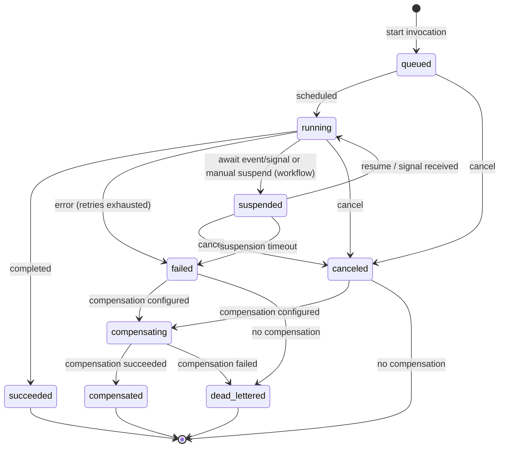
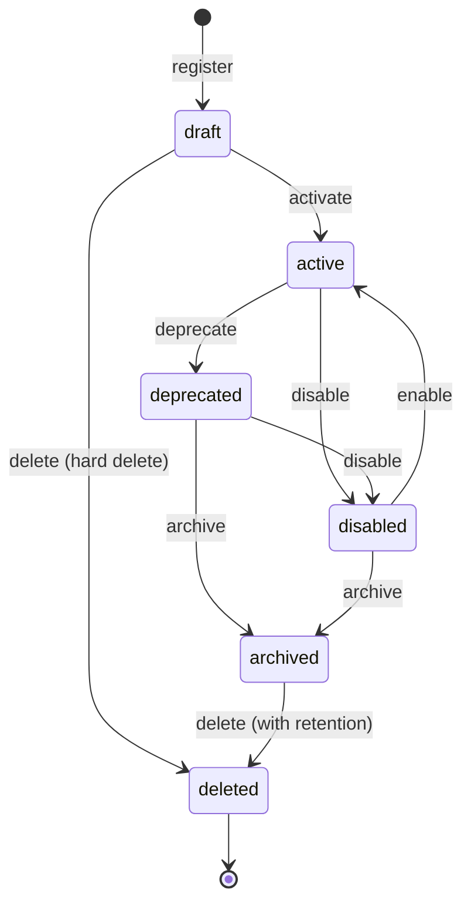

<!--
Created:  2026-03-12 by Constructor Tech
Updated:  2026-04-30 by Constructor Tech
-->
# Technical Design — Serverless Runtime

<!-- toc -->

- [1. Architecture Overview](#1-architecture-overview)
  - [1.1 Architectural Vision](#11-architectural-vision)
  - [1.2 Architecture Drivers](#12-architecture-drivers)
  - [1.3 Architecture Layers](#13-architecture-layers)
  - [1.4 ToolKit Integration](#14-toolkit-integration)
- [2. Principles & Constraints](#2-principles--constraints)
  - [2.1 Design Principles](#21-design-principles)
  - [2.2 Constraints](#22-constraints)
  - [2.3 Capability Allocation](#23-capability-allocation)
- [3. Technical Architecture](#3-technical-architecture)
  - [3.1 Domain Model](#31-domain-model)
  - [3.1.1 Complete Entity Examples](#311-complete-entity-examples)
  - [3.2 Component Model](#32-component-model)
  - [3.3 API Contracts](#33-api-contracts)
  - [3.4 Internal Dependencies](#34-internal-dependencies)
  - [3.5 External Dependencies](#35-external-dependencies)
  - [3.6 Interactions & Sequences](#36-interactions--sequences)
  - [3.7 Database schemas & tables](#37-database-schemas--tables)
- [4. Additional Context](#4-additional-context)
  - [Security Considerations](#security-considerations)
  - [Audit Events](#audit-events)
  - [Non-Applicable Domains](#non-applicable-domains)
- [5. Traceability](#5-traceability)

<!-- /toc -->

<!--
=============================================================================
TECHNICAL DESIGN DOCUMENT
=============================================================================
PURPOSE: Define HOW the system is built — architecture, components, APIs,
data models, and technical decisions that realize the requirements.

DESIGN IS PRIMARY: DESIGN defines the "what" (architecture and behavior).
ADRs record the "why" (rationale and trade-offs) for selected design
decisions; ADRs are not a parallel spec, it's a traceability artifact.

SCOPE:
  ✓ Architecture overview and vision
  ✓ Design principles and constraints
  ✓ Component model and interactions
  ✓ API contracts and interfaces
  ✓ Data models and database schemas
  ✓ Technology stack choices

NOT IN THIS DOCUMENT (see other templates):
  ✗ Requirements → PRD.md
  ✗ Detailed rationale for decisions → ADR/
  ✗ Step-by-step implementation flows → features/

STANDARDS ALIGNMENT:
  - IEEE 1016-2009 (Software Design Description)
  - IEEE 42010 (Architecture Description — viewpoints, views, concerns)
  - ISO/IEC 15288 / 12207 (Architecture & Design Definition processes)

ARCHITECTURE VIEWS (per IEEE 42010):
  - Context view: system boundaries and external actors
  - Functional view: components and their responsibilities
  - Information view: data models and flows
  - Deployment view: infrastructure topology

DESIGN LANGUAGE:
  - Be specific and clear; no fluff, bloat, or emoji
  - Reference PRD requirements using `cpt-cf-serverless-runtime-fr-{slug}`, `cpt-cf-serverless-runtime-nfr-{slug}`, and `cpt-cf-serverless-runtime-usecase-{slug}` IDs
  - Reference ADR documents using `cpt-cf-serverless-runtime-adr-{slug}` IDs
=============================================================================
-->

## 1. Architecture Overview

### 1.1 Architectural Vision

The Serverless Runtime gear provides a stable, implementation-agnostic domain model and API contract for runtime creation, registration, and invocation of Functions and Workflows. Functions and Workflows are sibling callable types — both are registered definitions invoked via the runtime API, sharing the same registration and invocation surface, consistent response shapes, and shared lifecycle management, but they are independent GTS base types so plugins can match positively on either without accidental substitutability.

The architecture is designed to support multiple implementation technologies (Temporal, Starlark, cloud-native FaaS) through a pluggable plugin model. Each plugin registers itself as a GTS type and implements the SDK plugin trait. The platform validates plugin-specific limits, traits, and implementation payloads against the plugin's registered schemas, ensuring type safety without coupling the core model to any specific runtime.

**Scope note — host responsibilities vs. plugin-provided workflow features:** The host gear owns Function Registry, Tenant Policy, the REST façade, GTS validation, audit aggregation, plugin dispatch, and a lightweight invocation index — not durable execution machinery. Each runtime plugin owns its own invocation engine, scheduler, and event-trigger handling using its backend's native primitives (Temporal Schedule API and signals, EventBridge Scheduler with SQS, Azure Durable native timers, etc.). Workflow orchestration features — parallel execution, event waiting, per-step timeouts, deterministic replay, conditional branching, retry, compensation, checkpointing, and timeout enforcement — are implemented inside the runtime plugin appropriate for the function (Temporal, Serverless Workflow 1.0 engine, in-process Starlark, etc.). This is intentional: the host remains independent of execution engine specifics, and plugins can leverage their native strengths without being constrained by a lowest-common-denominator abstraction. See [section 2.3](#23-capability-allocation) for the capability allocation.

The domain model uses the Global Type System (GTS) for identity, schema validation, and type inheritance. All entities carry GTS identifiers, enabling schema-first validation, version resolution, and consistent cross-gear references. Security context propagation, tenant isolation, and governance are built into the API contract layer, ensuring that every operation is scoped, auditable, and policy-compliant.

### 1.2 Architecture Drivers

Requirements that significantly influence architecture decisions.

#### Functional Drivers

| PRD Requirement | Design Response |
|-------------|-----------------|
| `cpt-cf-serverless-runtime-fr-tenant-registry` (BR-002) | `OwnerRef` schema with `owner_type` determining default access scope (user/tenant/system) |
| `cpt-cf-serverless-runtime-fr-execution-lifecycle` (BR-005, BR-012, BR-028) | Base `Limits` schema with plugin-derived extensions; tenant quota enforcement |
| `cpt-cf-serverless-runtime-fr-trigger-schedule` (BR-007) | Schedule, Event Trigger, and Webhook Trigger entities with dedicated APIs |
| `cpt-cf-serverless-runtime-fr-execution-engine` (BR-009) | `WorkflowTraits` with configurable checkpointing strategy and suspension limits |
| `cpt-cf-serverless-runtime-fr-runtime-authoring` (BR-011) | `ValidationError` schema with per-issue location and suggested corrections |
| `cpt-cf-serverless-runtime-fr-execution-lifecycle` (BR-014), `cpt-cf-serverless-runtime-fr-execution-visibility` (BR-015) | `InvocationStatus` state machine with full transition table and timeline events |
| `cpt-cf-serverless-runtime-fr-execution-lifecycle` (BR-019) | `RetryPolicy` schema with exponential backoff and non-retryable error overrides |
| `cpt-cf-serverless-runtime-fr-tenant-registry` (BR-020), `cpt-cf-serverless-runtime-nfr-resource-governance` (BR-106), `cpt-cf-serverless-runtime-nfr-retention` (BR-107) | `TenantRuntimePolicy` with quotas, retention, allowed runtimes, and approval policies |
| `cpt-cf-serverless-runtime-nfr-ops-traceability` (BR-021), `cpt-cf-serverless-runtime-nfr-security` (BR-034) | `InvocationRecord` with correlation ID, trace ID, and tenant context |
| `cpt-cf-serverless-runtime-fr-trigger-schedule` (BR-022) | `Schedule` entity with cron/interval expressions, missed policies, and concurrency control |
| `cpt-cf-serverless-runtime-fr-execution-lifecycle` (BR-027) | Dead letter queue configuration on triggers; `dead_lettered` invocation status |
| `cpt-cf-serverless-runtime-fr-execution-lifecycle` (BR-029) | In-flight executions pinned to exact function version at start time |
| `cpt-cf-serverless-runtime-fr-runtime-authoring` (BR-032), `cpt-cf-serverless-runtime-fr-input-security` (BR-037) | `IOSchema` with JSON Schema or GTS reference validation before invocation |
| `cpt-cf-serverless-runtime-fr-runtime-capabilities` (BR-035) | `adapter_ref` implementation kind for plugin-provided definitions |
| `cpt-cf-serverless-runtime-fr-debugging` (BR-103) | Dry-run invocation mode with synthetic response and no side effects |
| `cpt-cf-serverless-runtime-nfr-performance` (BR-118, BR-132) | Response caching policy with TTL, idempotency key, and owner-scoped cache keys |
| `cpt-cf-serverless-runtime-fr-governance-sharing` (BR-123) | Extended sharing beyond default visibility via access control integration |
| `cpt-cf-serverless-runtime-fr-debugging` (BR-129) | Standardized error types with GTS-identified derived errors and RFC 9457 responses |
| `cpt-cf-serverless-runtime-fr-debugging` (BR-130) | `InvocationTimelineEvent` for debugging, auditing, and execution visualization |
| `cpt-cf-serverless-runtime-fr-advanced-patterns` (BR-133) | Two-layer compensation model: function-level (platform) and step-level (plugin) |
| `cpt-cf-serverless-runtime-fr-advanced-patterns` (BR-134) | `Idempotency-Key` header with configurable tenant deduplication window |
| `cpt-cf-serverless-runtime-fr-replay-visualization` (BR-124, BR-125) | `InvocationRecord` replay from recorded history; timeline visualization of workflow structure and execution path |
| `cpt-cf-serverless-runtime-fr-advanced-deployment` (BR-201, BR-202, BR-203, BR-204, BR-205) | Import/export of definitions; execution time travel; A/B testing and canary release via function versioning and traffic splitting; long-term archival via `TenantRuntimePolicy` retention settings |
| `cpt-cf-serverless-runtime-fr-deployment-safety` (BR-121) | Blue-green deployment via function version pinning and controlled traffic routing between active versions |

#### NFR Allocation

| NFR ID | NFR Summary | Allocated To | Design Response | Verification Approach |
|--------|-------------|--------------|-----------------|----------------------|
| `cpt-cf-serverless-runtime-nfr-tenant-isolation` | Tenant isolation | All components | Tenant-scoped queries, isolated execution environments, secret isolation | Integration tests with multi-tenant scenarios |
| `cpt-cf-serverless-runtime-nfr-observability` | Observability | InvocationRecord, Timeline API | Correlation IDs, trace IDs, execution metrics, timeline events | Verify trace propagation in integration tests |
| `cpt-cf-serverless-runtime-nfr-resource-governance` | Pluggability | Executor, Plugin model | the SDK plugin trait; plugin-derived GTS types for limits | Plugin conformance test suite |
| `cpt-cf-serverless-runtime-nfr-reliability` | State consistency, availability ≥99.95%, RTO ≤30s, RPO ≤1min | Invocation Engine, Executor, State Machine | `InvocationStatus` state machine with atomic transitions; `RetryPolicy` with compensation; version-pinned executions; durable snapshots for workflow resume | Chaos tests for state consistency; availability monitoring; recovery time measurement |
| `cpt-cf-serverless-runtime-nfr-composition-deps` | Dependency management between functions/workflows | Registry, Invocation Engine | Function definitions reference dependencies via GTS type IDs; registry validates dependency availability at publish time | Dependency resolution integration tests |
| `cpt-cf-serverless-runtime-nfr-scalability` | ≥10K concurrent executions, ≥1K starts/sec, ≥1K tenants | All components | Stateless API layer; tenant-partitioned persistence; plugin-level horizontal scaling; per-tenant quota enforcement via `TenantRuntimePolicy` | Load tests against scalability targets |

#### Key ADRs

| ADR ID | Decision Summary |
|--------|-----------------|
| `cpt-cf-serverless-runtime-adr-callable-type-hierarchy` | Unified callable type hierarchy: Function and Workflow as sibling GTS base types with identical base schema fields |
| `cpt-cf-serverless-runtime-adr-jsonrpc-mcp-protocol-surfaces` | JSON-RPC 2.0 and MCP protocol surfaces for direct function invocation and AI agent tool integration |
| `cpt-cf-serverless-runtime-adr-workflow-dsl` | CNCF Serverless Workflow Specification v1.0.0 adopted as the vendor-neutral, declarative JSON/YAML workflow DSL — decoupled from the execution engine |
| `cpt-cf-serverless-runtime-adr-temporal-workflow-engine` | Temporal chosen as the durable execution backend for the workflow engine plugin, interpreting the Serverless Workflow DSL atop Temporal primitives |
| `cpt-cf-serverless-runtime-adr-thin-host` | Serverless-runtime gear boundary: host owns Registry, Tenant Policy, lightweight invocation index, REST, GTS validation, audit, and plugin dispatch; runtime plugins own invocation, scheduling, and event-trigger handling using their backend's native primitives |

### 1.3 Architecture Layers

| Layer | Responsibility | Technology |
|-------|---------------|------------|
| API | REST endpoints for function management, invocation, scheduling, triggers, tenant policy, observability; JSON-RPC 2.0 endpoint for direct function invocation; MCP server endpoint for AI agent tool integration | REST / JSON, JSON-RPC 2.0, MCP (Streamable HTTP), RFC 9457 Problem Details |
| Domain | Core entities, state machines, validation rules, GTS type resolution | Rust, GTS type system |
| Runtime | Pluggable backend plugins resolved at runtime by the host; each plugin owns its own invocation engine, scheduler, and event-trigger handling using its backend's native facilities (Temporal Schedule API + signals, EventBridge Scheduler + SQS, Azure Durable native timers, etc.). No stateless middle tier sits between the host and the plugin. | Rust async traits, ClientHub-resolved plugin crates |
| Infrastructure | Persistence, caching, event broker integration, secret management | TBD per deployment |

### 1.4 ToolKit Integration

Per ADR `cpt-cf-serverless-runtime-adr-thin-host`, the serverless-runtime capability is a **thin host** with **fat runtime plugins**, implemented as a single ToolKit gear at `gears/serverless-runtime/`.

#### 1.4.1 Gear Structure

The capability lives at `gears/serverless-runtime/` with three crate roles:

- **`serverless-runtime-sdk/`** — contract crate. Domain types, the plugin trait, the host trait (public CRUD + thin event port), the SDK error taxonomy, and plugin-conformance harness hooks.
- **`serverless-runtime/`** — host implementation crate (`#[toolkit::gear]`, `[db, rest]`). Owns Function Registry, Tenant Policy, plugin dispatch, REST façade, GTS validation, audit aggregation, and the lightweight invocation index.
- **`plugins/<backend>-plugin/`** — one self-contained plugin crate per backend (Temporal, Lambda, Starlark, …), each owning its invocation engine, scheduler, and event-trigger handling using the backend's native primitives.

Plugin crates are **siblings** of the SDK and impl crates under `gears/serverless-runtime/plugins/` (mirroring `gears/system/tenant-resolver/plugins/`), never nested inside the impl crate's `src/`. The host crate has no compile-time dependency on any plugin crate; plugins are resolved at runtime through `ClientHub` scoped registration keyed by plugin GTS type. Internal file layout for each crate follows the canonical DDD-light layout in [Gear Layout and SDK Pattern](../../../docs/toolkit_unified_system/02_gear_layout_and_sdk_pattern.md) — not restated here.

#### 1.4.2 Plugin model

Each runtime backend (Temporal, Lambda, the planned Starlark in-process runner, etc.) is implemented as a **standalone plugin crate** under `gears/serverless-runtime/plugins/<backend>-plugin/`. Per ADR `cpt-cf-serverless-runtime-adr-thin-host`, the host crate does not depend on any plugin crate at compile time; plugins are resolved at runtime through ClientHub scoped registration keyed by plugin GTS type. Every plugin is self-contained — there is no capability flag carving up the plugin contract into different dispatch tiers, because no such tiering exists.

**Dispatch.** The host's plugin-dispatch component reads the function definition's `implementation.adapter` GTS type ID, looks up the registered plugin via `ClientHub` scoped resolution keyed by that GTS ID, and forwards the request through the SDK plugin trait declared in `serverless-runtime-sdk`. Plugins register themselves during their own ToolKit `init()` against the same GTS types-registry mechanism used elsewhere in the platform; the host treats each registered plugin as opaque.

**Backend ownership.** Each plugin owns its invocation engine, scheduler, and event-trigger handling using its backend's native primitives — Temporal Schedule API and signals, EventBridge Scheduler with SQS for Lambda, Azure Durable native timers, and so on. The host owns no backend-side execution machinery: orchestration primitives — durability, scheduling, event matching, retries, compensation — live entirely inside each plugin. In-process runtimes that lack native durability obtain those primitives from a shared Rust helper crate consumed at the plugin level, scoping that complexity to the plugins that need it.

**Invocation record split.** Invocation records use a host-indexed, plugin-detailed split. The host persists a lightweight, queryable index — `id`, `function_id`, `adapter`, `tenant`, `owner`, `status`, timestamps, and an `error_summary` — populated entirely from plugin-emitted events. The plugin owns the full invocation record, the timeline, and any internal execution state. Aggregate queries and tenant-wide listings read the host index for low-latency, cross-tenant answers; deep fetches (full timeline, stored payloads) are delegated to the plugin through the SDK plugin trait.

**Plugin → host event port.** Plugins emit index updates back to the host through a thin event port on the host trait — status-update and timeline-event notifications used by plugins to populate the host invocation index. This port is a **notification surface only** — it is not a general-purpose callback API and replaces the prior request/response callback design.

**Plugin error isolation.** Each plugin owns a private plugin-specific error enum that captures backend-native failures (e.g. Temporal `ApplicationError`, Lambda invoke errors, EventBridge dispatch failures). Every plugin trait method converts those backend errors into the SDK error type before returning, so the host never observes backend-specific error types. Information not preserved by the SDK taxonomy — raw stack traces, backend retry counters, vendor error codes — stays inside the plugin and is surfaced through the plugin's timeline-retrieval method rather than crossing the host boundary. Errors flowing into the host's domain layer follow the canonical toolkit three-layer pattern (`DomainError` → SDK error → `Problem`) without any serverless-runtime-specific deviation; see `docs/toolkit_unified_system/05_errors_rfc9457.md` and `02_gear_layout_and_sdk_pattern.md` for the canonical layering.

#### 1.4.3 SDK Crate

The contract crate `serverless-runtime-sdk` exports two traits, the domain types they reference, the error taxonomy they raise, and plugin-conformance harness hooks used by every plugin's test suite:

- **Host-implemented trait** — the host's `ClientHub` interface for the serverless-runtime gear. Carries public CRUD over host-owned resources (functions, the invocation index, host-side schedule and trigger metadata, tenant policy) plus a thin notification-only event port that plugins use to populate the host invocation index. Consumers and plugins reach the host through this trait rather than HTTP.
- **Plugin-implemented trait** — the contract every backend plugin satisfies. The host dispatches to it via `dyn` after `ClientHub` resolution keyed by plugin GTS type. Covers backend-side identity, lifecycle, invocation, scheduling, and event-trigger handling using the backend's native primitives.

Specific trait names, method surfaces, the SDK error type, conformance hooks, and version policy live in the SDK crate's own design and are intentionally not restated here.

#### 1.4.4 Gear Lifecycle

The `serverless-runtime` host crate is a single ToolKit gear declared with `#[toolkit::gear]` over a `[db, rest]` capability set. Lifecycle hooks follow the canonical ToolKit lifecycle (see [Gear Layout and SDK Pattern](../../../docs/toolkit_unified_system/02_gear_layout_and_sdk_pattern.md)); the host applies host-owned migrations and fails fast if any host-owned dependency (types-registry, authz-resolver, persistence) is unavailable.

Each runtime backend is its own ToolKit plugin gear under `gears/serverless-runtime/plugins/<backend>-plugin/` with an independent lifecycle: it registers its plugin trait implementation against ClientHub keyed by plugin GTS type and starts the long-running workers its backend needs (Temporal workers, EventBridge subscribers, Azure Durable hosts, etc.). On shutdown, the platform's ordered-shutdown sequence stops plugins before the host; each plugin drains its backend-native workers within its own `stop_timeout`, and the host then drains in-flight REST requests within its own `stop_timeout`. The host fans out no cancellation to plugins through any callback surface.

#### 1.4.5 Database Access and Tenant Isolation

Host-owned tables in the `serverless-runtime` crate: `functions` (polymorphic — Function and Workflow definitions, discriminated by GTS type), the `invocation_index`, `schedules`, `event_triggers`, `webhook_triggers`, and `tenant_policies`. Plugin-owned entities (full invocation records, timelines, internal checkpoints) live inside each plugin crate.

Tenant isolation follows the canonical toolkit `SecureConn` + `Scopable` pattern (see `docs/toolkit_unified_system/06_authn_authz_secure_orm.md` and `02_gear_layout_and_sdk_pattern.md`). Two serverless-runtime-specific cases:

- The host `invocation_index` is populated only via the SDK event port and is never coupled to plugin-internal storage.
- System-scoped Functions (`OwnerRef.owner_type = "system"`, visible to all tenants) require an elevated `AccessScope` that includes the system tenant scope alongside the requesting tenant's scope.

## 2. Principles & Constraints

### 2.1 Design Principles

#### Implementation-Agnostic Runtime

- [ ] `p1` - **ID**: `cpt-cf-serverless-runtime-principle-impl-agnostic`

The domain model and API contracts are intentionally decoupled from any specific runtime technology. The same function definitions, invocation APIs, and lifecycle management work identically whether the underlying runtime plugin is Starlark, Temporal, WASM, or a cloud-native FaaS provider. This enables technology selection to be deferred to deployment time and allows multiple runtime plugins to coexist within the same platform instance.

#### GTS-Based Identity

- [ ] `p1` - **ID**: `cpt-cf-serverless-runtime-principle-gts-identity`

All domain entities use Global Type System (GTS) identifiers following the [GTS specification](https://github.com/globaltypesystem/gts-spec). GTS provides hierarchical type inheritance, schema-first validation, and stable cross-gear references. Entity identity is the GTS instance address, not an internal database key, ensuring that types are portable and self-describing.

#### Unified Callable Model

- [ ] `p1` - **ID**: `cpt-cf-serverless-runtime-principle-unified-callable`

Functions and Workflows are sibling peer base types in the GTS hierarchy — neither derives from the other. They share the same registration and lifecycle APIs, the same invocation surface, and the same base schema fields, but they are independent types so plugins can match positively on `function.v1~` or `workflow.v1~` without accidental substitutability. Workflow-specific behaviour (compensation, checkpointing, event waiting) lives in the `workflow_traits` block on the Workflow base type, not on a shared parent. See ADR `cpt-cf-serverless-runtime-adr-callable-type-hierarchy`.

#### Pluggable Plugin Architecture

- [ ] `p1` - **ID**: `cpt-cf-serverless-runtime-principle-pluggable-adapters`

Plugins are crates that implement the SDK plugin trait. Each plugin registers its own GTS type and may extend the base schemas (e.g., plugin-specific limits). The platform validates plugin-specific fields at registration time by deriving the plugin's schema from the `implementation.adapter` field. This enables new execution technologies to be added without modifying the core domain model.

### 2.2 Constraints

#### No Runtime Technology Selection

- [ ] `p2` - **ID**: `cpt-cf-serverless-runtime-constraint-no-runtime-selection`

This design intentionally does not select a specific runtime technology. The choice of runtime plugin (Starlark, Temporal, cloud FaaS, etc.) is deferred to implementation and deployment.

#### No Workflow DSL Specification

- [ ] `p2` - **ID**: `cpt-cf-serverless-runtime-constraint-no-workflow-dsl`

Workflow DSL syntax details are implementation-specific and defined per plugin. This design specifies the workflow traits and lifecycle but not the authoring language.

#### No UI/UX Definition

- [ ] `p2` - **ID**: `cpt-cf-serverless-runtime-constraint-no-ui-ux`

UI/UX for authoring or debugging workflows is out of scope for this design document.

### 2.3 Capability Allocation

This design draws from several industry workflow/serverless platforms. Per ADR `cpt-cf-serverless-runtime-adr-thin-host`, capabilities are allocated to plugins by default; the host owns only what must be **consistent across all backends** — REST façade, GTS validation, the function registry, tenant policy, audit aggregation, plugin dispatch, the lightweight invocation index, and idempotency-key deduplication. Everything else — invocation lifecycle, retry, compensation, checkpointing, timeout enforcement, scheduling, event/webhook handling, step composition, task-queue / worker models, DSL semantics — lives inside each runtime plugin and uses its backend's native primitives.

#### The Plugin Contract

The SDK exposes two traits — host-implemented (public CRUD plus a thin event port for plugin → host index updates) and plugin-implemented (identity, lifecycle, invocation, scheduling, event-trigger). Both are declared in `serverless-runtime-sdk`; specific names and method surfaces live in the SDK crate's own design. The plugin conformance test suite in the SDK is the load-bearing mechanism for keeping user-visible semantics uniform across plugins (status transitions, retry contract, compensation triggering, suspension / resume visibility, error taxonomy).

## 3. Technical Architecture

### 3.1 Domain Model

**Technology**: GTS (Global Type System), JSON Schema, Rust structs

**Location**: Domain model is defined inline in this document. Rust types are intended for SDK and core runtime crates.

#### Entity Summary

Functions and Workflows are sibling GTS base types (neither derives from the other) — both share the same registration / invocation surface, distinguished by the `workflow_traits` trait block. The full type catalog (entity GTS IDs, supporting types, derived types) lives in [DESIGN_GTS_SCHEMAS.md](DESIGN_GTS_SCHEMAS.md).

#### Functions and Workflows

Functions and Workflows are sibling callable types — both are registered definitions invoked via the runtime API, sharing the same registration and invocation surface but distinct GTS base types. They are distinguished via their GTS base types, which are siblings — neither derives from the other:

| GTS Type | Description |
|-----------------|-------------|
| `gts.cf.core.sless.function.v1~` | Function base type (stateless, short-lived callable) |
| `gts.cf.core.sless.workflow.v1~` | Workflow base type (durable, multi-step callable) — sibling to function, not derived |
| `gts.cf.core.sless.function.v1~vendor.app.my_func.v1~` | Custom function (derived from function base) |
| `gts.cf.core.sless.workflow.v1~vendor.app.my_workflow.v1~` | Custom workflow (derived from workflow base) |

##### Invocation modes

- **sync** — caller waits for completion and receives the result in the response. Best for short runs.
- **async** — caller receives an `invocation_id` immediately and polls for status/results later.
- **stream** — caller receives an SSE (Server-Sent Events) stream that delivers progress notifications, intermediate events (elicitation requests, sampling requests), and the final result. This mode is used by the MCP server for streaming tool calls and by the JSON-RPC endpoint for streaming function invocations. Stream mode is a form of asynchronous execution with real-time push delivery instead of polling.

##### Protocol surfaces

Functions can be invoked through multiple protocol surfaces. Each surface translates its wire protocol into the Invocation Engine's domain model:

| Protocol Surface | Endpoint | Function Identity | Streaming | Session |
|------------------|----------|-------------------|-----------|---------|
| REST API | `POST /api/serverless-runtime/v1/invocations` | `function_id` in request body | No (poll-based async) | No |
| JSON-RPC 2.0 | `POST /api/serverless-runtime/v1/json-rpc` | `method` field = GTS function ID | Optional (SSE response + input stream) | No |
| MCP Server | `POST /api/serverless-runtime/v1/mcp` | `tools/call` `name` = GTS function ID | Yes (SSE with progress, elicitation, sampling) | Yes (MCP session) |

All protocol surfaces delegate to the same Invocation Engine for validation, execution, and lifecycle management. The function definition's `traits.json_rpc` and `traits.mcp` fields control exposure on each surface — functions without these fields are not accessible through the respective protocol.

---

#### OwnerRef

**GTS ID:** `gts.cf.core.sless.owner_ref.v1~`

Defines ownership and default visibility for a function. Per PRD BR-002, the `owner_type` determines
the default access scope:

- `user` — private to the owning user by default
- `tenant` — visible to authorized users within the tenant
- `system` — platform-provided, managed by the system

Extended sharing beyond default visibility is managed through access control integration (PRD BR-123).

> Schema: [`gts.cf.core.sless.owner_ref.v1~`](DESIGN_GTS_SCHEMAS.md#ownerref)

#### IOSchema

**GTS ID:** `gts.cf.core.sless.io_schema.v1~`

Defines the input/output contract for a function. Per PRD BR-032 and BR-037, inputs and outputs
are validated before invocation.

Each of `params` and `returns` accepts:

- **Inline JSON Schema** — any valid JSON Schema object
- **GTS reference** — `{ "$ref": "gts://gts.cf.some.type.v1~" }` for reusable types
- **Void** — `null` or absent indicates no input/output

> Schema: [`gts.cf.core.sless.io_schema.v1~`](DESIGN_GTS_SCHEMAS.md#ioschema)

#### Limits

**GTS ID:** `gts.cf.core.sless.limits.v1~`

Base resource limits schema. Per PRD BR-005, BR-012, and BR-028, the runtime enforces limits to
prevent resource exhaustion and runaway executions.

The base schema defines only universal limits — execution timeout (BR-028) and per-function concurrency cap (BR-012). Plugins register derived GTS types with plugin-specific fields. The runtime validates limits against the plugin's schema based on the `implementation.adapter` field.

> Schema: [`gts.cf.core.sless.limits.v1~`](DESIGN_GTS_SCHEMAS.md#limits-base)

##### Plugin-Derived Limits (Examples)

Plugins register their own GTS types extending the base:

| GTS Type | Plugin | Additional Fields |
|----------|---------|-------------------|
| `gts.cf.core.sless.limits.v1~cf.core.sless.runtime.starlark.limits.v1~` | Starlark | `memory_mb`, `cpu` |
| `gts.cf.core.sless.limits.v1~cf.core.sless.runtime.lambda.limits.v1~` | AWS Lambda | `memory_mb`, `ephemeral_storage_mb` |
| `gts.cf.core.sless.limits.v1~cf.core.sless.runtime.temporal.limits.v1~` | Temporal | (worker-based, no per-execution limits) |

#### RetryPolicy

**GTS ID:** `gts.cf.core.sless.retry_policy.v1~`

Configures retry behavior for failed invocations. Per PRD BR-019, supports exponential backoff with configurable limits — attempt count, initial / maximum delay, backoff multiplier — plus a `non_retryable_errors` opt-out list of GTS error type IDs that must never be retried regardless of their SDK error category. Detailed field shapes live in `DESIGN_GTS_SCHEMAS.md`.

##### Retry Precedence

A failed invocation is retried only when **all** of the following hold:

1. `max_attempts` has not been exhausted.
2. The error's category (an SDK-defined classification carried on every error returned by a plugin) marks it as retryable.
3. The error's GTS type ID is **not** present in `RetryPolicy.non_retryable_errors`.

`non_retryable_errors` takes precedence over the category — listing a GTS error type ID there opts it out of retries even if its category is otherwise retryable. This lets function authors suppress retries for specific error types in a specific context (e.g., a normally-retryable upstream timeout that's known to be unrecoverable in this caller's flow) without touching the error source.

Non-retryable categories (resource limits, timeouts, cancellation, and any other non-retryable classification) are never retried, regardless of `non_retryable_errors`. The exact category set is defined by the SDK error taxonomy (see SDK design); the plugin conformance harness in `serverless-runtime-sdk` enforces this contract uniformly across every plugin per ADR `cpt-cf-serverless-runtime-adr-thin-host`.

> Schema: [`gts.cf.core.sless.retry_policy.v1~`](DESIGN_GTS_SCHEMAS.md#retrypolicy)

#### RateLimit

**GTS ID:** `gts.cf.core.sless.rate_limit.v1~`

Rate limiting is implemented as a plugin keyed by the GTS strategy ID referenced from the
function's `rate_limit` field. The host evaluates the rate-limit decision before dispatching the
invocation to the runtime plugin (per-function per-owner; tenants are isolated). Strategy-specific
config schemas (token bucket, sliding window, etc.) live in `DESIGN_GTS_SCHEMAS.md`. Rejection
surfaces as an RFC 9457 `429 Too Many Requests` problem (see `docs/toolkit_unified_system/05_errors_rfc9457.md`).

#### Implementation

**GTS ID:** `gts.cf.core.sless.implementation.v1~`

Defines how a Function or Workflow is implemented. Carries a required `adapter` GTS type ID — the chosen runtime plugin — and a kind-tagged payload (inline `code`, declarative `workflow_spec`, or hot-plug `adapter_ref` per PRD BR-035).

The runtime plugin's GTS type drives a registration-time check: the function's `traits.limits` must validate against the limits schema derived from the chosen plugin's GTS type. Functions are rejected at registration if their limits include fields the chosen plugin does not support.

> Schema: [`gts.cf.core.sless.implementation.v1~`](DESIGN_GTS_SCHEMAS.md#implementation)

#### WorkflowTraits

**GTS ID:** `gts.cf.core.sless.workflow_traits.v1~`

Workflow-specific execution traits required for durable orchestrations: compensation handlers (saga pattern, PRD BR-133), checkpointing strategy (PRD BR-009), and maximum suspension window (PRD BR-009). Detailed field schemas live in `DESIGN_GTS_SCHEMAS.md`.

> Schema: [`gts.cf.core.sless.workflow_traits.v1~`](DESIGN_GTS_SCHEMAS.md#workflowtraits)

##### Compensation Design — Two-Layer Model

The Serverless Runtime contract supports two complementary layers of compensation:

- **Function-level compensation** — a uniform contract every plugin must implement, enforced by the SDK conformance harness. The workflow author registers `on_failure` / `on_cancel` GTS function references on `workflow_traits`; when the workflow fails or is canceled, the runtime plugin invokes the referenced function with a `CompensationContext` body. This is the coarse-grained fallback every plugin must support.
- **Step-level compensation** — plugin-specific, fine-grained. For example, a plugin may support per-step compensation functions (e.g., `step(name, fn, compensate_fn)`) executed in reverse order on failure. Step-level APIs are not part of the uniform SDK contract; each plugin documents its own.

If step-level compensation handles the failure, the function-level handler is not invoked. Function-level compensation serves as a safety net for workflows without step-level compensation configured, or for plugins whose backend doesn't expose step-level hooks.

##### Function-Level Compensation

Since runtimes cannot generically implement compensation logic (e.g., "compensate all completed steps"), compensation handlers are explicit function references — `on_failure` and `on_cancel` — each carrying a GTS function ID (or `null` for no compensation). The referenced function is invoked as a standard function with a single `CompensationContext` JSON body (`gts.cf.core.sless.compensation_context.v1~`) carrying the original invocation identity, failure details, and a workflow state snapshot, so the handler has everything it needs to perform rollback. See the [CompensationContext](#compensationcontext) section below for the full schema and usage.

#### CompensationContext

**GTS ID:** `gts.cf.core.sless.compensation_context.v1~`

The compensation envelope passed to `traits.workflow.compensation.on_failure` /
`on_cancel` handlers is split between the host and the plugin: the host owns the envelope shape
(trigger, correlation IDs, timestamp, original invocation metadata) and guarantees those fields are
always present; the plugin populates `workflow_state_snapshot` from its own checkpoint format and
that payload is opaque to the host. This split keeps the contract explicit for handler authors while
letting plugins represent backend state however their engine prefers. Field-level schema lives in
[`DESIGN_GTS_SCHEMAS.md`](DESIGN_GTS_SCHEMAS.md#compensationcontext). Registration-time validation
requires the referenced function's `schema.params` to accept this type (or a compatible superset).

#### InvocationStatus

**GTS ID:** `gts.cf.core.sless.status.v1~`

Invocation lifecycle states. Each state is a derived GTS type extending the base status type.
Per PRD BR-015 and BR-014, invocations transition through these states during their lifecycle.

##### GTS Schema

> Schema: [`gts.cf.core.sless.status.v1~`](DESIGN_GTS_SCHEMAS.md#invocationstatus) (full derived-type catalog lives in DESIGN_GTS_SCHEMAS.md).

##### Invocation Status State Machine



**Note on `replay`:** The `replay` control action creates a **new** invocation (new `invocation_id`, starts at
`queued`) using the same parameters as the original. It does not transition the original invocation's state.
Replay is valid from `succeeded` or `failed` terminal states.

#### Error

**GTS ID:** `gts.cf.core.sless.err.v1~`

Standardized error envelope for invocation failures (BR-129: stable identifier, human-readable
message, structured details). Derived error types and their HTTP status codes are catalogued in
[`DESIGN_GTS_SCHEMAS.md`](DESIGN_GTS_SCHEMAS.md#error).

> Schema: [`gts.cf.core.sless.err.v1~`](DESIGN_GTS_SCHEMAS.md#error)

#### ValidationError

**GTS ID:** `gts.cf.core.sless.err.v1~cf.core.sless.err.validation.v1~`

Validation error for definition and input validation failures. Per PRD BR-011, validation errors
include the location in the definition and suggested corrections. Returned only when validation fails;
success returns the validated definition. A single validation error can contain multiple issues,
each with its own error type and location.

##### GTS Schema

> Schema: [`gts.cf.core.sless.err.v1~cf.core.sless.err.validation.v1~`](DESIGN_GTS_SCHEMAS.md#validationerror)

#### InvocationTimelineEvent

**GTS ID:** `gts.cf.core.sless.timeline_event.v1~`

Represents a single event in the invocation execution timeline. Used for debugging, auditing,
and execution history visualization per PRD BR-015 and BR-130.

##### GTS Schema

> Schema: [`gts.cf.core.sless.timeline_event.v1~`](DESIGN_GTS_SCHEMAS.md#invocationtimelineevent)

#### JsonRpcTraits

**GTS ID:** `gts.cf.core.sless.jsonrpc_traits.v1~`

Per-function trait that opts a function into JSON-RPC 2.0 exposure and selects the response shape
(single response vs. SSE stream) and whether input streaming is accepted. Functions without this
trait are not reachable on the JSON-RPC endpoint.

> Schema: [`gts.cf.core.sless.jsonrpc_traits.v1~`](DESIGN_GTS_SCHEMAS.md#jsonrpctraits)

#### McpTraits

**GTS ID:** `gts.cf.core.sless.mcp_traits.v1~`

Per-function trait that opts a function into MCP tool exposure and declares its tool-call shape
(single response vs. SSE stream, plus elicitation/sampling capability flags that gate the
human-in-the-loop and LLM-in-the-loop flows). Functions without this trait are not visible to MCP
clients.

> Schema: [`gts.cf.core.sless.mcp_traits.v1~`](DESIGN_GTS_SCHEMAS.md#mcptraits)

#### McpToolAnnotations

**GTS ID:** `gts.cf.core.sless.mcp_tool_annotations.v1~`

MCP tool-annotation hints surfaced in `tools/list`. Per the MCP spec these are hints only —
clients must not rely on them for correctness or security.

> Schema: [`gts.cf.core.sless.mcp_tool_annotations.v1~`](DESIGN_GTS_SCHEMAS.md#mcptoolannotations)

#### McpSession

**GTS ID:** `gts.cf.core.sless.mcp_session.v1~`

Represents an MCP protocol session scoped to a single client connection. Session state is
persisted so any platform instance can serve any session (failover, horizontal scaling); ingress
should pin requests by `Mcp-Session-Id` to keep SSE streams local. Sessions follow the MCP
2025-03-26 lifecycle (`initialize` → operation → `DELETE`) and expire on inactivity or absolute
max length; in-flight invocations continue independently and persist beyond session lifetime.

> Schema: [`gts.cf.core.sless.mcp_session.v1~`](DESIGN_GTS_SCHEMAS.md#mcpsession)

#### McpElicitationContext

**GTS ID:** `gts.cf.core.sless.mcp_elicitation_context.v1~`

Envelope passed from the plugin to the MCP server layer when a function requests human input
during execution. The plugin transitions the invocation to `suspended`; the MCP server layer
constructs an MCP `elicitation/create` request and sends it inline on the active SSE stream.

> Schema: [`gts.cf.core.sless.mcp_elicitation_context.v1~`](DESIGN_GTS_SCHEMAS.md#mcpelicitationcontext)

#### McpSamplingContext

**GTS ID:** `gts.cf.core.sless.mcp_sampling_context.v1~`

Envelope passed from the plugin to the MCP server layer when a function requests an LLM
completion. The MCP server layer constructs an MCP `sampling/createMessage` request and sends it
inline on the active SSE stream. Unlike elicitation, the plugin may remain actively waiting
(holding its execution slot) for the typically fast LLM response rather than entering `suspended`.

> Schema: [`gts.cf.core.sless.mcp_sampling_context.v1~`](DESIGN_GTS_SCHEMAS.md#mcpsamplingcontext)

#### Function (Base Type)

**GTS ID:** `gts.cf.core.sless.function.v1~`

A stateless, short-lived callable designed for request/response invocation. The Function base schema carries the registration metadata, owner reference, IO schema, limits, retry policy, and traits common to all callables; the Workflow base type carries the **same** field set as a sibling GTS base type — not a parent/child hierarchy (ADR `cpt-cf-serverless-runtime-adr-callable-type-hierarchy`).

- Stateless with respect to the runtime — durable state lives externally
- Bounded by platform timeout limits
- Building blocks for APIs, event handlers, and single-step jobs
- Authors are encouraged to design for idempotency when side effects are possible
- Functions may run in **streaming** mode (SSE), receiving an `invocation_id` for stream-position resumability — this is asynchronous-execution territory; for durable wait states, checkpointing across restarts, and event-driven suspension, use a Workflow

> Schema: [`gts.cf.core.sless.function.v1~`](DESIGN_GTS_SCHEMAS.md#function-base-type)

##### Function Status State Machine



- **`archived`** = soft-delete: the function is no longer callable but remains queryable for historical reference and audit.
- **`deleted`** = hard-delete: the function is removed after a configurable retention period (`retention_until`). During the retention window it may still appear in audit queries but is not restorable.

##### Versioning Model

Functions follow GTS-canonical semver (major = breaking schema changes; minor = backward-compatible). In-flight invocations are pinned to the exact version at start time (BR-029).

##### GTS Schema

> Schema: [`gts.cf.core.sless.function.v1~`](DESIGN_GTS_SCHEMAS.md#function-base-type)

#### Workflow

**GTS ID:** `gts.cf.core.sless.workflow.v1~`

Workflows are durable, multi-step orchestrations that coordinate actions over time:

- Persisted invocation state (durable progress across restarts)
- Supports long-running behavior (timers, waiting on external events, human-in-the-loop)
- Encodes orchestration logic (fan-out/fan-in, branching, retries, compensation)
- Steps are callable invocations — typically Functions for individual actions, or other Workflows for sub-orchestration
- Waiting for events, timers, or callbacks is implemented via suspension and trigger registration

The runtime plugin is responsible for step identification and retry scheduling, compensation orchestration, checkpointing and suspend/resume, and event subscription with event-driven continuation — all using its backend's native primitives (Temporal Schedule API + signals, EventBridge events, Azure Durable timers, etc.). Plugins emit status and timeline notifications back to the host invocation index through the SDK's event port (per [§1.4.2](#142-plugin-model)).

> Schema: [`gts.cf.core.sless.workflow.v1~`](DESIGN_GTS_SCHEMAS.md#workflow-base-type)

##### Functions vs. Workflows

The function/workflow distinction is **structural**, not modal: a workflow is a callable registered under the `gts.cf.core.sless.workflow.v1~` base type and carries `workflow_traits` (compensation, checkpointing, event waiting). Function and Workflow are sibling GTS base types — Workflow is not derived from Function. Execution mode (sync vs async) is orthogonal to type — both functions and workflows can be invoked in either mode. See [ADR — Function | Workflow as Sibling Peer Base Types](ADR/0001-cpt-cf-serverless-runtime-adr-callable-type-hierarchy.md) for the full rationale.

Functions and Workflows share the same base schema fields and the same lifecycle / invocation surface, but they are independent GTS base types — not one schema with a flag. The distinguishing characteristics of a Workflow are:

- **Durable state**: checkpointing and suspend/resume across restarts
- **Compensation**: registered rollback handlers for saga-style recovery
- **Event waiting**: suspension until an external event, timer, or callback arrives

A function that does not declare `workflow_traits` has none of these capabilities. A function that declares `workflow_traits` is a workflow regardless of how it is invoked.

**Sync invocation of a workflow:** durable execution semantics (checkpointing, compensation registration) add overhead that provides no client benefit in a synchronous request — the client holds an open connection and has no handle to reconnect to a resumed execution if the request times out. Therefore, when a workflow is invoked synchronously, the runtime MUST apply one of these two behaviors:

1. **Execute without durable overhead** — if the workflow can complete within the sync timeout without requiring suspension or event waiting, the runtime executes it as a plain function call. Checkpointing is skipped (not silently — the invocation record explicitly notes `mode: sync`), and the result is returned directly. This is appropriate for short-lived workflows where durability adds cost without value.
2. **Reject the request** — if the workflow requires capabilities that are incompatible with synchronous execution (suspension, event waiting, long-running steps that exceed the sync timeout), the runtime MUST return an explicit error directing the client to use asynchronous invocation. The runtime MUST NOT silently degrade behavior.

A workflow's `workflow_traits` SHOULD declare whether it is async-only. Workflows that require suspension or event waiting MUST be marked async-only and will be rejected on sync invocation. Workflows that do not require these capabilities may be invoked in either mode. If a workflow does not declare async-only but reaches a suspension point during synchronous execution, the runtime MUST fail the request with error type `gts.cf.core.sless.err.v1~cf.core.sless.err.sync_suspension.v1~` (409) rather than blocking indefinitely or silently dropping the suspension.

**Short-timeout guidance:** synchronous operations should have short timeouts. Clients requiring long-running or durable execution should use asynchronous invocation (jobs), which returns an invocation ID that can be used to poll status, receive callbacks, or reconnect to a resumed execution.

##### GTS Schema

> Schema: [`gts.cf.core.sless.workflow.v1~`](DESIGN_GTS_SCHEMAS.md#workflow)

#### InvocationRecord

**GTS ID:** `gts.cf.core.sless.invocation.v1~`

An invocation record tracks the lifecycle of a single Function or Workflow invocation, including status, parameters,
results, timing, and observability data. Per PRD BR-015, BR-021, and BR-034, invocations are queryable
with tenant and correlation identifiers for traceability.

##### GTS Schema

> Schema: [`gts.cf.core.sless.invocation.v1~`](DESIGN_GTS_SCHEMAS.md#invocationrecord)

#### Schedule

**GTS ID:** `gts.cf.core.sless.schedule.v1~`

A schedule defines a recurring trigger for a Function or Workflow based on cron expressions or intervals.
Per PRD BR-007 and BR-022, schedules support lifecycle management and configurable missed schedule policies.

##### GTS Schema

> Schema: [`gts.cf.core.sless.schedule.v1~`](DESIGN_GTS_SCHEMAS.md#schedule)

##### Cron Expression Format

Schedules use the standard 5-field cron expression syntax — see <https://en.wikipedia.org/wiki/Cron> or any standard cron reference.

##### Concurrency Policies

| Policy | Behavior |
|--------|----------|
| `allow` | Start new execution even if previous is running |
| `forbid` | Skip this scheduled run if previous is still running |
| `replace` | Cancel previous execution and start new one |

##### Missed Schedule Handling

When the scheduler is unavailable (maintenance, outage), schedules may be missed.

| Policy | Behavior |
|--------|----------|
| `skip` | Ignore missed schedules; resume from next scheduled time |
| `catch_up` | Execute once to catch up, then resume normal schedule |
| `backfill` | Execute each missed instance individually up to `max_catch_up_runs` limit |

**Example:** A daily schedule at 2 AM with `backfill` policy and `max_catch_up_runs: 3`:
- If scheduler is down for 5 days, only 3 catch-up executions occur
- Executions run sequentially with a brief delay between each

#### Trigger

**GTS ID:** `gts.cf.core.sless.trigger.v1~`

A trigger binds an event type to a Function or Workflow, enabling event-driven invocation.
Per PRD BR-007, triggers are one of three supported trigger mechanisms (schedule, API, event).

##### GTS Schema

> Schema: [`gts.cf.core.sless.trigger.v1~`](DESIGN_GTS_SCHEMAS.md#trigger)

##### Filtering, Batching, Connection Status

Trigger filters use a CEL (Common Expression Language) subset evaluated against the inbound event payload. Triggers may opt into batching (multiple events grouped into a single invocation, bounded by max size and max wait). Each trigger reports a connection status — `active`, `degraded`, `disconnected`, `paused` — for operational monitoring; on `disconnected`, new executions are rejected, in-flight executions complete or fail gracefully, and reconnection uses exponential backoff. Field-level schemas live in [DESIGN_GTS_SCHEMAS.md](DESIGN_GTS_SCHEMAS.md).

#### Webhook Trigger

**GTS ID:** `gts.cf.core.sless.webhook_trigger.v1~`

Webhook triggers expose HTTP endpoints that external systems can call to trigger Function or Workflow executions.

##### Webhook Schema

> Schema: [`gts.cf.core.sless.webhook_trigger.v1~`](DESIGN_GTS_SCHEMAS.md#webhook-trigger)

#### TenantRuntimePolicy

**GTS ID:** `gts.cf.core.sless.tenant_policy.v1~`

Tenant-level governance settings including quotas, retention policies, and defaults.
Per PRD BR-020, BR-106, and BR-107, tenants are provisioned with isolation and governance settings.

##### GTS Schema

> Schema: [`gts.cf.core.sless.tenant_policy.v1~`](DESIGN_GTS_SCHEMAS.md#tenantruntimepolicy)

### 3.1.1 Complete Entity Examples

Full-instance examples (Function and Workflow) live in [DESIGN_GTS_SCHEMAS.md](DESIGN_GTS_SCHEMAS.md).

### 3.2 Component Model

> **Owner labels.** Per ADR `cpt-cf-serverless-runtime-adr-thin-host`, every component below is owned by exactly one of: **host** (the `serverless-runtime` ToolKit gear — Function Registry, Tenant Policy, REST façade, GTS validation, audit aggregation, plugin dispatch, lightweight invocation index), **SDK contract** (behaviour defined in `serverless-runtime-sdk` and binding on every plugin; no host implementation), or **Runtime Plugin** (a backend-specific plugin crate under `gears/serverless-runtime/plugins/<backend>-plugin/` that implements the SDK-contract behaviour using the backend's native primitives).

The Serverless Runtime is composed of the following logical components. Each component has a defined responsibility scope and interacts with other components through the domain model types defined in [section 3.1](#31-domain-model).

#### Function Registry

- [ ] `p1` - **ID**: `cpt-cf-serverless-runtime-component-function-registry`

**Owner:** host — `serverless-runtime` host crate, `domain/registry.rs`.

Owns the callable-definition lifecycle (CRUD, GTS schema validation, status state machine, version resolution, code scanning). The Registry is host-owned because every plugin reads callable metadata at dispatch time and the same rules must apply uniformly across all backends. Plugin-specific validation runs through the plugin trait's registration-validation hook and activation/deactivation lifecycle hooks. The Registry does not execute function code, manage schedules / triggers, or run the rate limiter — those live in plugins or in separate host-side cross-cutting components.

##### Invocation index (host-indexed, plugin-detailed split)

The host persists a lightweight `invocation_index` table that answers cross-tenant aggregate queries without delegating to a plugin. Invariants:

- The index is **populated only from plugin-emitted events** through the host event port's status-update and timeline-event notifications. The host never writes to it directly.
- Tenant and owner are host-derived from request context; all other columns (id, function_id, adapter, status, timestamps, error summary) originate in plugin-emitted events.
- Aggregate queries and tenant-wide listings read the host index. Deep fetches (full timeline, stored payloads, internal execution state) are delegated to the Runtime Plugin; the plugin remains the timeline's system of record.

Column-level shape lives alongside the host's logical-tables row in [§3.7](#37-database-schemas--tables).

#### Invocation Engine

- [ ] `p1` - **ID**: `cpt-cf-serverless-runtime-component-invocation-engine`

**Owner:** SDK contract — behaviour defined here, implementation lives in each Runtime Plugin.

Defines the user-visible behaviour of an invocation: request validation, mode handling (sync / async), dry-run, the status state machine ([§3.1](#31-domain-model)), retry orchestration with retryable / non-retryable classification, compensation triggering (Workflow invocations only — constructing `CompensationContext` and invoking compensation handlers), and suspension / resume visibility (Workflow invocations only). Idempotency-Key dedup is host-owned and applied at the dispatch boundary before the Invocation Engine is reached (see [Host-side mediation](#host-side-mediation) and [§2.3](#23-capability-allocation)). The control surface (start, control: cancel/suspend/resume/retry/replay, get, list, get-timeline) is canonical and implemented per-plugin against backend-native primitives. SDK conformance suites lock down which error variants each backend may emit so semantics stay uniform across plugins.

##### Host-side mediation

Every external invocation request passes through the host before reaching a plugin. The host applies cross-cutting concerns at the plugin-dispatch boundary in this order: authentication and tenant resolution, transport handler decoding (REST / JSON-RPC / MCP), GTS validation, tenant policy enforcement (Tenant Policy Manager), rate-limiting via the rate-limiter plugin surface (separate plugin surface), Idempotency-Key dedup, audit aggregation, and finally `ClientHub::get_scoped` keyed by plugin GTS type to dispatch the request through the SDK contract.

#### Runtime Plugin

- [ ] `p1` - **ID**: `cpt-cf-serverless-runtime-component-executor`

**Owner:** Runtime Plugin — each plugin lives at `gears/serverless-runtime/plugins/<backend>-plugin/` and implements the SDK plugin trait.

Per ADR `cpt-cf-serverless-runtime-adr-thin-host`, every backend is a self-contained "fat plugin" that owns the full execution stack for its technology and is resolved at runtime through `ClientHub` scoped registration keyed by plugin GTS type — there are no compile-time dependencies from host to plugin. Each plugin implements the full plugin trait (invocation lifecycle, scheduling, event triggers, registration-time validation hooks) using the backend's native primitives (Temporal Schedule API and signals, EventBridge Scheduler with SQS, Azure Durable native timers, etc.) and is the system of record for its `InvocationRecord`, timeline, and any internal execution state. There are no host durability APIs to call into; index updates flow back to the host **only** through the SDK event port.

#### Scheduler

- [ ] `p2` - **ID**: `cpt-cf-serverless-runtime-component-scheduler`

**Owner:** SDK contract — behaviour defined here, implementation lives in each Runtime Plugin.

Defines the user-visible semantics of cron / interval recurring execution: schedule CRUD, cron expression evaluation and time-zone handling, next-run computation, missed-schedule detection with the configured policy (skip / catch_up / backfill), concurrency policy enforcement (allow / forbid / replace), and run-history surfacing through plugin-emitted invocation events. The host runs no scheduler, polling loop, or timer mechanism — each plugin uses its backend's native scheduling primitives. Schedule firings dispatch through the Invocation Engine SDK contract; manual triggers are surfaced as regular invocation-start calls.

#### Event Trigger Engine

- [ ] `p2` - **ID**: `cpt-cf-serverless-runtime-component-event-trigger-engine`

**Owner:** SDK contract — behaviour defined here, implementation lives in each Runtime Plugin.

Defines the user-visible semantics of event-driven invocation: trigger CRUD, event filter evaluation (CEL subset), batching, dead-letter handling, connection-status monitoring with reconnection behaviour, and the webhook trigger contract (URL generation, authentication, IP allowlisting). The host's REST façade exposes the inbound webhook surface, but event matching and dispatch into the backend happen inside the Runtime Plugin using the backend's native event mechanism (Temporal signals, EventBridge events, NATS subjects, etc.). Trigger firings dispatch through the Invocation Engine SDK contract.

#### Tenant Policy Manager

- [ ] `p2` - **ID**: `cpt-cf-serverless-runtime-component-tenant-policy-manager`

**Owner:** host — `serverless-runtime` host crate, `domain/tenant_policy.rs`.

Owns tenant-level governance for the serverless runtime: enablement / disablement, quotas and quota usage tracking, retention policies, runtime allowlist (which plugin GTS types a tenant may invoke), and default limits for new functions. Tenant policy is a cross-cutting concern that must apply uniformly across every plugin, so it stays host-owned and is consulted at the plugin-dispatch boundary before any call into a Runtime Plugin. The Manager itself does not enforce quotas at invocation time — it provides the data the dispatch boundary uses to gate calls.

#### JSON-RPC Handler

- [ ] `p1` - **ID**: `cpt-cf-serverless-runtime-component-jsonrpc-handler`

**Owner:** host — `serverless-runtime` host crate, JSON-RPC façade under `api/`.

Provides a JSON-RPC 2.0 protocol surface for direct function invocation: the JSON-RPC `method` field is the function's GTS ID, the handler parses / validates / routes / formats responses (including batch arrays and notifications), supports streaming response mode (`Content-Type: text/event-stream` for functions with `traits.json_rpc.stream_response`), input streaming over a correlation endpoint when `stream_input` is set, and translates SDK error variants into JSON-RPC error codes (`-32700`, `-32600`, `-32601`, `-32602`, `-32603`, `-32001`). Authentication uses the same JWT middleware as the REST API. The handler dispatches through the Invocation Engine SDK contract — it does not own MCP sessions or MCP-specific protocol features (those live in MCP Server Handler).

#### MCP Server Handler

- [ ] `p1` - **ID**: `cpt-cf-serverless-runtime-component-mcp-server`

**Owner:** host — `serverless-runtime` host crate, MCP transport under `api/`.

Implements the Model Context Protocol (MCP) 2025-03-26 Streamable HTTP transport on `/api/serverless-runtime/v1/mcp`: session lifecycle (`initialize` handshake, capability negotiation, persisted state, inactivity expiry, `DELETE` termination), tool discovery (`tools/list` over functions with `traits.mcp.enabled`, with pagination), tool invocation (`tools/call` — sync single response or async SSE depending on `stream_response`), SSE stream management with resumability (`Last-Event-ID` replay), human-in-the-loop elicitation and LLM-in-the-loop sampling delivered inline on the active SSE stream, cancellation, ping, and protocol-version negotiation. The handler dispatches through the Invocation Engine SDK contract; the Runtime Plugin executes function code and the host index records status transitions via the SDK event port. The handler does not present elicitation UI — it sends the MCP request and the client renders the prompt.

#### Transport Gateway Architecture

- [ ] `p1` - **ID**: `cpt-cf-serverless-runtime-component-transport-gateway`

**Owner:** host — `serverless-runtime` host crate, transport composition layer in `api/`.

The protocol handlers (REST, JSON-RPC, MCP) are pluggable transports — self-contained protocol surfaces that own their wire format, speak a common internal interface into the Invocation Engine, declare their capabilities so the gateway can validate function trait compatibility at routing time, and are independently deployable (compiled in or out, enabled / disabled by configuration, or run as a separate process). The gateway is the deployment-time composition layer that decides which transports are active per instance and applies common middleware (auth, rate limiting, tracing) uniformly before protocol-specific handling. It does not define wire formats, execute functions, or replace the Invocation Engine's per-request authorization — the Engine still enforces authorization regardless of which transport delivered the request. Concrete deployment topologies (monolith, per-pool decomposition, GTS-mask scoping) live in the operations docs, not here.

### 3.3 API Contracts

**Technology**: REST / JSON, JSON-RPC 2.0, MCP (Streamable HTTP)
**Base URL**: `/api/serverless-runtime/v1`

All APIs require authentication. Authorization is enforced based on tenant context, user context, and required permissions per operation. The REST API uses standard request/response JSON. The JSON-RPC endpoint uses the JSON-RPC 2.0 wire format. The MCP endpoint uses MCP's Streamable HTTP transport with JSON-RPC 2.0 as the message format.

#### Response Conventions

Response shape, error envelope, pagination, filtering, and sorting follow ToolKit canonical conventions: RFC 9457 Problem Details for errors (`docs/toolkit_unified_system/05_errors_rfc9457.md`); cursor pagination, OData `$filter` / `$orderby`, and `$select` projection (`docs/toolkit_unified_system/07_odata_pagination_select_filter.md`). This gear adds no gear-specific deviations.

---

#### Function Registry API

The Function Registry exposes CRUD over `Function` and `Workflow` entities at `/api/serverless-runtime/v1/functions` (register draft, validate, publish, update / new version, get, list, list versions, disable / enable, deprecate, delete). Per-endpoint request and response shapes are described in the generated OpenAPI spec; resource shape and lifecycle are covered in [§3.1 Function](#function-base-type) and the [Function Registry component](#function-registry).

---

#### Invocation API

| Method | Endpoint | Description |
|--------|----------|-------------|
| `POST` | `/api/serverless-runtime/v1/invocations` | Start invocation |
| `GET` | `/api/serverless-runtime/v1/invocations` | List invocations |
| `GET` | `/api/serverless-runtime/v1/invocations/{invocation_id}` | Get status |
| `POST` | `/api/serverless-runtime/v1/invocations/{invocation_id}:control` | Control invocation lifecycle (generic) |
| `POST` | `/api/serverless-runtime/v1/invocations/{invocation_id}:plugin-control` | Plugin-specific control actions (passthrough) |

##### Invocation Control Actions (Generic)

The `:control` endpoint handles **platform-level lifecycle actions** that work across all plugins. The host executes these directly — they never reach the plugin.

```json
{
  "action": "cancel"
}
```

Valid actions and state requirements:

| Action | Description | Valid From States |
|--------|-------------|-------------------|
| `cancel` | Cancel a running or queued invocation | `queued`, `running` |
| `suspend` | Suspend a running workflow | `running` (workflow only) |
| `resume` | Resume a suspended invocation | `suspended` |
| `retry` | Retry a failed invocation with same parameters | `failed` |
| `replay` | Create new invocation from completed one's params | `succeeded`, `failed` |

##### Plugin Control Actions (Passthrough)

Control-action verbs (cancel / suspend / resume / retry plus any backend-specific verbs) route through the host's plugin-dispatch boundary into the plugin trait's control-action method; the plugin owns the verb set its backend supports and rejects unsupported actions with the canonical RFC 9457 envelope. The host authenticates the caller, verifies tenant ownership of the invocation, and forwards the action and payload to the resolved plugin.

##### Start Invocation Request

```json
{
  "function_id": "gts.cf.core.sless.function.v1~...",
  "mode": "async",
  "params": {
    "invoice_id": "inv_001",
    "amount": 100.0
  },
  "dry_run": false
}
```

- `dry_run`: When `true`, validates invocation readiness without executing. See [Dry-Run Behavior](#dry-run-behavior) below.
- `Idempotency-Key` header prevents duplicate starts. Retention is configurable per tenant via `TenantRuntimePolicy.idempotency.deduplication_window_seconds` (default: 24 hours, per BR-134).
- When the `Idempotency-Key` header is present and the function enables response caching (`traits.is_idempotent: true` and `traits.caching.max_age_seconds > 0`), the runtime may return a cached successful result instead of re-executing. See [Response Caching](#response-caching).

##### Dry-Run Behavior

When `dry_run: true`, the `POST /invocations` endpoint performs **validation only** and returns
a synthetic `InvocationResult` without producing any durable state or side effects (BR-103).

**Validations Performed**

The following checks run in order; the first failure short-circuits and returns an
RFC 9457 Problem Details response (`application/problem+json`):

1. **Function exists** -- resolve `function_id` to an `FunctionDefinition`. Return `404 Not Found` with error type `gts.cf.core.sless.err.v1~cf.core.sless.err.not_found.v1~` if missing.
2. **Function is callable** -- verify `status` is `active` or `deprecated`. Return `409 Conflict` with error type `gts.cf.core.sless.err.v1~cf.core.sless.err.not_active.v1~` if the function is in `draft`, `disabled`, or `archived` state.
3. **Input params match schema** -- validate `params` against `function.schema.params` JSON Schema. Return `422 Unprocessable Entity` with error type `gts.cf.core.sless.err.v1~cf.core.sless.err.validation.v1~` and per-field `errors` array on mismatch.
4. **Tenant quota** -- verify the tenant has not exhausted `max_concurrent_executions` from `TenantQuotas`. Return `429 Too Many Requests` with error type `gts.cf.core.sless.err.v1~cf.core.sless.err.quota_exceeded.v1~` if at capacity.

**What Dry-Run Does NOT Do**

- Does **not** create an `InvocationRecord` in the persistence layer.
- Does **not** execute any user code (function body or workflow steps).
- Does **not** consume quota -- the check is read-only.
- Does **not** count against per-function rate limits.
- Does **not** generate observability traces or billing events.
- Does **not** evaluate or enforce the `Idempotency-Key` header.

**Response shape**

On validation success the endpoint returns `200 OK` (not `201 Created`) with an `InvocationResult` whose embedded record is synthetic — `invocation_id` is prefixed `dryrun_`, status is `queued`, all execution fields are null, and the `dry_run: true` flag is set. The synthetic record is **not** persisted and **not** queryable via `GET /invocations/{id}`. Validation failures return RFC 9457 Problem Details with the appropriate status (`404`, `409`, `422`, `429`) — error shape is identical to a normal invocation error.

##### Response Caching

Response caching is a callable-author-driven opt-in: the runtime returns a previously computed `succeeded` result without re-executing when the caller supplies an `Idempotency-Key` header **and** the callable declares both `traits.is_idempotent: true` and `traits.caching.max_age_seconds > 0` (BR-118, BR-132). If any condition fails, the invocation executes normally — no cache lookup or storage occurs. Only `succeeded` results are cached; failures, cancellations, and dry-runs never read or write the cache. Cache hits return the original `InvocationRecord` with `cached: true` and bypass quota, rate-limiting, and observability emission. Entries expire on TTL (`max_age_seconds`) or when the callable version changes; there is no explicit purge API.

The cache is keyed by owner scope and **never crosses tenants**:

| Owner Type | Cache Key Tuple |
|------------|-----------------|
| `user` | `(subject_id, function_id, function_version, idempotency_key)` |
| `tenant` / `system` | `(tenant_id, function_id, function_version, idempotency_key)` |

User-owned callables key on `subject_id` so different users get independent entries. Tenant- and system-owned callables key on `tenant_id` so authorized callers within the same tenant share entries; cached results for system-owned callables remain tenant-isolated. Idempotency deduplication (BR-134) prevents duplicate *starts*; response caching returns stored *results* — the two are complementary. `retry` and `replay` control actions always execute fresh.

---

#### Schedule Management API

CRUD over `Schedule` entities. Resource shape, lifecycle, concurrency / missed-schedule policies, and cron-expression handling are covered in [§3.1 Schedule](#schedule). Per-endpoint request and response shapes are generated into the OpenAPI spec.

| Method | Endpoint | Description |
|--------|----------|-------------|
| `POST` | `/api/serverless-runtime/v1/schedules` | Create schedule |
| `GET` | `/api/serverless-runtime/v1/schedules` | List schedules |
| `GET` | `/api/serverless-runtime/v1/schedules/{schedule_id}` | Get schedule |
| `PATCH` | `/api/serverless-runtime/v1/schedules/{schedule_id}` | Update schedule |
| `DELETE` | `/api/serverless-runtime/v1/schedules/{schedule_id}` | Delete schedule |
| `POST` | `/api/serverless-runtime/v1/schedules/{schedule_id}:pause` | Pause schedule |
| `POST` | `/api/serverless-runtime/v1/schedules/{schedule_id}:resume` | Resume schedule |
| `POST` | `/api/serverless-runtime/v1/schedules/{schedule_id}:trigger` | Manual trigger |
| `GET` | `/api/serverless-runtime/v1/schedules/{schedule_id}/runs` | Run history |

---

#### Event Trigger Management API

CRUD over `Trigger` entities (event-driven invocation bindings). Resource shape, filter syntax, batching, dead-letter handling, and connection-status semantics are covered in [§3.1 Trigger](#trigger). Per-endpoint request and response shapes are generated into the OpenAPI spec.

| Method | Endpoint | Description |
|--------|----------|-------------|
| `POST` | `/api/serverless-runtime/v1/event-triggers` | Create event trigger |
| `GET` | `/api/serverless-runtime/v1/event-triggers` | List event triggers |
| `GET` | `/api/serverless-runtime/v1/event-triggers/{trigger_id}` | Get event trigger |
| `PATCH` | `/api/serverless-runtime/v1/event-triggers/{trigger_id}` | Update event trigger |
| `DELETE` | `/api/serverless-runtime/v1/event-triggers/{trigger_id}` | Delete event trigger |
| `POST` | `/api/serverless-runtime/v1/event-triggers/{trigger_id}:enable` | Enable |
| `POST` | `/api/serverless-runtime/v1/event-triggers/{trigger_id}:disable` | Disable |
| `GET` | `/api/serverless-runtime/v1/event-triggers/{trigger_id}/metrics` | Trigger metrics |

---

#### Webhook Trigger Management API

CRUD over `Webhook Trigger` entities (HTTP endpoints exposed for external systems). Resource shape, authentication modes, and IP allowlisting are covered in [§3.1 Webhook Trigger](#webhook-trigger). Per-endpoint request and response shapes are generated into the OpenAPI spec.

| Method | Endpoint | Description |
|--------|----------|-------------|
| `POST` | `/api/serverless-runtime/v1/webhook-triggers` | Create webhook trigger |
| `GET` | `/api/serverless-runtime/v1/webhook-triggers` | List webhook triggers |
| `GET` | `/api/serverless-runtime/v1/webhook-triggers/{trigger_id}` | Get webhook trigger |
| `DELETE` | `/api/serverless-runtime/v1/webhook-triggers/{trigger_id}` | Delete webhook trigger |
| `POST` | `/api/serverless-runtime/v1/webhook-triggers/{trigger_id}:regenerate-secret` | Rotate webhook secret |

---

#### JSON-RPC API

The JSON-RPC 2.0 endpoint exposes functions for direct invocation. The `method` field is the function's GTS ID; the tenant is derived from the JWT (same middleware as REST). Only functions whose definition declares `traits.json_rpc` are reachable, and the function's `traits.json_rpc.stream_response` flag gates whether the response is a single JSON object or an SSE stream — batch requests are only supported when every method in the batch resolves to a non-streaming function. JSON-RPC notifications (requests without `id`) execute fire-and-forget and return `204 No Content`. Wire-format details, the JSON-RPC error-code mapping, and SSE framing are generated into the OpenAPI / spec artifacts.

| Method | Endpoint | Description |
|--------|----------|-------------|
| `POST` | `/api/serverless-runtime/v1/json-rpc` | JSON-RPC 2.0 invocation (single or batch) |
| `POST` | `/api/serverless-runtime/v1/json-rpc/input/{invocation_id}` | Stream input chunks into a running stream-input invocation |

---


#### MCP Server API

Base URL: `/api/serverless-runtime/v1`

| Method | Endpoint | Purpose |
|--------|----------|---------|
| `POST` | `/mcp` (`initialize`) | Open MCP session and negotiate capabilities; response sets `Mcp-Session-Id` |
| `POST` | `/mcp` (`notifications/initialized`) | Complete handshake; session enters operation phase |
| `POST` | `/mcp` (`tools/list`) | Discover functions exposed as MCP tools (paginated) |
| `POST` | `/mcp` (`tools/call`) | Invoke a function as an MCP tool (sync or SSE-streamed depending on trait) |
| `POST` | `/mcp` (`elicitation/create` response) | Client-side response to a server-initiated human-input request |
| `POST` | `/mcp` (`sampling/createMessage` response) | Client-side response to a server-initiated LLM-completion request |
| `POST` | `/mcp` (`notifications/cancelled`) | Cancel an in-flight tool call |
| `POST` | `/mcp` (`ping`) | Liveness check |
| `GET`  | `/mcp` | Open / resume the SSE stream for server-initiated messages (`Last-Event-ID` for resumability) |
| `DELETE` | `/mcp` | Terminate the session |

MCP requests are translated into Invocation Engine SDK-contract operations against the Runtime Plugin: `tools/call` becomes an invocation-start call; `notifications/cancelled` becomes a control-action call (cancel); elicitation and sampling exchanges are delivered inline on the active SSE stream while the plugin is suspended awaiting human or LLM input. See [§3.2 MCP Server Handler](#mcp-server-handler) for the host-side component and [§3.6 MCP Tool Call Flow](#mcp-tool-call-flow) for the end-to-end sequence. Wire format and full method semantics: <https://modelcontextprotocol.io/specification/2025-03-26>.

---

#### Tenant Enablement, Policy, and Usage API

CRUD over tenant-level governance settings (quotas, retention, allowed runtimes, approval policy, outbound domain allowlist) and read-only access to current usage versus quotas. Resource shape is the `TenantRuntimePolicy` GTS entity covered in [§3.1 TenantRuntimePolicy](#tenantruntimepolicy); per-endpoint request and response shapes are generated into the OpenAPI spec.

| Method | Endpoint | Description |
|--------|----------|-------------|
| `POST` | `/api/serverless-runtime/v1/tenants/{tenant_id}/serverless-runtime:enable` | Provision capability for a tenant |
| `POST` | `/api/serverless-runtime/v1/tenants/{tenant_id}/serverless-runtime:disable` | Disable capability (existing functions retained, not invocable) |
| `GET` | `/api/serverless-runtime/v1/tenants/{tenant_id}/serverless-runtime` | Get tenant configuration (quotas, governance, current usage) |
| `PATCH` | `/api/serverless-runtime/v1/tenants/{tenant_id}/serverless-runtime` | Update tenant quotas / governance |
| `GET` | `/api/serverless-runtime/v1/tenants/{tenant_id}/runtime-policy` | Get `TenantRuntimePolicy` |
| `PUT` | `/api/serverless-runtime/v1/tenants/{tenant_id}/runtime-policy` | Update `TenantRuntimePolicy` |
| `GET` | `/api/serverless-runtime/v1/tenants/{tenant_id}/usage` | Current usage vs. quotas |
| `GET` | `/api/serverless-runtime/v1/tenants/{tenant_id}/usage/history` | Usage history over time |

---

#### Executions API (Observability)

Read-only access to per-invocation observability for debugging, audit, and execution-history visualization (BR-015, BR-130). Deep fetches are delegated by the host to the owning Runtime Plugin via the SDK plugin trait; the host's invocation index keeps only summary fields. Per-endpoint request and response shapes are generated into the OpenAPI spec.

| Method | Endpoint | Description |
|--------|----------|-------------|
| `GET` | `/api/serverless-runtime/v1/invocations/{invocation_id}/timeline` | Step / event timeline (paginated) |
| `GET` | `/api/serverless-runtime/v1/invocations/{invocation_id}/debug` | Debug information (current location, stack trace for running executions) |
| `GET` | `/api/serverless-runtime/v1/invocations/{invocation_id}/trace` | Sub-calls made during execution (paginated) |


### 3.4 Internal Dependencies

The gear dependency graph has no cycles; see `Cargo.toml` for the actual dependency list.

### 3.5 External Dependencies

The host crate has no backend-specific external dependencies. Each plugin documents its own backend dependencies in its plugin crate.

### 3.6 Interactions & Sequences

#### Invocation Flow

**ID**: `cpt-cf-serverless-runtime-seq-invocation-flow`

The invocation flow follows the state machine defined in the InvocationStatus section (3.1). The key sequence is:

1. Caller sends `POST /invocations` with function ID, mode, and params
2. Host dispatch boundary applies, in order: authentication and tenant resolution, transport decoding, GTS schema validation, function-existence and callable-status checks, params-schema validation, tenant policy enforcement (quota, runtime allowlist), rate-limiting (rate-limiter plugin), Idempotency-Key dedup, audit aggregation
3. **Dry-run short-circuit**: if `dry_run: true`, the host returns the synthetic `InvocationResult` (see [Dry-Run Behavior](#dry-run-behavior)) **after** the validation checks in step 2 (function existence, callable status, params schema, tenant quota) and **before** rate-limiting, Idempotency-Key dedup, response-cache lookup, and plugin dispatch — dry-run never reaches the plugin and never consumes a rate-limit token, dedup slot, or cache entry
4. If response cache is active and the request matches a live entry, host returns the cached result without dispatching
5. Host resolves the runtime plugin via `ClientHub::get_scoped` keyed by the function's plugin GTS type and dispatches through the SDK plugin trait
6. Plugin Invocation Engine applies mode handling (sync / async)
7. Plugin creates its `InvocationRecord` in `queued`, assigns an `invocation_id`, and emits a status notification to the host event port — which lands a row in `invocation_index`
8. Plugin executes the function:
   - `sync`: plugin returns the result inline; host forwards it to the caller
   - `async`: plugin returns `invocation_id` immediately and runs the invocation off-call
9. Throughout execution, plugin emits status transitions and timeline events to the host event port; host updates `invocation_index` accordingly
10. On retryable failure: plugin applies the retry policy; on exhaustion, transitions to `failed`
11. On failure with compensation configured (Workflow invocations only — Function has no compensation handlers): plugin transitions to `compensating`, constructs `CompensationContext`, invokes the compensation handler

#### Compensation Flow

**ID**: `cpt-cf-serverless-runtime-seq-compensation-flow`

When a Workflow invocation enters a terminal `failed` or `canceled` state and has a compensation handler configured on `workflow_traits.compensation`:

1. Plugin's Invocation Engine detects the terminal state and matches the appropriate handler (`on_failure` for failure, `on_cancel` for cancellation)
2. Plugin transitions the original invocation to `compensating` and emits a status notification to the host event port (host updates `invocation_index`)
3. Plugin constructs `CompensationContext`: host-owned envelope (trigger, correlation IDs, timestamp, original invocation metadata) plus the plugin's own `workflow_state_snapshot` (opaque to the host) — full schema in [§3.1](#compensationcontext)
4. Plugin invokes the referenced compensation function as a standard invocation through the host dispatch boundary (new `invocation_id`)
5. If compensation succeeds: plugin transitions original invocation to `compensated` and emits the status notification
6. If compensation fails: plugin transitions original invocation to `dead_lettered` and emits the status notification

The state machines for both invocation status and function status are defined in section 3.1 with full Mermaid diagrams.

#### JSON-RPC Invocation Flow

**ID**: `cpt-cf-serverless-runtime-seq-jsonrpc-invocation`

The JSON-RPC transport surface translates the JSON-RPC 2.0 wire format into the Invocation Engine flow above. Transport-specific behaviour (validation, batch handling, SSE streaming, error-code mapping) is owned by the [JSON-RPC Handler](#json-rpc-handler) component.

#### MCP Tool Call Flow

**ID**: `cpt-cf-serverless-runtime-seq-mcp-tool-call`

The MCP transport surface maps `tools/call` into a single invocation-start call against the Runtime Plugin and streams progress / result on SSE per `traits.mcp.stream_response`. Transport-specific behaviour is owned by the [MCP Server Handler](#mcp-server-handler) component.

#### MCP Elicitation Flow

**ID**: `cpt-cf-serverless-runtime-seq-mcp-elicitation`

When a function requests human input, the plugin enters `suspended` and the [MCP Server Handler](#mcp-server-handler) sends `elicitation/create` inline on the active SSE stream; on validated client response the host dispatches a resume through the SDK plugin trait.

#### MCP Sampling Flow

**ID**: `cpt-cf-serverless-runtime-seq-mcp-sampling`

When a function requests an LLM completion, the [MCP Server Handler](#mcp-server-handler) sends `sampling/createMessage` inline on the active SSE stream; the plugin may hold its slot rather than suspend (responses are typically fast). On client response the host delivers the result and execution continues; on timeout the plugin falls back to a checkpointed suspension.

### 3.7 Database schemas & tables

The persistence layer maps directly from the domain model entities defined in section 3.1. Physical schema details (indexes, partitioning, engine-specific types) depend on the deployment target and are deferred to implementation. The logical tables below capture the primary storage entities and their key columns.

#### Logical Tables

| Table | Primary Key | Tenant-Scoped | Description |
|-------|-------------|---------------|-------------|
| `functions` | `(tenant_id, function_id, version)` | Yes | Function and Workflow definitions with GTS schema, implementation payload, status, and traits |
| `invocation_index` | `(tenant_id, invocation_id)` | Yes | Host-owned lightweight index of plugin-emitted invocation status / timing / error summary; populated only via the SDK event port. Full record + timeline are plugin-owned. |
| `schedules` | `(tenant_id, schedule_id)` | Yes | Recurring trigger definitions: cron/interval, concurrency policy, missed-schedule policy |
| `event_triggers` | `(tenant_id, trigger_id)` | Yes | Event-driven trigger bindings: event type, filter, batching config |
| `webhook_triggers` | `(tenant_id, trigger_id)` | Yes | Webhook trigger endpoints: path, auth type, secret hash, allowed sources |
| `tenant_policies` | `(tenant_id)` | Yes | Tenant-level governance: quotas, retention, allowed runtimes, approval policies |
| `mcp_sessions` | `(tenant_id, session_id)` | Yes | MCP session state: protocol version, client/server capabilities, status, expiry timestamps |
| `mcp_sse_events` | `(tenant_id, session_id, stream_id, seq)` | Yes | SSE event log for stream resumability. Each row stores one sent SSE event (event ID, data, timestamp). |

## 4. Additional Context

### Security Considerations

Cross-cutting concerns (tenant isolation, JWT authentication, per-function rate limiting, RFC 9457 error framing) follow the canonical ToolKit conventions and are not restated here. Runtime-specific items:

- **Webhook URL allowlisting:** outbound HTTP calls from function code are validated against tenant-configured `policies.allowed_outbound_domains`.
- **CEL filter sandboxing:** event-trigger filter expressions are validated and evaluated in a sandbox with no host access.
- **MCP origin / session binding:** the server validates the `Origin` header on all incoming connections to prevent DNS rebinding (per the MCP spec); the `Mcp-Session-Id` is bound to the tenant established at `initialize` time, and subsequent requests must carry a JWT for the same tenant.

### Audit Events

The runtime emits audit events for every Function, Workflow, Invocation, Schedule, Trigger, MCP session, and TenantPolicy mutation. The full audit-event catalog (GTS IDs and payloads) is generated from code. Audit events use the canonical platform envelope (tenant, actor, correlation, timestamp, details).

### Non-Applicable Domains

- **Privacy Architecture (COMPL-DESIGN-002)**: Not applicable — this gear does not process personal data or PII directly. Functions receive opaque tenant payloads; data classification and privacy controls are the responsibility of the calling services and the platform's data governance layer.
- **Compliance Architecture (COMPL-DESIGN-001)**: Not applicable — the Serverless Runtime is an internal platform gear, not a regulated product boundary. Compliance controls (SOC 2, ISO 27001) are enforced at the platform level; this gear contributes audit events (see Audit Events above) but does not implement compliance architecture independently.
- **User-Facing / Frontend Architecture (UX-DESIGN-001)**: Not applicable — this gear is a backend runtime library with REST APIs. It has no direct user-facing UI; UI/UX for function authoring or debugging is out of scope (see Constraints, section 2.2).
- **Complete API Specifications (INT-DESIGN-NO-001)**: This document describes resource shapes and endpoint inventories at the architectural level only; the OpenAPI spec is the source of truth for wire-level request/response shapes and will be generated during implementation.

## 5. Traceability

- **PRD**: [PRD.md](./PRD.md)
- **ADRs**: [Callable Type Hierarchy](./ADR/0001-cpt-cf-serverless-runtime-adr-callable-type-hierarchy.md), [JSON-RPC / MCP Protocol Surfaces](./ADR/0002-cpt-cf-serverless-runtime-adr-jsonrpc-mcp-protocol-surfaces-v1.md), [Workflow DSL](./ADR/0003-cpt-cf-serverless-runtime-adr-workflow-dsl.md), [Temporal Workflow Engine](./ADR/0004-cpt-cf-serverless-runtime-adr-temporal-workflow-engine.md), [Thin Host Gear / Fat Runtime Plugins](./ADR/0005-cpt-cf-serverless-runtime-adr-thin-host.md)
- **Features**: TBD
