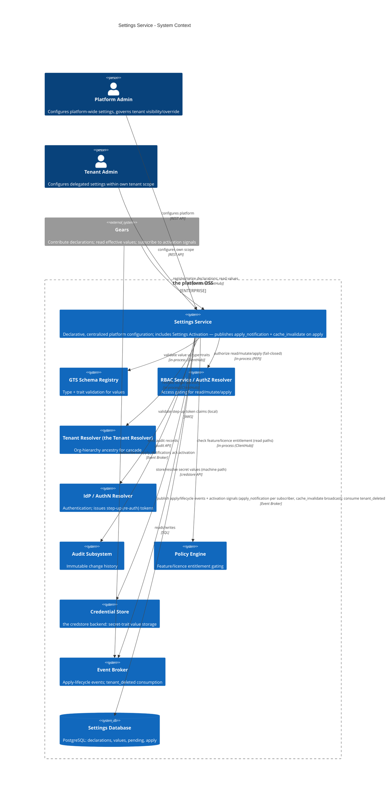
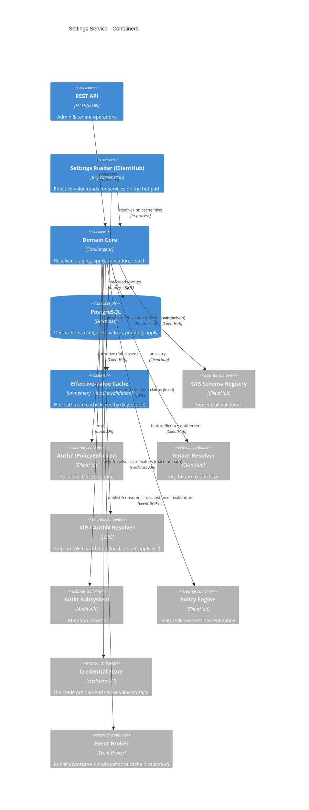
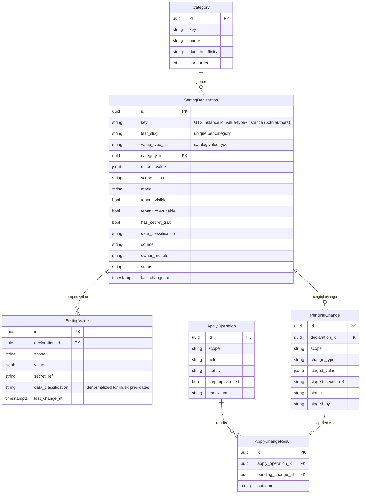

# Technical Design — Settings Service

<!-- toc -->

- [1. Architecture Overview](#1-architecture-overview)
  - [1.1 Architectural Vision](#11-architectural-vision)
  - [1.2 Architecture Drivers](#12-architecture-drivers)
  - [1.3 Architecture Layers](#13-architecture-layers)
- [2. Goals / Non-Goals](#2-goals--non-goals)
  - [2.1 Goals](#21-goals)
  - [2.2 Non-Goals](#22-non-goals)
- [3. Principles & Constraints](#3-principles--constraints)
  - [3.1 Design Principles](#31-design-principles)
  - [3.2 Constraints](#32-constraints)
- [4. Technical Architecture](#4-technical-architecture)
  - [4.1 Domain Model](#41-domain-model)
  - [4.2 Component Model](#42-component-model)
  - [4.3 API Contracts](#43-api-contracts)
  - [4.4 External Interfaces & Protocols](#44-external-interfaces--protocols)
  - [4.5 Service-to-Service Pattern](#45-service-to-service-pattern)
  - [4.6 Database schemas & tables](#46-database-schemas--tables)
  - [4.7 Security & Authorization](#47-security--authorization)
  - [4.8 Deployment Topology](#48-deployment-topology)
  - [4.9 Technology Stack](#49-technology-stack)
- [5. Risks / Trade-offs](#5-risks--trade-offs)
  - [5.1 Architectural Trade-offs](#51-architectural-trade-offs)
  - [5.2 Security and Performance Risks](#52-security-and-performance-risks)
- [6. Open Questions](#6-open-questions)
  - [6.1 From PRD (Cross-Reference)](#61-from-prd-cross-reference)
  - [6.2 Design-Specific Questions](#62-design-specific-questions)
- [7. Additional context](#7-additional-context)
  - [Feature Metrics](#feature-metrics)
  - [NFR Mapping & Scale Model](#nfr-mapping--scale-model)
  - [Testing Architecture](#testing-architecture)
- [8. Traceability](#8-traceability)

<!-- /toc -->

<!--
=============================================================================
TECHNICAL DESIGN DOCUMENT
=============================================================================
PURPOSE: Define HOW the system is built — architecture, components, APIs,
data models, and technical decisions that realize the requirements.

DESIGN IS PRIMARY: DESIGN defines the "what" (architecture and behavior).
ADRs record the "why" (rationale and trade-offs) for selected design
decisions; ADRs are not a parallel spec, it's a traceability artifact.

SCOPE:
  ✓ Architecture overview and vision
  ✓ Design principles and constraints
  ✓ Component model and interactions
  ✓ API contracts and interfaces
  ✓ Data models and database schemas
  ✓ Technology stack choices

NOT IN THIS DOCUMENT (see other templates):
  ✗ Requirements → PRD.md
  ✗ Step-by-step implementation flows → features/

STANDARDS ALIGNMENT:
  - IEEE 1016-2009 (Software Design Description)
  - IEEE 42010 (Architecture Description — viewpoints, views, concerns)
  - ISO/IEC 15288 / 12207 (Architecture & Design Definition processes)

ARCHITECTURE VIEWS (per IEEE 42010):
  - Context view: system boundaries and external actors
  - Functional view: components and their responsibilities
  - Information view: data models and flows
  - Deployment view: infrastructure topology

DESIGN LANGUAGE:
  - Be specific and clear; no fluff, bloat, or emoji
  - Reference PRD requirements using `cpt-cf-settings-service-fr-{slug}`,
    `cpt-cf-settings-service-nfr-{slug}` IDs
  - Reference ADR documents using `cpt-cf-settings-service-adr-{slug}` IDs
=============================================================================
-->

- [ ] `p1` - **ID**: `cpt-cf-settings-service-design-settings-service`

## 1. Architecture Overview

### 1.1 Architectural Vision

Design the **Settings Service** — the platform's single, centralized, declarative configuration capability. It manages platform-wide system settings: it organizes settings into categories, exposes typed keys with independent defaults, resolves effective values through the tenant hierarchy, stages changes and applies them to running services, and governs visibility and audit per setting. It realizes the WHAT/WHY of [PRD-settings-service-202606160811](./PRD.md).

This document defines the complete Settings Service — its scope is the whole capability described below.

The service is delivered as a **Cyber Fabric Gear** — the platform's unit of composable, infrastructure-agnostic capability (reference example: the [`credstore` gear](../../credstore)). Like every gear it owns its API surface and database and is consumed through a **Rust-native SDK that facades local (in-process) vs. remote calls**; concretely it is bootstrapped by the Cyber Fabric **ToolKit** runtime (`cf-gears-toolkit`) and registers its typed clients in `ClientHub`, following the same SDK/implementation split, REST surface, and PostgreSQL persistence model used by the `authz-resolver` gear. It is shipped both as that **SDK** (for in-process access) and as the **gear implementation** (§4.8). It consumes the GTS Schema Registry for value typing, the Multi-Tenancy Model for the scope hierarchy, the RBAC Engine for access gating, the IdP for authentication and apply step-up, the Credential Store for secret values, the platform Event Broker for apply-lifecycle events and cross-instance cache invalidation, and the platform audit subsystem for change history.

### 1.2 Architecture Drivers

#### Functional Drivers

| Requirement | Design Response |
|-------------|-----------------|
| `cpt-cf-settings-service-fr-settings-category-model` | Category Management + Declaration Management components; flat categories with no-orphan delete enforced by the `ON DELETE RESTRICT` FK; declaration mutation classes (immediate / immutable / step-up gated) |
| `cpt-cf-settings-service-fr-module-contributed-declarations` | Contribution Reconciler: idempotent `register_declarations` from gear init, gear-namespaced keys, `source=module_contributed` immutable to admins |
| `cpt-cf-settings-service-fr-contributed-lifecycle` | Reconciler match by version-stripped instance path; new/compatible/upgrade cases; retire → `status=retired` with values retained; re-declare-to-revive |
| `cpt-cf-settings-service-fr-setting-scope-class` | `ScopeClass` enum on the declaration drives resolution; per-class algorithm in the Value Resolver; `global ⇒ tenant_overridable=false` enforced by a DB check |
| `cpt-cf-settings-service-fr-typed-value-validation` | Type Validator against the value type in the key's left half + traits; `secret` routed to the Secret Manager; `public`/`pii`/`secret` classification drives masking |
| `cpt-cf-settings-service-fr-staged-change-pending` | Staging Manager writes `pending_changes` on the pending plane; one active pending per `(declaration, scope)`; discard individually or in bulk |
| `cpt-cf-settings-service-fr-apply-preview-stepup` | Apply Orchestrator `preview` computes a `checksum`; `POST /v1/applies` requires a fresh step-up assertion verified by a `StepUpVerifier` |
| `cpt-cf-settings-service-fr-apply-effect-resolution` | Commit-per-change, then local eviction, then signal publish; per-change `ApplyChangeResult`; consumers self-react on `apply_notification` |
| `cpt-cf-settings-service-fr-tenant-overrides` | `stage_set` / `clone_override` at any tenant inside the caller's subtree; the override row is created at the target tenant |
| `cpt-cf-settings-service-fr-cascading-inheritance` | Ancestor-id walk via the Tenant Resolver, nearest-match wins; `inheritance_trail` on the read; bounded `cascading_impact` report |
| `cpt-cf-settings-service-fr-tenant-scope-enforcement` | Server-side subtree check on every operation; reads gated by `tenant_visible`, writes by `tenant_overridable` |
| `cpt-cf-settings-service-fr-authn-role-gating` | Bearer token via the AuthN Resolver, then a fail-closed `PolicyEnforcer` decision; step-up on apply and on behavior-affecting declaration actions |
| `cpt-cf-settings-service-fr-audit-mutations` | Audit Emitter writes synchronously inside the mutation transaction, fail-closed; canonical `resource` id makes history an exact-match query |
| `cpt-cf-settings-service-fr-feature-license-gating` | `licence_feature` checked through the License Resolver on administrative read paths only; the in-process reader is not gated |
| `cpt-cf-settings-service-fr-standard-advanced-mode` | `mode` on the declaration; mode-filtered lists expose `hidden_advanced_count`; per-user preference persisted |
| `cpt-cf-settings-service-fr-search-discoverability` | Trigram GIN indexes over key/description/category/value with classification split into the index predicates |
| `cpt-cf-settings-service-fr-defaults-revert` | `default_value` column is authoritative and immutable; `stage_revert` returns the resolved fallback for a pre-commit preview |
| `cpt-cf-settings-service-fr-domain-affinity-filtering` | Optional `domain_affinity` on category and declaration; hub filters by the admin's current domain |
| `cpt-cf-settings-service-fr-dependency-group-declaration` | **Not designed for v1** — no setting pair with a cross-setting invariant has been identified; see the open question in §6.2 |

#### NFR Allocation

| NFR ID | NFR Summary | Allocated To | Design Response | Verification Approach |
|--------|-------------|--------------|-----------------|----------------------|
| `cpt-cf-settings-service-nfr-performance-read-cache` | Cache-served effective reads stay on the hot path | Effective-Value Cache + Settings Reader | In-process cache keyed by `(key, scope)`; invalidate on apply; `cache_ttl_seconds` backstop; resolve cost is O(depth), not O(tenant count) | Integration benchmark on a warm cache and on a seeded hierarchy |
| `cpt-cf-settings-service-nfr-reliability-fail-safe-staged` | Unapplied changes never affect running services | Staging Manager + Apply Orchestrator | Pending rows are never read by resolution; failed items stay pending; apply is checksum-keyed and idempotent | API + E2E apply-failure and retry paths |
| `cpt-cf-settings-service-nfr-scope-isolation` | No cross-scope leakage on any read path | Value Resolver + Search + REST layer | Server-side subtree enforcement; `404` for non-visible settings; classification split in index predicates | Integration + E2E isolation tests per read path |
| `cpt-cf-settings-service-nfr-security-baseline` | AuthN, secret confidentiality, step-up, audit | Secret Manager + Audit Emitter + AuthZ | Secrets held by reference and masked on every administrative path; plaintext only via the audited machine path; fail-closed audit | API/E2E secret and audit tests |
| `cpt-cf-settings-service-nfr-efficiency-live-read` | No platform-initiated reload or restart | Apply Orchestrator | Apply commits and publishes signals only; consumers self-react | Assert zero reload/restart calls in apply tests |
| `cpt-cf-settings-service-nfr-availability` | Read path stays available | Cache + Settings Reader | Warm reads served from cache; distinguishable `Unavailable` error so consumers own their degradation posture | Operational SLO from liveness aggregation |
| `cpt-cf-settings-service-nfr-scale-growth` | Tenant, setting, and audit volume | Data model + Audit Subsystem | Bounds in §7 *NFR Mapping & Scale Model*; audit volume and retention are requirements on the platform Audit Subsystem | Load test against the declared bounds |
| `cpt-cf-settings-service-nfr-ops-apply-monitoring` | Aggregate apply-failure visibility | Metrics | `settings_apply_failure_ratio` on shared dashboards plus an alert-routing rule | Dashboard and alert-rule review |
| `cpt-cf-settings-service-nfr-versatility-gts-scope-class` | New types and gear declarations need no core change | Type Validator + Reconciler | Values validated against a curated catalog value type; declarations arrive at runtime | Add a value type and a gear declaration without touching the gear |

### 1.3 Architecture Layers

```
┌─────────────────────────────────────────────────────────────┐
│         Consumers (gears, admin UI, tenant portal)          │
├─────────────────────────────────────────────────────────────┤
│  settings-service-sdk │ Reader + Contribution traits, DTOs  │
├─────────────────────────────────────────────────────────────┤
│  settings-service     │ REST, authz, staging, apply, search │
│  ┌──────────────────────────────────────────────────────┐   │
│  │ Domain: resolver · staging · apply · validator ·     │   │
│  │         scope-class engine · secret manager          │   │
│  ├──────────────────────────────────────────────────────┤   │
│  │ Infrastructure: effective-value cache · audit emitter│   │
│  └──────────────────────────────────────────────────────┘   │
├─────────────────────────────────────────────────────────────┤
│  External │ types-registry · tenant-resolver · authz/authn  │
│           │ credstore · event-broker · audit · license      │
├─────────────────────────────────────────────────────────────┤
│  Storage  │ PostgreSQL (declarations, values, pending)      │
└─────────────────────────────────────────────────────────────┘
```

| Layer | Responsibility | Technology |
|-------|---------------|------------|
| SDK | Public trait definitions, transport-agnostic models, errors, shared GTS type ids | Rust crate (`settings-service-sdk`) |
| Gear | REST surface, authorization, declaration lifecycle, staging and apply, resolution, search | Rust crate (`settings-service`), ToolKit gear, Axum |
| Domain | Effective-value resolution, Scope Class behaviour, staging/apply state machine, type validation, secret handling | In-process Rust modules |
| Infrastructure | Hot-path effective-value cache with signal-driven invalidation; fail-closed audit emission | In-memory cache, Event Broker client |
| External | Type and trait resolution, tenant ancestry, authentication and authorization decisions, secret storage, event transport, audit, entitlement | `types-registry`, `tenant-resolver`, `authn-resolver`, `authz-resolver`, `credstore`, `event-broker`, audit, `license-resolver` |
| Storage | Declarations, categories, values, pending changes, apply records | PostgreSQL via `toolkit-db` |

#### Context View



#### Container View



## 2. Goals / Non-Goals

### 2.1 Goals

- Category CRUD with no-orphan deletion. Categories are flat (single-level, no nesting) per PRD.
- Setting **Declaration** lifecycle — admin-authored and **module-contributed** (register/retire). The setting's **key** is a **GTS instance identifier** of the form `<value-type>~<setting-instance-id>` for **both** authors: the left segment is the curated **value type** the setting derives its shape from (`gts.cf.toolkit.settings.types.*~`, registered in the Registry), and the right segment is the setting's own instance id (no trailing `~`). Only **value types** are registered in GTS; the setting itself is a GTS **instance** and is **not** registered — it lives in the Settings DB. There is no separate `gts_type_id` (the value type is the left half of the key). The declaration is kept separate from the value.
- First-class **Scope Class** (`global` / `cascading` / `local`) deriving cascade/override behaviour deterministically.
- **Typed values** validated against GTS schema + traits (scalar and structured), with rendering metadata exposure.
- **Secret values** — `secret`-trait settings backed by the Credential Store: plaintext never enters the settings DB, cache, search index, or audit trail; masked on every **administrative** read/search/list, with **no human reveal path**. Plaintext resolves only through the **machine-only runtime path** — the in-process Settings Reader (§4.5) — and only for a consuming service authorized to that specific setting; every resolution is audited as a secret-use event (§4.2 *Secret Manager*).
- **Effective-value resolution** with inheritance walk and source trace; hot-path **cache** with invalidation on apply — local in-process. Cross-instance cache coherence is driven by the [Settings Activation](./DESIGN-activation.md) (separate design).
- **Staged change → explicit, credential-verified Apply**: pending state, pending-changes view, apply preview, step-up, per-change result reporting, and an optimistic-concurrency `checksum` verified at apply time. On Apply the service **commits the value** and publishes the apply signals — a filtered **`apply_notification`** per subscriber (consumer activation) and a **`cache_invalidate`** broadcast (replica cache); consumers read the new value **on demand** (pull) and activate it themselves. Proactive notification is owned by the [Settings Activation](./DESIGN-activation.md) (separate design).
- **Multi-tenant overrides**: set/clone/remove tenant overrides; server-side scope enforcement; visibility-gated reads; non-blocking cascading-impact warning.
- **Standard / Advanced mode** — a per-user complexity split with mode-filtered browsing and search (§4.1, §4.3).
- **Optimistic-concurrency conflict handling** — `If-Match`/ETag on `PATCH`/`DELETE` and an apply `checksum` (`409 ApplyChecksumMismatch`) so concurrent edits and stale applies fail loudly.
- **Events** — apply-lifecycle, declaration, and secret-use events published through the platform Event Broker; the **`apply_notification`** consumer signal and the **`cache_invalidate`** cross-instance cache broadcast are owned by the Settings Activation (separate design); `tenant_deleted` consumed for cleanup (§4.4).
- **Search** (cross-field), **Defaults & Revert**, **Domain Affinity filtering**.
- **Audit** of all mutations; **feature/licence gating**.
- **Gear SDK for in-process access** (`settings-service-sdk`: Settings Reader + Contribution clients) for services on the hot path.

### 2.2 Non-Goals

- **GTS type authoring / the schema registry itself** — owned by the `types-registry` gear. This service *consumes* types.
- **Managed-resource desired-state reconciliation** — owned by RMS. This service governs platform configuration, not managed resources.
- **Org-hierarchy CRUD and closure-table maintenance** — owned by the Tenant Resolver gear.
- **Role/permission CRUD and authorization decisions** — owned by RBAC Engine and the AuthZ Resolver Plugin.
- **Hot-reload / restart / template-regeneration execution** — this service commits values and publishes the apply signals (consumer `apply_notification` + replica `cache_invalidate`); it never reloads or restarts a consumer in-process. Heavier activation (reload/restart/regenerate) for components that cannot self-react is owned by the [Settings Activation](./DESIGN-activation.md) and **deferred** (out of scope for v1).
- **Cross-region settings replication; ancestor-level batch apply across descendants; settings export/import** — deferred (PRD Out of Scope).
- **Bootstrap / boot-critical infrastructure config** (DB and broker endpoints, service identity, platform TLS, ports, domain) — deployment-owned, delivered via ToolKit config at gear init (§4.8, §4.7); never a managed setting.
- **Frontend visual design / mockups** — owned by a future frontend DESIGN document.

## 3. Principles & Constraints

### 3.1 Design Principles

#### Declaration and Value Are Separate Planes

- [ ] `p1` - **ID**: `cpt-cf-settings-service-principle-declaration-value-split`

A setting's **declaration** (key, value type, Schema Default, Scope Class, metadata) is distinct from its **values** at each scope. Declarations are authored — by an administrator or contributed by a gear — and are addressed by immutable UUID on the management plane. Values are staged and applied, and are addressed by `key` on the read plane. Keeping the planes separate is what allows a gear to own a setting's shape while an administrator owns its runtime value.

#### Staging Governs Values; Declarations Are Gated by Immutability

- [ ] `p1` - **ID**: `cpt-cf-settings-service-principle-staging-scope`

Only value operations are staged. A declaration edit has no in-effect value to gate, so descriptive metadata applies immediately — but the fields that *would* change live resolution (Schema Default, value type, Scope Class) are immutable rather than staged, and the two actions that change whether a setting resolves at all (retire, reactivate) require credential step-up. No ungated path can alter a live setting's resolution.

#### Behaviour Derives From One Declared Attribute

- [ ] `p1` - **ID**: `cpt-cf-settings-service-principle-scope-class-derivation`

Cascade and override behaviour is derived from the mandatory `ScopeClass`, never from independently-toggleable booleans. A setting must declare its class, so infrastructure settings are `global` by declaration rather than by remembering to disable a flag.

#### Single Source of Ancestry

- [ ] `p1` - **ID**: `cpt-cf-settings-service-principle-single-ancestry-source`

Tenant ancestry is owned by the Tenant Resolver. This gear stores a flat `tenant_id`, never a path, and never reconstructs the hierarchy from a string. A tenant re-parent therefore requires no stored-scope rewrite.

#### One Type System, Consumed Not Rebuilt

- [ ] `p1` - **ID**: `cpt-cf-settings-service-principle-consume-gts`

Values are validated against a curated catalog value type resolved from `types-registry`. This gear builds no parallel type system. Only value types are registered; a setting is a GTS *instance* that lives in this gear's own tables, so the registry stays off the read hot path.

#### Secrets Never Take a Human Path

- [ ] `p1` - **ID**: `cpt-cf-settings-service-principle-machine-only-secrets`

A `secret`-classified value is held by reference and masked on every administrative surface. Plaintext resolves only through the machine-only reader path, authorized per setting against the calling service and audited on every resolution. There is no administrative reveal operation.

#### Inform, Do Not Block

- [ ] `p1` - **ID**: `cpt-cf-settings-service-principle-inform-not-block`

Consequences are surfaced rather than prevented: cascading impact is a non-blocking warning, a flagged override falls through to a valid value instead of failing the read, and hard blocks are reserved for the irreversible or the invalid.

#### Fail Closed on Every Gate

- [ ] `p1` - **ID**: `cpt-cf-settings-service-principle-fail-closed`

Authorization, entitlement, type validation, and audit all fail closed. A mutation that cannot be authorized, validated, or recorded does not take effect.

### 3.2 Constraints

| Constraint/Assumption | Description |
|----------------------|-------------|
| PostgreSQL primary storage | Declarations, categories, values, pending changes, and apply records stored in PostgreSQL via the `toolkit-db`. |
| Cyber Fabric Gear | Settings Service is **supplied as a Cyber Fabric Gear** — an SDK crate plus a gear implementation (§4.8), hosted by the Cyber Fabric **ToolKit** runtime and registering its typed clients in `ClientHub`. `ClientHub` resolves each dependency to an in-process implementation or a generated REST client per the active deployment profile, so consumers call the same SDK trait either way: co-located, effective-value reads run **in-process** via `SettingsReaderClient` (no network call on the hot path); when the gear runs out-of-process the same trait is served over REST. |
| Setting key by author | The setting `key` is a **GTS instance identifier** `<value-type>~<setting-instance-id>` for **both** authors. Left = the curated **value type** (`gts.cf.toolkit.settings.types.*~`, the only thing registered in GTS). Right = the setting's instance id (no trailing `~`): a **module** provides its full GTS id and the category is **extracted from the namespace segment**; an **admin** setting's instance id is `gts.<vendor>.toolkit.settings.<category>.<name>.v1` (`<vendor>`/`<name>` entered by the admin, `<category>` = the category it was added to). The setting is a GTS **instance** and is **not** registered; there is no separate `gts_type_id` field (the value type is the left half of the key). |
| GTS validation | Every value is checked against the setting's **value type** (the left half of its key) + traits via `TypesRegistryClient`. This service builds no parallel type system. Only value types are registered; setting instances and their values live in our own tables — never in the Registry. |
| Scope hierarchy | Scopes are tenant-hierarchy paths: `/` (platform root) or `/tenants/{id}`. Ancestry resolved via `TenantResolverClient` (in-process). |
| Secrets | `secret`-trait values are backed by the Credential Store (the credstore backend). Plaintext never enters the settings DB, cache, search index, or audit trail — the row holds only an opaque `secret_ref`; values are masked on every **administrative** read/search/list and there is **no human reveal path**. Plaintext is resolved only through the **machine-only** Settings Reader path (§4.5), per-setting authorized and audited as a secret-use event (§4.2 *Secret Manager*). |
| AuthN / step-up | OIDC bearer via the AuthN Resolver / IdP. Apply requires **step-up = re-authentication at the IdP**, not a password entered into this service: the frontend re-runs the IdP login ceremony and the service verifies only the resulting fresh token's claims. **The Settings Service never receives or verifies raw credentials** (§4.2 *Apply Orchestrator*). |
| AuthZ | RBAC `PolicyEnforcer` gates read/mutate/apply against `gts.cf.toolkit.settings.*` resource types. |
| Feature/licence entitlement | Visibility gating by `licence_feature` uses the Policy Engine Decision Point via `PolicyDecisionClient` (in-process ClientHub): given the caller `Context` and a `licence_feature`, it returns allow/deny, **fail-closed** (deny on error). Applied on REST read/browse/search paths only — not the in-process Settings Reader hot path. |
| Audit & events | Mutations write to the platform audit subsystem (unlike RBAC v1, audit is **not** deferred here — it is a PRD show-stopper). Apply-lifecycle, declaration, and secret-use events are published, and `tenant_deleted` is consumed, through the platform **Event Broker** (§4.4); local cache invalidation is in-process, while cross-instance coherence (`cache_invalidate`) and the consumer signal (`apply_notification`) are owned by the Settings Activation (separate design). |
| Optimistic concurrency | `PATCH`/`DELETE` require `If-Match`/ETag and Apply verifies a previewed `checksum` (`409 ApplyChecksumMismatch`), so concurrent edits and stale applies fail loudly. The DB-level partial-unique pending index is an additional data-integrity invariant. |
| Activation model | On Apply the value is committed and is **effective on next read**; consumers read on demand (pull, §4.5). This service does not execute reload/restart. Proactive change notification, consumer reaction, and the orchestrated fallback for components that cannot self-react are owned by the [Settings Activation](./DESIGN-activation.md). |

## 4. Technical Architecture

### 4.1 Domain Model

#### GTS Type Constants

| Constant | GTS Type Identifier |
|----------|---------------------|
| Category | `gts.cf.toolkit.settings.category.v1~` |
| Setting Declaration | `gts.cf.toolkit.settings.declaration.v1~` |
| Setting Value | `gts.cf.toolkit.settings.value.v1~` |
| Pending Change | `gts.cf.toolkit.settings.pending_change.v1~` |
| Apply Operation | `gts.cf.toolkit.settings.apply_operation.v1~` |
| Effective Value | `gts.cf.toolkit.settings.effective_value.v1~` |
| Apply Bundle | `gts.cf.toolkit.settings.apply_bundle.v1~` |

GTS identifiers follow `gts.<vendor>.<package>.<namespace>.<type>.v<MAJOR>[.<MINOR>]~`. **These are the control-plane entity types** — the shape of a category row, a declaration row, and so on — used as RBAC resource types and internal schemas. They are authored by the gear itself, so they carry vendor `cf` (Cyber Fabric), package `toolkit`, namespace `settings`.

**Why `toolkit`, not `core`.** In the Cyber Fabric namespace, `core` holds ambient primitives with no service in front of them — the error taxonomy, the event bus, monitoring metrics, the account model's tenant-type (`gts.cf.core.{errors,events,mon,am}.*`); nobody calls "the errors service". `toolkit` holds a discrete subsystem with its own registry, RBAC, and lifecycle (e.g. authz, `gts.cf.toolkit.authz.*`). The Settings Service is the second kind — a gear with its own declaration registry, RBAC resource types, and apply lifecycle — so it is a peer of authz under `toolkit`, not of the error taxonomy under `core`.

These control-plane types are **separate** from **setting keys** and **value types**. A setting `key` is a GTS **instance** id `<value-type>~<instance-id>` (§4.1); its **instance** half is authored by the *deploying party* (module or admin) and its vendor is that party's — not necessarily `cf` — see §4.2 *Declaration Management* / *Contribution Reconciler* and §4.6. Its **value-type** half is a curated catalog type under `gts.cf.toolkit.settings.types.*~` (the only GTS-registered part).

#### Entity: `Category`

| Field | Type | Required | Description |
|-------|------|----------|-------------|
| `id` | UUID | Yes | Unique category ID (UUIDv7). |
| `key` | string (1..128) | Yes | Globally-unique category slug (e.g. `network`). Used as the single category segment in admin setting keys (§4.2 *Declaration Management*), so it MUST NOT contain `/` (reserved path separator; validated at create/update). |
| `name` | string (1..256) | Yes | Human-readable name; globally unique (categories are flat — no nesting). |
| `description` | string (0..4096) | No | Category description. |
| `domain_affinity` | `DomainAffinity` | No | Optional administrative-domain binding (e.g. `infrastructure`, `commercial`). |
| `sort_order` | integer | Yes | Display ordering hint. |
| `icon` | string | No | Icon token for the hub. |
| `created_at` / `updated_at` | `timestamptz` | Yes | UTC timestamps. |

**Invariants:** `key` and `name` globally unique; categories are flat (no nesting); deletion rejected while the category contains any setting declaration (no-orphan, `cpt-cf-settings-service-fr-settings-category-model`).

#### Entity: `SettingDeclaration`

The *definition* of a setting — distinct from its runtime value(s). Authored by a platform administrator or contributed by a gear.

| Field | Type | Required | Description |
|-------|------|----------|-------------|
| `id` | UUID | Yes | Unique declaration ID (UUIDv7). |
| `key` | string | Yes | Globally-unique setting id passed to `resolve` and used in REST value paths — a **GTS instance identifier** `<value-type>~<setting-instance-id>` (chain form) for **both** authors (§4.2 *Declaration Management*, *Contribution Reconciler*). Left segment = the curated **value type** (`gts.cf.toolkit.settings.types.*~`, ends with `~`, the only GTS-registered part). Right segment (no trailing `~`) = the setting instance id: for a **module** setting, the id the gear supplies, whose namespace segment names the category (§4.2 *Contribution Reconciler*); for an **admin** setting, `gts.<vendor>.toolkit.settings.<category>.<name>.v1` (§4.2 *Declaration Management*). The setting is a GTS **instance**, not a registered type. Consumers treat the whole `key` as an opaque identifier. |
| `category_id` | UUID | Yes | Owning category (FK). The category name is embedded in the `key` (admin: the `<category>` segment; module: the namespace segment of the supplied id), so moving the setting to another category or renaming the category **re-keys** the setting (§4.2 *Declaration Management* / *Contribution Reconciler*). |
| `value_type_id` | string | Yes | GTS id of the **value type** the value is validated against — a curated type from the catalog `gts.cf.toolkit.settings.types.*~`, **registered** in GTS. This is exactly the **left half** of `key`. Carries the trait set (incl. `secret`). |
| `default_value` | JSON | No | Schema Default — the **authoritative** default: this column, not the value type, is the source of truth. Value types are **validation-only** (they carry no JSON-Schema `default` keyword), so there is no second, divergent default. `NULL` only when the setting has no default. Read locally with the value rows — the GTS Registry is **not** on the resolution path. |
| `scope_class` | `ScopeClass` | Yes | `global` / `cascading` / `local` — derives cascade/override behaviour deterministically. |
| `mode` | `Mode` | Yes | `standard` or `advanced` — complexity split governing default visibility in the hub (§4.1 `Mode`; default `standard`). |
| `tenant_visible` | boolean | Yes | Whether tenants may *see* the setting (orthogonal to Scope Class). |
| `tenant_overridable` | boolean | Yes | Whether tenants may *change* the setting. Forced `false` when `scope_class = global`. |
| `domain_affinity` | `DomainAffinity` | No | Optional domain binding (overrides category default). |
| `has_secret_trait` | boolean | Yes | Denormalized from the value type's trait set for fast masking; `true` when `value_type_id` carries the `secret` trait (§4.2 *Secret Manager*). |
| `data_classification` | `DataClassification` | Yes | Sensitivity class of the setting's **value**: `public` / `pii` / `secret`. `secret` is *derived* from the value type's `secret` trait (it always accompanies `has_secret_trait = true`); `pii` is *declared* by the author, because a PII-bearing value — an alerting contact address, an operator name — need not carry the `secret` trait yet must not reach a caller unauthorized for unmasked PII. Default `public`. Drives masking (§4.2 *Secret Manager*) and the search corpus (§4.2 *Search*). |
| `source` | `DeclarationSource` | Yes | `admin_authored` or `module_contributed`. |
| `owner_module` | string | No | Owning module namespace; required when `source = module_contributed`. |
| `licence_feature` | string | No | Feature/licence flag gating visibility; enforced server-side on the REST read paths via the Policy Engine Decision Point (`PolicyDecisionClient`; see §4.2 *Category Management* / *Declaration Management*/§4.2 *Search* and §4.7). |
| `status` | `DeclarationStatus` | Yes | `active` or `retired`. |
| `description` | string (0..4096) | No | Human-readable description. |
| `last_change_at` | `timestamptz` | Yes | When the **declaration's definition** (metadata/type/default) last changed — **definition only, NOT a max over its values** (a value-aggregating field would leak cross-tenant activity). This is the *declaration arm* of the effective-value recency `max` computed on the admin read (§4.3); the *value arm* is `SettingValue.last_change_at`. |
| `created_at` / `updated_at` | `timestamptz` | Yes | UTC timestamps. |
| `created_by` | string | Yes | Author subject ID (or `system`/module for contributed). |

**Invariants:**
- `key` is globally unique and is a **GTS instance identifier** `<value-type>~<setting-instance-id>` for both authors. Uniqueness is enforced by the Settings DB (`uq_declaration_key` on `key`; plus `UNIQUE(category_id, leaf_slug)` for the leaf-within-category rule, §4.6). The **value type** (left half) is GTS-registered and guarantees the shape; the setting **instance** (right half) is not registered.
- The `key`'s right (instance) half embeds the **category**: an admin id is `gts.<vendor>.toolkit.settings.<category>.<name>.v1`; a gear id carries the category in its namespace segment (§4.2 *Contribution Reconciler*). Renaming or moving a setting's category therefore **re-keys** the setting (for both authors); the old key resolves as `Gone` (§4.2 *Value Resolver*), no succession/redirect.
- The **version lives in the instance half's `.vN` suffix**. An **upgrade** — including a **breaking** value-shape change (a different value type on the left) — is a **new instance major** under the same version-stripped instance path, hence a **new key**; the old version and its values are retained and old values are copied to the new key with re-validation (§4.2 *Contribution Reconciler*). A same-major in-place metadata/compatible change keeps the key (§6).
- A declaration's identity (key/type, scope_class, source) is immutable for `module_contributed` declarations except through the register/retire lifecycle (§4.2 *Contribution Reconciler*); administrators MUST NOT alter a contributed declaration, only its values.
- `scope_class = global` ⇒ `tenant_overridable = false` (enforced regardless of the supplied flag); `tenant_visible` MAY still be `true` (read-only to tenants).

#### Enum: `ScopeClass`

| Value | Override behaviour | Inheritance |
|-------|--------------------|-------------|
| `global` | Value lives only at `/`. Never tenant-overridable. | Not inherited by tenants; tenant access governed solely by `tenant_visible` (read-only). |
| `cascading` | Overridable at any permitted scope. | Inherits down the org hierarchy; descendants without an own override inherit the nearest ancestor override. |
| `local` | Overridable at a scope. | Applies only at the scope where set; never inherited by descendants. |

#### Enum: `DeclarationSource` / `DeclarationStatus` / `DomainAffinity`

| Enum | Values |
|------|--------|
| `DeclarationSource` | `admin_authored`, `module_contributed` |
| `DeclarationStatus` | `active`, `retired` |
| `DomainAffinity` | open vocabulary (e.g. `infrastructure`, `commercial`); `NULL` = no affinity |
| `Mode` | `standard` (visible in Standard mode), `advanced` (hidden in Standard, visible in Advanced) |
| `DataClassification` | `public` (no special handling), `pii` (unmasked only for a caller authorized for unmasked PII; masked in every other administrative read and in audit/report output; governed by the platform retention/anonymization policy), `secret` (held by reference in the Credential Store, masked on every administrative path with no human reveal, plaintext only via the machine-only reader path — §4.2 *Secret Manager*) |

#### Entity: `SettingValue`

An **applied** override at a specific scope (distinct from the Schema Default and from pending changes).

| Field | Type | Required | Description |
|-------|------|----------|-------------|
| `id` | UUID | Yes | Unique value ID (UUIDv7). |
| `declaration_id` | UUID | Yes | Declaration this value belongs to (FK). |
| `tenant_id` | UUID | No | Scope as an id, not a path: `NULL` ⇒ platform scope (`/`); a tenant UUID ⇒ that tenant. Ancestry is resolved by the Tenant Resolver, never parsed from this field (§4.2 *Value Resolver*, §4.6). |
| `value` | JSON | No | The inline (non-secret) override value; `NULL` when the value is a secret held by reference. |
| `secret_ref` | string | No | Opaque Credential-Store reference for a `secret`-trait value (§4.2 *Secret Manager*); `NULL` for inline values. Exactly one of `value`/`secret_ref` is set. |
| `needs_review` | boolean | Yes | `true` when the value no longer validates against the setting's current GTS type (flagged by the Reconciler on an invalidating type upgrade, §4.2 *Contribution Reconciler*). Excluded from apply until corrected; cleared on a valid re-stage/apply or revert (§4.6; PRD Schema/type-versioning decision). |
| `needs_review_detail` | string | No | Short reason for the flag, shown to the admin (§4.3); `NULL` when `needs_review = false`. |
| `last_change_at` | `timestamptz` | Yes | When this scoped value last changed. The *value arm* of the effective-value recency `max` (§4.3); on read only the **resolved** row's value contributes — never a max across sibling/descendant scopes. |
| `created_at` / `updated_at` | `timestamptz` | Yes | UTC timestamps. |
| `set_by` | string | Yes | Subject who set the value. |

**Invariants:** one applied value per `(declaration_id, tenant_id)` and at most one platform row per declaration (`tenant_id IS NULL`), enforced by the two partial unique indexes (§4.6); exactly one of `value`/`secret_ref` is set — and **which** one follows the declaration's `secret` trait, both enforced by `CHECK` (§4.6); the serialized `value` MUST NOT exceed the **64 KiB** size cap (enforced at staging by the Type Validator, §4.2 *Type Validator*); `global` declarations may only have a value at platform scope (`tenant_id IS NULL`); `local` and `cascading` may have per-tenant values (`tenant_id` set) subject to `tenant_overridable`.

#### Entity: `EffectiveValue` (computed, not persisted)

Returned by the resolver and the Settings Reader.

| Field | Type | Description |
|-------|------|-------------|
| `key` | string | Setting key — a GTS instance id `<value-type>~<instance-id>` (both authors); see §1.3 `SettingDeclaration.key`. |
| `scope` | string | Requested scope. |
| `value` | JSON | Resolved value. |
| `source` | `EffectiveSource` | Where the value resolved from. |
| `source_scope` | string \| `null` | Scope that provided the value (`null` for Schema Default). |
| `traits` | object | Resolved trait set (for rendering / pre-validation), from the setting's `value_type_id` (§1.3). |
| `inheritance_trail` | `TrailEntry[]` | Ordered scopes inspected during resolution — **limited to the caller's own ancestor chain** (root→self), never a sibling/descendant scope (same cross-tenant leak-safety invariant as `last_change_at`). The per-entry **who/when** (`set_by` + timestamp) is surfaced **only on the admin read** (§4.3), **not** on the consumer SDK `EffectiveValue` (§4.5) — an ancestor's setter identity is not exposed to a subordinate tenant. |

#### Enum: `EffectiveSource`

| Value | Description |
|-------|-------------|
| `own_override` | An override exists at the requested scope. |
| `inherited` | Resolved from a nearest-ancestor override (cascading). |
| `schema_default` | No override in the chain; the type-declared default. |

#### Entity: `PendingChange`

A staged, not-yet-applied mutation. Does not affect running services until Apply (`cpt-cf-settings-service-fr-staged-change-pending`).

| Field | Type | Required | Description |
|-------|------|----------|-------------|
| `id` | UUID | Yes | Unique pending-change ID (UUIDv7). |
| `declaration_id` | UUID | Yes | Target declaration (FK). |
| `scope` | string | Yes | Target scope. |
| `change_type` | `ChangeType` | Yes | `set` / `revert` / `remove` / `clone`. |
| `staged_value` | JSON | No | Proposed inline (non-secret) value; `NULL` for `revert`/`remove` or when the staged value is a secret held via `staged_secret_ref`. |
| `staged_secret_ref` | string | No | Credential-Store reference for a staged `secret`-trait value (§4.2 *Secret Manager*); `NULL` for inline/no-value changes. |
| `prior_value_snapshot` | JSON | No | Effective value before the change (for preview / audit pre-image). |
| `status` | `PendingStatus` | Yes | `pending` / `applying` / `applied` / `failed`. |
| `failure_detail` | string | No | Populated on `failed`. |
| `staged_by` | string | Yes | Subject who staged the change. |
| `staged_at` | `timestamptz` | Yes | UTC timestamp. |
| `applied_at` | `timestamptz` | No | Set when the change reaches `applied`. |

**Invariants:** at most one `pending`/`applying` change per `(declaration_id, scope)`; a new staged change supersedes a prior discarded one.

#### Enum: `ChangeType` / `PendingStatus`

| Enum | Values |
|------|--------|
| `ChangeType` | `set`, `revert`, `remove`, `clone` |
| `PendingStatus` | `pending`, `applying`, `applied`, `failed` |

#### Entity: `ApplyOperation`

| Field | Type | Required | Description |
|-------|------|----------|-------------|
| `id` | UUID | Yes | Unique apply ID (UUIDv7). |
| `scope` | string | Yes | Scope being applied (own scope only). |
| `actor` | string | Yes | Subject performing the apply. |
| `status` | `ApplyStatus` | Yes | `previewed` / `running` / `succeeded` / `partial_failed` / `failed`. |
| `step_up_verified` | boolean | Yes | Whether IdP step-up re-verification succeeded before execution. |
| `summary` | JSON | Yes | Per-outcome counts (e.g. `{ applied: 8, failed: 1 }`). |
| `checksum` | string | Yes | Content hash of the previewed change set, verified at apply time (`409 ApplyChecksumMismatch` on drift; §4.2 *Apply Orchestrator*, §4.3). |
| `started_at` / `completed_at` | `timestamptz` | Yes/No | UTC timestamps. |

#### Enum: `ApplyStatus`

| Value | Description |
|-------|-------------|
| `previewed` | Preview computed; awaiting step-up + confirm. |
| `running` | Execution in progress. |
| `succeeded` | All changes applied. |
| `partial_failed` | Some changes applied; failed items left pending for retry. |
| `failed` | No change applied. |

#### Entity: `ApplyChangeResult`

| Field | Type | Description |
|-------|------|-------------|
| `id` | UUID | Result ID. |
| `apply_operation_id` | UUID | Owning apply (FK). |
| `pending_change_id` | UUID | The change (FK). |
| `outcome` | `Outcome` | `success` / `failure`. |
| `detail` | string \| `null` | Failure detail. |

#### Entity Relationships



### 4.2 Component Model

```mermaid
graph TD
 subgraph API["API Layer"]
 rest_api["REST API<br/><small>HTTP/JSON · admin/tenant ops</small>"]
 reader_api["Settings Reader<br/><small>ClientHub · effective reads</small>"]
 end

 subgraph Domain["Domain Layer"]
 cat["Category Mgmt"]
 decl["Declaration Mgmt"]
 reconciler["Contribution Reconciler<br/><small>register/retire</small>"]
 validator["Type Validator<br/><small>GTS + traits</small>"]
 resolver["Value Resolver<br/><small>effective value + source trace</small>"]
 staging["Staging Manager<br/><small>pending changes</small>"]
 apply["Apply<br/><small>preview · step-up · commit · publish apply_notification + cache_invalidate · checksum</small>"]
 secrets["Secret Manager<br/><small>store · mask · resolve (machine-only)</small>"]
 search["Search"]
 scopeclass["Scope Class Engine"]
 end

 subgraph Infra["Infrastructure Layer"]
 cache["Effective-Value Cache<br/><small>local invalidation; cross-instance via cache_invalidate broadcast</small>"]
 emitter["Audit Emitter<br/><small>audit + event publish</small>"]
 end

 subgraph External["External Dependencies"]
 types[("GTS Registry<br/><small>ClientHub</small>")]
 authz[/"AuthZ PolicyEnforcer<br/><small>ClientHub</small>"/]
 tenant[("Tenant Resolver<br/><small>ClientHub</small>")]
 idp[/"IdP / AuthN Resolver<br/><small>step-up token (JWKS)</small>"/]
 audit[/"Audit Subsystem"/]
 policy[/"Policy Engine<br/><small>ClientHub · entitlement</small>"/]
 credstore[("Credential Store<br/><small>the credstore backend</small>")]
 broker[/"Event Broker<br/><small>publish/consume</small>"/]
 pg[("PostgreSQL")]
 end

 rest_api -->|delegates| cat
 rest_api -->|delegates| decl
 rest_api -->|delegates| staging
 rest_api -->|delegates| apply
 rest_api -->|delegates| search
 rest_api -->|reads| resolver
 reader_api -->|hot read| cache
 reader_api -.->|miss| resolver
 reader_api -->|resolve plaintext<br/><small>authorized · audited</small>| secrets

 decl -->|validates default| validator
 decl -->|derives behaviour| scopeclass
 reconciler -->|reconciles declarations| decl
 staging -->|validates value| validator
 staging -->|derives override rules| scopeclass
 staging -->|store secret| secrets
 resolver -->|ancestry walk| tenant
 resolver -->|reads| pg
 resolver -->|mask secret| secrets
 validator -->|type+traits| types
 apply -->|invalidate (local)| cache
 apply -->|validate step-up token| idp
 apply -->|publish apply_notification + cache_invalidate| broker
 secrets -->|store/resolve| credstore

 cat -->|reads/writes| pg
 decl -->|reads/writes| pg
 staging -->|reads/writes| pg
 apply -->|reads/writes| pg
 search -->|reads| pg

 cat -->|authorize| authz
 decl -->|authorize| authz
 staging -->|authorize| authz

 cat -->|entitlement| policy
 decl -->|entitlement| policy
 search -->|entitlement| policy

 apply -->|audit| emitter
 staging -->|audit| emitter
 secrets -->|secret-use audit| emitter
 emitter -->|records| audit
 emitter -->|publish events| broker
 broker -->|tenant_deleted / cache invalidate| cache
```

#### Component: Category Management

- [ ] `p1` - **ID**: `cpt-cf-settings-service-component-category-management`

**Dependencies:** PostgreSQL, `PolicyEnforcer`, `PolicyDecisionClient` (Policy Engine — feature/licence entitlement), Audit Emitter

**Operations:**

| Operation | Input | Output | Key Behavior |
|-----------|-------|--------|--------------|
| `create_category` | `CreateCategoryRequest`, `Context` | `Category` | Authorize `create` on `gts.cf.toolkit.settings.category.v1~` (category governance is per-resource-type CRUD — create/read/update/delete — per §4.7). Reject duplicate `key`/`name` (`409`). Insert; audit. (`cpt-cf-settings-service-fr-settings-category-model`) |
| `update_category` | `id`, `UpdateCategoryRequest`, `Context` | `Category` | Authorize `update` on `gts.cf.toolkit.settings.category.v1~`. Partial update (`name`, `description`, `domain_affinity`, `sort_order`, `icon`). Requires `If-Match` (optimistic concurrency, §4.3). |
| `delete_category` | `id`, `Context` | — | Authorize `delete` on `gts.cf.toolkit.settings.category.v1~`. Reject (`409 CategoryNotEmpty`) if any declaration row references it — **including `retired` ones** (a retired declaration still occupies the category and its values are retained, §4.2 *Declaration Management*; no-orphan, `cpt-cf-settings-service-fr-settings-category-model`). Hard-delete only when no declaration row remains. Authoritative guard is the declaration→category FK `ON DELETE RESTRICT` (§4.6), which blocks regardless of `status`. |
| `get_category` / `list_categories` | filter, `Context` | `Category` / `Category[]` | Domain-filtered, visibility-gated, paginated. |

#### Component: Declaration Management

- [ ] `p1` - **ID**: `cpt-cf-settings-service-component-declaration-management`

Manages **admin-authored** declarations and serves reads for both authored and contributed declarations. Contributed declarations are written only via the Reconciler (§4.2 *Contribution Reconciler*).

**Dependencies:** `TypeValidator`, `ScopeClassEngine`, Category Management, PostgreSQL, `PolicyDecisionClient` (Policy Engine — feature/licence entitlement), Audit Emitter

**Operations:**

| Operation | Input | Output | Key Behavior |
|-----------|-------|--------|--------------|
| `create_declaration` | `CreateDeclarationRequest`, `Context` | `SettingDeclaration` | Authorize `create` on `gts.cf.toolkit.settings.declaration.v1~`. Verify category exists (`404`). The admin supplies `value_type_id` (a curated **value type** from `gts.cf.toolkit.settings.types.*~`), plus a `vendor` and a leaf `name`. Build the setting **instance id** `gts.<vendor>.toolkit.settings.<category>.<name>.v1`, where `<category>` is the target category's slug, `<vendor>`/`<name>` are the admin's inputs (validate each segment against the GTS grammar — lowercase, `[a-z0-9_]`, no `/`, `422` otherwise). The `key` is the **GTS instance identifier** `<value_type_id>~<instance-id>` (left = the value type ending `~`; right = the instance id, no trailing `~`). The setting is a GTS **instance** and is **not** registered in GTS (only the value type is). `key` is **globally unique** (`uq_declaration_key`) and the leaf `name` is unique within its category (`UNIQUE(category_id, leaf_slug)`, `cpt-cf-settings-service-fr-settings-category-model`). The `<category>` segment tracks the owning category: renaming or moving the category **re-keys** the setting, and the stale key resolves as `Gone` (§4.2 *Value Resolver*) — no succession. The Schema Default lives solely in the `default_value` column — the value type is validation-only. Validate `default_value` against `value_type_id` via Type Validator. Resolve `has_secret_trait` from that type's trait set; when `true`, the setting is secret-backed and its **values** are stored via the Secret Manager (§4.2 *Secret Manager*) — its **default** is not: reject a non-empty `default_value` on a secret-trait type (`422`), see *A secret setting has no secret default* there. Set `data_classification` (§4.1): **`secret` is derived** from the trait, never author-supplied; otherwise take the author's declared class — `pii` or `public` (default `public`). Reject an author-supplied `secret` on a non-secret type (`422`). Force `tenant_overridable=false` when `scope_class=global`. Set `mode` (default `standard`). Reject duplicate `key` (`409`). Set `source=admin_authored`. Insert; audit. (`cpt-cf-settings-service-fr-settings-category-model`) |
| `update_declaration` | `id`, `UpdateDeclarationRequest`, `Context` | `SettingDeclaration` | Authorize `update` on `gts.cf.toolkit.settings.declaration.v1~` (metadata, incl. `tenant_visible`/`tenant_overridable` — platform-scope-gated). Reject if `source=module_contributed` (`409 ContributedDeclarationImmutable`). Partial update of **metadata only** (`description`, `tenant_visible`, `tenant_overridable`, `domain_affinity`, `licence_feature`, `mode`). **`default_value` (the Schema Default) is NOT editable here** — the PRD treats it as a **read-only** stable declared floor and a revert target: change the effective baseline via a **platform-scope override** (staged, §4.2 *Staging Manager*/§4.3), not by editing the default. The value **type** is immutable too (baked into the `key` — a type change is a re-key, §4.2 *Contribution Reconciler*, never a `PATCH`). Requires `If-Match` (optimistic concurrency, §4.3). |
| `delete_declaration` | `id`, `Context` | `SettingDeclaration` (retired) | Authorize `delete` on `gts.cf.toolkit.settings.declaration.v1~` (retire = soft-delete) **and require credential step-up** — retire drops a live setting out of resolution at once, so it is a **behavior-affecting authoring action** gated like Apply (step-up contract §4.2 *Apply Orchestrator*, authz §4.7). Reject if `source=module_contributed` (`409 ContributedDeclarationImmutable` — gear declarations retire via §4.2 *Contribution Reconciler*, they are not admin-deletable). **Immediate soft-delete** (retire) — **not** staged (`cpt-cf-settings-service-fr-staged-change-pending`: declaration operations apply at once): sets `status=retired` on the declaration (same terminal state as a gear retire, §4.2 *Contribution Reconciler*) in one transaction, invalidates cache, and publishes `cache_invalidate` for affected scopes + `event_declaration_retired` (§4.4). **Values are retained** in `setting_values` (not deleted) but are **excluded from resolution** — a read of a retired key returns the distinct `Retired` outcome (§4.2 *Value Resolver*/§4.5), symmetric with a gear retire. Recovery is by **re-declaring the key** — a `POST /v1/declarations` at the same key revives this retired row (§4.3 re-declare-to-revive); full disposition of the retained values (purge / archive / keep) is the same open lifecycle question as gear removal (§6). Requires `If-Match` (§4.3). There is no pending state and no Apply step. Audit the retire with pre-images (§4.2 *Audit Emitter*). |
| `get_declaration` / `list_declarations` | filter, `Context` | declaration(s) | Visibility-, domain-, and licence-gated. Returns the setting `key` (the `<value-type>~<instance>` id), its `value_type_id` (the key's left half), and resolved `traits` for client rendering (`cpt-cf-settings-service-fr-typed-value-validation`). |

**Declaration mutation classes — what is immediate, what is immutable, what is step-up gated.** Declaration operations are never value-staged (§4.2 *Staging Manager*), but they are **not** uniformly ungated: each field falls into one of three classes by its effect on live resolution.

| Class | Fields / actions | Gate |
|-------|------------------|------|
| **Descriptive metadata** | `description`, `mode`, `domain_affinity`, `licence_feature`, and — for admin-authored settings — `tenant_visible` / `tenant_overridable` | **Immediate**, `update` permission + `If-Match`. No gate needed: none of these changes an effective value. |
| **Behavior-affecting fields** | `default_value` (Schema Default), value **type**, `scope_class` | **Immutable** — an in-place edit is rejected (`422`, §4.3). The change is expressible only as a **replacement declaration** (a new key) or, for the type, a **new major version** (§4.2 *Contribution Reconciler*). No ungated edit can alter a live setting's resolution. |
| **Behavior-affecting actions** | **retire** (soft-delete, §4.2 *Declaration Management*) and **reactivate** (re-declare-to-revive, §4.3) | **Immediate + credential step-up** — each changes whether a live setting resolves at all, so both are gated like Apply (§4.2 *Apply Orchestrator*, §4.7). |
| **Classification change** | `data_classification` (§4.1) | **Tightening** (`public` → `pii`) is immediate. **Loosening** (`pii` → `public`) requires **credential step-up** — it un-masks content previously withheld from callers without PII entitlement (§4.2 *Secret Manager*, *Search*). Neither alters effective-value resolution, so neither is value-staged. |

Step-up applies to the **administrative** retire/reactivate path only. The module register/retire lifecycle (§4.2 *Contribution Reconciler*) is a machine caller with no interactive session to re-authenticate; it is governed by the contribution trust model (§4.7) instead.

**Invariants:**
- `default_value` (Schema Default) is independent of any override and is never destroyed by setting/reverting an override (`cpt-cf-settings-service-fr-defaults-revert`).
- Structured (object/array) defaults are supported, not only scalars.
- No declaration edit can change a live setting's effective resolution: resolution-affecting fields are immutable, and the two resolution-affecting actions require step-up (table above).

#### Component: Module Contribution Reconciler

- [ ] `p1` - **ID**: `cpt-cf-settings-service-component-module-contribution-reconciler`

Realizes **Module-Contributed Settings** (`cpt-cf-settings-service-fr-module-contributed-declarations`, `cpt-cf-settings-service-fr-contributed-lifecycle`): gears register Setting Declarations on install/upgrade; administrators may change values only.

**Invocation (caller contract).** The owning gear invokes `register_declarations` from its own gear init **on every boot** — the reconcile is idempotent, so a repeated call is safe and the gear's declaration set simply converges (no separate install/upgrade hook is required; a version bump is picked up on the next boot). The **write-time ordering** against the Settings gear (the owner calls once Settings is reachable) and the **failure posture** when the call fails (fail-closed init vs. degrade) are the **owner gear's** responsibility, not this service's; the service guarantees only that the reconcile is idempotent and returns a typed error on failure.

**Dependencies:** Declaration Management, `TypeValidator`, PostgreSQL, Audit Emitter

**Operations:**

| Operation | Input | Output | Key Behavior |
|-----------|-------|--------|--------------|
| `register_declarations` | `owner_module`, `ContributedDeclaration[]` | `ReconcileResult` | Idempotent reconcile of the gear's settings. Each `ContributedDeclaration` carries its own **GTS instance id** (`gts.<vendor>.toolkit.settings.<category>.<name>.vN`) and a **`value_type_id`** (a curated value type from `gts.cf.toolkit.settings.types.*~`). The reconciler **extracts the category from the namespace segment** of the instance id and **auto-vivifies the category**: reuse the existing category by that slug or create it, then bind `category_id` (gears need no pre-seeded categories). The setting `key` is the **GTS instance identifier** `<value_type_id>~<instance-id>`. Modules do **not** register a per-setting GTS type — only value types are registered (§4.6); the setting is a GTS **instance**. **Version lives in the instance id's `.vN` suffix**; "the same setting across versions" is the **version-stripped instance path** (e.g. `cf.toolkit.settings.cat.sett1`). Per setting, matched by that stripped path: **(a) new** (no prior version) → insert with `source=module_contributed`; **(b) same major, metadata/compatible change** → update metadata in place, **preserving** administrator-set values; **(c) upgrade — a higher instance major** (`…sett1.v1` → `…sett1.v2`, optionally with a different `value_type_id`, e.g. `bool_flag.v1~`→`string.v1~`) → run the **upgrade migration** (below). A matched declaration that is currently **`retired`** is **reactivated** by the reconcile (status→active, cache invalidated, `event_declaration_reactivated` §4.4) — re-declaring revives it, symmetric with the admin re-declare-to-revive path (§4.3); the retained same-type values become live again as-is. The instance id's vendor/package/namespace MUST be well-formed and the `<category>` segment present (`422 KeyNotNamespaced` otherwise). Because the category is embedded in the instance id, renaming/moving the category re-keys the setting (§4.2 *Value Resolver*) — same rule as admin settings. |
| `retire_declarations` | `owner_module`, `key[]` | `ReconcileResult` | Mark declarations `status=retired`. Values are retained but excluded from effective resolution — a read of a retired key returns the distinct `Retired` outcome, not `NotFound` and not the retained value (§4.2 *Value Resolver*/§4.5). Full disposition on gear removal is **OPEN** (§6). |
| `list_contributed` | `owner_module` | `SettingDeclaration[]` | Read the gear's contributed set (for upgrade diffing). |

**Contributed classification.** A `ContributedDeclaration` carries its own `data_classification` (§4.1): a gear contributing a PII-bearing setting — an alerting contact address, an operator name — MUST declare `pii`, while `secret` is **derived** from the value type's trait and never accepted from the caller. A gear upgrade may correct the class in place (reconcile case **b**), and the change re-syncs the denormalized copy on that setting's value rows (§4.6). Loosening the class (`pii` → `public`) on the machine path is governed by the contribution trust model (§4.7) rather than step-up, since a gear has no interactive session — a further reason the trust model matters (§6).

**Upgrade migration (new instance major).** A setting is upgraded by registering a **higher instance major** under the same version-stripped instance path — with any `value_type_id`, including a different value type (`bool_flag.v1~` → `string.v1~`). Both versions then coexist:

1. **Old version retained.** The prior declaration (old `key`, old value type) and **all its override values are kept** — read-only, resolving in the old shape. It is **not** retired or deleted by the upgrade; existing readers on the old key keep working (*eternal compatibility*).
2. **New version created.** The new declaration is inserted at the new `key`.
3. **Values copied + re-validated.** Each old override value is **copied** to the new declaration and **re-validated against the new value type** (§4.2 *Type Validator*). Copies that validate become normal overrides on the new key; copies that **fail** are inserted flagged **`needs_review`** (with `needs_review_detail`), excluded from resolution until an admin corrects them (§4.2 *Value Resolver*/§4.6) — no silent coercion.
4. **Succession is derived, not stored.** New and old share the same version-stripped instance path, so "which is the predecessor of `…v2`" is a query — the same-path row with the highest major `< 2` — and "all versions of this setting" is `GROUP BY` the version-stripped path. No `predecessor_key` column: the link is already encoded in the keys (consistent with the single-source-of-truth stance). The migration already holds both keys in the `register_declarations` call, so it needs no stored pointer to find the source.

Defaults (`default_value`) are re-validated against the new value type the same way; a failing default blocks the new declaration (`422`) since a declaration MUST have a valid default. This is the general form of the `needs-review` flow — a *compatible* (same-major, in-place) metadata change (case **b** above) still just updates metadata and preserves values with no copy.

**Worked example.** A `bool` setting upgraded to a `string`:

```
before: gts.cf.toolkit.settings.types.bool_flag.v1~cf.toolkit.settings.cat.sett1.v1
after: gts.cf.toolkit.settings.types.string.v1~cf.toolkit.settings.cat.sett1.v2
 └──── new value type ────────────────────┘└─ same stripped path, new major ─┘
```

Both rows coexist, matched by the version-stripped path `cf.toolkit.settings.cat.sett1`. The `…sett1.v1` declaration and every `bool` override under it are **retained** (read-only). The `…sett1.v2` declaration is created; each old `bool` override is **copied** and re-validated against `string.v1~` — those that coerce cleanly become `string` overrides on the new key, those that do not are flagged `needs_review`. `…v2`'s predecessor is found by query (same stripped path, highest major below 2) — nothing is stored. (Per GTS grammar the right, instance, half carries no `gts.` prefix — that prefix appears once at the head of the chain.)

#### Component: Type Validator (GTS + traits)

- [ ] `p1` - **ID**: `cpt-cf-settings-service-component-type-validator`

**Dependencies:** `TypesRegistryClient` (GTS Schema Registry, in-process via ClientHub)

**Operations:**

| Operation | Input | Output | Key Behavior |
|-----------|-------|--------|--------------|
| `validate_value` | `gts_type_id`, `value` | `ValidationResult` | Resolve the type's JSON Schema + `x-gts-traits`. Validate structurally (JSON Schema 2020-12). Assert `format` keywords (`uri`, `ipv4`/`ipv6`, …) and trait-driven rules (cron dialect parses, regex compiles, dynamic-enum membership, entity-reference resolves) as **hard** checks, not advisory (`cpt-cf-settings-service-fr-typed-value-validation`). Reject any value whose serialized JSON exceeds the **64 KiB** size cap (`413`/`422 ValueTooLarge`) — a settings value is a configuration datum, not a blob store; the cap bounds the hot cache, audit pre/post-images, and apply-preview payloads. Reject any **number** that a round trip through IEEE-754 binary64 does not return unchanged in value (`422 ValueNotCanonical`) — integers beyond ±2⁵³ and decimals finer than a double resolves collapse, and activation compares values through a canonical encoding that cannot carry them ([Settings Activation](./DESIGN-activation.md) §4.1 *Canonical value encoding*); a setting needing more range or precision declares a **string** type instead. Return field-level errors on failure. |
| `resolve_traits` | `gts_type_id` | `TraitSet` | Return the resolved trait set (incl. `secret`, `multiline`, cron dialect, dynamic-enum source, entity-reference) for rendering metadata (`cpt-cf-settings-service-fr-typed-value-validation`) and for create-time classification — a resolved `secret` trait marks the setting secret-backed so its values route through the Secret Manager (§4.2 *Declaration Management*, *Secret Manager*). |

> For a setting, the `gts_type_id` passed here is the setting's **`value_type_id`** (§1.3) — the curated catalog value type that forms the **left half** of the setting's `key` (`<value-type>~<instance>`), for both module and admin settings. The Type Validator itself is generic — it validates a value against any GTS type id.

**Trusted-input note:** structured values are validated in full before staging; the staged change carries the already-validated value so Apply does not re-validate (the type could not have changed between staging and apply within one declaration version; a `needs-review` flag covers the version-change case).

#### Component: Value Resolver

- [ ] `p1` - **ID**: `cpt-cf-settings-service-component-value-resolver`

Resolves the **effective value** with source trace; the hot read path (`cpt-cf-settings-service-fr-cascading-inheritance`, `cpt-cf-settings-service-nfr-performance-read-cache`).

**Dependencies:** PostgreSQL, `TenantResolverClient`, Cache

**Operations:**

| Operation | Input | Output | Key Behavior |
|-----------|-------|--------|--------------|
| `resolve` | `key`, `scope`, `Context` | `EffectiveValue` | Cache-first (§4.2 *Cache & Invalidation*). On miss, dispatch by Scope Class (below), populate cache, return. |
| `resolve_bulk` | `key[]` \| `category_id`, `scope`, `Context` | `Result<EffectiveValue>[]` | Batched resolution sharing one ancestry walk per scope. **Per-key outcomes:** each element is independently `Ok(EffectiveValue)` or `Err(Unavailable \| Retired \| Gone \| NotFound)` for that key — a mixed batch **never fails wholesale** (one bad key does not fail the others). No `NeedsReview` variant: a flagged override falls through (below). |
| `effective_source` | `key`, `scope` | `EffectiveSource` + trail | Returns the inheritance trail (scopes inspected, which provided the value, when/by whom). |

**Resolution algorithm by Scope Class:**

| Scope Class | Algorithm |
|-------------|-----------|
| `global` | Read the platform-scope row (`tenant_id IS NULL`) if present, else Schema Default. Tenant requests resolve the platform value **read-only** when `tenant_visible`; never inherited as overridable. |
| `cascading` | Ask `TenantResolverClient.get_ancestors` for the requested tenant's ancestor **ids** (root→…→self); resolve nearest-first over `WHERE declaration_id = ? AND (tenant_id IS NULL OR tenant_id IN (<ancestor ids>))`, preferring the deepest match: return the first override found (`own_override` if it is the requested tenant, else `inherited`), else Schema Default. |
| `local` | Read the row for the requested `tenant_id` only. No ancestor walk; absence → Schema Default (no inheritance). |

**Needs-review overrides fall through — the read always resolves a valid value.** If an override that would otherwise provide the effective value is flagged `needs_review` (§4.6 — its value no longer validates against the current type), the resolver **skips it** and continues: for `cascading`, to the nearest *valid* ancestor override, else the Schema Default; for `local`/`global`, to the Schema Default. The flagged value is **never served**, but the consumer always gets a usable value and is not handed a resolution error for a state it did not create. The flagged override is not discarded — it stays **excluded from apply until corrected** (apply-side) and **visible on the admin read/listing** (§4.3, `$filter=needs_review eq true`) so an administrator can fix or revert it. **Rationale (fallthrough over fail-read):** a consumer needs a working value; quarantining the un-re-blessed override and surfacing it only to the admin who can act on it keeps the read path live while still never serving an invalid value. `NeedsReview` is therefore **not** a consumer-facing reader error (§4.5) — it is admin-only.

**Stale keys resolve as `Gone`, distinctly.** A setting's `key` embeds its category (admin: the `<category>` segment; module: the namespace segment of the supplied id — §4.2 *Declaration Management* / *Contribution Reconciler*), so renaming or moving the setting's category re-keys it — for **both** authors. A read under a **stale** key (one that no longer names a live declaration because its category segment changed) returns `Err(Gone { key })` — a **distinct** outcome, not `NotFound` and not a served value — so a reader holding the old key can tell "this setting was re-keyed" apart from "never declared" and re-read under the current key. There is no redirect to the new key (deliberately simple).

**Retired declarations resolve as not-found, distinctly.** A declaration with `status=retired` (§4.2 *Contribution Reconciler*) is excluded from resolution: `resolve` returns `Err(Retired { key })` — a **distinct** error, not `NotFound` and not a served value. Retained values (still in `setting_values`) are **not** returned. The distinct code lets a gear still reading the key during its own upgrade/rollback window tell "the platform retired this setting" apart from "this key was never declared," so it can drop the dependency rather than treat it as a transient miss. `Retired` is a **positive fact** — the declaration row exists with `status=retired`.

`NotFound` (no declaration row at all) deliberately **conflates two sub-cases the service cannot tell apart**: the owning gear has not registered yet (install/upgrade ordering — the key may appear later) versus the key never existed. The service only observes "no row"; it MUST NOT guess which. Distinguishing "wait" from "give up" is the **consumer's** responsibility, resolved from its own boot ordering and readiness contract (§4.5) — not a separate resolution outcome.

**Why a single ancestry source:** ancestry is owned by the Tenant Resolver; the resolver never reconstructs the hierarchy from scope strings beyond parsing `/tenants/{id}`. This keeps cascade semantics consistent with the Tenant Resolver and avoids a second source of truth.

#### Component: Staging Manager

- [ ] `p1` - **ID**: `cpt-cf-settings-service-component-staging-manager`

Implements the **staged-then-apply** model for all value mutations (`cpt-cf-settings-service-fr-staged-change-pending`, `cpt-cf-settings-service-fr-tenant-overrides`).

**Dependencies:** `TypeValidator`, `ScopeClassEngine`, Declaration Management, Secret Manager, PostgreSQL, Audit Emitter

**Operations:**

| Operation | Input | Output | Key Behavior |
|-----------|-------|--------|--------------|
| `stage_set` | `key`, `tenant`, `value`, `Context` | `PendingChange` | Resolve the target `tenant` (optional; defaults to the caller's own tenant) and authorize `write`: the target MUST be within the caller's **subtree** (own tenant or a descendant), else `403` (`cpt-cf-settings-service-fr-tenant-scope-enforcement`). Enforce Scope Class + `tenant_overridable` (reject overriding a `global` or non-overridable setting, `403`/`409`). Validate value via Type Validator. For a secret-backed setting, store the plaintext via the Secret Manager (§4.2 *Secret Manager*) and stage only the resulting `staged_secret_ref` — plaintext is never persisted in `pending_changes`. Snapshot prior effective value. Upsert pending change (one per key+tenant) **at the target tenant**. Audit `stage`. |
| `stage_revert` | `key`, `scope`, `Context` | `PendingChange` | Stage clearing of the scope's override. Compute fallback (nearest ancestor for tenant scope; Schema Default for `/`) and return it for the pre-commit fallback preview (`cpt-cf-settings-service-fr-defaults-revert`). |
| `stage_remove` | `key`, `scope`, `Context` | `PendingChange` | Stage removal of a **value** at a scope (revert/remove-value). Declaration removal is **not** staged — it is an immediate soft-delete (retire) (§4.2 *Declaration Management*). |
| `clone_override` | `key`, `from_scope`, `to_scope`, `Context` | `PendingChange` | Stage copying an effective value as an explicit override at `to_scope` (pin-inheritance, `cpt-cf-settings-service-fr-tenant-overrides`). **Authorize both ends.** The caller MUST be authorized to **read the source effective value** at `from_scope` (`read` + `tenant_visible`, with `from_scope` inside the caller's subtree) **and** to mutate `to_scope` (`write` + `tenant_overridable` + subtree), else `403`. The source check is not optional: a clone that read a scope the caller cannot read would **exfiltrate a value across the scope boundary** — the write authorization on the target says nothing about the right to the source content. **A `secret`-classified value cannot be cloned** — reject with `422 SecretNotCloneable`. Cloning by reference would leave the target holding the **source's** Credential-Store entry, which `delete_secret` removes as soon as the source override is removed or applied away (§4.2 *Secret Manager*), so the clone would silently dangle; the credstore gear offers only `get`/`put`/`delete` and no server-side copy, so giving the target its own entry would route an administrative action through the machine-only plaintext path. Nor is the operation meaningful: there is **no human reveal path**, so the administrator would be pinning a credential they cannot see, and materialising an ancestor's credential as the target's own override propagates it across a scope boundary. A secret at the target is set explicitly with `stage_set`. The clone copies the **value only** — not the Declaration — and establishes **no** continuing link, so a later source change does not propagate to the target override. |
| `list_pending` | `scope`/all, `Context` | `PendingChange[]` | Pending-changes view across categories: category, key, old value (or "default"), new value, who staged (`cpt-cf-settings-service-fr-staged-change-pending`). |
| `discard_pending` | `id[]` \| bulk filter, `Context` | — | Discard individual/bulk pending changes without applying (`cpt-cf-settings-service-fr-staged-change-pending`). |
| `cascading_impact` | `key`, `scope`, `value`, `Context`, `limit?` | `ImpactReport` | For `cascading`, list descendants whose effective value would change (current vs new), via the Tenant Resolver subtree. **Bounded:** returns the **first `limit`** changed descendants **in subtree traversal order** (BFS from the requesting scope — no ranking; there is no notion of a "more important" descendant), plus the **total count** `total_changed` and a `truncated` flag. It does **not** stream the full subtree; on very large subtrees the walk itself is capped (see below) and `truncated=true`. **Non-blocking** — informational only (`cpt-cf-settings-service-fr-cascading-inheritance`). |

**Impact report bound.** `cascading_impact` is an advisory preview, not a system-of-record query, so it MUST NOT run unbounded on a deep/wide subtree. It walks the requesting scope's subtree breadth-first via `get_descendants`, evaluating changed-vs-unchanged per descendant, and stops at a **node budget** (default 5,000 descendants scanned). `ImpactReport` carries `changed[]` (the first `limit` changed descendants in traversal order — **not** ranked), `total_changed` (the full count, up to the node budget), `scanned`, and `truncated` (true when either the node budget or `limit` was hit). A truncated report is still valid — it warns "≥ N descendants affected" — and the UI presents it as such; because the report is non-blocking (`cpt-cf-settings-service-fr-cascading-inheritance`), truncation never blocks the stage/apply.

**Pending indicator:** `count_pending(scope)` powers the persistent pending-change badge for the user's visible scope (`cpt-cf-settings-service-fr-staged-change-pending`).

#### Component: Apply Orchestrator

- [ ] `p1` - **ID**: `cpt-cf-settings-service-component-apply-orchestrator`

The explicit, credential-verified activation of pending changes (`cpt-cf-settings-service-fr-apply-preview-stepup`, `cpt-cf-settings-service-fr-apply-effect-resolution`, `cpt-cf-settings-service-nfr-reliability-fail-safe-staged`).

**Dependencies:** Staging Manager, `PolicyEnforcer`, IdP (step-up), Cache, Apply Publisher (Settings Activation), Secret Manager, Audit Emitter, PostgreSQL

**Operations:**

| Operation | Input | Output | Key Behavior |
|-----------|-------|--------|--------------|
| `preview` | `scope`, `Context` | `ApplyPreview` | List pending changes (old → new, scope, staged-by) and compute the `checksum` over the pending set (§4.3). Requires no step-up to preview. |
| `apply` | `scope`, `checksum`, `step_up_assertion`, `Context` | `ApplyOperation` | 1. Authorize `apply` at scope. 2. Verify step-up via the resolved `StepUpVerifier` (the **step-up contract** below; `401/403` on failure) (`cpt-cf-settings-service-fr-authn-role-gating`). 3. Verify the previewed `checksum` against the current pending set; reject `409 ApplyChecksumMismatch` on drift. 4. Mark the scope's current pending changes `applying`. 5. **Commit** each change — write the applied value (secret-backed values written by reference via the Secret Manager, §4.2 *Secret Manager*). 6. Write `ApplyChangeResult` (`success`/`failure`) per change; clear `pending` only for successes. 7. On partial/total failure, leave unapplied changes `pending` for retry, persist the failure (`status=failed`, `failure_detail`) + audit, and raise a durable `event_apply_failed` notification (§4.4); failures remain **durable and queryable** via `apply_status` (`cpt-cf-settings-service-nfr-reliability-fail-safe-staged`). 8. Invalidate the **local** cache for applied keys/scopes. 9. Hand the committed keys to the **Apply Publisher** ([Settings Activation](./DESIGN-activation.md)): **once per apply** it publishes a filtered **`apply_notification`** per subscriber (consumer activation) and a **`cache_invalidate`** broadcast to replicas (cross-instance cache coherence) — one outbox row per apply, drained after the apply settles. 10. Emit `apply_completed` and audit the apply. 11. On a fully `succeeded` operation, once the audit write is durable, **delete** the `apply_operation` row (its `apply_change_results` cascade) — it is a settled execution record, not the system of record; `failed`/`partial_failed` operations are retained for retry/query (§4.6 Row lifecycle, `cpt-cf-settings-service-nfr-reliability-fail-safe-staged`). |
| `apply_status` | `apply_operation_id` | `ApplyOperation` + results | Per-change progress (pending → running → success/failure) for the UI. |

**Step-up contract.** Step-up is a **re-authentication ceremony at the IdP**, not a credential prompt in the settings UI. The **expected admin experience is re-entering the password** — but that prompt is presented and verified by the **IdP**, not by this service. The frontend redirects the admin to the IdP (`prompt=login` / `acr_values` / `max_age=0`); the IdP re-challenges (password by default; it MAY substitute MFA/passkey for SSO/WebAuthn/passwordless admins who have no password) and returns a fresh assertion. **The Settings Service MUST NOT receive or verify raw credentials.** Verification is **local claims inspection** on the fresh token — no per-apply runtime call to the IdP — checking:

- **signature** valid against the IdP's published **JWKS**;
- **`sub`** matches the current session's subject;
- **`auth_time`** is fresh — within the step-up **freshness window (≤ 5 min)** — this is the field that distinguishes a re-authenticated token from the morning's session token;
- **`acr` / `amr`** meet the required assurance level / methods.

The `step_up_assertion` input carries this fresh token. Because the token itself is the assertion (RFC 9470: a `401` challenge with `error="insufficient_user_authentication"`, `acr_values`, `max_age` drives the re-auth), the parameter MAY be folded into the bearer token in implementation. **The step-up contract itself is owned by the `authn-resolver` gear** — this service references it rather than defining its own. **IdP integration prerequisites** (record against IAM): the IdP MUST be configured to emit `auth_time`/`acr`/`amr` in tokens (often off by default), and the freshness window MUST be agreed. No IdP runtime dependency is added to the gear (§4.8) — only the IdP's JWKS is needed, fetched and cached — so there is **no per-apply IdP-outage failure mode**; the C4 IdP relationship (§1.3) denotes token/JWKS trust, not a synchronous call at apply.

**Step-up verification is a swappable `StepUpVerifier` plugin.** The local-claims check above is the **default binding** — an OIDC/JWKS `StepUpVerifier` resolved through `ClientHub` (§4.8), exactly as the gear resolves `PolicyEnforcer` / `TenantResolverClient` / the AuthN Resolver. Because verification is a resolved trait, not hard-coded gear logic, a deployment can — **without editing the gear** — bind a **non-OIDC** verifier (SAML/LDAP/…) or an **added-factor** verifier. What a deployment may **not** bind is a verifier that does not verify: `cpt-cf-settings-service-fr-apply-preview-stepup` requires credential re-verification before **every** Apply and carries no environment carve-out, so an always-satisfied binding does not implement this contract — it removes it, and a deployment running one is non-conformant however convenient it is in a sandbox. The default OIDC/JWKS binding is exactly what this contract specifies; the trait makes the *mechanism* pluggable, **never the requirement** — every binding must be capable of failing. The one sanctioned non-verifying binding is `MockStepUpVerifier`, and it exists only inside the test harness (§7 *Testing Architecture*). Tests bind a `MockStepUpVerifier` (§7 *Testing Architecture*).

**Apply atomicity model.** Apply **commits per change** — each pending change is applied in its own transaction (value write; for `secret`-trait changes its Credential Store reference, §4.2 *Secret Manager*; the synchronous audit write, §4.2 *Audit Emitter*). A whole-bundle single transaction is not available: applying a change may span the local DB, the Credential Store, and the Audit Subsystem, which cannot be committed atomically together (§4.2 *Audit Emitter*). A change that fails to commit — and every change not yet reached — stays `pending`; already-committed changes stay committed (`partial_failed`). Retrying the same Apply is **idempotent**: it is checksum-verified against the current pending set (step 3), and a change already committed is a no-op on retry. Intermediate state is not observable to readers — a value becomes effective only after its own commit, and pending changes are never read (`cpt-cf-settings-service-fr-staged-change-pending`, `cpt-cf-settings-service-nfr-reliability-fail-safe-staged`).

**"Successfully applied" is defined by durability, then signal.** A change counts as applied only when its new value is **durably persisted** *and* the applied scope's cache invalidation has been issued (with descendant invalidation emitted for `cascading` settings, §4.2 *Cache & Invalidation*). The order is fixed and not an implementation detail: **commit the value first (step 5), then evict the local cache (step 8), then publish the signals (step 9)** — so no consumer can observe an invalidation or an `apply_notification` for a value that is not yet stored. A change's `pending` flag clears only after that point (step 6).

**Apply failure:** a partial/total failure leaves unapplied changes `pending` for retry with a persisted `failed` state (`failure_detail`) and a durable `event_apply_failed` notification (`cpt-cf-settings-service-nfr-reliability-fail-safe-staged`). Consumer-side activation — reaction sequencing across modules and any orchestrated fallback — is owned by the [Settings Activation](./DESIGN-activation.md).

#### Component: Secret Manager

- [ ] `p1` - **ID**: `cpt-cf-settings-service-component-secret-manager`

Handles `secret`-trait values, backed by the platform **Credential Store** (the credstore backend, the `credstore` gear; gear dependency `credstore`). Plaintext never enters the settings DB, cache, search index, or audit trail — the settings row holds only an opaque `secret_ref`. `create_declaration` (§4.2 *Declaration Management*) resolves `has_secret_trait` from the type's trait set to route the setting's values through this component.

**A secret setting has no secret default.** `default_value` is an ordinary JSONB column in the settings DB, so a `secret`-trait declaration's default MUST be a **non-secret placeholder** — empty or absent — never a live credential. One rule, both authoring paths: a gear's contributed declaration ships in source control to every installation, where a real credential would be a universally known shared secret; an administrator's declaration would put plaintext in the settings DB, which §4.7 forbids outright. `create_declaration` and `register_declarations` therefore reject a non-empty default on a secret-trait type (`422`). A real secret is set as a **value at a scope** through `stage_set` (§4.2 *Staging Manager*), which stores the plaintext here and persists only the `secret_ref` — the only path that keeps plaintext out of this database. Reverting that scope then falls back to the placeholder, i.e. to *not configured*, rather than resurrecting a previous credential.

**Dependencies:** Credential Store (the credstore backend), Audit Emitter

**Operations:**

| Operation | Input | Output | Key Behavior |
|-----------|-------|--------|--------------|
| `store_secret` | `key`, `scope`, `plaintext` | `secret_ref` | Write the secret to the credential store under a deterministic path; return an opaque reference. Plaintext never persisted in the settings DB, cache, search index, or audit. |
| `mask` | `EffectiveValue`, `Context` | masked value | **Classification-aware masking.** A `secret` payload is replaced with a fixed mask token in every **administrative** read/search/list/audit response (`cpt-cf-settings-service-fr-typed-value-validation`). A `pii` payload is masked the same way **unless** the caller is authorized for unmasked PII. A `public` payload passes through. |
| `resolve_plaintext` | `key`, `scope`, `CallerIdentity` | plaintext | The **only** operation that yields plaintext, and it is **machine-only** — reachable solely through the in-process Settings Reader (§4.5), never from a REST or human-facing path. Authorize the **calling service against that specific setting** (per-setting, not a blanket grant), fetch the plaintext from credstore, and emit a **secret-use** audit event (`event_secret_used`; the value stays masked in the record, §4.2 *Audit Emitter*). Plaintext MUST NOT be cached (§4.2 *Cache & Invalidation*) and MUST NOT be returned to any administrative caller. |
| `delete_secret` | `secret_ref` | — | Remove the credstore entry when an override is removed/applied-away. |

**Reader behaviour — plaintext flows *through* the service, not around it.** `SettingsReaderClient.get_effective` (§4.5) returns a secret-trait value masked as a `SecretHandle`. A consumer that needs the plaintext resolves that handle **through the Settings Reader** (`resolve_secret`, §4.5) — **not** by calling the Credential Store itself. Routing it through the service is what makes this design's two secret guarantees enforceable at all: per-setting authorization of the consumer, and one secret-use audit record per resolution. A consumer reading credstore directly would bypass both, so the SDK deliberately does not hand out a credstore-resolvable reference — the `SecretHandle` is opaque to the consumer and meaningless outside the reader.

**No human reveal path.** No administrative or REST operation returns a secret's plaintext — there is no `reveal` endpoint, permission, event, or metric. An administrator sets a secret value and thereafter sees it masked; they cannot read it back. Recovering a lost secret is a **re-set**, not a reveal. This is the machine-only model required by the gears PRD (`cpt-cf-settings-service-fr-typed-value-validation`).

**Data classification — `secret` is not the only sensitivity class.** A module-contributed setting can carry PII in a GTS-typed value without carrying the `secret` trait (an alerting contact address, an operator name), so masking cannot key on `secret` alone. Every declaration therefore carries a `data_classification` (§4.1): `public` passes through; **`pii`** is unmasked only for a caller authorized for unmasked PII, masked in every other administrative read and in audit/report output, and remains governed by the platform retention/anonymization policy; **`secret`** follows the machine-only model above. Search applies the same classes **before matching**, not merely to its output (§4.2 *Search*). PII authorization is an RBAC decision, not a Settings concept — the gate is a `PolicyEnforcer` check (§4.7), so this service classifies and enforces but does not define who is entitled to unmasked PII. Export/import of settings manifests is out of scope (PRD), so no classification rule is stated for it.

**Prerequisite — verified machine caller identity (§6).** Both per-setting authorization and audit attribution on the machine path need a **caller service identity**, which the gear's trusted-caller model for SDK traits (§4.7) deliberately does not establish. Until a service-identity model lands, the machine path enforces only the deployment trust boundary — whose extent is itself a deployment choice, since `ClientHub` binds this trait either in-process or to a remote client (§4.5) — and the secret-use record attributes the resolution to the caller's **declared** module rather than a verified one. Tracked as an open item (§6).

**Open question:** credential store (the credstore backend) by reference vs. inline envelope encryption in the persistence layer (per the Platform Persistence Layer PRD's "encrypted secrets"). The credstore approach is the working choice for stronger isolation and reuse of the existing deployment; confirm with persistence/security owners (§6).

#### Component: Search

- [ ] `p1` - **ID**: `cpt-cf-settings-service-component-search`

**Dependencies:** PostgreSQL, `PolicyEnforcer`, `PolicyDecisionClient` (Policy Engine — feature/licence entitlement)

**Operations:**

| Operation | Input | Output | Key Behavior |
|-----------|-------|--------|--------------|
| `search` | `query`, `scope`, `Context` | `SearchHit[]` | Cross-field match over key, description, category name, and **applied override values**. Returns a flat list with category breadcrumbs and the matched-field indicator (`cpt-cf-settings-service-fr-search-discoverability`). Applies the **same** scope, tenant-visibility, and licence filters as browsing. |

**Value search is over applied override rows, not resolved values.** `cpt-cf-settings-service-fr-search-discoverability` requires searching *by value* with the same filters as browsing — it does **not** ask for a per-tenant resolved view. A value hit therefore matches a stored `setting_values.value` (an *explicitly set* override) within the caller's visible subtree, and reports the `(setting, scope, value)` where it is set — answering the admin question "where is value X set?". It deliberately does **not** resolve the inheritance cascade per tenant: an inherited or Schema-Default value is not a hit at the inheriting scope (it is a hit at the ancestor that set it). This bounds the work to an indexed row scan instead of resolving every setting per scope. "What value is *in effect* for tenant T" is a **read** (`GET /v1/settings/{key}?tenant=T`, §4.3), not a search.

**Classification-aware matching — authorization applies *before* the match, not to the output.** Masking a result is not sufficient: whether a match **exists**, how many there are, and any returned snippet each leak content on their own. The corpus is therefore filtered by classification and caller authorization **before** matching (§4.1 `data_classification`):

- **`secret`** — never indexed and never matched at all. A secret is not discoverable through match existence, result counts, snippets, or timing; searching secret content is **unsupported**, not merely masked in the response (`cpt-cf-settings-service-fr-search-discoverability`).
- **`pii`** — matched only for a caller authorized for unmasked PII. For every other caller the PII value content is excluded from the corpus, so it is unreachable through a match, a count, or a snippet.
- **`public`** — matched normally, under the usual scope, visibility, mode, and licence filters.
- **Structured values** — the text projection matches leaf values under the same rules; a `secret` leaf, or a `pii` leaf for an unauthorized caller, is excluded from the projection rather than masked after the fact.

The corpus covers only Schema Defaults and overrides the caller may **already read** in the requested scope — it never matches a value the caller could not otherwise retrieve.

**Index:** trigram (`pg_trgm`) GIN indexes on `setting_declarations.key`, `.description`, `categories.name`, and on the **text projection** of both `setting_values.value` and `setting_declarations.default_value` (§4.6) — the latter because the corpus includes Schema Defaults, which live on the declaration and would otherwise be matchable only by an unbounded scan. Value search is therefore a substring/trigram match consistent with the other fields. Each projection carries a **pair** of partial indexes split by classification: one covering `public` rows — the corpus for a caller without PII entitlement — and one covering `pii` rows, queried **only** when the caller is authorized for unmasked PII (`idx_values_value_trgm` / `idx_values_value_pii_trgm`, `idx_declarations_default_trgm` / `idx_declarations_default_pii_trgm`). What that split does and does not guarantee is spelled out in §4.6; in particular it is an access path, not a barrier, and correctness rests on the classification predicate in the query rather than on the plan the planner happens to pick.

#### Component: Cache & Invalidation

- [ ] `p1` - **ID**: `cpt-cf-settings-service-component-cache-and-invalidation`

**Dependencies:** in-memory store (local to the service instance), Event Broker

**Operations:**

| Operation | Input | Output | Key Behavior |
|-----------|-------|--------|--------------|
| `get` | `key`, `scope` | `EffectiveValue?` | Hot-path lookup keyed by `(key, scope)`. |
| `populate` | `key`, `scope`, `EffectiveValue` | — | Store the resolved value with the resolved source trace. |
| `invalidate` | `key`, `scope` \| key-wide | — | Evict on apply on the **local** instance. Cross-instance convergence is driven by the **`cache_invalidate` broadcast** (Settings Activation): every replica evicts on receipt of the event. For `cascading` applies, evict every cached scope for the changed declaration key so descendants re-resolve lazily on next read. |

**Why key-wide eviction:** an ancestor apply does not activate descendant services (own-scope apply only). Evicting the affected cached scopes for that key lets reads re-resolve the new effective value rather than serving stale values. Cross-instance convergence is signal-driven: the applying instance evicts locally, and peers evict on the `cache_invalidate` broadcast (Settings Activation, §4.4) so they do not serve stale values.

**A hierarchy change invalidates too, not only an apply.** A cached effective value for a `cascading` setting is a function of the tenant's **ancestor chain**, so a change to the hierarchy itself — a tenant re-parent, or a new tenant inserted mid-chain — can change the correct effective value with **no settings apply involved**. Apply-driven invalidation alone would therefore serve a stale value until the entry's TTL expired. The cache also evicts on a **hierarchy-change signal** from the Tenant Resolver: for every `cascading` declaration, the cached `(key, scope)` entries of the affected subtree are dropped so the next read re-resolves against the new ancestry. `tenant_deleted` (§4.4) is the special case already handled; re-parent / mid-chain insert is the general one. **Dependency:** the Tenant Resolver does not publish such a signal today (§4.4, §6) — until it does, `cache_ttl_seconds` below is the only backstop and the post-re-parent staleness window equals that TTL.

**Cache TTL — this cache owns the knob.** The local effective-value cache also evicts entries older than **`cache_ttl_seconds`** (default 30 s) as a **backstop**: a missed `cache_invalidate` broadcast self-heals within the TTL, so no replica serves a value staler than `cache_ttl_seconds` after an apply. The TTL is a property of **this** cache (and, symmetrically, of the reader-SDK consumer cache, §4.5); Settings Activation only **references** it as the backstop for its best-effort broadcast (activation §4.2 *Declaration Management* / *Apply Orchestrator*), it does not define it.

#### Component: Audit Emitter

- [ ] `p1` - **ID**: `cpt-cf-settings-service-component-audit-emitter`

Unlike RBAC v1, audit is a **show-stopper** here and is always active.

**Dependencies:** Audit Subsystem, Event Broker

**Operations:**

| Operation | Input | Output | Key Behavior |
|-----------|-------|--------|--------------|
| `audit` | `AuditRecord` | — | Write actor, target (`category + key + scope`), pre/post values, timestamp, outcome, request id for every mutation (create/change/revert/remove/apply/clone) and for every **machine secret-use** (§4.2 *Secret Manager*); secret-use records carry a masked value (`cpt-cf-settings-service-fr-audit-mutations`). Each record's audit **`resource`** field is set to the canonical resource id below so the history read path (§4.3) can retrieve it. **Synchronous, fail-closed** — see below. |
| `emit` | `SettingsEvent` | — | Publish apply-lifecycle and cache-invalidation events (§4.4) through the Event Broker. |

**Canonical audit resource id.** Every audit record this service writes carries a `resource` field formed from the setting key and the scope, so that per-(setting, scope) history (§4.3) is a plain `resource ==`-filtered query against the platform Audit Subsystem — no local audit table is introduced. The format is:

```
cf.settings:{key}@{tenant_id} # tenant scope
cf.settings:{key}@platform # platform scope (tenant_id IS NULL)
```

- `{key}` is the `SettingDeclaration.key` (§4.1) — a GTS instance identifier `<value-type>~<instance-id>` (both authors). It contains `~` (and, in the instance segment, `.`), which does not collide with the `:`/`@` audit-resource delimiters, so the id stays parseable. Because the key embeds its category segment, renaming or moving the setting's category **re-keys** the setting (§4.2 *Declaration Management* / *Contribution Reconciler*): audit records written before the move keep the **old** key in their `resource` id, so per-(setting, scope) history under the new key does not include pre-move records — a known consequence of the no-succession re-key model (§6), acceptable since a re-key is an admin-initiated structural change.
- `{tenant_id}` is the **flat tenant UUID** owning the row (§4.1, §4.6 — the id-based scope model); the sentinel `@platform` denotes the platform row (`tenant_id IS NULL`). We deliberately key on the **flat id, not a tenant *path*** (`…@{tenant_path}`): the path is derived state (ancestry is resolved by the Tenant Resolver, never stored, §4.2 *Value Resolver*/§4.6), so a path-based resource id would break every audit record on any reparent/rename, whereas the immutable tenant UUID stays valid for the life of the trail. A `(setting, scope)` tuple maps to exactly one resource id, so per-(setting, scope) history is a single **exact-match** query — no prefix or wildcard search is required. (A cross-scope view of one setting is not a Settings Service endpoint; the PRD delegates the global audit view to the platform audit surface, §4.3.)
- The **same formatter** MUST be used by the `audit` write (this component) and by the history read (§4.3); the format is a single point of truth. Secret settings are keyed by this identifier like any other — only the record's pre/post *values* are masked (`cpt-cf-settings-service-fr-audit-mutations`), never the resource id.

**The actor identity is itself classified.** An audit record's actor is an administrator identity, which is PII. Actor identity MUST carry a `public`/`pii` classification and, when `pii`, be unmasked only for a caller authorized for unmasked PII — masked in every other administrative audit read and in audit/report output — remaining governed by the platform retention/anonymization policy. Because per-(setting, scope) history is a **read-through** to the platform Audit Subsystem (§4.3), the masking is applied by that subsystem's redaction on the read side; this service's obligation is to **carry the classification on the record it writes**, not to re-implement redaction. The lawful basis and retention terms for processing administrator identities are set by the platform's approved privacy policy, which this service defers to rather than asserting one of its own.

**Fail-closed audit.** Every mutation MUST be audited: the `audit` call writes to the external Audit Subsystem **synchronously, inside the mutation's database transaction, as the last step before commit**. If the audit write fails or times out, the mutation MUST be rolled back and rejected (`503`); a mutation MUST NOT take effect unless its audit record was accepted. The audit write has a hard timeout of `AUDIT_WRITE_TIMEOUT` (default 2 s); a timeout is treated as failure → the mutation is rejected. This closes the "changed but unlogged" gap: the platform never applies a change it could not record.

**Accepted limitations** (deliberate: the platform's external Audit Subsystem is reused as-is; no local audit table and no async outbox are introduced, to keep the service small):

- **Phantom on commit failure.** Because an external audit write and a local DB commit cannot be made atomic, a crash between a *successful* audit write and the *commit* leaves an audit record for a mutation that did not take effect. Placing the audit write immediately before commit narrows this window to the commit itself but does not eliminate it. Consequence: **audit is authoritative for mutation *attempts*, not for applied state**; reconciling phantom records against applied state is out of scope.
- **Timeout ambiguity.** An audit-write timeout is indistinguishable from a lost success, so the rejected mutation MAY still have produced an audit record (a phantom, per above).
- **Availability coupling.** Mutation availability depends on Audit Subsystem availability *by design* — this is the fail-closed contract. A misconfigured or unreachable audit endpoint blocks **all** mutations (read paths, §4.8, are unaffected). The hard timeout bounds per-request latency and, with a bounded DB connection pool, prevents a stalled audit endpoint from exhausting connections; operators MUST monitor audit-write failure rate and latency.

### 4.3 API Contracts

All REST APIs follow the shared DNA REST contract: `snake_case` JSON; UUIDv7 IDs; ISO-8601 UTC timestamps with milliseconds; cursor pagination (`cursor`, `limit`) returning `{ "items": [...], "page_info": {...} }` (no `total_count`); errors use RFC 9457 `application/problem+json` (§4.3). **Collection `GET` endpoints** (`/v1/declarations`, `/v1/categories`, settings-browse) adopt the platform **OData** surface — `$filter` / `$orderby` / `$select` (guideline §4.4) parsed via the shared `toolkit_odata` (`ODataQuery`/`Page`), the same as the AM gear — with allowed fields declared per endpoint via `x-odata-filter`/`-orderby`/`-select`; `tenant`/`scope` are **resolution context**, not filters (they stay named), and `GET /v1/search` (§4.3, `cpt-cf-settings-service-fr-search-discoverability`) is a **purpose-built value-search** (its `q`, which MAY layer `$orderby`/`$select`). **`PATCH` bodies are JSON Merge Patch (RFC 7396)** (guideline §4.2). Mutating `PATCH`/`DELETE` on categories and declarations carry an optimistic-concurrency precondition: `GET` returns an `ETag` (derived from the normalized UTC `updated_at`) and the mutation requires `If-Match` — missing → `428`, stale → `412`.

**Create idempotency.** Resource-creating `POST`s (`/v1/categories`, `/v1/declarations`) use the guideline §4.7 idempotency strategy for **critical operations** — a **permanent DB unique constraint → `409`** (`uq_declaration_key`, category-key uniqueness), a *permanent* uniqueness guarantee, not a time-windowed cache. Because of that, a client's **lost-response retry** also lands on `409`; a client **MUST disambiguate** its own retry from a genuine conflict by **re-reading** (`GET` by key / list) — the service keeps **no `Idempotency-Key` store**. `POST` (not a key-addressed `PUT`-create) is required: the `key` is server-composed and **mutable** (re-key on category rename/move, §4.2 *Declaration Management* / *Value Resolver*), while identity is the server-assigned UUIDv7 (§4.3 /). (The apply path has its own retry story — checksum-verified, already-committed = no-op, §4.2 *Apply Orchestrator*.)

**Success codes & staging semantics.** `GET` → `200`; `PATCH` → `200`. A resource-creating `POST` → `201 Created` + `Location`; an action-style `POST` named `resource:verb` (`applies:preview`, `pending:discard`, and the per-setting actions `pending/{key}:revert` / `:clone`) → `200 OK` with a result body. **Direct (immediate, not staged)** mutations: a `DELETE` on a **category** or a **pending-change discard** → `204 No Content` (hard deletes, no body); a **declaration retire** (`DELETE /v1/declarations/{id}`, soft-delete) → **`200 OK`** with the retired declaration body (`status=retired`, `updated_at` = retire time — the soft-delete tombstone per guideline §4.2, distinguishable from a hard delete); **declaration create** (`POST /v1/declarations`) → `201 Created` (or `200 OK` with `reactivated: true` when the key belongs to a **retired** declaration — re-declare-to-revive, §4.3); **declaration metadata edit** (`PATCH /v1/declarations/{id}`) → `200 OK` — all take effect at once (declaration operations are not staged, `cpt-cf-settings-service-fr-staged-change-pending`).

**Action naming — one rule.** A non-CRUD action is an action-style `POST` named **`resource:verb`**, whether the resource is a **collection** (`applies:preview`, `pending:discard`) or an **item** (`pending/{key}:revert` / `:clone`). A **`GET`** computed sub-resource keeps a **path segment** (`settings/{key}/impact`, `settings/{key}/history`) — it is a sub-resource read, not an action. **Apply is a resource with two facets:** an apply lives under the plural namespace **`/v1/applies/{apply_id}`** — applying is `POST /v1/applies` (batch create), preview is the `applies:preview` action, and its two opposite-lifecycle facets are `…/{apply_id}/commit` (execution, delete-on-settle) and `…/{apply_id}/activation` (consumer activation, unbounded, owned by the activation design). See §4.3.

**Staging targets the pending resource, not the setting.** A staged value mutation does **not** change live state, and is **not** addressed as if it did — it is a write to the setting's `PendingChange` on the **pending plane**: `PUT /v1/pending/{key}?tenant={tenant_id}` **creates or replaces** the single active pending change for `(setting, tenant)` as a `set` → **`201 Created`** on first create / **`200 OK`** on replace, `Location: /v1/pending/{id}`; the clear/derive actions are action-style — `POST /v1/pending/{key}:revert` / `:clone?tenant={tenant_id}` → `200 OK` with the `PendingChange`. `GET /v1/pending/{key}?tenant={tenant_id}` reads that draft back — **read-your-write holds on the addressed resource** — and `DELETE /v1/pending/{key}?tenant={tenant_id}` discards it (`204`). Consequently `/v1/settings/{key}` is a **read-only effective-value** resource (plus `impact`); whether a draft exists is surfaced there by `has_pending`/`pending_id` (§4.3), never by mutating that URI. Staged changes take effect only after Apply (§4.3).

**Addressing the pending plane — by id or by key.** `/v1/pending/{id}` names a pending change by its immutable **UUIDv7** (the durable handle from `GET /v1/pending`, used for by-id and bulk discard); `/v1/pending/{key}?tenant={tenant_id}` names the **same** resource by its natural `(key, tenant)` handle for staging and read-your-write. A path segment that parses as a UUIDv7 is treated as `{id}`; otherwise it is a `{key}` (a GTS instance id, URL-encoded) and the `tenant` query is **required**. Same two-planes / two-identifiers rationale as declarations (§4.3).

#### REST API — Categories

| Method | Endpoint | Description | Idempotency |
|--------|----------|-------------|-------------|
| `POST` | `/v1/categories` | Create a category | No — unique key → `409`; lost-response retry disambiguated by re-read (§4.3 DNA) |
| `GET` | `/v1/categories` | List categories (domain/visibility filtered, paginated) | Yes |
| `GET` | `/v1/categories/{id}` | Get a category | Yes |
| `PATCH` | `/v1/categories/{id}` | Update category metadata | Yes |
| `DELETE` | `/v1/categories/{id}` | Delete category (empty only) | Yes |

##### `DELETE /v1/categories/{id}` — Deletion Rules

| Condition | Error | Description |
|-----------|-------|-------------|
| Category exists | `404` | Not found |
| Category empty | `409 CategoryNotEmpty` | Must contain no declarations (`cpt-cf-settings-service-fr-settings-category-model`) |
| Actor authorized | `403` | `delete` on `gts.cf.toolkit.settings.category.v1~` |

#### REST API — Setting Declarations

| Method | Endpoint | Description | Idempotency |
|--------|----------|-------------|-------------|
| `POST` | `/v1/declarations` | Create an admin-authored declaration — **or reactivate** a retired one at the same key (re-declare-to-revive), in which case **credential step-up is required** (reactivation is behavior-affecting, §4.2 *Declaration Management*) | No — unique key → `409`; lost-response retry disambiguated by re-read (§4.3 DNA) |
| `GET` | `/v1/declarations` | List declarations — OData `$filter` (e.g. `category_id`, `domain_affinity`), `$orderby`/`$select` (§4.3 DNA); visibility/licence gated | Yes |
| `GET` | `/v1/declarations/{id}` | Get a declaration (incl. `value_type_id` = key's left half + resolved `traits`) | Yes |
| `PATCH` | `/v1/declarations/{id}` | Update declaration metadata — **immediate**, not staged (admin-authored only) | Yes |
| `DELETE` | `/v1/declarations/{id}` | **Immediately** retire a declaration — `status=retired`, values retained but excluded from resolution (**`200`** with the retired body — soft-delete tombstone; admin-authored only) — not staged, but **step-up gated** (§4.2 *Declaration Management*) | Yes |

> **Why declarations are addressed by UUID while values/history are addressed by key.** The `key` is a **mutable attribute** of a declaration, not its identity: a category rename, a move to another category, or a leaf-slug edit **re-keys** the setting (§4.2 *Declaration Management* / *Value Resolver*, §6), and a read under the old key returns the distinct `Gone` outcome (§4.3/§4.5). The two access planes sit on opposite sides of that mutability:
> - **Read plane (consumers)** address settings by `key` (`/v1/settings/{key}`, §4.3). Key churn is absorbed by the read contract — a consumer that hits a stale key gets `Gone` and re-reads under the current key. It only ever needs a *current* handle, not a durable one.
> - **Management plane (admin console)** addresses declarations by immutable **UUIDv7** (`/v1/declarations/{id}`) because it is the *source* of key change — you cannot address a resource by the attribute you are mutating. The UUID is the one identity that stays constant **across** a rename/move: it anchors the `If-Match`/ETag optimistic-concurrency loop and post-save re-fetch of an edit that itself re-keys the row; and makes list-then-act (`GET /v1/declarations` → edit/retire) deterministic against concurrent re-keys by another admin. (Reactivation is **not** UUID-addressed — a retired declaration is revived by **re-declaring its key** (§4.3 re-declare-to-revive), so the UUID plane does not carry a reactivation role.)
>
> Same entity, two planes, two identifiers **by design**. History follows the read plane: the audit `resource` id embeds the key (`cf.settings:{key}@{tenant_id}`, §4.2 *Audit Emitter*), so a re-key **intentionally** starts a fresh per-key trail with no succession — symmetric with the `Gone`-no-redirect read semantics; the cross-key lineage of a re-keyed setting is a platform-audit concern, not a Settings Service endpoint (§4.3).

##### `POST /v1/declarations` — Create Rules

| Condition | Error | Description |
|-----------|-------|-------------|
| Actor authorized | `403` | `create` on `gts.cf.toolkit.settings.declaration.v1~` |
| Category exists | `404` | `category_id` must reference an existing category |
| Key unique | `409 DeclarationKeyConflict` **/ revive** | `key` is globally unique — a GTS instance id `<value-type>~<instance-id>` (both authors). A key held by an **active** declaration → `409 DeclarationKeyConflict`; a key held by a **retired** declaration → **revive** (re-declare-to-revive, below), not a conflict. The same leaf name MAY recur in a different category (`cpt-cf-settings-service-fr-settings-category-model` — `UNIQUE(category_id, leaf_slug)`) |
| Default valid | `422` | `default_value` validated against the setting's value type (the left half of its `key`) (field-level errors) |
| Scope Class present | `422 ScopeClassRequired` | Every declaration MUST declare a Scope Class (`cpt-cf-settings-service-fr-setting-scope-class`) |
| Step-up verified — **revive only** | `401`/`403` | When the `key` belongs to a **retired** declaration the call is a **reactivation**, a behavior-affecting action requiring credential step-up (§4.2 *Declaration Management*). A genuinely new key needs no step-up: a fresh declaration has no live resolution to change. |

**Re-declare to revive.** A retired declaration is brought back by **re-declaration**, not a separate reactivate operation: a `POST /v1/declarations` with the **exact** retired `key` (admin), or a `register_declarations` of the same version-stripped path (module, §4.2 *Contribution Reconciler*), **reactivates** the retired row — keeps its UUID, sets `status=active`, invalidates cache, emits `event_declaration_reactivated` (§4.4) — and returns **`200`** (not `201`) with `reactivated: true`. The **administrative** revive requires **credential step-up** (§4.2 *Declaration Management*): it puts a setting back into live resolution, which is behavior-affecting. The **module** revive through `register_declarations` does not — it is a machine caller with no interactive session, governed by the contribution trust model (§4.7). The **retained** `setting_values` become live again as-is: the value type + version are baked into the `key` (`<value_type_id>~<instance-id>`), so an exact-key revive cannot have a type mismatch — the retained values are the same type and stay valid. (A change of value type is a **different** key → an ordinary fresh create, or the gear upgrade migration, §4.2 *Contribution Reconciler*.) Consequently a genuinely *fresh* declaration at a retired key is not possible while the retired row and its values exist — that awaits the retained-value disposition decision (§6).

##### `PATCH`/`DELETE /v1/declarations/{id}` — Rules

Both are **immediate** — declaration operations are not staged (§4.2 *Declaration Management*, `cpt-cf-settings-service-fr-staged-change-pending`). `PATCH` edits metadata in place (`200`); `DELETE` is a **soft-delete (retire)** — sets `status=retired` and returns **`200`** with the retired declaration body (`status=retired`, `updated_at` = retire time — the soft-delete tombstone per guideline §4.2; distinguishable from a hard delete and anchoring the re-declare / `If-Match` follow-up, §4.3), **retaining** the declaration's `setting_values` (excluded from resolution, recoverable by **re-declaring the key**, §4.3), with cache invalidation and `cache_invalidate` for affected scopes — there is no pending state or Apply step.

| Condition | Error | Description |
|-----------|-------|-------------|
| Declaration exists | `404` | Not found |
| Actor authorized | `403` | `update` on `declaration.v1~` (`PATCH`) / `delete` (`DELETE`) — platform-admin |
| Step-up verified — **`DELETE` only** | `401`/`403` | Retire is behavior-affecting and requires credential step-up (§4.2 *Declaration Management*). `PATCH` touches descriptive metadata only, changes no effective value, and needs none. |
| Not module-contributed | `409 ContributedDeclarationImmutable` | Contributed declarations are immutable to admins (retire via §4.2 *Contribution Reconciler*); values change via §4.3 |
| `owner_module`, `source`, `key`, `default_value` immutable | `422` | Immutable fields rejected if included in a `PATCH`. **`default_value`** (Schema Default) is **not** editable via `PATCH` — it is the stable declared floor (read-only per PRD); change the effective baseline via a platform-scope override (staged, §4.3). The value **type** is immutable via the `key` (type change = re-key, §4.2 *Contribution Reconciler*). |

#### REST API — Setting Values (effective reads)

| Method | Endpoint | Description | Idempotency |
|--------|----------|-------------|-------------|
| `GET` | `/v1/settings/{key}?tenant={tenant_id}` | Read the effective value with source trace + type/traits | Yes |
| `GET` | `/v1/settings?tenant={tenant_id}` | Bulk effective read (browse) — OData `$filter` over `category_id`, `needs_review` (e.g. `$filter=needs_review eq true` — the migration prompt), plus `$orderby`/`$select` (§4.3 DNA); `tenant` is resolution context | Yes |
| `GET` | `/v1/settings/{key}/impact?tenant={tenant_id}&limit={n}` | Non-blocking cascading-impact report (affected descendants); bounded — `limit` (default 100, max 500) plus `total_changed`/`truncated` (§4.2 *Staging Manager*) | Yes |

> `{key}` in these paths is the setting `key` (URL-encoded) — a **GTS instance identifier** `<value-type>~<instance-id>` for both authors; the `~`/`.` in the key are URL-encoded like any other characters and matched as an opaque string, not parsed. `{tenant_id}` is a bare the Tenant Resolver **tenant id** (UUID), not a path; **omitted ⇒ platform scope**. The service resolves ancestry from the id via the Tenant Resolver — it never parses a scope path (§4.2 *Value Resolver*, §4.6).

##### `GET /v1/settings/{key}` — Read Rules

- Returns `value`, `source`, `source_scope`, resolved `traits`, `inheritance_trail`, `last_change_at`, and — when the **scope's own override** is flagged `needs_review` (resolution falls through past it, §4.2 *Value Resolver*, but the admin must still see it) — `needs_review` + `needs_review_detail` (§4.6), so the admin sees both the effective (fallthrough) value and that the own override needs fixing; the value type is `value_type_id` (§1.3) — the **left half** of the setting's `key` for both authors (`cpt-cf-settings-service-fr-typed-value-validation`, `cpt-cf-settings-service-fr-cascading-inheritance`).
- **`last_change_at` — recency of the effective value the caller sees.** Computed as **`max(declaration.last_change_at, resolved_row.last_change_at)`**, since the effective value is a function of both the declaration's definition (Schema Default / type) and the resolved override. The `max` is the correct semantics; the **only** care is that each arm stays leak-safe:
  - **declaration arm** = definition changes only (§1.3) — never an aggregate over the setting's values, so it carries no other tenant's activity;
  - **value arm** = the `last_change_at` of the **resolved** row only (own override → nearest-ancestor override → none if the effective value is the Schema Default) — always within the caller's own ancestor chain, which it may already read; **never** a max over sibling/descendant scopes.
 Hence the returned timestamp reveals nothing the caller cannot already see. A "when did this setting change **anywhere** in the subtree" view (a max over all overrides) is a **different** semantic, sound only for a platform-admin entitled to every scope, and is deliberately **not** provided on this read.
- This recency is **admin-facing only** — it is part of the `GET /v1/settings/{key}` admin read, **not** the consumer effective-value read path (`SettingsReaderClient.get_effective` / `EffectiveValue`, §4.5, which carry no recency — consumers resolve values, they do not display recency).
- **Needs-review listing:** `GET /v1/settings?tenant={tenant_id}&$filter=needs_review eq true` returns the overrides in the caller's subtree whose value no longer validates against the current type (backed by `idx_values_needs_review`, §4.6) — the data source for the admin migration prompt. Same visibility/subtree gating as browse. Resolution of a flagged override **falls through** to the nearest valid value (§4.2 *Value Resolver*) — never served, but visible here and apply-blocked; the flag is cleared when a valid value is re-staged and applied or the override is reverted — the exact Reconciler flag-**set** rule (§4.2 *Contribution Reconciler*) and flag-**clear**-on-apply step (§4.2 *Apply Orchestrator*) are the remaining follow-up.
- **Pending-draft pointer.** When a staged change exists for this `(key, tenant)`, the read includes `has_pending: true` and `pending_id` (the `/v1/pending/{id}` handle). This is a **pointer, not the draft's content**: the returned `value` stays the **live effective** value; the staged content is fetched from `/v1/pending/{key}` (§4.3). Avoids a one-read visibility gap without the effective read serving draft state.
- **Stale key → `410 Gone`.** A read under a key whose category segment has changed (the setting was re-keyed by a category rename or a move to another category — either author, §4.2 *Declaration Management* / *Contribution Reconciler*/§4.2 *Value Resolver*) returns `410 Gone`, distinct from `404` — the caller re-reads under the current key. No redirect to the new key.
- **Visibility-gated**, not Scope-Class-gated: a `global` setting marked `tenant_visible` is returned **read-only** to tenants; a setting not visible to the caller's scope returns `404` (never leaks existence) (`cpt-cf-settings-service-fr-tenant-scope-enforcement`, `cpt-cf-settings-service-nfr-scope-isolation`).
- Tenant callers are constrained server-side to their own subtree regardless of client-supplied `tenant`; a target outside the subtree is rejected (`cpt-cf-settings-service-fr-tenant-scope-enforcement`).

> **Value mutations moved to the pending plane.** Set / revert / clone are staged as writes to the setting's `PendingChange` — `PUT /v1/pending/{key}`, `POST /v1/pending/{key}:revert` / `:clone` — not as `PUT`/`DELETE`/`clone` on this read-only URI. Endpoints and staging rules: §4.3. A subsequent `GET /v1/settings/{key}` still returns the **live** effective value; a draft's presence is flagged by `has_pending`/`pending_id` above.

#### REST API — Pending Changes & Apply

| Method | Endpoint | Description | Idempotency |
|--------|----------|-------------|-------------|
| `PUT` | `/v1/pending/{key}?tenant={tenant_id}` | **Stage a set** — create/replace the pending change for `(key, tenant)` (`201` create / `200` replace); `Location: /v1/pending/{id}` | Yes (per key+tenant) |
| `POST` | `/v1/pending/{key}:revert?tenant={tenant_id}` | **Stage a revert** — clear the override at the target scope | Yes |
| `POST` | `/v1/pending/{key}:clone?tenant={tenant_id}` | **Stage a clone** — copy an effective value from another scope (`from` in body) as an override | No |
| `GET` | `/v1/pending/{key}?tenant={tenant_id}` | Read the staged draft for `(key, tenant)` (read-your-write) | Yes |
| `DELETE` | `/v1/pending/{key}?tenant={tenant_id}` | Discard the draft for `(key, tenant)` | Yes |
| `GET` | `/v1/pending?scope={path}` | List pending changes across categories | Yes |
| `DELETE` | `/v1/pending/{id}` | Discard one pending change by id | Yes |
| `POST` | `/v1/pending:discard` | Bulk-discard pending changes (by filter/selection) | Yes |
| `POST` | `/v1/applies:preview?scope={path}` | Compute apply preview (changes, old → new) + `checksum` | Yes |
| `POST` | `/v1/applies?scope={path}` | Execute apply — creates the apply; `200` all-applied / `207` mixed; `Location: /v1/applies/{apply_id}` (step-up + previewed `checksum` required) | No |
| `GET` | `/v1/applies/{apply_id}` | Apply summary — links to the `commit` and `activation` facets | Yes |
| `GET` | `/v1/applies/{apply_id}/commit` | Execution facet — per-change commit results (delete-on-settle; `404` after settle) | Yes |
| `GET` | `/v1/applies/{apply_id}/activation` (+ `/responses`) | Activation facet — consumer-activation tracking (owned by Settings Activation, §4.3 there; unbounded) | Yes |

> **`/v1/pending/{key}` vs `/v1/pending/{id}`.** A path segment that parses as a **UUIDv7** names the pending change by its durable id (the handle from `GET /v1/pending`, used for by-id discard); otherwise the segment is a **`{key}`** (a GTS instance id, URL-encoded) and the `tenant` query is **required** — the natural `(key, tenant)` handle for staging and read-your-write. Same entity, two identifiers — the two-planes rationale of §4.3.

##### `PUT /v1/pending/{key}` — Set Staging Rules

Creates or replaces the single active pending `set` for `(key, tenant)` (`201` create / `200` replace).

| Condition | Error | Description |
|-----------|-------|-------------|
| Setting visible to caller | `404` | Hidden settings never leak |
| Overridable at this tenant | `403`/`409` | `global` not tenant-overridable; `tenant_overridable=false` rejects tenant change (`cpt-cf-settings-service-fr-setting-scope-class`, `cpt-cf-settings-service-fr-tenant-scope-enforcement`) |
| Value valid | `422` | Validated against type + traits (`cpt-cf-settings-service-fr-typed-value-validation`) |
| Value within size cap | `413`/`422 ValueTooLarge` | Serialized value MUST NOT exceed 64 KiB (§4.2 *Type Validator*) |
| Target within caller's subtree | `403` | The optional `tenant` targets the caller's own tenant or any **descendant** within its subtree; a target outside the subtree (an ancestor or sibling) is rejected server-side. Omitted ⇒ the caller's own tenant. The override is created **at the target tenant** (`cpt-cf-settings-service-fr-tenant-overrides`, `cpt-cf-settings-service-fr-tenant-scope-enforcement`). |

> The change is **staged**, not live (`cpt-cf-settings-service-fr-staged-change-pending`). It affects running services only after Apply.

##### `POST /v1/pending/{key}:revert` / `:clone` — Revert & Clone Staging Rules

`:revert` stages clearing the setting's override at the target scope; the effective value then falls back per Scope Class (`cpt-cf-settings-service-fr-defaults-revert`):

| Scope | Fallback after revert |
|-------|-----------------------|
| `/` (platform) | Schema Default |
| tenant scope | nearest-ancestor override, else Schema Default (`cascading`); Schema Default (`local`) |

- **Staged**, not live: creates a `PendingChange` (`change_type = revert`) carrying the resolved fallback for a pre-commit preview (§4.2 *Staging Manager* `stage_revert`); it affects running services only after Apply.
- Both accept the same optional `tenant` as the set endpoint: a tenant caller may act at its own tenant or any tenant within its subtree, while a platform admin MAY target a specific tenant (e.g. tenant offboarding/reset — multi-tenant Story 3). A target outside the caller's subtree is rejected (`cpt-cf-settings-service-fr-tenant-scope-enforcement`).
- `:clone?tenant={to}` stages a `clone` — copying the effective value resolved at the `from` scope (request body) as an explicit override at the target tenant (§4.2 *Staging Manager* `clone_override`, `cpt-cf-settings-service-fr-tenant-overrides`). **Both ends are authorized**: read on the `from` scope *and* write on the target, each within the caller's subtree — a source the caller may not read is rejected `403`, so clone cannot be used to lift a value out of a scope the caller has no access to. A `secret`-classified setting is **not cloneable at all** — `422 SecretNotCloneable` (§4.2 *Staging Manager* `clone_override`); set it at the target with `:set` instead.

`applies:preview` computes and returns a `checksum` — a content hash over a canonical (scope-sorted) serialization of each pending change's `(declaration_id, scope, change_type, staged_value, staged_secret_ref)`; the `POST /v1/applies` create requires it (§4.2 *Apply Orchestrator*).

**One apply, two facets under `/v1/applies/{apply_id}`.** An apply's `apply_id` is a **namespace**, not one record — the two things you can ask about an apply have **opposite lifecycles**, so each is its own facet:
- **`GET /v1/applies/{apply_id}/commit`** — the **execution** facet ("did the values commit"): per-change commit results, `value.v1~`, **deleted on settle** (a fully-succeeded apply's row is removed once audited, §4.2 *Apply Orchestrator* step 11 / §4.6), so it **404s** after settle and its history is served from the audit trail (§4.3).
- **`GET /v1/applies/{apply_id}/activation`** (+ `…/responses`) — the **activation** facet ("did the consumers activate"): owned by the [Settings Activation](./DESIGN-activation.md) design (same gear), **unbounded** lifecycle (§4.2 *Value Resolver* there).

The parent **`GET /v1/applies/{apply_id}`** is a thin summary linking both, living as long as either facet does. Grouping the facets under the **neutral `apply_id` namespace** — rather than nesting the activation facet under the delete-on-settle execution record — is what avoids the orphaned-sub-resource trap: the `commit` facet 404s independently while `activation` lives on.

##### `POST /v1/applies` — Apply Rules

| Condition | Error | Description |
|-----------|-------|-------------|
| Actor authorized | `403` | `apply` on `gts.cf.toolkit.settings.value.v1~` at scope |
| Step-up verified | `401`/`403` | IdP credential re-verification required (`cpt-cf-settings-service-fr-apply-preview-stepup`, `cpt-cf-settings-service-fr-authn-role-gating`) |
| Checksum current | `409 ApplyChecksumMismatch` | The previewed `checksum` no longer matches the pending set (it changed since preview) |
| Apply executed | `200` all-applied / `207` mixed | Batch convention (guideline §7 *Testing Architecture*): every change applied → `200`; mixed outcomes → `207 Multi-Status`, per-change results in body. **Not `201`** — the success record is **delete-on-settle**, so this is batch execution, not durable creation |
| Operation readable | `Location: /v1/applies/{apply_id}` | The `POST` returns the created apply's location; the execution facet is readable at `GET /v1/applies/{apply_id}/commit` (until delete-on-settle); partial/`failed` operations persist for retry (`cpt-cf-settings-service-fr-apply-effect-resolution`, `cpt-cf-settings-service-nfr-reliability-fail-safe-staged`) |

**Apply response** reports per change: `success`/`failure` and any failure detail. Pending flags clear only for successes. On success the value is committed and the apply signals (`apply_notification` + `cache_invalidate`) published (§4.2 *Apply Orchestrator*); consumers read the new value on demand (`cpt-cf-settings-service-nfr-reliability-fail-safe-staged`).

#### REST API — Search, History & Preferences

| Method | Endpoint | Description | Idempotency |
|--------|----------|-------------|-------------|
| `GET` | `/v1/search?q={query}&scope={path}&mode={mode}` | Cross-field search (flat list, breadcrumbs, matched-field), mode-filtered | Yes |
| `GET` | `/v1/settings/{key}/history?scope={path}` | Per-(setting, scope) audit history — read-through to the Audit Subsystem query API (see below) | Yes |
| `GET` | `/v1/me/preferences` | Read the caller's per-user mode preference | Yes |
| `PUT` | `/v1/me/preferences` | Persist the caller's per-user mode preference (per user, not per session; `cpt-cf-settings-service-fr-standard-advanced-mode`) | Yes |

`GET /v1/declarations` and `GET /v1/settings` (§4.3/§4.3) accept a `mode` filter. Standard mode excludes Advanced-only declarations and Advanced-only categories; a category containing hidden Advanced settings returns `hidden_advanced_count` so the UI indicates the count rather than silently omitting (`cpt-cf-settings-service-fr-standard-advanced-mode`).

**History has no local backing store — it is a read-through to the audit trail.** This service only *writes* audit (§4.2 *Audit Emitter*); it keeps no history table of its own. `GET /v1/settings/{key}/history` resolves the `(key, scope)` to the canonical audit resource id (`cf.settings:{key}@{tenant_id}`, §4.2 *Audit Emitter*) and issues a `resource`-filtered, paginated query against the platform **Audit Subsystem query API**, which the platform audit subsystem mandates as a first-class capability: *"Audit search — Authorized user with filters → Paginated results returned with redaction"* (`cpt-cf-settings-service-fr-standard-advanced-mode`) and the HIGH capability *"Audit query API (via Events Archive) — Tenant-safe search with filters, pagination, redaction"*; its documented filter dimensions include **`resource`** (Audit search story). Redaction (secrets masked, no reveal path) is applied by the audit query API, satisfying `cpt-cf-settings-service-fr-audit-mutations` on the read side without a second masking implementation here. Tenant scoping and access control on the query are the audit API's (`cpt-cf-settings-service-fr-settings-category-model`, `cpt-cf-settings-service-fr-apply-preview-stepup`); this endpoint forwards the caller's identity. **Cross-team dependency:** correctness relies only on the audit `resource` filter supporting **exact match** on this instance-level identifier (no prefix/wildcard needed — the requirement is per-(setting, scope), one id per query); the Audit Subsystem design does not yet exist and its target release is TBD, so this exact-match contract MUST be confirmed with the Audit team (tracked as a dependency, not an in-service gap).

#### Error Response Format (REST APIs)

All 4xx/5xx responses use `Content-Type: application/problem+json` (RFC 9457).

**Required fields:** `type` (`gts://...` URI), `title`, `status`, `trace_id`. Every `422` includes a field-level `errors` array. `PATCH`/`DELETE` on categories and declarations return the `If-Match` preconditions `428` (missing) / `412` (stale) (§4.3).

**Example — `422 Validation failed`:**

```json
{
 "type": "gts://gts.cf.toolkit.settings.error_validation.v1~",
 "title": "Validation failed",
 "status": 422,
 "trace_id": "01JXYZ...",
 "errors": [
 { "field": "value", "code": "format_uri", "message": "value must be a valid uri" }
 ]
}
```

### 4.4 External Interfaces & Protocols

The service publishes apply-lifecycle and cache-invalidation events, and consumes `tenant_deleted`, through the platform **Event Broker** (gear dependency `event-broker`; §1.3/§1.3). Delivery follows the Event Broker's contract — **at-least-once** — so a consumer must tolerate a repeated event; ordering across events is not guaranteed. The Audit Emitter's `emit` operation (§4.2 *Audit Emitter*) is the publish path. Apply lifecycle is additionally observable via `GET /v1/applies/{apply_id}/commit` (§4.3) and the audit trail (§4.3).

Event type identifiers follow `gts.<vendor>.<package>.<namespace>.<type>.v<MAJOR>~`. The envelope (id, timestamp, source, content type, transport) is owned by the platform event system and composed via the platform base event type `gts://gts.cf.core.events.type.v1~` (`guidelines/GTS.md` §2.1/§7).

#### Events Emitted

| Event Type (GTS) | Description | Payload Fields |
|------------------|-------------|----------------|
| `gts.cf.toolkit.settings.event_apply_completed.v1~` | An apply operation finished | `apply_operation_id`, `scope`, `status`, `summary` |
| `gts.cf.toolkit.settings.event_apply_failed.v1~` | Apply partially/fully failed (durable notification, `cpt-cf-settings-service-nfr-reliability-fail-safe-staged`) | `apply_operation_id`, `scope`, `failed_keys`, `detail` |
| `gts.cf.toolkit.settings.event_declaration_registered.v1~` | Module contributed/upgraded a declaration | `owner_module`, `key` |
| `gts.cf.toolkit.settings.event_declaration_retired.v1~` | Module retired a declaration | `owner_module`, `key` |
| `gts.cf.toolkit.settings.event_declaration_reactivated.v1~` | A retired declaration was revived by re-declaring its key (admin `POST` or gear reconcile, §4.2 *Declaration Management* / *Contribution Reconciler*/§4.3) | `key`, `source`, `actor` |
| `gts.cf.toolkit.settings.event_secret_used.v1~` | Security audit event for a **machine secret-use** — a plaintext resolution through the machine-only reader path; value masked (§4.2 *Secret Manager*) | `declaration_key`, `scope`, `resolving_service`, `request_id` |

> The identifiers above are the **payload `type`** constants (bare GTS type IDs). The corresponding **registered schema `$id`s** are the base-event-composed forms, derived from `gts.cf.core.events.type.v1~` (e.g. `gts://gts.cf.core.events.type.v1~cf.toolkit.settings.event_apply_completed.v1~`); the two forms denote the same event. These schemas are registered at gear init (§4.6). The consumer-facing **`apply_notification`** signal and the **`cache_invalidate`** cross-instance cache broadcast are defined and owned by the [Settings Activation](./DESIGN-activation.md); this service publishes them on apply (§4.2 *Apply Orchestrator*).

#### Events Consumed

| Event Type | Source | Purpose |
|------------|--------|---------|
| `gts.cf.core.events.type.v1~cf.core.am.tenant_deleted.v1~` | Account Management (owns tenant lifecycle) | Clean up tenant-scoped overrides, pending changes, and secret refs for deleted tenant scopes, per the disposition policy in §6. **Not published by Account Management today** — no tenant-lifecycle event type is defined and the gear has no publish path; tracked as a dependency (§6). Until it exists, tenant-scoped rows outlive their tenant and cleanup is operational, not event-driven. Note that AM `delete_tenant` is a **scheduled deletion saga restricted to leaf tenants** (it rejects a tenant with children), so the event — once it exists — will arrive per tenant, never for a subtree. |
| Hierarchy-change signal (e.g. `gts.cf.core.events.type.v1~cf.core.am.tenant_reparented.v1~`) | Account Management (owns tenant lifecycle) | Evict cached effective values for the affected subtree: a re-parent or a mid-chain tenant insert changes the ancestor chain, and therefore the correct `cascading` effective value, with **no** settings apply involved (§4.2 *Cache & Invalidation*). **Neither the event nor the underlying operation exists today** — AM maintains the hierarchy (`tenants.parent_id` + a `tenant_closure` table) but subtree reparenting is explicitly deferred post-v1, and `UpdateTenantRequest` carries no `parent_id`, so an established ancestor chain is immutable in v1. The staleness window this row guards against is therefore **not reachable in v1**; it becomes live only when AM ships `move_subtree`. Tracked as a dependency (§6); `cache_ttl_seconds` bounds the window if it lands before this service consumes the signal. |

#### Event-Driven Invalidation

Apply (§4.2 *Apply Orchestrator*) publishes two signals (owned by the [Settings Activation](./DESIGN-activation.md)): a filtered **`apply_notification`** per subscriber (consumer activation) and a **`cache_invalidate`** broadcast — the Cache component (§4.2 *Cache & Invalidation*) evicts on the broadcast so all instances converge after an ancestor apply. Partial-apply failures raise a **durable failure notification** via `event_apply_failed` in addition to the persisted `failed` state.

#### Internal Activation & Cache Coherence (no internal REST surface)

Activation introduces **no internal REST endpoints and no platform service-token surface** — matching the [Settings Activation](./DESIGN-activation.md) design (§4.3 there). The two operations that might otherwise need internal token-only calls are both realized without an endpoint:

- **Checksum-verified activation (value commit) is in-process, not a separate call.** Verifying the previewed `checksum` and committing the applied values happen **inside the user-facing `POST /v1/applies`** (step-up + checksum, §4.3; commit sequence §4.2 *Apply Orchestrator*). There is **no** `/internal/v1/applies:activate` endpoint: a second, service-token entry point would only be needed for **asynchronous** or **split-process** execution, and apply executes **synchronously in-process** (the Apply Publisher also publishes in-process, §4.2 *Apply Orchestrator* step 9). Retry safety comes from the checksum — an already-committed change is a no-op on retry (§4.2 *Apply Orchestrator*) — not from a separate networked step.
- **Cache invalidation is not a REST endpoint.** Cross-instance cache coherence is the **`cache_invalidate` broadcast event** (Settings Activation, §4.2 *Cache & Invalidation*/§4.4): every replica consumes it and evicts. There is **no** `cache:invalidate` HTTP endpoint.

### 4.5 Service-to-Service Pattern

The hot path: platform services read effective configuration in-process via `ClientHub` with cache invalidation — the **pull** read path: a consumer reads a value when it needs it (`cpt-cf-settings-service-nfr-performance-read-cache`). Proactive change notification (push) is owned by the [Settings Activation](./DESIGN-activation.md). These traits constitute the gear's **SDK for in-process access** (`settings-service-sdk`, §4.8); the SDK facades local-vs-remote, and the active deployment profile decides the binding (§4.8) — `ClientHub` resolves them to the in-process implementation when the gear is co-located, or to the same trait over REST when it runs out-of-process (§4.3).

**`SettingsReaderClient` trait:**

| Method | Input | Output | Description |
|--------|-------|--------|-------------|
| `get_effective` | `GetEffectiveRequest { key, scope }` | `EffectiveValueResponse` \| `Err(Unavailable \| Retired \| Gone \| NotFound)` | Cache-first effective value; secret-trait values are returned masked as a `SecretHandle` (§4.2 *Secret Manager*). A `needs_review` override falls through to a valid value (§4.2 *Value Resolver*) — never surfaced here. May fail — see the degradation contract below. |
| `get_effective_bulk` | `keys[] \| category`, `scope` | `Result<EffectiveValueResponse>[]` | Batched read sharing one ancestry walk. **Per-key outcomes:** each element is `Ok` or `Err(Unavailable \| Retired \| Gone \| NotFound)` for that key — never all-or-nothing. |
| `resolve_secret` | `SecretHandle` | plaintext \| `Err(Unauthorized \| Unavailable \| NotFound)` | **The sole plaintext path for a `secret`-trait value, and it is machine-only** (§4.2 *Secret Manager*). Resolves the opaque handle returned by `get_effective` into plaintext, authorizing the calling service **against that specific setting** and emitting one secret-use audit event per resolution. Plaintext is **never cached** and never crosses an administrative/human path. The handle carries no credstore coordinates, so a consumer cannot bypass this call. |
| `watch` | `keys` | change stream | Subscribe to change notifications (the `apply_notification` signal) for **exact setting keys** and re-read on change — **no category** (a prefix subscription, excluded by the activation per-exact-key Non-Goal) and **no scope** (the notification carries the tenant). Any trusted reader may watch any key it can read (not ownership-bound, activation §4.2 *Subscription Manager*). The durable, cross-process subscribe contract is owned by the [Settings Activation](./DESIGN-activation.md) (its `subscribe(keys)` SDK); this trait is its consumer-facing entry point. |

**`SettingsContributionClient` trait:**

| Method | Input | Output | Description |
|--------|-------|--------|-------------|
| `register_declarations` | `owner_module`, `ContributedDeclaration[]` | `ReconcileResult` | Gear install/upgrade registration (§4.2 *Contribution Reconciler*). |
| `retire_declarations` | `owner_module`, `key[]` | `ReconcileResult` | Module retire. |

The reader returns secret-trait values masked as an **opaque** `SecretHandle`; a consumer needing plaintext calls **`resolve_secret` on the same reader** (§4.2 *Secret Manager*), which authorizes it per setting and audits the resolution. This is the **only** plaintext path in the design — there is no `reveal` operation on the REST surface and no administrative or human-facing route to a secret's plaintext.

**Reader degradation contract.** Settings are a **boot-time dependency**, and the Settings Service — like any dependency (DB, broker) — can be unavailable. Handling that is the **consumer's responsibility**, not something this service masks. The contract is therefore minimal and explicit:

- `get_effective` returns either an effective value or a **distinguishable** error: `Unavailable` (DB/network/service down — the value could not be resolved; a retry may succeed) vs `Retired` (the declaration was retired by the platform — the setting is gone; a retry will **not** help, and the consumer SHOULD drop the dependency, §4.2 *Contribution Reconciler* / *Value Resolver*) vs `Gone` (a setting was re-keyed by a category rename or a move to another category — either author; the value still exists under a new key; a retry under the old key will **not** help, the consumer must re-read under the current key, §4.2 *Declaration Management* / *Contribution Reconciler*/§4.2 *Value Resolver*) vs `NotFound` (no declaration row — either the owning gear has not registered yet, so the key may appear later, or the key never existed; the service cannot tell these apart and does not guess). Consumers MUST distinguish these: retry/hold-last-known/degrade for `Unavailable`; stop reading for `Retired`; re-read under the current key for `Gone`; for `NotFound`, decide wait-vs-give-up from the consumer's own boot ordering/readiness (§4.2 *Value Resolver*). *(A `needs_review` override is **not** a consumer error — the resolver falls through past it to a valid value, §4.2 *Value Resolver*; it is an admin-only concern, §4.3.)*
- The consumer decides its own degradation posture (fail-fast with a red readiness probe, run on a last-known value, or fall back to a code-level default) — this service does **not** dictate it and does **not** substitute a Schema Default on failure (the Schema Default lives in the same DB, so it is equally unreachable when the DB is down).
- The reader SDK **MAY** serve a stale cached value within a bounded TTL (**`cache_ttl_seconds`**, default 30 s — this consumer cache owns the knob, symmetric with the replica cache §4.2 *Cache & Invalidation*) as a best-effort optimization on `Unavailable`; this is an implementation nicety, **not** a guarantee — consumers still MUST handle the error.
- On a cold boot with an empty cache and an unreachable service, `get_effective` fails; the consumer's readiness reflects the degradation.

### 4.6 Database schemas & tables

> **Timestamps:** all timestamp columns use `TIMESTAMPTZ`; REST serializes ISO-8601 UTC with milliseconds. Tables exposed via `PATCH` set `updated_at = NOW` on every write; the `If-Match`/ETag precondition (§4.3) is derived from the normalized UTC `updated_at`.

#### Table: `categories`

| Column | Type | Nullable | Default | Constraints |
|--------|------|----------|---------|-------------|
| `id` | UUID | No | auto-generated | **PK** |
| `key` | `varchar(128)` | No | — | **Unique** (`uq_category_key`) |
| `name` | `varchar(256)` | No | — | **Unique** (`uq_category_name`) |
| `description` | `varchar(4096)` | Yes | — | |
| `domain_affinity` | text | Yes | — | |
| `sort_order` | integer | No | `0` | |
| `icon` | text | Yes | — | |
| `created_at` | `timestamptz` | No | current timestamp | |
| `updated_at` | `timestamptz` | No | current timestamp | |

**Indexes:** `idx_categories_name_trgm` (GIN `pg_trgm` on `name` for search); `uq_category_name` — unique on `name`. Categories are **flat** (no nesting), so category **name** is **globally unique**. Category **`key`** is likewise globally unique (`uq_category_key`) — it is the stable id; `name` is the display label.

#### Table: `setting_declarations`

| Column | Type | Nullable | Default | Constraints |
|--------|------|----------|---------|-------------|
| `id` | UUID | No | auto-generated | **PK** |
| `key` | text | No | — | **Unique** (`uq_declaration_key`) — GTS instance id `<value-type>~<instance-id>` (both authors); see §1.3 |
| `leaf_slug` | text | No | — | Setting's own name slug — the `<name>` segment of the instance id (no `/`); **Unique per category** (`uq_declaration_category_slug` on `(category_id, leaf_slug)`, `cpt-cf-settings-service-fr-settings-category-model`) |
| `value_type_id` | text | No | — | GTS id of the value type (catalog `gts.cf.toolkit.settings.types.*~`); this is the **left half** of `key` (both authors, §1.3) |
| `category_id` | UUID | No | — | **FK** → `categories(id)` ON DELETE RESTRICT |
| `default_value` | JSONB | Yes | — | Schema Default — **authoritative** source of the default; the value type is validation-only (no `default` keyword). Independent of overrides. |
| `scope_class` | text | No | — | Check: `global`, `cascading`, `local` |
| `mode` | text | No | `'standard'` | Check: `standard`, `advanced` |
| `tenant_visible` | boolean | No | `false` | |
| `tenant_overridable` | boolean | No | `false` | Check: `NOT (scope_class = 'global' AND tenant_overridable)` |
| `domain_affinity` | text | Yes | — | |
| `has_secret_trait` | boolean | No | `false` | Denormalized from GTS traits for fast masking (§4.2 *Secret Manager*) |
| `data_classification` | text | No | `'public'` | Check: `public`, `pii`, `secret`; Check: `(data_classification = 'secret') = has_secret_trait` — the `secret` class is **derived** from the value type's trait and never set independently (§4.1) |
| `source` | text | No | `'admin_authored'` | Check: `admin_authored`, `module_contributed` |
| `owner_module` | text | Yes | — | Check: `(source='module_contributed') = (owner_module IS NOT NULL)` |
| `licence_feature` | text | Yes | — | |
| `status` | text | No | `'active'` | Check: `active`, `retired` |
| `description` | `varchar(4096)` | Yes | — | |
| `last_change_at` | `timestamptz` | No | current timestamp | |
| `created_at` | `timestamptz` | No | current timestamp | |
| `updated_at` | `timestamptz` | No | current timestamp | |
| `created_by` | text | No | — | |

**Indexes:** `idx_declarations_category` (`category_id`); `idx_declarations_owner_module` (`owner_module`); `idx_declarations_domain` (`domain_affinity`); `idx_declarations_mode` (`mode`); `idx_declarations_key_trgm`, `idx_declarations_desc_trgm` (GIN `pg_trgm` for search); partial `idx_declarations_active` (`status`) where `status = 'active'`; and, so that Schema Defaults are searchable on the same terms as overrides (§4.2 *Search*), two partial trigram GIN indexes on the text projection of `default_value` mirroring the pair on `setting_values`: `idx_declarations_default_trgm` `WHERE data_classification = 'public'` and `idx_declarations_default_pii_trgm` `WHERE data_classification = 'pii'`. Here the predicate reads this table's own **authoritative** `data_classification`, so unlike `setting_values` no denormalization is needed; `secret` declarations fall outside both predicates, and their default is a non-secret placeholder in any case (§4.2 *Secret Manager*).

#### Table: `setting_values`

| Column | Type | Nullable | Default | Constraints |
|--------|------|----------|---------|-------------|
| `id` | UUID | No | auto-generated | **PK** |
| `declaration_id` | UUID | No | — | **FK** → `setting_declarations(id)` ON DELETE CASCADE |
| `tenant_id` | UUID | Yes | `NULL` | Scope, stored as an id — **not** a path: `NULL` ⇒ platform scope (`/`); a tenant UUID ⇒ that tenant's scope. No string parsing; ancestry is never derived from this column (§4.2 *Value Resolver*). |
| `value` | JSONB | Yes | — | Inline (non-secret) override value. SQL `NULL` means **no inline value in this column** (the value is a secret ref) and is not the JSON value `null`: a setting whose type admits `null` stores `'null'::jsonb`, a non-`NULL` column, so the exactly-one constraint below reads it as a value like any other |
| `secret_ref` | text | Yes | — | Credential-Store reference for a `secret`-trait value (§4.2 *Secret Manager*); `NULL` for inline values |
| `data_classification` | text | No | `'public'` | Check: `public`, `pii`, `secret`. **Denormalized** from the owning declaration (§4.1) so the search-index predicates below can reference it — a partial-index predicate cannot reach another table (see the note under Constraints/Indexes). Copied on write, re-synced when the declaration's classification changes. |
| `needs_review` | boolean | No | `false` | `true` when this override no longer validates against the setting's current GTS type — set by the Reconciler on an invalidating type upgrade (§4.2 *Contribution Reconciler*). Excluded from apply until corrected; cleared when a valid value is re-staged/applied or the override is reverted (per the PRD type-versioning policy, `cpt-cf-settings-service-fr-typed-value-validation`). |
| `needs_review_detail` | text | Yes | — | Short human-readable reason the value was flagged (e.g. "value no longer matches enum after type v2 upgrade"); surfaced to the admin (§4.3). `NULL` when `needs_review = false`. |
| `last_change_at` | `timestamptz` | No | current timestamp | |
| `created_at` | `timestamptz` | No | current timestamp | |
| `updated_at` | `timestamptz` | No | current timestamp | |
| `set_by` | text | No | — | |

**Constraints/Indexes:** `CHECK (num_nonnulls(value, secret_ref) = 1)` — **exactly** one of the two is set, so a row can be neither doubly-valued nor valueless; the earlier `value IS NULL OR secret_ref IS NULL` admitted both-`NULL`, a row the resolver has no way to interpret. `CHECK ((data_classification = 'secret') = (secret_ref IS NOT NULL))` ties **which** of the two is set to the declaration's `secret` trait, mirroring `(data_classification = 'secret') = has_secret_trait` on `setting_declarations` (§4.6) and checkable here only because that column is denormalized onto this table (note below). `idx_values_declaration` (`declaration_id`); partial `idx_values_needs_review` (`declaration_id`, `tenant_id`) `WHERE needs_review` for the needs-review listing (§4.3); two partial trigram GIN indexes on the text projection of `value`, splitting the search corpus by classification (§4.2 *Search*): `idx_values_value_trgm` `WHERE secret_ref IS NULL AND data_classification = 'public'` — the corpus for a caller **without** PII entitlement — and `idx_values_value_pii_trgm` `WHERE secret_ref IS NULL AND data_classification = 'pii'`, queried **only** for a caller authorized for unmasked PII. Secret values are absent from these indexes because they are absent from the **column**: a `secret` row has `value IS NULL` by the `CHECK` above, so there is no secret content in the searchable projection for any plan to reach — the `secret_ref IS NULL` predicate is belt-and-braces, not the guarantee, and it is this absence that satisfies the no-timing-leak requirement for secrets. For **PII** the split is an **access path, not a barrier**: a partial index constrains what is indexed, never what the planner may scan, so a sequential scan can still evaluate `pii` rows. Correctness does not depend on the plan — the classification predicate in the query keeps PII out of every match, count and snippet returned to an unentitled caller, which is what `cpt-cf-settings-service-fr-search-discoverability` requires — but the split must not be read as a plan-level guarantee that such rows are never touched. Closing that last gap would take RLS or a physically separate projection; neither is required by the stated privacy rules, which name timing for secrets only.

> **Why `data_classification` is denormalized onto this table.** The authoritative classification lives on `setting_declarations` (§4.6 above), but a Postgres **partial-index predicate can only reference columns of the table being indexed** — so an index predicate on the *declaration's* classification is not expressible from `setting_values`. The column is therefore copied here on write and re-synced if a declaration's classification changes, exactly as `has_secret_trait` is denormalized onto the declaration for fast masking. Post-filtering with a join would work functionally, but the classification could then not appear in an index predicate at all — so the split corpus, and with it the access path that normally keeps an unentitled caller's scan off PII rows, would not exist (§4.2 *Search*).

Uniqueness is two **partial** unique indexes because `NULL` marks platform scope and Postgres treats `NULL`s as distinct in a plain unique index (which would let duplicate platform rows through): `uq_value_tenant` on (`declaration_id`, `tenant_id`) `WHERE tenant_id IS NOT NULL` (**at most one** override per tenant) and `uq_value_platform` on (`declaration_id`) `WHERE tenant_id IS NULL` (**at most one** platform row). *At most*, not exactly: an index rejects a duplicate, it does not create a row, and a declaration resolving from its Schema Default alone legitimately has no `setting_values` row at all (§4.2 *Value Resolver*). `tenant_id` references a platform tenant; it is not a DB foreign key here (tenants live in the Multi-Tenancy Model, not this schema) — a `tenant_deleted` event drives cleanup (§4.4).

**Scope is an id, resolution is by ancestor-id lookup.** `tenant_id` holds a single id (or `NULL` for platform) — never a path — so ancestry is **not** encoded in the column and is never derived from it. Cascade resolution asks `TenantResolverClient.get_ancestors` (§4.2 *Value Resolver*) for the ancestor id list and reads with one exact-match set query: `WHERE declaration_id = ? AND (tenant_id IS NULL OR tenant_id IN (<ancestor ids>))` — served by `idx_values_declaration` + the partial unique indexes. There is no prefix/`LIKE` scan and no scope-prefix index: the Tenant Resolver is the single source of ancestry, so a tenant re-parent needs no stored-scope rewrite.

#### Table: `pending_changes`

| Column | Type | Nullable | Default | Constraints |
|--------|------|----------|---------|-------------|
| `id` | UUID | No | auto-generated | **PK** |
| `declaration_id` | UUID | No | — | **FK** → `setting_declarations(id)` ON DELETE CASCADE |
| `scope` | text | No | — | |
| `change_type` | text | No | — | Check: `set`, `revert`, `remove`, `clone` |
| `staged_value` | JSONB | Yes | — | `NULL` for `revert`/`remove` or when the staged value is a secret ref |
| `staged_secret_ref` | text | Yes | — | Credential-Store reference for a staged `secret`-trait value (§4.2 *Secret Manager*) |
| `prior_value_snapshot` | JSONB | Yes | — | Pre-image for preview/audit |
| `status` | text | No | `'pending'` | Check: `pending`, `applying`, `applied`, `failed` |
| `failure_detail` | text | Yes | — | |
| `staged_by` | text | No | — | |
| `staged_at` | `timestamptz` | No | current timestamp | |
| `applied_at` | `timestamptz` | Yes | — | |

**Constraints/Indexes:** partial unique `uq_pending_active` (`declaration_id`, `scope`) where `status IN ('pending','applying')` — at most one active pending change per setting+scope; `idx_pending_scope` (`scope`); `idx_pending_status` (`status`).

#### Table: `apply_operations`

| Column | Type | Nullable | Default | Constraints |
|--------|------|----------|---------|-------------|
| `id` | UUID | No | auto-generated | **PK** |
| `scope` | text | No | — | |
| `actor` | text | No | — | |
| `status` | text | No | `'previewed'` | Check: `previewed`, `running`, `succeeded`, `partial_failed`, `failed` |
| `step_up_verified` | boolean | No | `false` | |
| `summary` | JSONB | No | `'{}'` | Per-effect counts |
| `checksum` | text | No | — | Content hash of the previewed change set, verified at apply (§4.2 *Apply Orchestrator*, §4.3) |
| `started_at` | `timestamptz` | No | current timestamp | |
| `completed_at` | `timestamptz` | Yes | — | |

**Indexes:** `idx_apply_scope` (`scope`); `idx_apply_status` (`status`).

#### Table: `apply_change_results`

| Column | Type | Nullable | Default | Constraints |
|--------|------|----------|---------|-------------|
| `id` | UUID | No | auto-generated | **PK** |
| `apply_operation_id` | UUID | No | — | **FK** → `apply_operations(id)` ON DELETE CASCADE |
| `pending_change_id` | UUID | No | — | **FK** → `pending_changes(id)` ON DELETE RESTRICT |
| `outcome` | text | No | — | Check: `success`, `failure` |
| `detail` | text | Yes | — | |

**Indexes:** `idx_results_apply` (`apply_operation_id`).

**Row lifecycle.** `apply_operations` and their cascaded `apply_change_results` are **operational execution records, not the system of record.** When an operation reaches `succeeded` and its outcome is durably recorded in the audit trail (§4.2 *Audit Emitter*), the operation row is **deleted**; its `apply_change_results` children cascade away (`ON DELETE CASCADE`). Deletion is delete-on-settle, not a retention window — there is no "keep for N days" knob to tune, and per-operation history is served from the audit store. The **activation outcome** of the same apply is the longer-lived **`activation` facet** (`GET /v1/applies/{apply_id}/activation`, Settings Activation §4.3) — keyed by `apply_id` correlation (no FK), so it outlives this `commit`-facet deletion. `failed` / `partial_failed` operations are **not** deleted: `cpt-cf-settings-service-nfr-reliability-fail-safe-staged` requires them durable and queryable via `apply_status` for retry (§4.2 *Apply Orchestrator*), so they persist until their remaining pending changes are re-applied or reverted (the `apply_change_results.pending_change_id` `ON DELETE RESTRICT` FK also blocks deleting a pending row still referenced by a retained failure result). `pending_changes` rows are **kept for as long as needed**: a `pending` change is a proposal awaiting an admin decision and MUST NOT be auto-expired or pruned on any timeout — it lives until the admin approves, rejects, or reverts it. Terminal `pending_changes` rows (`applied`, `failed`) do not block new staging because `uq_pending_active` is a partial unique index scoped to `status IN ('pending','applying')` only (see `pending_changes` above), so keeping them costs a row but never a slot.

#### Table: `user_mode_preferences`

Per-user Standard/Advanced mode preference — persisted per user, not per session (§4.1 `Mode`, `cpt-cf-settings-service-fr-standard-advanced-mode`).

| Column | Type | Nullable | Default | Constraints |
|--------|------|----------|---------|-------------|
| `user_id` | text | No | — | **PK** |
| `mode` | text | No | `'standard'` | Check: `standard`, `advanced` |
| `updated_at` | `timestamptz` | No | current timestamp | |

#### GTS Type & Schema Identifiers

Settings domain entities have canonical JSON Schemas with GTS-compliant `$id` identifiers, registered during gear init via `TypesRegistryClient.register(...)`. Naming follows the four-segment shape `gts.cf.toolkit.settings.<type>.v1~`: `<type>` encodes the category — entities (`category`, `declaration`, `value`, `pending_change`, `apply_operation`, `effective_value`), errors (`error_<name>`), events (`event_<name>`, §4.4).

| Schema | GTS `$id` | Status |
|--------|-----------|--------|
| Category | `gts://gts.cf.toolkit.settings.category.v1~` | Registered at gear init |
| Setting Declaration | `gts://gts.cf.toolkit.settings.declaration.v1~` | Registered at gear init |
| Setting Value | `gts://gts.cf.toolkit.settings.value.v1~` | Registered at gear init |
| Pending Change | `gts://gts.cf.toolkit.settings.pending_change.v1~` | Registered at gear init |
| Apply Operation | `gts://gts.cf.toolkit.settings.apply_operation.v1~` | Registered at gear init |
| Effective Value | `gts://gts.cf.toolkit.settings.effective_value.v1~` | Registered at gear init |
| Apply Bundle | `gts://gts.cf.toolkit.settings.apply_bundle.v1~` | Registered at gear init (activation bundle-status resource type, §4.7 / Settings Activation) |

The settings **event** schemas (`event_apply_completed`, `event_apply_failed`, `event_declaration_registered`, `event_declaration_retired`, `event_declaration_reactivated`, `event_secret_used`; §4.4) are also registered at gear init; their registered `$id`s are the base-event-composed forms, derived from `gts.cf.core.events.type.v1~` (e.g. `gts://gts.cf.core.events.type.v1~cf.toolkit.settings.event_apply_completed.v1~`). The `apply_notification` and `cache_invalidate` signal schemas are owned by the Settings Activation. The `apply_bundle` **resource type** (read scope for bundle status, activation §4.7) is a control-plane type registered **here** — the signal schemas stay with Activation, the RBAC resource type sits under the settings registry.

> **Two families of GTS identifiers.** The identifiers above are the settings **control-plane** entity/event types — the shape of our rows (a category, a declaration, and so on), authored by the gear itself under `gts.cf.toolkit.settings.*~`. Separate from them: the **value types** a setting's value conforms to — a small **curated catalog** under `gts.cf.toolkit.settings.types.*~` (`bool_flag`, number ranges, `url`, choice lists, …), each a registered GTS **type**. **These value types are the only setting-related types registered in GTS.**
>
> A **setting itself is a GTS instance, not a registered type** (per the [GTS spec](https://github.com/globaltypesystem/gts-spec): instance registration is not mandated). Its `key` is a GTS **instance identifier** `<value-type>~<instance-id>`, where the left half is one of the catalog value types (above) and the right half is the setting's own instance id — authored by the deploying party:
>
> - **Module** settings: the gear supplies the instance id; its vendor/package segments follow **who authored the gear** — CF-authored modules use `gts.cf.toolkit.settings.<category>.<name>.v1`, third-party-vendor modules use `gts.<vendor>.<vendor_package>.settings.<category>.<name>.v1`. The `<category>` segment is the category the setting belongs to (extracted by the reconciler — §4.2 *Contribution Reconciler*).
> - **Admin** settings: the instance id is `gts.<vendor>.toolkit.settings.<category>.<name>.v1` — `<vendor>`/`<name>` entered by the admin, `<category>` = the category it was created in (§4.2 *Declaration Management*).
>
> Neither author registers a per-setting type; both **reference** a catalog value type via the key's left half (`value_type_id`, §1.3). The service never invents value *shapes* on the fly — those always come from the curated catalog, added as reviewed design-time changes.

#### Compatibility mode for value types

**Value types** (the left half of a setting's key) are registered under **`backward`** compatibility with a **closed** content model. The GTS Registry decides — automatically, by schema diff at registration time — whether a new value-type version is compatible; the Settings Service does not adjudicate this itself. The mode defines the boundary the rest of this design relies on:

- A revision the Registry accepts as **backward-compatible** is a **minor** version of the value type (e.g. add an optional field, widen an enum). A setting referencing it needs no upgrade: its `key` is unchanged and a `vN` lookup on the value type resolves to the latest minor; old stored overrides still validate, so values are preserved.
- A change that would break already-stored values (add a required field, retype a field) — or any switch to a **different value type** (`bool_flag`→`string`) — is expressed as an **upgrade of the setting**: a **new instance major** whose key references the new value type (§4.2 *Contribution Reconciler*). The old version and its values are **retained**; old values are **copied** to the new key and re-validated, failures flagged `needs_review` (§4.2 *Contribution Reconciler*). The value-type change itself is not shoe-horned into the *value type's* own major — the value type is a shared catalog entry — it drives a **new setting version** instead.

We pin `backward` (not `forward` or `full`) for value types because the reader that must survive is a **new schema reading an already-stored value** — exactly the backward guarantee. `forward` optimizes the opposite direction (old readers, new data), which this service has no need for.

### 4.7 Security & Authorization

#### Authorization Model

Authorization is enforced server-side via the RBAC `PolicyEnforcer` (fail-closed); reads are gated by **visibility**, mutations/apply by **role**.

**Action vocabulary** — the permitted actions on the settings resource types:
- **`read`** — resolve / browse / search effective values; list declarations, categories, and pending changes.
- **`write`** — stage or discard a *value* change (set / revert / remove / clone; discard pending).
- **`create`** — create a `declaration` or a `category`.
- **`update`** — edit a `declaration`'s metadata (including `tenant_visible` / `tenant_overridable`, platform-scope-gated) or a `category`.
- **`delete`** — **retire** a `declaration` (soft-delete, `status=retired`, §4.2 *Declaration Management*) or delete an (empty) `category`.
- **`apply`** — activate staged changes (and compute an apply preview).
- **No `reveal` action** — secret plaintext has no administrative action or endpoint at all. It resolves only through the **machine-only** reader path (`resolve_secret`, §4.5), authorized per setting against the calling service and audited as a secret-use event (§4.2 *Secret Manager*).

> **No coarse `manage` action.** Definition governance is **per-resource-type CRUD** (`declaration` / `category` → `create` / `read` / `update` / `delete`), matching the platform PEP pattern (AM, RMS, RBAC service), so "may edit but not retire" or "may create but not delete categories" are grantable via `{operation, target_type}` role rules. A platform-admin bundle aggregates these through a role definition with `operation: "*"` (RBAC engine) — no umbrella action needed. **Value** actions stay upsert-style: `value` keeps `write` (staging is upsert — one pending per key+tenant, §4.2 *Staging Manager*), distinct from the UUID-addressed, `PATCH` + `If-Match` `update` of declarations/categories.

| Operation | Required permission | Scope | Unauthorized response |
|-----------|---------------------|-------|------------------------|
| Any call without valid authentication | Valid bearer token (AuthN Resolver) | — | `401`. AuthN runs before AuthZ. |
| Read effective value / browse / search | `read` on `gts.cf.toolkit.settings.value.v1~`; further gated by `tenant_visible` + licence | Caller scope subtree | `404` for not-visible settings (no existence leak, `cpt-cf-settings-service-nfr-scope-isolation`) |
| Stage override (set/revert/remove) | `write` on `gts.cf.toolkit.settings.value.v1~` + `tenant_overridable` | Target scope, within the caller's subtree | `403`/`409` |
| Stage a **clone** | `read` on `…value.v1~` at the **source** scope **and** `write` + `tenant_overridable` at the **target** — both within the caller's subtree (§4.2 *Staging Manager*). Read authorization on the source is mandatory: without it, clone would exfiltrate a value the caller may not read. | Source + target scope | `403`/`409` |
| Create declaration / category | `create` on `…declaration.v1~` / `…category.v1~` | Platform (admin) | `403` |
| Update declaration / category (metadata; declaration incl. `tenant_visible`/`tenant_overridable`) | `update` on `…declaration.v1~` / `…category.v1~` | Platform only | `403` — tenants MUST NOT change their own visibility/override (`cpt-cf-settings-service-fr-tenant-scope-enforcement`) |
| Retire declaration (soft-delete) | `delete` on `…declaration.v1~` **+ IdP step-up** — behavior-affecting: it drops a live setting out of resolution (§4.2 *Declaration Management*) | Platform (admin) | `401`/`403`/`409` |
| Reactivate declaration (re-declare-to-revive) | `create` on `…declaration.v1~` **+ IdP step-up** — behavior-affecting: it puts a setting back into live resolution (§4.3). The **module** revive path is machine-side and not step-up gated (§4.2 *Contribution Reconciler*). | Platform (admin) | `401`/`403` |
| Delete (empty) category | `delete` on `…category.v1~` — **no step-up**: an empty category holds no setting, so its removal changes no effective value | Platform (admin) | `403`/`409` |
| Apply pending changes | `apply` on `…value.v1~` **+ IdP step-up** | Own scope | `401`/`403` |
| List / read pending changes (`GET /v1/pending`, `GET /v1/pending/{key}`) | `read` on `…value.v1~` | Own scope subtree | `403` |
| Discard pending (`DELETE /v1/pending/{id}` \| `/{key}`, `POST /v1/pending:discard`) | `write` on `…value.v1~` (mutates staged state) | Own scope subtree | `403`/`409` |
| Preview apply (`POST /v1/applies:preview`) | `apply` on `…value.v1~` — **no step-up** (read-only preview, §4.2 *Apply Orchestrator*) | Own scope | `403` |
| Read apply commit facet (`GET /v1/applies/{apply_id}/commit`) | `read` on `…value.v1~` | Apply's scope | `404` when not visible, or after **settle** (execution facet deleted — §4.2 *Apply Orchestrator*/§4.6; history via audit §4.3, activation facet via `GET /v1/applies/{apply_id}/activation`, activation §4.3). |
| Resolve a secret's plaintext (`resolve_secret`, machine path) | **Machine-only — no administrative action exists.** Authorized **per setting** against the **calling service**; audited as a secret-use event (§4.2 *Secret Manager*). Depends on a verified caller identity (§6 prerequisite). | Caller's scope | `403` |
| Read/set own mode preference (`GET`/`PUT /v1/me/preferences`) | Authenticated caller, **own record only** — `user_id` forced to the token subject; no cross-user access (§4.3) | Self | `401` (no valid bearer) |
| Internal **SDK traits** (`SettingsReaderClient` read; `SettingsContributionClient` register/retire) | **Trusted caller** — no in-service service-identity check (§6). Caller owns `tenant_id` correctness/scope-read right (read) and `owner_module` correctness (contribution). Valid **within the deployment's trust boundary** only. | — | — |

`PATCH`/`DELETE` on categories and declarations additionally require the `If-Match` precondition (§4.3).

#### Security Controls

| Control | Implementation |
|---------|----------------|
| Data at rest | PostgreSQL TDE for the settings DB. Secret-trait values are **never** stored in the settings DB — plaintext lives only in the Credential Store (the credstore backend); the settings row holds an opaque `secret_ref` (§4.2 *Secret Manager*). |
| Data in transit | TLS 1.3 for REST; in-process `ClientHub` calls have no network boundary. |
| API authentication | OIDC bearer via AuthN Resolver; Apply requires IdP credential step-up. |
| API authorization | RBAC `PolicyEnforcer`, fail-closed; tenant scope forced server-side. |
| Tenant subtree isolation | Every read/search/list/mutate is constrained to the caller's own subtree server-side (own tenant or a descendant); a target outside the subtree is rejected; never relies on client-side filtering (`cpt-cf-settings-service-fr-tenant-scope-enforcement`, `cpt-cf-settings-service-nfr-scope-isolation`). |
| Visibility vs Scope Class | Reads gated by `tenant_visible` (a `global` setting may be tenant-visible read-only); overrides gated by Scope Class + `tenant_overridable`. |
| Feature/licence gating | Gated settings/categories excluded server-side across all REST read/browse/search paths via Policy Engine Decision Point entitlement checks (`PolicyDecisionClient`, fail-closed); the in-process `SettingsReaderClient` hot path is not licence-gated — services receive values regardless of UI entitlement (`cpt-cf-settings-service-fr-feature-license-gating`). |
| Audit | Every mutation writes an immutable audit record (`cpt-cf-settings-service-fr-audit-mutations`). |
| Secret confidentiality | `secret`-trait values are stored by reference in the Credential Store (the credstore backend); masked on every **administrative** read/search/list/audit path, with **no human reveal path**. Plaintext is returned only through the **machine-only** reader path (`resolve_secret`, §4.5), authorized per setting against the calling service and audited as a secret-use event; never cached in plaintext (§4.2 *Secret Manager*, *Cache & Invalidation*). |
| Data classification | Every setting value carries `public` / `pii` / `secret` (§4.1). `pii` is unmasked only for a caller authorized for unmasked PII, and masked in every other administrative read and in audit/report output; `secret` has no human path at all. Search enforces the classes **before matching** through split index predicates, so match existence, counts, snippets, and timing cannot leak withheld content (§4.2 *Search*, §4.6). Audit actor identities are classified the same way (§4.2 *Audit Emitter*). |
| Input validation | GTS type + trait validation on every value; Scope Class / overridability checks; scope-path validation; namespaced-key check for contributed declarations. |
| Contributed-declaration protection | Module-contributed declarations are immutable to admins (values only). |
| Optimistic concurrency | `PATCH`/`DELETE` require `If-Match`; Apply verifies a previewed `checksum` (§4.3), so concurrent edits and stale applies fail loudly. |
| Declaration mutation gating | No declaration edit can silently change a live setting's resolution: descriptive metadata is immediate, resolution-affecting fields (`default_value`, value type, `scope_class`) are **immutable** (`422`; change via replacement declaration / new major version), and the two resolution-affecting actions — **retire** and **reactivate** — require credential step-up (§4.2 *Declaration Management*, §4.3, §4.7). |
| Fail-safe staging | Changes never affect running services until an explicit, step-up-verified Apply; failed/partial applies leave items pending for retry + durable `failed` state queryable via `GET /v1/applies/{apply_id}/commit` and an `event_apply_failed` notification (§4.4) (`cpt-cf-settings-service-nfr-reliability-fail-safe-staged`). |

#### Bootstrap

At service startup the gear seeds a minimal category set (idempotent upsert) and registers its GTS control-plane schemas. There is no privileged in-service bootstrap of values: platform-admin access derives from the RBAC platform-admin assignment (see the `authz-resolver` gear). Contributed declarations arrive via the Reconciler as gears install.

Config required to reach the settings-store, or to load before `ClientHub` init, is **deployment-owned bootstrap config** (ToolKit-provided at gear init, §4.8) and MUST NOT be registered as a managed setting — doing so would make the store depend on a value it holds. Classification test: if a service needs it to start before this service is reachable, it is bootstrap, not a setting.

### 4.8 Deployment Topology

The Settings Service is **supplied as a Cyber Fabric Gear** — a composable, infrastructure-agnostic capability that owns its API surface and database and is consumed through a **Rust-native SDK that facades local (in-process) vs. remote calls**. It mirrors the layout of the reference [`credstore` gear](../../credstore): an **SDK crate** (in-process access) plus a **gear implementation crate**, with optional **plugins** for swappable backends. The gear is hosted by the Cyber Fabric **ToolKit** runtime (`cf-gears-toolkit` / `HostRuntime`) and registers its typed clients in `ClientHub` — the same SDK/implementation shape used by the RBAC Service.

**Gear layout** (mirrors `gears/credstore/`):

| Crate / dir | Role | `credstore` analogue | Recommended path |
|-------------|------|----------------------|------------------|
| `settings-service-sdk` | **SDK for in-process access** — the public contract only: SDK traits (`SettingsReaderClient`, `SettingsContributionClient`), transport-agnostic models (DTOs), errors, shared GTS type IDs. Consumers depend on this crate alone and never see transport types (SDK-first separation, manifest §3.3.1) | `credstore-sdk` | `gears/settings-service/settings-service-sdk` |
| `settings-service` | **Gear implementation** — ToolKit gear crate (`#[toolkit::gear]` bootstrap + capability declaration): REST adapters, DB, migrations, domain/infra layers, local `ClientHub` adapter. Depends on the SDK, never the reverse (§3.3.1) | `credstore` | `gears/settings-service/settings-service` |
| `plugins/` | Optional plugin gears — the host defines the plugin interface in its SDK; plugin gears implement it and register scoped in `ClientHub` by GTS instance ID, selected by vendor/priority. **None required** | `plugins/static-credstore-plugin` | `gears/settings-service/plugins` |
| `docs/`, `QUICKSTART.md` | Gear documentation + quickstart | `docs/`, `QUICKSTART.md` | `gears/settings-service/` |

**SDK facade & deployment topology.** Consumers depend only on `settings-service-sdk` and call its trait; they never see transport types. `ClientHub` resolves each binding to an in-process implementation or a generated REST/gRPC client via `DirectoryService`, chosen by the active **deployment profile** — not a per-gear toggle — so gear code works identically in-process and out-of-process **without source changes** (manifest §3.3.1; `toolkit-oop`). The three profiles: **Embedded** (all gears in one process — edge / on-prem / dev), where settings reads are the in-process **pull** hot path (§4.5); **Host + Workers** (separate OS processes, on-prem); and **K8s Native** (each gear its own pod) — in the latter two the same `SettingsReaderClient` trait is served over REST (§4.3).

**Gear declaration:**

| Property | Value |
|----------|-------|
| Gear name | `settings-service` |
| Dependencies | `types-registry`, `tenant-resolver`, `rbac` (PEP), `policy-engine` (DP — feature/licence entitlement), `credstore` (secret values, §4.2 *Secret Manager*), `event-broker` (apply/cache events + `tenant_deleted`, §4.4), `audit`. **No IdP gear dependency** — the step-up re-authentication happens **browser ↔ IdP** (the apply request arrives already bearing a fresh token); the gear only **validates that token's claims locally against the IdP's cached JWKS** (§4.2 *Apply Orchestrator*), so the IdP is not a per-apply runtime dependency — only its JWKS endpoint is configured (fetched/refreshed in the background). Step-up verification is a **ClientHub-resolved `StepUpVerifier`** trait — default binding = the OIDC/JWKS verifier (§4.2 *Apply Orchestrator*); a deployment may bind a non-OIDC, no-op (step-up-disabled), or added-factor verifier **without gear code**. |
| Capabilities | `db`, `rest` |

> **Why not `system`.** The ToolKit runtime re-partitions gears at init into *all system gears first, then all non-system gears* (`registry::gears_by_system_priority`), preserving the dependency topo-order only *within* each group. A `system` `settings-service` would therefore init **before** its non-system dependencies (`rbac`, `credstore`, `event-broker`) and its fail-closed client resolution would break startup. `system` is intentionally **not** declared (the reference `rbac` gear omits it for the same reason). The reader's early availability is instead provided by dependency ordering — a gear that must read effective values during its own init declares `settings-service` in its `deps`.

**Lifecycle hooks:**

| Hook | Responsibility |
|------|----------------|
| Gear init | Load config (incl. the IdP **JWKS endpoint** + step-up **freshness window** for local step-up token validation, §4.2 *Apply Orchestrator*); resolve `TypesRegistryClient`, `TenantResolverClient`, `PolicyEnforcer`, `PolicyDecisionClient`, the `StepUpVerifier` (default: OIDC/JWKS), credstore client, Event Broker publisher/consumer, audit client; construct services/repos; register `SettingsReaderClient` + `SettingsContributionClient` in `ClientHub`; register settings GTS schemas (incl. event schemas, §4.6) in types-registry; subscribe to `tenant_deleted`. |
| Database migrations | Apply settings schema migrations (§4.6). |
| REST registration | Register versioned REST routes + OpenAPI docs (§4.3). There are **no** internal token-only routes — activation commits in-process and cache coherence is the `cache_invalidate` broadcast (§4.4). |
| Reader availability | The in-process reader is available to any gear that declares `settings-service` in its own `deps` — dependency ordering runs `settings-service` init first. (`system` is intentionally not declared — see the capabilities note above.) |

### 4.9 Technology Stack

| Concern | Choice | Notes |
|---------|--------|-------|
| Language / runtime | Rust, ToolKit gear (`#[toolkit::gear]`) | SDK crate plus gear implementation crate, per the gear packaging model |
| HTTP surface | Axum, OpenAPI-documented REST | RFC 9457 problem details; OData on collection lists via `toolkit_odata` |
| Persistence | PostgreSQL via `toolkit-db` | Partial and trigram GIN indexes; UUIDv7 keys |
| In-process wiring | `ClientHub` | Resolves each dependency to a local implementation or a generated REST client per deployment profile |
| Type validation | JSON Schema 2020-12 + `x-gts-traits` | Resolved from `types-registry`; validation only, never a second default |
| Secret storage | `credstore` gear | Values held by opaque reference; plaintext never in this gear's database, cache, index, or audit |
| Eventing | Event Broker | Apply lifecycle, declaration lifecycle, secret-use, and the two activation signals |
| Search | `pg_trgm` GIN | Substring match over key, description, category name, and non-secret value projections |
| Observability | Prometheus scrape targets | Metrics enumerated in §7 *Feature Metrics* |

## 5. Risks / Trade-offs

### 5.1 Architectural Trade-offs

Decisions taken during design, with the alternative that was rejected and the residual cost.

- **Upgrade & old-key reader support — RESOLVED: eternal compatibility + migrate**. An **upgrade** is a **new instance major** under the same version-stripped instance path (`…sett1.v1`→`…sett1.v2`), optionally referencing a different value type (§4.2 *Contribution Reconciler*). The service keeps **both** versions:
  - **Old version retained forever, read-only.** The old `key`, its declaration, and its override values are **kept** — never auto-retired by the upgrade — and resolve in the **old shape**, so existing readers on the old key keep working. `v1`/`v2` values diverge from that point (the old snapshot is frozen; there is no `v2→v1` down-conversion — a breaking shape change makes it impossible in general, which is the point of a new major).
  - **Values migrated to the new version.** Old override values are **copied** to the new key and **re-validated** against the new value type; failures are flagged **`needs_review`** and excluded from resolution until fixed (§4.2 *Contribution Reconciler* / *Value Resolver*). Old↔new succession is **derived from the shared version-stripped instance path** (no stored pointer).
  - **A deprecation *window* is deliberately NOT used** — the service cannot know when all old-key readers are gone (reads are unregistered pull, §4.5), so any timer either never safely closes or breaks a live reader. Eternal retention side-steps that; a version is removed only by an explicit `retire_declarations` (§4.2 *Contribution Reconciler*), not on a timer.
  - **Legacy-version visibility (follow-up):** because each version is a separate declaration, the admin UI/`list_declarations` MUST be able to surface **all live versions** of a setting (grouped by version-stripped instance path, older majors marked superseded) so old-key overrides remain viewable/editable/purgeable — otherwise they are unmanageable. Grouping and predecessor are **derived from the key** (stripped path + major); with `needs_review` already present, the grouped listing/UX affordance is a **DESIGN follow-up** (not a blocker for the model).
- **Admin type-evolution & module-level type versioning — RESOLVED: evolution rides the re-key/upgrade path; no `module_type_version` field**. An admin-authored setting evolves by the **same instance-major re-key path** as a gear setting: a value-shape change is a **new instance major** under the shared version-stripped instance path → a **new key**, with old values **copied to the new key and re-validated** (§4.2 *Contribution Reconciler*). There is **no dedicated `evolve_declaration` operation** — the generic re-key mechanism is the single evolution path for both authors, so an admin setting evolves **without value loss** — no retire-and-recreate that would drop every scoped value. There is **no `module_type_version` field** (§1.3, §4.2 *Contribution Reconciler* `register_declarations`, §4.4 event, §4.6 schema): compatible-vs-upgrade detection is driven entirely by the instance id's `.vN` **major** on the version-stripped path (§4.2 *Contribution Reconciler* cases a/b/c), so a separate module-level version would be inert while still requiring ordering/comparison semantics to be defined; the design omits it rather than specifying it.
- **Service-to-service authorization for the SDK traits — RESOLVED: out of scope; trusted caller**. The gear's two internal SDK traits — `SettingsReaderClient` (read) and `SettingsContributionClient` (contribution write) — treat the **caller as trusted**, whether resolved in-process via `ClientHub` or served over REST out-of-process (§4.8). The Settings Service does **not** implement a service-identity AuthN/AuthZ model of its own for them.
  - **Read (`get_effective`):** the caller **supplies the `tenant_id`** for effective-value resolution and is **responsible for its correctness and for its own right to read that scope**. The service resolves against the given `tenant_id` and does **not** verify caller↔tenant authorization, nor re-gate `tenant_visible`/`global` for a service reader. Scope-read authorization over the network hop is the **caller's** responsibility.
  - **Contribution (`register_declarations`/`retire_declarations`):** `owner_module` stays **caller-supplied and taken on trust** — the service verifies only that keys sit under the *claimed* gear's namespace (§4.2 *Contribution Reconciler*), not that the caller *is* that module. **Accepted risk:** a caller that can reach the contribution trait can register or **retire** declarations under another gear's `owner_module` (silently removing another gear's settings from resolution). This is accepted under the trust assumption below, not mitigated in-service.
  - **Assumption this rests on (stated so it can be revisited):** every reader/contribution caller is a **trusted, in-platform component behind the deployment's trust boundary** — co-located in-process, or reached over REST only within a trusted network. If a deployment ever exposes these traits to an **untrusted** network, this decision MUST be revisited and a service-identity model (service-token subject; `owner_module` bound to caller identity; per-service scope-read policy) added first.
  - **Unaffected:** the **user-facing** REST surface (§4.3) keeps full RBAC + tenant-subtree enforcement (§4.7) — admin value/declaration writes and reads are authorization-checked. This decision covers **only** the gear's internal service-to-service SDK traits, not any human-initiated operation.
- **Staging scope for declaration create/metadata/remove — RESOLVED: declaration operations are NOT staged** (`cpt-cf-settings-service-fr-staged-change-pending`). Staging is scoped to **value** operations (set / revert / remove-value / clone). **All** declaration operations apply **immediately**: `create_declaration` inserts directly, `update_declaration` edits metadata in place, and `delete_declaration` is an immediate **soft-delete (retire)** — `status=retired`, values **retained** but excluded from resolution, symmetric with a gear retire (§4.2 *Declaration Management*, *Contribution Reconciler*, §4.3). Rationale: staging exists to keep a change off the live system until Apply, and a declaration edit has no in-effect value to gate — a fresh declaration has no reader, metadata has no runtime effect, and a retire takes the setting out of resolution at once (there is nothing to preview-then-apply that Apply would add). Routing `tenant_visible`/`tenant_overridable` through staged-then-apply is **deliberately not adopted** — the PRD author scoped staging to values, so these flags flip immediately like other metadata; the tenant-facing exposure they cause is governed by RBAC (platform-admin-only, `cpt-cf-settings-service-fr-tenant-scope-enforcement`), not by an Apply gate.
- **Last-change recency — RESOLVED: `max` of definition-change and resolved-value-change, no cross-tenant leak**. The admin read (§4.3) returns `last_change_at = max(declaration.last_change_at, resolved_row.last_change_at)` — the honest recency of the effective value the caller sees. The `max` is the right semantics only with both arms scoped narrowly: were the declaration `last_change_at` to mean "the declaration **or any of its values**," it would fold every tenant's override into a platform-visible field. So the declaration arm is definition-only (§1.3), and the value arm is the **resolved** row only (own→ancestor→default) — always in the caller's ancestor chain, never a max over sibling/descendant scopes. Recency is **admin-only** — not on the SDK reader / `EffectiveValue` (§4.5). A "changed anywhere in the subtree" view is a distinct, platform-admin-only semantic, deliberately not provided here.
- **Schema Default authority — RESOLVED: the `default_value` column is authoritative**. The setting's **value type** is **validation-only** and carries no `default` keyword, so the default has a single home (the DB column), read locally with the values (GTS Registry off the resolution path). No column-vs-type divergence, no sync rule.
- **Reader degradation — RESOLVED: consumer's responsibility**. The service returns a distinguishable `Unavailable` error (§4.5); consumers handle resolve-failure like any dependency outage. (A `needs_review` override is not a consumer error — it falls through to a valid value, §4.2 *Value Resolver*.) The service does not substitute a Schema Default on failure; the SDK MAY serve stale-from-cache (bounded TTL) best-effort. Settings are a boot-time dependency and cold-boot failure surfaces via the consumer's readiness.
- **Setting discovery — RESOLVED: settings are listed from the Settings DB, value types from the Registry.** Since a setting is a GTS **instance** in our own tables (not a registered type), "list all settings" is a Settings-DB query (§4.3 `list_declarations`), not a Registry listing. What the Registry lists is the small curated **value-type** catalog (`gts.cf.toolkit.settings.types.*~`) — the shapes an admin may pick from. Eligibility is built in: `create_declaration`/`register_declarations` reference a catalog value type via `value_type_id` (the key's left half), so an arbitrary/inappropriate shape cannot slip in; a genuinely new shape is a reviewed design-time addition to the catalog.
- **Setting identity — RESOLVED: key is a GTS *instance* id `<value-type>~<instance-id>` for both authors**. Only **value types** (`gts.cf.toolkit.settings.types.*~`) are registered in GTS; a setting is a GTS **instance** and is **not** registered (per the [GTS spec](https://github.com/globaltypesystem/gts-spec): instance registration is not mandated). Both module and admin settings are uniformly GTS-referenceable by their instance id.
  - **Key = `<value-type>~<instance-id>`.** Left half = the curated value type the value conforms to (the only registered part). Right half = the setting's instance id: a **module** supplies its own id (`gts.[<vendor>.<pkg>|cf.toolkit].settings.<category>.<name>.v1`), and the reconciler extracts `<category>` from the namespace segment (§4.2 *Contribution Reconciler*); an **admin** id is `gts.<vendor>.toolkit.settings.<category>.<name>.v1`, `<vendor>`/`<name>` entered by the admin, `<category>` = the target category (§4.2 *Declaration Management*).
- **Dual addressing (declarations by UUID, values/history by key) — RESOLVED: mutable key ≠ identity; two planes by design**. The `key` is a **mutable attribute** (re-key on category rename/move/leaf-slug edit → `Gone`, §4.2 *Value Resolver*/§4.3), not a declaration's identity. The **read plane** (consumers) addresses settings by `key` because key churn is absorbed by the read contract (`Gone` → re-read); the **management plane** (admin console) addresses declarations by immutable **UUIDv7** (`/v1/declarations/{id}`) because it is the *source* of key change and cannot address a resource by the attribute it mutates — the UUID anchors `If-Match`/ETag across a re-keying edit and makes list-then-act deterministic (reactivation is **key-based re-declare**, not UUID-addressed — §4.3). History follows the read plane: the audit `resource` id embeds the key (§4.2 *Audit Emitter*), so a re-key **intentionally** starts a fresh per-key trail (no succession) — cross-key lineage is a platform-audit concern (§4.3).
  - **Uniqueness lives in the Settings DB.** `key` is globally unique (`uq_declaration_key`, §4.6) and the leaf `name` is unique within its category (`UNIQUE(category_id, leaf_slug)`, `cpt-cf-settings-service-fr-settings-category-model`). No per-setting GTS type is minted.
  - **Type comes from the value catalog.** The value is validated against the value type in the key's left half (`value_type_id`, §1.3/§4.6). `secret` trait, structured shapes, etc. all come from that catalog type — validation requires no per-setting registration.
  - **Category rename / setting move = re-key (both authors).** The key's instance half embeds the category segment, so renaming or moving the category re-keys the setting; there is **no succession/redirect** — a read of a stale key returns the distinct `Gone` outcome (§4.2 *Value Resolver*/§4.3), and callers re-read under the new key. Readers treat `Gone` like `Retired`.

 **Consequence — reference-only-GTS rule is satisfied for all settings.** Because every setting key is a valid GTS (instance) id, declaration **events** (§4.4) and **audit** (§4.2 *Audit Emitter*) reference settings by a GTS-conformant `key` uniformly; there is **no admin-vs-module referenceability asymmetry**. Only value types occupy the Registry; per-tenant values and overrides stay in the Settings DB, off the Registry hot path.
- **Step-up model — RESOLVED: re-authentication at the IdP; the service never receives raw credentials**. Step-up is a re-auth ceremony at the IdP (`prompt=login`/`acr_values`/`max_age=0`) that produces a fresh token; the Settings Service performs **local claims validation only** — JWKS signature, `sub`-match, `auth_time` freshness (≤ 5 min), `acr`/`amr` level — and never handles a password (§4.2 *Apply Orchestrator*). This supports SSO/WebAuthn/passwordless admins and keeps the service off the credential-attack surface. No IdP **runtime** dependency is added (only its JWKS is configured, §4.8), so there is no per-apply IdP-outage failure mode; the C4 IdP relationship denotes token/JWKS trust, not a synchronous call. The step-up **contract itself is owned by the `authn-resolver` gear** and referenced here. **IAM integration prerequisites:** the IdP MUST emit `auth_time`/`acr`/`amr` (often off by default) and the freshness window MUST be agreed.
- **Step-up verification is a swappable `StepUpVerifier` plugin — RESOLVED**. The OIDC/JWKS local-claims logic is the **default** `ClientHub` binding (§4.2 *Apply Orchestrator*/§4.8), not hard-coded gear logic; a deployment may bind a non-OIDC verifier (SAML/LDAP/…) or an added-factor verifier **without editing the gear** — consistent with how `authn`/`policy`/`tenant` are resolved — but **not** an always-satisfied one: the mechanism is pluggable, the requirement is not (§4.2 *Apply Orchestrator*). The default binding is preserved: local JWKS validation, the step-up contract owned by the `authn-resolver` gear, and no per-apply IdP call.

### 5.2 Security and Performance Risks

- **No hierarchy-change signal from Account Management** — a cached `cascading` effective value depends on the tenant's ancestor chain, so a **re-parent** or a mid-chain tenant insert would change the correct value with no settings apply to trigger invalidation (§4.2 *Cache & Invalidation*, §4.4). Account Management publishes **no** tenant-lifecycle events today — neither `tenant_deleted` nor a hierarchy-change event. **Not exploitable in v1:** AM defers subtree reparenting post-v1 and exposes no `parent_id` mutator, so an established ancestor chain cannot change; a mid-chain insert is equally unreachable, since `create_tenant` only attaches a new tenant under an existing parent. Consequence once AM ships `move_subtree`: after a re-parent a replica may serve the pre-move effective value for up to `cache_ttl_seconds` (default 30 s). Mitigation: the TTL backstop bounds it; the durable fix is an AM hierarchy-change event this service consumes. Raise with the Account Management gear owners **before** reparenting lands, not after.
- **Activation of non-self-reacting components** — heavier activation (reload/restart/regenerate) for components that cannot re-read on a signal is owned by the [Settings Activation](./DESIGN-activation.md) and **deferred** (out of scope for v1 — depends on orchestration primitives that do not yet exist). This service commits values and publishes the apply signals (`apply_notification` + `cache_invalidate`); it never executes restarts in-process.
- **Cross-instance cache coherence depends on the broadcast** — peers evict on the `cache_invalidate` broadcast (§4.2 *Cache & Invalidation*); a dropped broadcast could leave a peer serving a stale value until its own TTL. Mitigation: the `cache_ttl_seconds` backstop (§4.2 *Cache & Invalidation*). Broadcast durability and transport (Event Broker) are owned by the [Settings Activation](./DESIGN-activation.md).
- **Durable failure notification depends on the Event Broker** — `event_apply_failed` (§4.4) requires the Event Broker; the persisted `failed` pending state + `GET /v1/applies/{apply_id}/commit` remain the authoritative, broker-independent record.
- **GTS type versioning of stored values** — the `needs-review` flow has a representation (`setting_values.needs_review`, §4.6), a resolver contract (**fall through** past the flagged override — admin-visible, apply-blocked — §4.2 *Value Resolver*), a listing API (§4.3), and a stuck detector (`settings_needs_review_total`, §7 *Feature Metrics*). What still depends on **GTS Schema Registry compatibility rules landing** is the *automatic* compatible-vs-breaking classification at upgrade time; until those land, whether a given type change invalidates existing values must be determined conservatively (treat as invalidating → flag `needs_review`) rather than auto-classified.
- **GTS Registry unavailable** — the Registry is on the **validate** path (resolving a setting's **value type** to check a value at write time; registering **value types**), not on the effective-value **read** hot path (values resolve from local tables) and not on setting listing (settings are DB rows, §4.3). If the Registry is slow or down: **creating a setting fails-closed** if its referenced value type cannot be resolved/validated; **staging or changing a value (`stage_set`) also fails-closed**, since the value is validated against its value type via the Registry; value-type registration and gear reconcile **retry** with backoff idempotently; existing value reads and setting listing are unaffected. Validation verdicts MUST NOT be cached to "ride out" an outage, to avoid accepting values against a stale type.
- **Secret storage model — OPEN** — credential store (the credstore backend) by reference vs. inline envelope encryption in the persistence layer (§4.2 *Secret Manager*). The credstore approach is the working choice for stronger isolation and reuse of the existing deployment; confirm with persistence/security owners.

## 6. Open Questions

### 6.1 From PRD (Cross-Reference)

- **Retired-declaration value lifecycle** — when a declaration becomes `retired` — a gear removal/retire (§4.2 *Contribution Reconciler*) **or** an admin soft-delete (§4.2 *Declaration Management*) — the disposition of the retained administrator-set values (purge / archive / retain orphaned) is undecided. v1 marks the declaration `retired` and **retains** the values, excluded from resolution, recoverable by **re-declaring the key** (revive, §4.3/§4.2 *Declaration Management*). The same open question now covers both retire paths (admin delete is a soft-retire, not a hard delete).

### 6.2 Design-Specific Questions

- **Atomic apply of a group of interdependent settings — OPEN (external requirement).** The apply model (§4.2 *Apply Orchestrator*) commits **per change**: each staged change is applied in its own transaction, a failed one stays `pending`, and already-committed ones stay committed (`partial_failed`). The gears PRD requirement `cpt-cf-settings-service-fr-dependency-group-declaration` introduces a **Dependency Group** — a declared set of interdependent settings with a cross-setting constraint over their combined values, applied all-or-nothing, with the **resulting configuration** of the scope validated before commit. **No pair of settings with such an invariant has been identified in the platform** — neither the PRD nor any story states such a requirement — so the mechanism is **not designed for v1**. What must be settled if product confirms the requirement: (a) the concrete setting pairs that need the invariant, without which there is nothing to specify a constraint language against; (b) the representation of the constraint itself (expression language / JSON Schema over a tuple / a GTS type) and its validation at declaration time; (c) the atomicity boundary — one Postgres transaction covers inline values only, while a group containing a `secret`-classified setting also touches the Credential Store and cannot be atomic in general (§4.2 *Secret Manager*); (d) whether a group may span admin-authored and contributed settings, and settings of different gears; (e) behaviour when a member override is flagged `needs_review` (it is excluded from Apply, so the whole group becomes inapplicable — §4.2 *Value Resolver*). Until then the divergence from the gears PRD is recorded here deliberately.
- **Verified machine caller identity for the secret path — OPEN.** The machine-only plaintext path (§4.2 *Secret Manager* `resolve_plaintext`, §4.5 `resolve_secret`) is specified to authorize the calling service **per setting** and to attribute a **secret-use** audit record to it. Both need a verified caller service identity, which the gear's trusted-caller model for the SDK traits (§4.7) deliberately does not establish. Consequence today: the machine path enforces only the deployment trust boundary, and the secret-use record attributes the resolution to the caller's **declared** module rather than a verified one — so the audit trail answers "which module claims to have used this secret", not "which service did". This is the same trust assumption the trusted-caller model rests on, but secrets raise its stakes, and the exposure is **not conditional on some future change**: `ClientHub` is transport-agnostic, so an out-of-process consumer binds the same trait to a REST/gRPC client (`docs/ARCHITECTURE_MANIFEST.md`) and a deployment can put this path on the network without a line changing here. The identity must therefore come from the platform, **uniformly on both transports**. This design deliberately does **not** gate `resolve_secret` on its transport: that would make a gear contract transport-dependent, and it would not even be sound — a local call may be a remote one already terminated by a gateway or sidecar, so a transport check yields false assurance rather than a boundary. Until verified service identity exists, deploying a secret-consuming gear out-of-process is a decision to be taken knowingly. Owner: platform AuthN/AuthZ + this design; resolve before GA.
- **ETag granularity under sub-millisecond writes** — the `If-Match`/ETag precondition (§4.3, §4.6) derives the ETag from the normalized UTC `updated_at`. Two writes to the same row within the same serialized timestamp tick would produce an identical ETag, so a stale write could pass `If-Match`. **Recommended resolution:** back the ETag with a monotonic per-row `version` counter (or `xmin`) incremented on every write, rather than a timestamp, so concurrent edits always differ. Confirm in DESIGN before implementation.
- **Orphaned staged secret ref on discard** — `stage_set` for a secret-backed setting writes the plaintext to the Credential Store and stages only the `staged_secret_ref` (§4.2 *Staging Manager*, *Secret Manager*). `discard_pending` (§4.2 *Staging Manager*) drops the pending row but does not currently call `delete_secret` (§4.2 *Secret Manager*), so the staged credstore entry is orphaned when a staged secret change is discarded (and, symmetrically, when a pending secret change is superseded). **Recommended resolution:** `discard_pending` and pending-supersession MUST delete the associated `staged_secret_ref` from the Credential Store (idempotent), with a reconciliation sweep as a backstop. Confirm in DESIGN before implementation.
- **Tenant-deleted cleanup — disposition policy OPEN** — the service consumes `gts.cf.core.events.type.v1~cf.core.am.tenant_deleted.v1~` (§4.4) to clean up tenant-scoped overrides, pending changes, and secret refs, but the **disposition policy** is unresolved: (a) **hard delete** satisfies GDPR-style erasure but destroys audit pre-images and is unrecoverable if the event fires in error; (b) **soft delete** (`deleted_at`, grace period) preserves recoverability but needs a purge job; (c) **audit-preserve + hard delete** deletes live data but retains audit records. **Open:** confirm with product and compliance owners.

## 7. Additional context

### Feature Metrics

All metrics exposed as Prometheus scrape targets.

| Vector | Metric | Type | Labels | Description | Target Threshold |
|--------|--------|------|--------|-------------|------------------|
| **Efficiency** | `settings_apply_changes_total` | Counter | `change_type`, `outcome` | Changes committed on apply, by type and outcome | — |
| **Performance** | `settings_effective_read_duration_seconds` | Histogram | `source` (`cache`,`resolve`), `scope_class` | Effective-value read latency (hot path) | cache p95 ≤ 2ms |
| **Performance** | `settings_rest_request_duration_seconds` | Histogram | `method`, `endpoint`, `status_code` | REST API request latency | p95 ≤ 50ms |
| **Performance** | `settings_cache_hit_ratio` | Gauge | `scope_class` | Effective-value cache hit ratio | ≥ 0.95 |
| **Reliability** | `settings_service_up` | Gauge | `instance` | Liveness; availability SLO computed externally over 30 days (§7 *NFR Mapping & Scale Model*) | — |
| **Reliability** | `settings_apply_operations_total` | Counter | `status` (`succeeded`,`partial_failed`,`failed`) | Apply outcomes; partial/failed feed durable notifications | — |
| **Reliability** | `settings_apply_failure_ratio` | Gauge | — | Apply failure rate, derived from `settings_apply_operations_total` — the **aggregate operator-facing** signal, distinct from the per-administrator `event_apply_failed` notification. Published to the shared platform dashboards with an **alert-routing rule** for platform-wide failure conditions (e.g. a bad value-type rollout failing applies across many unrelated admins and scopes), which a per-admin notification cannot surface | alert on sustained > 1% |
| **Reliability** | `settings_pending_changes` | Gauge | `status` | Outstanding pending changes (stuck-pending detector) | — |
| **Security** | `settings_audit_events_total` | Counter | `kind` (`mutation`,`apply`,`secret_use`) | Audit volume emitted by this service — capacity tracking against the declared annual bound (§7 *NFR Mapping & Scale Model*) | — |
| **Reliability** | `settings_needs_review_total` | Gauge | `source` | Overrides flagged `needs_review` awaiting an admin fix (stuck-needs-review detector, §4.2 *Value Resolver*/§4.6) | — |
| **Reliability** | `settings_resolve_failures_total` | Counter | `reason` (`unavailable`) | Reader resolve failures — surfaces consumer-visible degradation (§4.5). `needs_review` is not a resolve failure — it falls through (§4.2 *Value Resolver*). | — |
| **Security** | `settings_authz_denial_total` | Counter | `operation`, `reason` | Authorization denials | — |
| **Security** | `settings_step_up_total` | Counter | `operation` (`apply`,`retire`,`reactivate`), `result` | Step-up verification outcomes — apply (§4.2 *Apply Orchestrator*) and the behavior-affecting declaration actions retire/reactivate (§4.2 *Declaration Management*) | — |
| **Security** | `settings_secret_use_total` | Counter | `result` (`allowed`,`denied`) | Machine secret-use — plaintext resolutions through the machine-only reader path (§4.2 *Secret Manager*) | — |
| **Versatility** | `settings_declarations_total` | Gauge | `source` (`admin_authored`,`module_contributed`), `status` | Declaration count by source/status | — |
| **Versatility** | `settings_values_total` | Gauge | `scope_class`, `scope_kind` (`platform`,`tenant`) | Override count by class/scope | — |

### NFR Mapping & Scale Model

| NFR | Target | PRD AC | Measurement |
|-----|--------|--------|-------------|
| Effective-value read — cache hit (p95) | ≤ 2 ms | `cpt-cf-settings-service-nfr-performance-read-cache` | `settings_effective_read_duration_seconds{source="cache"}`; in-process reader hot path |
| Effective-value read — cache miss/resolve (p95) | ≤ 15 ms | `cpt-cf-settings-service-nfr-performance-read-cache` | Same histogram `source="resolve"`; ancestry walk + DB read |
| REST API latency (p95 / p99) | ≤ 50 ms / ≤ 100 ms | `cpt-cf-settings-service-nfr-performance-read-cache` | `settings_rest_request_duration_seconds` |
| Cache hit ratio | ≥ 0.95 | `cpt-cf-settings-service-nfr-performance-read-cache` | `settings_cache_hit_ratio`; invalidation only on apply |
| Apply success | ≥ 99.9% of applies | `cpt-cf-settings-service-nfr-reliability-fail-safe-staged` | `settings_apply_operations_total`; partial failures retriable |
| Availability | 99.95% over rolling 30-day window | `cpt-cf-settings-service-nfr-reliability-fail-safe-staged` | Aggregated `settings_service_up`; PostgreSQL HA + service replicas |
| Apply-failure alerting | A platform-wide Apply-failure condition raises an alert | `cpt-cf-settings-service-nfr-reliability-fail-safe-staged` | `settings_apply_failure_ratio` on the shared platform dashboards + an alert-routing rule (§7 *Feature Metrics*) — aggregate, not per-administrator |
| Audit volume | ≥ 50,000,000 audit events per **platform instance** per year (aggregate) | `cpt-cf-settings-service-fr-audit-mutations` | `settings_audit_events_total`; capacity per §7 *NFR Mapping & Scale Model*. **Requirement on the platform Audit Subsystem**, which owns the store — this service emits and must not be throttled by it |
| Audit online retention | ≥ 12 months, configurable | `cpt-cf-settings-service-fr-audit-mutations` | Platform Audit Subsystem retention policy; older records archived or purged per the platform retention/anonymization policy (§4.2 *Audit Emitter*) |
| Scoped audit query (p95) | ≤ 2 s over the online window | `cpt-cf-settings-service-fr-audit-mutations` | `GET /v1/settings/{key}/history` (§4.3) — a read-through, so the bound is a **requirement on the Audit Subsystem query API**, confirmed with the Audit team alongside the exact-match `resource` filter |
| Scope isolation | Zero cross-tenant / cross-scope leaks | `cpt-cf-settings-service-fr-tenant-scope-enforcement`, `cpt-cf-settings-service-nfr-scope-isolation` | Server-side scope enforcement; verified by integration + E2E isolation tests (§7 *Testing Architecture*) |
| Secret confidentiality | Zero plaintext on any administrative/human path (read/search/list/audit); plaintext only via the machine-only reader path | `cpt-cf-settings-service-fr-typed-value-validation`, `cpt-cf-settings-service-nfr-performance-read-cache` | Masking on every administrative path; credential-store storage; **100%** of machine plaintext resolutions audited as secret-use (§4.2 *Secret Manager*); verified by API/E2E secret tests (§7 *Testing Architecture*) |

#### Scale Model

The targets above are validated against these order-of-magnitude bounds. They are design anchors, not SLAs: they size the cache (§4.2 *Cache & Invalidation*), the search index (§4.2 *Search*), and the cascading-impact walk (§4.2 *Staging Manager*), and bound the JSONB value size. Concrete capacity numbers are a product/deployment call; these are the working assumptions the design is dimensioned for.

| Dimension | Bound | Anchors / rationale |
|-----------|-------|---------------------|
| Setting declarations (platform total) | ≤ 5,000 | Admin-authored + module-contributed across all gears. Bounds cache key-space and search-index size. |
| Categories | ≤ 500 | Browsing/breadcrumb structure only. |
| Tenants (tenant-hierarchy nodes) | ≤ 100,000 | Service-provider hierarchy (providers → resellers → customers). Bounds worst-case cache scope-space and cascading-impact fan-out — **not** resolve latency (see below). |
| Hierarchy depth | ≤ 10 levels | Bounds the ancestor walk in `cascading` resolve (§4.2 *Value Resolver*): resolve cost is O(depth). Ten levels matches the depth floor the gears PRD requires (`cpt-cf-settings-service-nfr-scale-growth`). |
| Explicit override rows (`setting_values`) | ≤ 1,000,000 | Most tenants inherit; only a fraction override. This — not `declarations × tenants` — is what value search and the search GIN index scale on (§4.2 *Search*). |
| Cached effective entries per instance | ≤ 500,000 | Hot working set of `(key, scope)` pairs, not the full cross-product. Sizes cache memory + eviction. |
| Effective-value reads (in-process, per instance) | ≤ 5,000 req/s | Hot path; validates the cache-hit p95 ≤ 2 ms and hit-ratio ≥ 0.95 targets. |
| REST mutate/apply requests (aggregate) | ≤ 50 req/s | Human-driven admin traffic; validates REST p95 ≤ 50 ms. |
| Pending changes per apply batch | ≤ 500 | Bounds `checksum` computation and per-change `ApplyChangeResult` writes (§4.2 *Apply Orchestrator*). |
| Audit events (per platform instance, per year) | ≤ 50,000,000 | Aggregate across all tenants — mutations, applies, and machine secret-use combined (under ~2 events/s average with peak headroom; ≈ 500/tenant/year over 100,000 tenants). Settings mutations are infrequent administrative actions, so the bound is stated **per platform instance**, never per tenant — a per-tenant figure would imply an unrealistic platform-wide total. |
| Audit online retention window | ≥ 12 months (configurable) | Sizes the online audit store that the history read-through queries (§4.3) and bounds the scoped-query p95; older records archived or purged per the platform retention/anonymization policy. |
| JSONB value size per override | ≤ **64 KiB**, a single hard cap | Structured settings are config, not blobs. An unbounded value would break cache sizing and the search text-projection. Not a soft/hard pair: a larger value is rejected outright at staging by the Type Validator (`413`/`422 ValueTooLarge`, §4.2 *Type Validator*, §4.3), so nothing above the cap exists to plan capacity for. |

**Resolve latency is O(depth), not O(tenant-count).** The 100k-tenant bound sizes the cache and search index; a single `resolve` only walks ancestors (≤ 10, §4.2 *Value Resolver*), so read latency is insulated from tenant growth. The cache-miss/resolve p95 ≤ 15 ms target holds independent of tenant count.

**The override-row bound (≤ 1M), not the `declarations × tenants` cross-product (~500M), is the real search/index cost.** §4.2 *Search* deliberately scopes value search to stored override rows rather than per-scope resolution, so the search NFR scales on this bound, keeping value search an indexed row scan.

### Testing Architecture

#### Testing Levels

| Level | Database | Network | What is real | What is mocked |
|---|---|---|---|---|
| **Unit** | No DB — in-memory trait mocks | No network | Resolver cascade logic, Scope Class behaviour, staging/apply state machine, validation error mapping | All repositories (`InMemory*`), `MockGtsValidator`, `MockTenantResolver`, `MockAuthZ`, `MockApplyPublisher` |
| **Integration** | Real PostgreSQL (testcontainers, per-test tx rollback) | No network — direct repo/service calls | Repositories, constraints, partial indexes, ancestor-id cascade queries, cascade resolution, migrations | External clients outside the gear boundary |
| **API** | Real PostgreSQL (testcontainers) | In-process HTTP (`Router::oneshot`) | REST handlers, domain services, repositories, DB | `PolicyEnforcer` (Allow/Deny), `MockGtsValidator`, `MockTenantResolver`, IdP step-up verifier |
| **E2E** | Real PostgreSQL (Docker/hosted) | Real HTTP to running service | Everything: AuthZ, DB, audit, network | Nothing — full production-like stack |

#### Level 1: Unit Tests (Domain Layer)

**Infrastructure:** none (in-process only).

**Mock boundaries:**

| Mock | Purpose | Pattern |
|------|---------|---------|
| `InMemoryDeclarationRepository` | HashMap store keyed by `id`/`key` | `with_declarations(vec![...])` |
| `InMemoryValueRepository` | Store keyed by `(declaration_id, tenant_id)` (`tenant_id = None` ⇒ platform) | `with_values(vec![...])` |
| `InMemoryPendingRepository` | Pending changes keyed by `(declaration_id, scope)` | `with_pending(vec![...])` |
| `MockGtsValidator` | Configurable validate/resolve-traits result | `.with_validate_result(Ok/Err)`, `.with_traits(...)` |
| `MockTenantResolver` | Ancestry/subtree responses | `.with_ancestors(scope, vec![...])`, `.with_subtree(...)` |
| `MockApplyPublisher` | Capture published `apply_notification` / `cache_invalidate` signals | assert on captured signals |
| `MockPolicyDecisionClient` | feature/licence entitlement allow/deny (fail-closed) | `.with_decision(feature, Allow/Deny)`, `.with_error(...)` |
| `MockSecretManager` | store/mask/resolve secret values | `.with_ref(...)`, `.with_resolve(Ok/Err)` |
| `MockEventPublisher` | Capture published events | assert on captured events |
| `MockAuditSink` | Capture audit records | assert on captured records |

| What to test | What is mocked | Verification target |
|---|---|---|
| `cascading` resolution — nearest-ancestor override | `InMemoryValueRepository`, `MockTenantResolver` | Returns ancestor value with `source=inherited`, correct `source_scope` |
| `cascading` resolution — no override | repos | Falls back to Schema Default, `source=schema_default` |
| `global` resolution — tenant read | repos, resolver | Returns platform value read-only; tenant override rejected |
| `local` resolution — descendant | repos, resolver | No inheritance; descendant gets Schema Default |
| Validation — invalid value | `MockGtsValidator` returns Err | `422` field-level error; not staged |
| Validation — `format`/cron/regex trait assertion | `MockGtsValidator` | Hard-fail (not advisory) on bad format (`cpt-cf-settings-service-fr-typed-value-validation`) |
| Staging — set override | repos | Pending created; running services unaffected (no applied value) (`cpt-cf-settings-service-fr-staged-change-pending`) |
| Staging — override `global`/non-overridable | repos | Rejected `403`/`409` (`cpt-cf-settings-service-fr-setting-scope-class`, `cpt-cf-settings-service-fr-tenant-scope-enforcement`) |
| Revert at tenant scope — fallback preview | resolver | Computes nearest-ancestor fallback before commit (`cpt-cf-settings-service-fr-defaults-revert`) |
| Revert at platform scope — default intact | repos | Override cleared; Schema Default unchanged (`cpt-cf-settings-service-fr-defaults-revert`) |
| Apply — commit + publish | repos, `MockAuditSink`, `MockApplyPublisher` | Applied value written; local cache invalidated; `apply_notification` + `cache_invalidate` published; pending cleared |
| Apply — partial failure | repo write fails for one change | Failed items left `pending`/`failed` with `failure_detail`, queryable via `apply_status` (`cpt-cf-settings-service-nfr-reliability-fail-safe-staged`) |
| Apply — checksum drift | pending set changed after preview | `409 ApplyChecksumMismatch`; nothing applied (§4.2 *Apply Orchestrator*) |
| Declaration create — secret-trait type | `MockGtsValidator` resolves `secret` trait, `MockSecretManager` | `has_secret_trait=true`; a **non-empty** `default_value` → `422`; an empty/absent default is accepted and stored inline, with the Secret Manager **not** called for it (§4.2 *Secret Manager*) |
| Secret masking on read | `MockSecretManager` | Read/search/list return the mask token, never plaintext (`cpt-cf-settings-service-fr-typed-value-validation`) |
| Machine secret-use — authorized vs. unauthorized consumer | `MockSecretManager` | `resolve_secret` returns plaintext for a consumer authorized to **that** setting and emits `event_secret_used` with the value masked; an unauthorized consumer gets `Unauthorized` and no plaintext (§4.2 *Secret Manager*) |
| Classification-aware masking | `MockSecretManager`, `MockAuthZ` | `public` passes through; `pii` masked for a caller without PII entitlement and unmasked for one with it; `secret` masked for every administrative caller regardless of entitlement (§4.2 *Secret Manager*) |
| Classification derivation on create | `MockGtsValidator` | `secret` trait ⇒ `data_classification = secret` (derived); an author-supplied `secret` on a non-secret type → `422`; absent class defaults to `public` (§4.2 *Declaration Management*) |
| Hierarchy change invalidates cascading entries | `MockTenantResolver`, cache | A re-parent signal evicts the affected subtree's cached `(key, scope)` entries for `cascading` declarations; the next resolve reflects the new ancestor chain (§4.2 *Cache & Invalidation*) |
| Clone of a secret is refused | `MockGtsValidator` resolves `secret` trait | `clone_override` on a secret-trait setting → `422 SecretNotCloneable`; nothing staged and no Credential-Store call is made |
| Clone authorizes the source scope | `MockAuthZ`, `MockTenantResolver` | A clone whose `from` scope the caller may not read is rejected `403` and stages nothing; an authorized clone stages the value at the target (§4.2 *Staging Manager*) |
| Mode filter — Standard hides Advanced | repos | Advanced-only declarations/categories excluded; `hidden_advanced_count` reported (`cpt-cf-settings-service-fr-standard-advanced-mode`) |
| Module contribution — namespaced key required | repos | `422 KeyNotNamespaced` for un-namespaced key (`cpt-cf-settings-service-fr-module-contributed-declarations`) |
| Module contribution — compatible upgrade preserves values | repos | Declaration updated; admin values preserved (`cpt-cf-settings-service-fr-contributed-lifecycle`) |
| Module contribution — breaking change flags values | repos | Affected overrides `needs-review`, excluded from apply |
| Cascading impact — descendants listed | resolver subtree, capped (default 5,000 scanned; `limit` default 100/max 500) | Affected descendants with current vs new; bounded + `truncated` flag; non-blocking (`cpt-cf-settings-service-fr-cascading-inheritance`, §4.2 *Staging Manager*) |
| Licence/feature gating — entitled vs not | `MockPolicyDecisionClient` (allow/deny/error) | Gated declaration excluded when denied; **fail-closed** on error (hidden); ungated visible (`cpt-cf-settings-service-fr-feature-license-gating`) |
| Domain-affinity filtering | repos | Categories/settings filtered to the current domain; cross-domain hidden; declaration `domain_affinity` overrides category default |
| Error mapping — domain → API variants | none | Every variant has a `From` impl, 100% coverage |

#### Level 2: Integration Tests (Persistence Layer)

**Infrastructure:** PostgreSQL via `testcontainers`; per-test tx rollback; unique scope/tenant UUIDs for committed-data cases.

| What to test | Setup | Verification target |
|---|---|---|
| Category/declaration/value CRUD | Seed categories + declarations | Rows persisted with correct fields and FKs |
| No-orphan category delete | Category with a declaration | `ON DELETE RESTRICT` blocks; succeeds when empty (`cpt-cf-settings-service-fr-settings-category-model`) |
| Declaration key uniqueness | Insert duplicate `key` | `uq_declaration_key` violation |
| Value uniqueness per tenant | Insert duplicate `(declaration_id, tenant_id)` for a non-null tenant | `uq_value_tenant` violation |
| Platform-row uniqueness | Insert two `tenant_id IS NULL` rows for one declaration | `uq_value_platform` violation (NULLs collide via the partial index) |
| `global` overridability | Insert `global` + `tenant_overridable=true` | `CHECK` violation |
| Pending uniqueness | Two active pending for same `(declaration_id, scope)` | Partial unique `uq_pending_active` violation |
| Ancestor-id cascade query | Seed a platform row (`tenant_id = NULL`) + rows for tenants `A` and `B`; resolve for `B` with ancestor ids `[A, B]` from `MockTenantResolver` | `WHERE declaration_id = ? AND (tenant_id IS NULL OR tenant_id IN (ancestor ids))` returns nearest-ancestor override; no prefix/`LIKE` scan |
| Partial active-declaration index | Mix `active`/`retired` | Index filters retired from active reads |
| Tenant isolation | Seed tenant A values; query as tenant B | Empty result set (real WHERE generation) |
| Pagination | Seed N declarations | Cursor traversal: all items, no duplicates, stable order |
| OData list query | `GET /v1/declarations?$filter=…&$orderby=…&$select=…` | Allowed fields filter/sort/project (`toolkit_odata`); disallowed field → `UNSUPPORTED_FILTER_FIELD`/`UNSUPPORTED_ORDERBY_FIELD`; cursor locks `$filter`/`$orderby`/`$select` (guideline §4.4) |
| Search trigram | Seed varied keys/descriptions | `pg_trgm` GIN returns expected substring matches |
| Migration idempotency | Apply migrations twice | Second run is a no-op |

#### Level 3: API Tests (REST Layer)

**Infrastructure:** in-process HTTP + real PostgreSQL + real domain services.

**Mock boundaries:**

| Dependency | Mock | Why |
|---|---|---|
| `PolicyEnforcer` | `MockAuthZClient` (Allow) / `DenyingAuthZClient` | Isolate from AuthZ infra |
| Policy Engine (licence/feature) | `MockPolicyDecisionClient` (allow/deny, fail-closed) | Deterministic entitlement gating without the Policy Engine |
| Audit sink | `MockAuditSink` | Capture audit records to assert mutations are audited |
| GTS Registry | `MockGtsValidator` | Deterministic type validation |
| Tenant Resolver | `MockTenantResolver` | Deterministic ancestry |
| IdP step-up | `MockStepUpVerifier` (pass/fail) | Exercise step-up gating on apply and on the behavior-affecting declaration actions retire/reactivate (§4.2 *Declaration Management*, *Apply Orchestrator*) |
| Step-up verifier is a resolved binding | two `MockStepUpVerifier` instances standing in for different mechanisms | The verifier is ClientHub-resolved rather than hard-coded — swapping the binding changes **which** check runs, and apply is refused whenever the bound verifier rejects, whichever one is bound. No binding that always succeeds is exercised as a supported configuration: the requirement is not deployment-optional (§4.2 *Apply Orchestrator*) |
| Credential Store | `MockSecretManager` | Deterministic store/mask/resolve without the credstore backend |
| Event Broker | `MockEventPublisher` | Capture emitted events without a broker |
| Database / domain services | Real | API layer delegates to real logic |

| What to test | Method | Verification target |
|---|---|---|
| Create category | `POST /v1/categories` | `201`, `Location`, body matches schema |
| Delete non-empty category | `DELETE /v1/categories/{id}` | `409 CategoryNotEmpty` |
| Create declaration — happy/duplicate/invalid default | `POST /v1/declarations` | `201` / `409` / `422` |
| Patch/delete contributed declaration | `PATCH`/`DELETE /v1/declarations/{id}` | `409 ContributedDeclarationImmutable` |
| Retire admin declaration (soft-delete) | `DELETE /v1/declarations/{id}` | `200` with retired body (`status=retired`, `updated_at`); values retained; contrast category hard delete → `204` |
| Patch/delete with stale/missing `If-Match` | `PATCH`/`DELETE /v1/declarations/{id}` | `428` (missing) / `412` (stale) (§4.3) |
| Create declaration — secret-trait type | `POST /v1/declarations` | `201` when the default is empty/absent (stored inline); a non-empty default → `422`; no plaintext in DB (§4.2 *Secret Manager*) |
| No secret plaintext on any REST path | every read / search / list / audit route | Secret values masked everywhere; **no** `reveal` route exists (a request to any such path → `404`); plaintext is unreachable through the REST surface (§4.2 *Secret Manager*) |
| PII excluded from the search corpus before matching | `GET /v1/search?q=` | A caller without PII entitlement gets **no match, no count, and no snippet** for content held only in a `pii` value — match existence itself does not leak; an entitled caller matches it. Secret content is never matched for anyone (§4.2 *Search*) |
| Retire / reactivate require step-up | `DELETE /v1/declarations/{id}`, `POST /v1/declarations` (retired key) | Both succeed with a fresh step-up assertion and return `401`/`403` without one; `PATCH` of descriptive metadata needs none (§4.2 *Declaration Management*, §4.3) |
| Classification loosening requires step-up | `PATCH /v1/declarations/{id}` | `public` → `pii` applies immediately; `pii` → `public` without step-up → `401`/`403` (§4.2 *Declaration Management*) |
| Read secret setting — masked | `GET /v1/settings/{key}` | Mask token returned, never plaintext (`cpt-cf-settings-service-fr-typed-value-validation`) |
| Read effective value — own/inherited/default | `GET /v1/settings/{key}` | Correct `source`, `source_scope`, `traits` |
| Read not-visible setting | `GET /v1/settings/{key}` | `404` (no existence leak) (`cpt-cf-settings-service-nfr-scope-isolation`) |
| Stage value — valid/invalid/non-overridable | `PUT /v1/pending/{key}` | `201` create / `200` replace / `422` / `403`–`409`; running services unaffected |
| Stage value at subtree tenant — own / descendant / out-of-subtree | `PUT /v1/pending/{key}?tenant={tenant_id}` | staged at own tenant and at a descendant (override created at target); out-of-subtree target (ancestor/sibling) → `403` (`cpt-cf-settings-service-fr-tenant-overrides`, `cpt-cf-settings-service-fr-tenant-scope-enforcement`) |
| Revert to default/inherited (staged) | `POST /v1/pending/{key}:revert` | `200` staged `PendingChange` with fallback preview; platform → Schema Default, tenant → nearest ancestor else Schema Default (`cpt-cf-settings-service-fr-defaults-revert`) |
| Read-your-write on the pending plane | `PUT /v1/pending/{key}` then `GET /v1/pending/{key}` | `GET` reflects the staged draft; `GET /v1/settings/{key}` still returns the **live** value plus `has_pending`/`pending_id` |
| Tenant scope enforcement | any with foreign `scope` | Forced to caller scope; cannot touch platform/sibling (`cpt-cf-settings-service-fr-tenant-scope-enforcement`) |
| Pending list + discard | `GET /v1/pending`, `DELETE /v1/pending/{id}`, `POST /v1/pending:discard` | Correct rows; discard without apply |
| Apply preview | `POST /v1/applies:preview` | Changes (old → new) + `checksum` returned |
| Apply without step-up | `POST /v1/applies` (step-up fails) | `401`/`403` |
| Apply with stale checksum | `POST /v1/applies` (pending changed after preview) | `409 ApplyChecksumMismatch` |
| Apply partial failure | `POST /v1/applies` (bridge fails one) | Per-change results (`207` mixed / `200` all-applied); failed items remain `pending`/`failed`, queryable via `GET /v1/applies/{apply_id}/commit`; `event_apply_failed` emitted |
| Search respects filters | `GET /v1/search` | Scope/visibility/mode honored (`cpt-cf-settings-service-fr-search-discoverability`) |
| Licence/feature gating across read paths | `GET /v1/settings/{key}`, `GET /v1/search`, `GET /v1/categories`, `GET /v1/declarations` | Un-entitled caller (`MockPolicyDecisionClient` deny) gets gated setting/category excluded on every read/search/list path; fail-closed on decision error (`cpt-cf-settings-service-fr-feature-license-gating`) |
| Domain-affinity filtering | `GET /v1/categories`, `GET /v1/declarations` | Results filtered to the admin's current domain; cross-domain hidden; platform-admin "All domains" view returns all |
| Audit written on every mutation | `POST`/`PATCH`/`PUT`/`DELETE` + `POST /v1/applies` | Each mutating call writes an audit record (actor, target, pre/post masked, request id) captured via `MockAuditSink` (`cpt-cf-settings-service-fr-audit-mutations`) |
| Mode preferences round-trip | `GET`/`PUT /v1/me/preferences` | Persisted per user; mode filter applied to browse/search (`cpt-cf-settings-service-fr-standard-advanced-mode`) |
| History per setting/scope | `GET /v1/settings/{key}/history` | Pre/post values returned (`cpt-cf-settings-service-fr-audit-mutations`) |
| AuthZ deny / unauthenticated | any | `403` / `401` |
| RFC 9457 error format | trigger each category | `type`,`title`,`status`,`trace_id` present |

#### Level 4: E2E Tests (Python / pytest)

**Infrastructure:** running service (Docker/local), `pytest` + `httpx`, real audit subsystem.

**Planned location:** `testing/e2e/modules/settings-service/`

| What to test | Marker | Verification target |
|---|---|---|
| Declaration → set → apply → read (pull) | `@pytest.mark.smoke` | Full lifecycle; effective value changes after apply via reader |
| Cascading override + cross-instance re-resolution | `@pytest.mark.smoke` | Ancestor apply evicts locally and publishes `cache_invalidate`; peer instances converge; descendants re-resolve on next read |
| Secret setting — set → apply → masked admin read → machine resolve | — | Plaintext never in any administrative read/search/audit; masked everywhere; `resolve_secret` through the reader returns plaintext to an authorized consumer and writes a masked secret-use audit record; no REST route yields plaintext |
| Tenant isolation — two tenants | — | Tenant A values invisible to tenant B; scope forced server-side |
| Visibility — global read-only to tenant | — | Tenant sees value read-only; cannot override |
| Step-up enforcement on apply | — | Apply blocked without step-up; allowed after |
| Module contribution lifecycle | — | Register/upgrade preserves values; retire excludes from resolution |
| Pending discard + partial-failure retry | — | Discard without apply; retry of failed items |
| Search & mode filters | — | Cross-field results honor scope/visibility; Standard mode hides Advanced |
| Value search over applied overrides | — | Substring match on non-secret `setting_values.value` in the caller's subtree returns the `(setting, scope)` where set; an inherited/Schema-Default value is not a hit at the inheriting scope; secret values never matched (§4.2 *Search*, `cpt-cf-settings-service-fr-search-discoverability`) |
| Value search matches a Schema Default | — | A setting whose matching content lives **only** in `default_value` is returned as a declaration-level hit carrying no scope — the default is in the corpus, it is simply not attributed to a tenant — under the same classification, visibility and licence rules as an override (§4.2 *Search*) |
| Licence/feature gating | — | Un-entitled tenant: gated setting/category absent from real read/search/list responses (fail-closed); entitled tenant sees it; in-process reader still resolves the value (`cpt-cf-settings-service-fr-feature-license-gating`) |
| Domain-affinity filtering | — | Hub returns only current-domain categories/settings; cross-domain hidden; platform-admin "All domains" view returns all |

#### What Must NOT Be Mocked

| Component | Why |
|---|---|
| Ancestor-id cascade resolution queries (integration + API) | Inheritance correctness depends on real `WHERE tenant_id IS NULL OR tenant_id IN (ancestor ids)` generation against seeded rows, with ancestry supplied by the Tenant Resolver |
| DB constraints (uniqueness, global check) | At-most-one and invariant enforcement are DB-level |
| Tenant isolation scoping | Must verify real `WHERE` generation, not application filtering |
| FK `ON DELETE RESTRICT`/`CASCADE` (categories, values) | No-orphan and cleanup invariants are DB-level |
| Partial unique pending index | At-most-one active pending per setting+scope is DB-enforced |

#### Concurrency Testing

Concurrent state mutations exist (parallel staging/apply against the same setting+scope, and the partial unique pending index). Tests:

1. **Operations needing protection:** concurrent `stage_set` on the same `(declaration_id, scope)`; concurrent `apply` of the same scope.
2. **Policy:** the partial unique `uq_pending_active` serializes competing pending changes (one succeeds, the other gets conflict and retries against the now-current pending). Apply transitions `pending → applying` under a row guard so a change applies once.
3. **Test pattern:** seed a declaration + scope; spawn N tasks issuing `stage_set`/`apply` with a barrier-synchronized start; assert at most one active pending per setting+scope, each change applied at most once, no lost updates, and deterministic conflict errors. Observe `pg_stat_database.deadlocks` stays at zero.
4. **Optimistic concurrency:** concurrent `PATCH`/`DELETE` on the same declaration/category with stale `If-Match` return `412`; a preview→apply race where the pending set changed returns `409 ApplyChecksumMismatch` (§4.3). The partial-unique pending index additionally bounds duplicate active pendings.

#### NFR Verification Mapping

| NFR | PRD AC | Test level | How verified |
|---|---|---|---|
| Effective read cache hit p95 ≤ 2 ms | `cpt-cf-settings-service-nfr-performance-read-cache` | Integration + micro-benchmark | Timed reader hot path on a warm cache |
| Effective read resolve p95 ≤ 15 ms | `cpt-cf-settings-service-nfr-performance-read-cache` | Integration | Timed ancestry walk + DB read on seeded hierarchy |
| REST p95 ≤ 50 ms / p99 ≤ 100 ms | `cpt-cf-settings-service-nfr-performance-read-cache` | API + load test | `settings_rest_request_duration_seconds` under offered load |
| Cache hit ratio ≥ 0.95 | `cpt-cf-settings-service-nfr-performance-read-cache` | Integration | Invalidation only on apply; assert ratio over a read workload |
| Apply success ≥ 99.9% | `cpt-cf-settings-service-nfr-reliability-fail-safe-staged` | API + E2E | Apply outcome counters; partial-failure retry path |
| Availability 99.95% | `cpt-cf-settings-service-nfr-reliability-fail-safe-staged` | Ops / runtime | Aggregated `settings_service_up`; HA validated operationally |
| Scope isolation — zero leaks | `cpt-cf-settings-service-fr-tenant-scope-enforcement`, `cpt-cf-settings-service-nfr-scope-isolation` | Integration + E2E | DB isolation tests + cross-tenant E2E scenarios |

## 8. Traceability

- **PRD**: [PRD.md](./PRD.md)
- **ADRs**: [ADR/](./ADR/) — TBD, not yet authored for this gear
- **Features**: [features/](./features/) — TBD, not yet authored for this gear
- **Activation design**: [DESIGN-activation.md](./DESIGN-activation.md)
