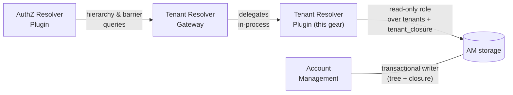
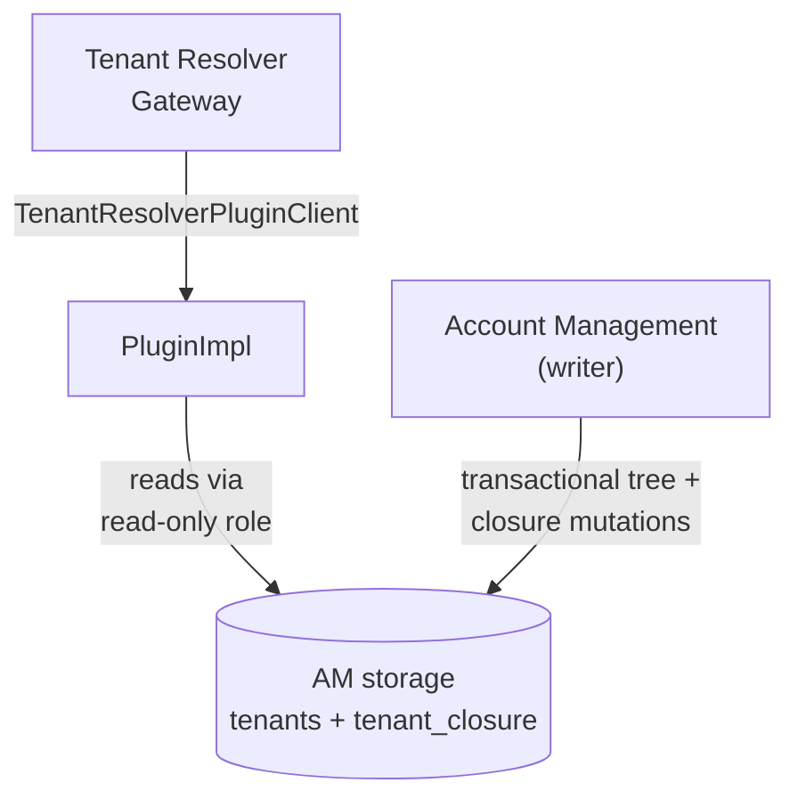
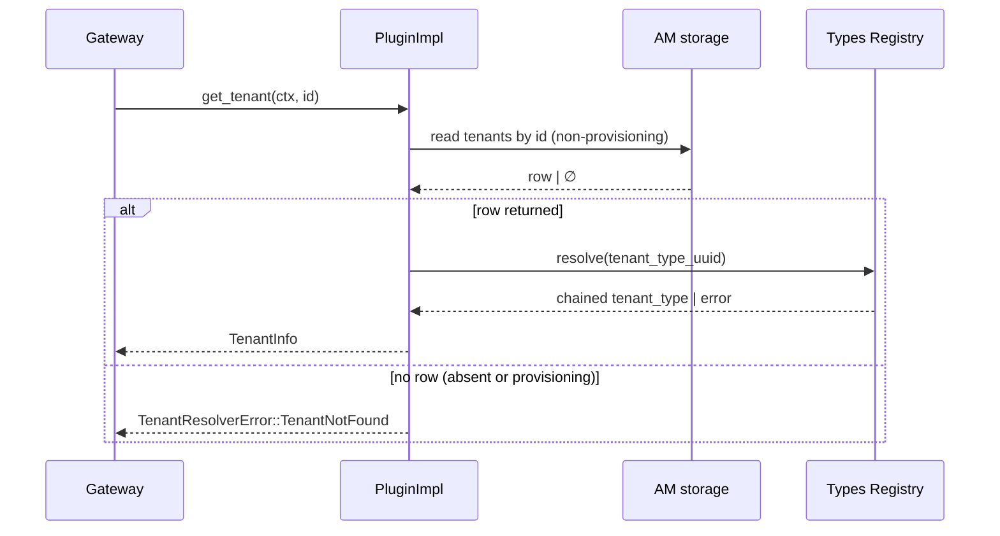
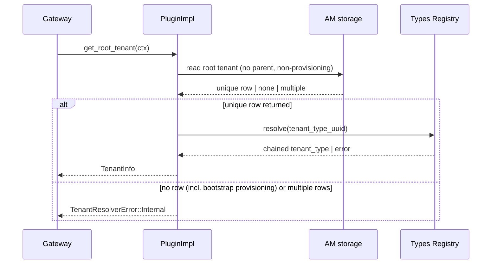
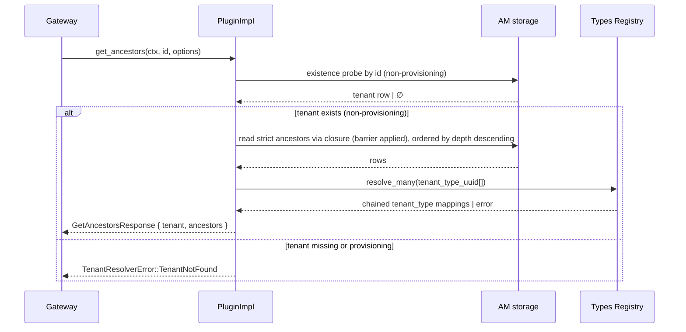
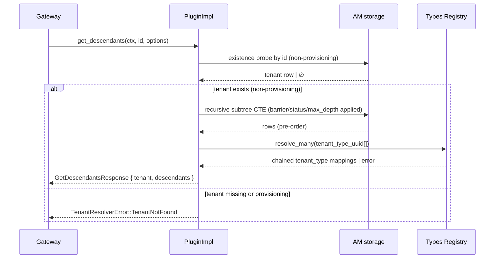
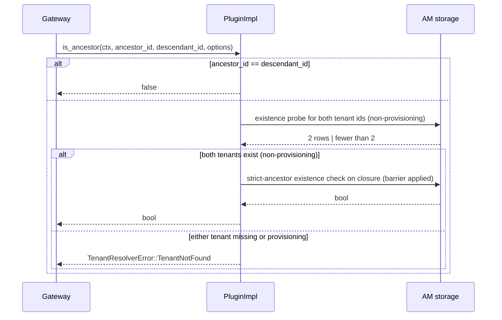

Created: 2026-04-21 by Diffora

# Technical Design — Tenant Resolver Plugin (AM-backed)

- [ ] `p1` - **ID**: `cpt-cf-tr-plugin-design-tr-plugin`

<!-- toc -->

- [1. Architecture Overview](#1-architecture-overview)
  - [1.1 Architectural Vision](#11-architectural-vision)
  - [1.2 Architecture Drivers](#12-architecture-drivers)
  - [1.3 Architecture Layers](#13-architecture-layers)
- [2. Principles & Constraints](#2-principles--constraints)
  - [2.1 Design Principles](#21-design-principles)
  - [2.2 Constraints](#22-constraints)
- [3. Technical Architecture](#3-technical-architecture)
  - [3.1 Domain Model](#31-domain-model)
  - [3.2 Component Model](#32-component-model)
  - [3.3 API Contracts](#33-api-contracts)
  - [3.4 Internal Dependencies](#34-internal-dependencies)
  - [3.5 External Dependencies](#35-external-dependencies)
  - [3.6 Interactions & Sequences](#36-interactions--sequences)
  - [3.7 Database schemas & tables](#37-database-schemas--tables)
  - [3.8 Error Codes Reference](#38-error-codes-reference)
- [4. Additional Context](#4-additional-context)
  - [4.1 Applicability and Delegations](#41-applicability-and-delegations)
  - [4.2 Security Architecture](#42-security-architecture)
  - [Threat Modeling](#threat-modeling)
  - [4.3 Reliability and Operations](#43-reliability-and-operations)
  - [Data Governance](#data-governance)
  - [Testing Architecture](#testing-architecture)
  - [Open Questions](#open-questions)
  - [Documentation Strategy](#documentation-strategy)
  - [Known Limitations & Technical Debt](#known-limitations--technical-debt)
  - [4.4 Scope Exclusions](#44-scope-exclusions)
- [5. Traceability](#5-traceability)

<!-- /toc -->

> **Abbreviations**: Account Management = **AM**; Tenant Resolver Plugin = **TRP**; Global Type System = **GTS**. Used throughout this document.

## 1. Architecture Overview

### 1.1 Architectural Vision

The Tenant Resolver Plugin is a **query facade** over the tenant hierarchy owned by [Account Management](../DESIGN.md). It implements the Gears [`TenantResolverPluginClient`](../../../tenant-resolver/tenant-resolver-sdk/src/plugin_api.rs) trait (`get_tenant`, `get_root_tenant`, `get_tenants`, `get_ancestors`, `get_descendants`, `is_ancestor`) by reading AM-owned `tenants` and `tenant_closure` tables directly through a dedicated read-only database role. The plugin owns no data, no schema, no sync loop, and no plugin-local cache. Every SDK call is a single indexed read against AM-owned storage for hierarchy state; reverse-resolution of `tenant_type_uuid` to the public chained `tenant_type` string is delegated to `TypesRegistryClient`, which owns the cache for that mapping.

Hierarchy state lives in exactly one place and in exactly one transaction scope. AM maintains `tenant_closure` transactionally with tenant writes ([`cpt-cf-account-management-fr-tenant-closure`](../PRD.md)), so the plugin never observes partial, lagged, or drifting hierarchy state. Barrier and status enforcement reduce to filter predicates on the canonical closure shape `(ancestor_id, descendant_id, barrier, descendant_status)` from [TENANT_MODEL.md](../../../../../docs/arch/authorization/TENANT_MODEL.md); the plugin applies `BarrierMode`, status filters, and SDK ordering guarantees at query time over those columns.

The plugin is **not** a standalone replaceable component. It is Account Management's internal adapter to the Tenant Resolver SDK contract and ships as a module inside the `account-management` crate at `gears/system/account-management/src/tr_plugin/`. Co-location is deliberate: the plugin's correctness relies on AM-writer invariants (transactional `(tenants, tenant_closure)` maintenance, self-row existence, barrier materialization over `(ancestor, descendant]`, provisioning-lifecycle semantics) that the table shape alone does not express. Shipping the plugin as a standalone crate would implicitly advertise reusability against any "compatible" two-table schema that the plugin cannot validate at runtime; keeping it inside the AM crate binds it to the one writer whose invariants it trusts. The hosting [Tenant Resolver](../../../tenant-resolver/) gateway discovers the plugin via GTS types-registry and resolves it through `ClientHub`. The plugin does not call `AccountManagementClient` for SDK traffic; it connects to AM-owned storage through the SecureConn pool assigned to a read-only database role scoped to `tenants` + `tenant_closure`.

#### System Context

**System actors by PRD ID**

- [`cpt-cf-tr-plugin-actor-tenant-resolver-gateway`](PRD.md#tenant-resolver-gateway) delegates plugin calls from the Tenant Resolver gateway.
- [`cpt-cf-tr-plugin-actor-authz-resolver`](PRD.md#authz-resolver-plugin) drives the hot-path read traffic via the gateway.
- [`cpt-cf-tr-plugin-actor-account-management`](PRD.md#account-management) owns the tenant tree and canonical `tenant_closure`.
- [`cpt-cf-tr-plugin-actor-operator`](PRD.md#platform-operator) owns the read-only role provisioning and consumes observability.

### 1.2 Architecture Drivers

#### Functional Drivers

| Requirement | Design Response |
|-------------|-----------------|
| `cpt-cf-tr-plugin-fr-plugin-api` | `PluginImpl` implements the SDK trait and registers with the gateway through `ClientHub` using the plugin's GTS instance identifier as scope. |
| `cpt-cf-tr-plugin-fr-get-tenant` | `PluginImpl::get_tenant` reads a single `tenants` row by id, excluding provisioning rows, and projects it to `TenantInfo`. Returns `TenantNotFound` for unknown IDs or provisioning rows, regardless of SDK-visible status. |
| `cpt-cf-tr-plugin-fr-get-root-tenant` | `PluginImpl::get_root_tenant` reads the unique `tenants` row that has no parent and a non-provisioning status, and returns `Internal` if AM storage does not currently satisfy the single-root invariant (including the bootstrap window when the sole root is still provisioning). |
| `cpt-cf-tr-plugin-fr-get-tenants` | `PluginImpl::get_tenants` issues a single bulk-by-ids read against `tenants`, excluding provisioning rows, then applies `GetTenantsOptions.status` as an additional filter. Input IDs are deduplicated and missing or provisioning rows are silently dropped. |
| `cpt-cf-tr-plugin-fr-get-ancestors` | `PluginImpl::get_ancestors` validates the starting tenant exists and is not provisioning, uses its AM row to populate `response.tenant`, then reads AM's `tenant_closure` for strict-ancestor rows (descendant = starting id, ancestor ≠ descendant) joined to `tenants` for hydration (excluding provisioning), ordered by `tenants.depth` descending with `tenants.id` as a deterministic tie-break (direct parent first, root last). Under `BarrierMode::Respect` the strict-ancestor rows are further restricted to those with `barrier` clear. No application-layer hierarchy traversal is performed. Because AM defines `barrier` over `(ancestor, descendant]`, this yields the SDK behavior exactly: a self-managed starting tenant returns empty ancestors, while the nearest self-managed ancestor is included and traversal stops above it. |
| `cpt-cf-tr-plugin-fr-get-descendants` | `PluginImpl::get_descendants` validates the starting tenant exists and is not provisioning, uses its AM row to populate `response.tenant`, then bulk-reads the barrier-bounded subtree from `tenant_closure` (single non-recursive scan; the **target shape** is a recursive CTE, but `toolkit-db` does not yet expose raw `ConnectionTrait`, so the **current shape** hydrates rows in bulk and walks the parent map pre-order in memory — see [NFR `subtree-latency`](#nfr-allocation) for the latency cost). Caller-supplied `barrier` is folded into the closure scan; caller-supplied `status_filter` is applied as an emission predicate during the in-memory walk so filtering by intermediate-status branches does not prune deeper matching descendants. Provisioning exclusion is structural — the closure has no provisioning rows by contract — and does not require a plugin-side predicate on `descendant_status`. Pre-order is the SDK's contract output; siblings are ordered by `id`; `max_depth` is enforced during the walk. Because AM defines `barrier` over `(ancestor, descendant]`, `Respect` excludes self-managed children and their subtrees while still allowing traversal from inside a self-managed tenant's own subtree. Status filter does not apply to the starting tenant (per SDK contract). |
| `cpt-cf-tr-plugin-fr-is-ancestor` | `PluginImpl::is_ancestor` returns `false` for self-reference, validates both tenant IDs exist and are not provisioning, and then checks `tenant_closure` for a strict-ancestor row with the requested barrier filter applied. Under `BarrierMode::Respect`, the same `(ancestor, descendant]` encoding makes a self-managed descendant endpoint return `false` without any extra endpoint-specific branch. |
| `cpt-cf-tr-plugin-fr-barrier-semantics` | AM populates `tenant_closure.barrier` (integer bitmask, v1 uses bit 0 for self_managed) under [`cpt-cf-account-management-fr-tenant-closure`](../PRD.md) so that the barrier bit is set iff some tenant on `(ancestor, descendant]` is self-managed, with self-rows fixed to clear; every SDK operation with `BarrierMode::Respect` therefore reduces to a single predicate on this column. Descendant ordering via the plugin-computed recursive walk does not replicate or override this predicate. |
| `cpt-cf-tr-plugin-fr-status-filtering` | AM populates `tenant_closure.descendant_status` denormalized on every tenant status transition between SDK-visible states (`active`, `suspended`, `deleted`). Because provisioning tenants are not in the closure by contract, `descendant_status` never carries a provisioning value; the plugin filters caller-supplied status directly on this column with no additional provisioning predicate. |
| `cpt-cf-tr-plugin-fr-provisioning-invisibility` | Provisioning invisibility is enforced primarily by AM's schema contract: `tenant_closure` contains no rows for tenants in `provisioning` state (see [`cpt-cf-account-management-fr-tenant-closure`](../PRD.md)), so closure-driven reads (`get_descendants`, `is_ancestor`, `get_ancestors`) cannot surface provisioning tenants even before plugin-side filtering. Defense-in-depth: reads of `tenants` (existence probes, bulk-by-ids, ancestor hydration JOINs) still drop provisioning rows in the query-builder, so a provisioning row can never appear in an SDK response regardless of which table the plugin hits. The rule is not opt-in and is exercised on every SDK method. |
| `cpt-cf-tr-plugin-fr-observability` | OpenTelemetry telemetry (see §4.3) covers query latency histograms, query-shape distribution, barrier enforcement rate, barrier-bypass audit signal, and tenant-not-found rate. |

#### NFR Allocation

| NFR ID | NFR Summary | Allocated To | Design Response | Verification Approach |
|--------|-------------|--------------|-----------------|----------------------|
| `cpt-cf-tr-plugin-nfr-query-latency` | `get_tenant` / `get_root_tenant` / `get_ancestors` / `is_ancestor` p95 ≤ 5ms on indexed read; `get_tenants` p95 ≤ 10ms at batch size ≤ 128 | SecureConn pool + AM closure indexes + `TypesRegistryClient` resolution (cache owned by registry client) | `get_tenant` / `get_root_tenant` are a single indexed read with the provisioning exclusion applied on the row; `get_tenants` is a single bulk-by-ids lookup bounded by batch size; `get_ancestors` / `is_ancestor` are at most two indexed reads per call (existence probe on `tenants` by id + closure read by descendant or by ancestor/descendant pair). Ancestor ordering is driven by AM's stable `tenants.depth` column, direct parent first and root last with `tenants.id` as tie-break — no application-layer walk. Connection pool sized against the gateway's concurrency profile; AM owns the index coverage documented in [§3.7 Database schemas & tables](#37-database-schemas--tables). | Microbenchmarks on 10K and 200K tenant fixtures with warm connection pool and warm `TypesRegistryClient` cache; separate cold-start verification; batch microbenchmarks at sizes 1, 16, 128. |
| `cpt-cf-tr-plugin-nfr-subtree-latency` | `get_descendants` p99 ≤ 20ms for result sets ≤ 1 000 rows | AM closure indexes + `tenants(parent_id, status)` + `max_depth` + existence probe | **Target plan:** an existence probe on `tenants` by id, then a single bounded recursive read rooted at the starting tenant that walks `tenants.parent_id` (leveraging `idx_tenants_parent_status`) and joins `tenant_closure` on `(ancestor = starting_tenant, descendant)` (leveraging the closure primary key) to apply `barrier` and `descendant_status` as filter predicates, with `max_depth` as the recursion bound. **Current implementation:** the secure `toolkit-db` extension does not expose raw `ConnectionTrait` access, so the plugin issues a single non-recursive `tenant_closure` scan for the barrier-bounded subtree, hydrates the matching `tenants` rows in one bulk read, and walks the parent map pre-order in memory; `max_depth` is applied during the in-memory walk, not at the DB layer. Server-side cost therefore scales with the full barrier-bounded subtree under the pivot rather than with `max_depth × out-degree`. The recursive-CTE optimization is a tracked follow-up; until it lands, deploys MUST budget the latency NFR against the unbounded barrier-subtree size, not against `max_depth`. Provisioning exclusion remains structural either way (closure contains no provisioning rows). Unbounded subtrees (`max_depth = None` on a large ancestor) are outside this NFR — governed by `query_timeout` and gateway rate limiting. | Load test with representative subtree shapes at the 1 000-row boundary. |
| `cpt-cf-tr-plugin-nfr-closure-consistency` | Every SDK read observes a transactionally consistent `(tenants, tenant_closure)` pair | AM transactional closure maintenance | AM commits tree and closure mutations in one transaction (see [`cpt-cf-account-management-fr-tenant-closure`](../PRD.md)); the plugin performs no caching or replication. | Integration test: concurrent tenant writes and plugin reads verify no partial-state window. |
| `cpt-cf-tr-plugin-nfr-tenant-isolation` | Queries never cross a respected barrier | Closure `barrier` column (integer bitmask) + SDK options | Every operation with `BarrierMode::Respect` applies the barrier-clear filter against AM's `(ancestor, descendant]` barrier encoding (v1 single-bit form of the wider bitmask); `BarrierMode::Ignore` is reserved for operator/billing flows authorized by the caller. | Barrier matrix integration tests covering every operation × mode combination, including self-managed starting-tenant and descendant-endpoint cases. |
| `cpt-cf-tr-plugin-nfr-audit-trail` | Every plugin read is observable | Structured logs + OpenTelemetry telemetry | `trace_id` from the active OpenTelemetry context is propagated into logs, traces, and metric attributes; `request_id` is included when the gateway provides one. | Log assertion in integration test; ensure trace context propagates to DB spans and `request_id` appears in logs when present. |
| `cpt-cf-tr-plugin-nfr-observability` | Operator dashboards cover Performance, Reliability, Security, Versatility | OpenTelemetry telemetry set (§4.3) | Minimum 3 telemetry instruments per applicable quality vector exported via the platform telemetry pipeline. | Dashboard/alert review in staging. |

#### Key ADRs

- [`cpt-cf-tr-plugin-adr-p1-tenant-hierarchy-closure-ownership`](ADR/ADR-001-tenant-hierarchy-closure-ownership.md) — AM owns canonical `tenants` + `tenant_closure`; the plugin is a pure query facade that reads AM-owned storage via a read-only database role.

### 1.3 Architecture Layers

- [ ] `p3` - **ID**: `cpt-cf-tr-plugin-tech-toolkit-stack`

| Layer | Responsibility | Technology |
|-------|---------------|------------|
| SDK | Public plugin trait and transport-agnostic models consumed from `tenant-resolver-sdk`; not redefined here | Rust SDK crate + ClientHub-compatible trait surface |
| Plugin API | SDK method handling, gateway integration, option/result translation | Rust services + ToolKit `ClientHub` registration |
| Domain | Barrier-mode application, SDK ordering, status filtering, `max_depth` bounds | Rust domain services |
| Infrastructure | Read-only database access to AM-owned storage | SecureConn pool bound to the plugin's read-only role |

**Technology stack alignment.** The stack (Rust + ToolKit + SecureConn + AM-owned relational storage) is the platform standard used by every sibling Gear (Account Management, OAGW, Resource Group), so team-capability alignment is a platform property rather than a plugin-local one. Long-term maintainability is anchored by the SDK contract's stability zone (see [§2.2 Platform Versioning Policy](#platform-versioning-policy)) — no plugin-local technology risk is introduced beyond what the platform already carries. Plugin-visible technology risks are surfaced in [§4.3 Known Limitations & Technical Debt](#known-limitations--technical-debt).

## 2. Principles & Constraints

### 2.1 Design Principles

#### Query Facade over AM-owned Storage

- [ ] `p1` - **ID**: `cpt-cf-tr-plugin-principle-query-facade`

The plugin owns no data and no schema. Every SDK call resolves to a read against AM's `tenants` and `tenant_closure` tables under the plugin's read-only database role. There is no derived projection and no sync path; hierarchy state is authoritative at the moment of the read. The plugin maintains no plugin-local cache; `tenant_type_uuid → tenant_type` reverse lookups are issued against `TypesRegistryClient`, which owns the cache for that mapping.

#### SDK Is the Public Contract

- [ ] `p1` - **ID**: `cpt-cf-tr-plugin-principle-sdk-source-of-truth`

Public types (`TenantInfo`, `TenantRef`, `TenantStatus`, `BarrierMode`, `GetAncestorsOptions`, `GetTenantsOptions`, `GetDescendantsOptions`, `IsAncestorOptions`, `GetAncestorsResponse`, `GetDescendantsResponse`) are owned by `tenant-resolver-sdk`. This DESIGN references them by name and does not restate the definitions. Column-to-field projection is applied at the API boundary; SDK types are the wire contract with the gateway.

#### Barrier as Data, Not as Policy

- [ ] `p1` - **ID**: `cpt-cf-tr-plugin-principle-barrier-as-data`

Barrier state is an integer bitmask column on each closure row (v1 uses bit 0 for self_managed — see [TENANT_MODEL.md §Closure Table](../../../../../docs/arch/authorization/TENANT_MODEL.md#closure-table)), populated by AM on every tenant write under [`cpt-cf-account-management-principle-barrier-as-data`](../DESIGN.md#barrier-as-data). AM defines it over `(ancestor, descendant]` with self-rows fixed to clear, so query-time enforcement reduces to a single barrier-clear filter without any extra endpoint-specific barrier logic in the plugin. The plugin does not interpret organizational policy or make authorization decisions — those remain with the AuthZ Resolver.

#### Single-Store Hierarchy

- [ ] `p1` - **ID**: `cpt-cf-tr-plugin-principle-single-store`

Tenant hierarchy state is never materialized outside AM. The plugin reads it; other platform gears read it through the SDK. There is no second copy, no rebuild, no drift, no freshness window — consistency is the default, not a target.

### 2.2 Constraints

#### AM-owned Storage Is the Only Backend

- [ ] `p1` - **ID**: `cpt-cf-tr-plugin-constraint-am-storage-only`

The plugin connects to the same physical database that AM writes to. The original design (see `cpt-cf-tr-plugin-constraint-read-only-role` below) calls for a dedicated read-only role scoped to `tenants` and `tenant_closure`; the current implementation shares AM's writer pool pending a `toolkit-db` per-role pool abstraction. It does not peer with other tenant sources, federated identity providers, or external CMDBs, and it does not hold any other database credentials.

#### Read-Only Database Role

- [ ] `p1` - **ID**: `cpt-cf-tr-plugin-constraint-read-only-role`

> **Implementation status:** Deferred. The plugin currently reads through
> AM's writer-grade `Db` handle because `toolkit-db` does not yet expose a
> connection-pool-per-role abstraction. Read-only behavior is enforced
> **structurally** by the `tr_plugin` gear — every query is a SELECT
> via the secure-extension `find()` / `count()` API, with no `secure_insert`
> / `secure_update` / `secure_delete` calls anywhere in the gear — so a
> code-review grep is the operative protection until the per-role pool
> lands. A startup audit warning under `target = "am.tr_plugin.audit"`
> records the deviation whenever `tr_plugin.enabled = true`.

When the per-role pool ships, the plugin's SecureConn pool **MUST** be provisioned with read-only grants on `tenants` and `tenant_closure` and no other privilege. Any attempt to mutate AM-owned storage through the plugin role MUST then be rejected by the database, not by plugin code. Role provisioning is an operator concern (see [§4.2 Least-Privilege Guidance](#least-privilege-guidance)).

#### No In-Process AM Client for SDK Traffic

- [ ] `p1` - **ID**: `cpt-cf-tr-plugin-constraint-no-am-client`

The plugin does not call `AccountManagementClient` on the SDK path. AM's public request-oriented surface is for administrative traffic; hierarchy reads bypass it in favor of the read-only database role, which is cheaper and transactionally consistent with AM writes by construction.

#### SecurityContext Propagation

- [ ] `p1` - **ID**: `cpt-cf-tr-plugin-constraint-security-context-passthrough`

Every plugin method receives `SecurityContext` from the gateway and must preserve it through the SDK call path. Observability identifiers are separate from `SecurityContext`: `trace_id` / `span_id` come from the active OpenTelemetry context, and `request_id` may be attached by gateway middleware. The plugin does not enforce authorization itself (that is an AuthZ Resolver concern) but it must not strip or forge `SecurityContext`.

#### No Public Wire API

- [ ] `p1` - **ID**: `cpt-cf-tr-plugin-constraint-no-wire-api`

The plugin exposes no REST/gRPC endpoints. All observability is via OpenTelemetry signals and structured logs; all functional surface is the SDK trait. This keeps the plugin replaceable behind the gateway.

#### Platform Versioning Policy

- [ ] `p1` - **ID**: `cpt-cf-tr-plugin-constraint-versioning-policy`

The plugin follows the same compatibility policy as the rest of the platform: no breaking SDK changes within a minor release. The shared schema with AM evolves under AM's migration policy; the plugin depends on AM-owned column names and types listed in [§3.5 External Dependencies — Account Management Storage](#account-management-storage) and coordinates any rename/removal with AM in the same release.

#### Scope Exclusions (constraints out of scope at the plugin layer)

- [ ] `p3` - **ID**: `cpt-cf-tr-plugin-constraint-scope-exclusions`

The following constraint classes are Not applicable at the plugin layer because the plugin is an in-process backend gear holding no user data, no third-party vendor dependency, no regulated payload, and no independent team/budget surface:

- **Regulatory constraints** — Not applicable: the plugin stores no credentials, no user PII, and no tokens; regulated-data controls (GDPR / HIPAA / PCI DSS / SOX) are inherited from the platform posture and AM's data-governance stance.
- **Vendor / licensing constraints** — Not applicable: the plugin's technology choices (Rust + ToolKit + SecureConn + AM-owned relational storage) are platform-standard; no plugin-local vendor or licensing dependency exists beyond AM's.
- **Legacy-system integration constraints** — Not applicable: the plugin is a greenfield Tenant Resolver surface. There is no legacy tenant-hierarchy consumer the plugin must stay compatible with.
- **Data-residency constraints** — Not applicable at the plugin level: the plugin holds no state; residency is inherited from AM's deployment (single-region for v1, per §1.4 Non-goals in the PRD).
- **Resource constraints (budget / team / time)** — Not applicable as plugin-local commitments: resourcing follows the platform's shared roadmap and SRE-owned capacity; plugin-level timeline is gated on the pre-GA targets in [PRD §1.3 Success criteria](PRD.md#13-goals-business-outcomes).

## 3. Technical Architecture

### 3.1 Domain Model

The plugin reuses SDK types (see [`models.rs`](../../../tenant-resolver/tenant-resolver-sdk/src/models.rs)) as its public domain. It introduces no plugin-specific persisted types; every read is a projection of AM-owned rows onto SDK types at the API boundary.

| Type | ID | Role | Source |
|------|----|------|--------|
| `TenantInfo` | *SDK* | Full tenant view returned by `get_tenant`/`get_tenants` | `tenant-resolver-sdk` |
| `TenantRef` | *SDK* | Lightweight reference returned by `get_ancestors`/`get_descendants` | `tenant-resolver-sdk` |
| `TenantStatus` | *SDK* | `Active` / `Suspended` / `Deleted` | `tenant-resolver-sdk` |
| `BarrierMode` | *SDK* | `Respect` (default) / `Ignore` | `tenant-resolver-sdk` |

At the SDK boundary, the plugin exposes `tenant_type` as an opaque public chained GTS schema identifier (for example, `gts.cf.core.am.tenant_type.v1~cf.core.am.customer.v1~`). Internally, AM stores the `tenant_type_uuid` UUIDv5 surrogate on `tenants`; the plugin reads that UUID and reverse-resolves the public `tenant_type` through `TypesRegistryClient`, which owns its own bounded TTL-aware cache for that mapping. The plugin does not parse or interpret tenant-type traits and does not maintain a parallel cache.

AM's physical `tenants.status` domain includes an internal provisioning value used during bootstrap and the tenant-create saga. Provisioning tenants are kept out of the SDK surface by construction: they are absent from `tenant_closure` entirely (AM inserts closure rows only on the `provisioning → active` transition per [`cpt-cf-account-management-fr-tenant-closure`](../PRD.md)), so `tenant_closure.descendant_status` domain is `{active, suspended, deleted}` and closure-driven reads cannot surface provisioning tenants at all. Direct reads of `tenants` (existence probes, bulk-by-ids, ancestor hydration JOINs) additionally drop provisioning rows as a defense-in-depth filter, so the SDK-visible `TenantStatus` domain is strictly `Active` / `Suspended` / `Deleted` (see [`cpt-cf-tr-plugin-fr-provisioning-invisibility`](PRD.md#provisioning-row-invisibility)).

The plugin does not define its own closure record type. The shape read from AM's `tenant_closure` — `(ancestor_id, descendant_id, barrier, descendant_status)` as specified in [TENANT_MODEL.md](../../../../../docs/arch/authorization/TENANT_MODEL.md) — is the only closure shape in the system, and it is projected directly to SDK `TenantRef` with barrier and status applied as filter predicates at the storage layer.

### 3.2 Component Model

#### PluginImpl

- [ ] `p1` - **ID**: `cpt-cf-tr-plugin-component-plugin-impl`

**Why this component exists**

`PluginImpl` is the sole component of the plugin. It exposes the SDK trait to the Tenant Resolver gateway and translates SDK calls into parameterized read queries against AM-owned storage over the plugin's read-only database role.

**Responsibility scope**

- Implements every `TenantResolverPluginClient` method (`get_tenant`, `get_root_tenant`, `get_tenants`, `get_ancestors`, `get_descendants`, `is_ancestor`).
- Builds the read query for each SDK call against AM's `tenants` + `tenant_closure` (see [§3.6 Interactions & Sequences](#36-interactions--sequences)).
- Validates tenant existence where the SDK requires `TenantNotFound` instead of an empty result (`get_ancestors`, `get_descendants`, `is_ancestor`).
- Translates SDK options (`BarrierMode`, status filter, `max_depth`) into filter predicates on the closure row.
- Normalizes result ordering: ancestors by `tenants.depth` descending with `tenants.id` as tie-break (direct parent first, root last, given AM's root-depth-0 convention); descendants by a deterministic pre-order traversal derived from the joined `tenants` rows.
- Applies the SDK's barrier semantics per method: `get_ancestors` includes the nearest self-managed ancestor and stops there under `BarrierMode::Respect`; `get_descendants` excludes self-managed children and their subtrees under `Respect`; `is_ancestor` returns `false` when a respected barrier lies on the path.
- Reverse-resolves `tenant_type_uuid` to the public chained `tenant_type` identifier via `TypesRegistryClient` (the registry client owns the cache for that mapping; the plugin does not maintain a parallel cache).
- Projects AM column values onto SDK types (`TenantInfo`, `TenantRef`) at the API boundary.
- Preserves `SecurityContext` and emits database spans / structured logs with OpenTelemetry `trace_id` / `span_id`, plus `request_id` when the gateway provides one.

**Responsibility boundaries**

Holds no plugin-owned cache of any kind — no cache of hierarchy rows, ancestor chains, descendant sets, closure state, or `tenant_type_uuid → tenant_type` mappings (the latter is delegated to `TypesRegistryClient`'s built-in cache). Does not write to storage. Does not validate `SecurityContext` (the SDK contract delegates that to the plugin, but the plugin trusts the gateway's AuthN projection; any authorization enforcement the gateway needs is added at the gateway layer). Does not interpret closure semantics beyond applying SDK-documented filter predicates. Barrier materialization, status denormalization, and pre-order stability remain AM's contract on the shared schema.

**Configuration**

| Parameter | Default | Description |
|-----------|---------|-------------|
| `db_url` | operator-provided | SecureConn target for the read-only database role. |
| `pool_max_connections` | implementation-defined | Connection-pool upper bound; sized against the gateway's concurrency profile. |
| `query_timeout` | `5s` | Per-statement timeout enforced at the DB driver level. |

### 3.3 API Contracts

#### TenantResolverPluginClient (SDK trait)

- [ ] `p1` - **ID**: `cpt-cf-tr-plugin-interface-plugin-client`

- **Technology**: Rust trait + ClientHub
- **Location**: [`gears/system/tenant-resolver/tenant-resolver-sdk/src/plugin_api.rs`](../../../tenant-resolver/tenant-resolver-sdk/src/plugin_api.rs)

The plugin implements the unmodified SDK trait. The OpenAPI/REST surface exposed by the Tenant Resolver gateway is owned by the gateway, not by this plugin. Method-level semantics (barrier behavior, SDK-contract ordering, status filtering) are described in [§3.2 PluginImpl](#pluginimpl) and the [Drivers table](#functional-drivers). Consumers should always treat the SDK trait doc comments as authoritative.

#### AM-owned schema (consumed, not defined)

- [ ] `p1` - **ID**: `cpt-cf-tr-plugin-interface-am-schema`

- **Technology**: Relational tables, owned by AM (dialect-neutral contract; physical DDL lives in AM's migration layer)
- **Location**: AM-owned — see [`cpt-cf-account-management-dbtable-tenants`](../DESIGN.md#table-tenants) and [`cpt-cf-account-management-dbtable-tenant-closure`](../DESIGN.md#table-tenant_closure)

The plugin depends on AM exposing the following columns under stable names:

| Table | Columns consumed | Purpose |
|-------|------------------|---------|
| `tenants` | `id`, `parent_id`, `name`, `tenant_type_uuid` (non-null), `status` (SDK-facing reads drop provisioning rows), `self_managed`, `depth`, `created_at`, `updated_at` | Hydrate `TenantInfo` for `get_tenant` / `get_root_tenant` / `get_tenants`; hydrate `TenantRef` for ancestor/descendant results; reverse-resolve the public `tenant_type` string through Types Registry. `depth` (AM's denormalized absolute depth from the root) supplies the ancestor-depth ordering used by `get_ancestors` and the recursion bound for `get_descendants` `max_depth`. The plugin does **not** read `deleted_at` or any other AM-owned tenant column on the SDK path. |
| `tenant_closure` | `ancestor_id`, `descendant_id`, `barrier`, `descendant_status` | Answer `get_ancestors`, `get_descendants`, `is_ancestor` with barrier and status filtering applied as filter predicates on the AM-canonical row. AM does **not** expose a pre-order ordering column or a depth-from-ancestor column on this table; descendant pre-order is computed by the plugin at query time via a recursive walk of `tenants.parent_id`. |

Any rename, removal, or type change to these columns requires a coordinated AM + plugin release. The plugin never calls a mutation on AM-owned storage; the read-only database role forbids it at the privilege layer.

### 3.4 Internal Dependencies

| Dependency Gear    | Interface Used | Purpose |
|-------------------|----------------|---------|
| [Tenant Resolver SDK](../../../tenant-resolver/tenant-resolver-sdk/) | `TenantResolverPluginClient` trait + models | Public contract implemented by the plugin. |
| [Tenant Resolver (gateway)](../../../tenant-resolver/) | Plugin registration via `ClientHub` under the plugin's GTS instance scope | Delegation target for the gateway. |
| [Types Registry](../../../types-registry/) | Reverse lookup of `tenant_type_uuid` to chained `tenant_type` identifier | Public tenant type hydration for SDK responses. |

**Dependency rules** (per project conventions)

- No circular dependencies.
- SDK types are referenced by name; they are not redefined in the plugin crate.
- `SecurityContext` MUST propagate across in-process calls and into database spans.

### 3.5 External Dependencies

#### Account Management Storage

- **Contract**: `cpt-cf-tr-plugin-contract-am-read-only-role`

| Aspect | Detail |
|--------|--------|
| Direction | Plugin → AM-owned database, read-only. |
| Transport | SecureConn pool bound to a dedicated read-only database role; no network boundary with AM itself (AM writes are transactional to the same database). |
| Tables consumed | `tenants`, `tenant_closure` (AM-owned; see [§3.3 API Contracts](#am-owned-schema-consumed-not-defined)). |
| Privileges | Read-only grants on `tenants` and `tenant_closure`; no write, truncate, or schema-change privilege of any kind. |
| Visibility contract | AM's saga flows persist transient provisioning rows on `tenants` during bootstrap and tenant-create, but the `tenant_closure` contract excludes them by construction — closure rows are inserted only on the `provisioning → active` transition. Closure-driven reads therefore cannot surface provisioning tenants. The plugin additionally drops provisioning rows on direct reads of `tenants` (existence probes, bulk-by-ids, ancestor hydration JOINs) as defense-in-depth, regardless of caller-supplied status filters (see [`cpt-cf-tr-plugin-fr-provisioning-invisibility`](PRD.md#provisioning-row-invisibility)). |
| Failure handling | Transient connection errors surface as `TenantResolverError::Internal` to the caller. There is no retry loop inside the plugin — the gateway decides retry semantics. |
| Audit | Every SDK call emits a database span with OpenTelemetry trace/span context and structured logs carrying `trace_id`; `request_id` is included when provided by the gateway. AM-side write audit is governed by [`cpt-cf-account-management-nfr-audit-completeness`](../PRD.md#64-audit-trail-completeness). |

#### Types Registry Reverse Lookup

- **Contract**: `cpt-cf-tr-plugin-contract-types-registry-reverse-lookup`

| Aspect | Detail |
|--------|--------|
| Direction | Plugin → Types Registry, read-only. |
| Transport | In-process `TypesRegistryClient` (ClientHub) used for schema/type lookup. |
| Purpose | Resolve `tenant_type_uuid` from AM storage back to the public chained `tenant_type` identifier required by SDK responses. |
| Cache behavior | The plugin holds no cache of these mappings. `TypesRegistryClient` owns a bounded TTL-aware local cache; the plugin issues a (batched) lookup on every call and lets the registry client absorb repeated reads. |
| Failure handling | If the mapping cannot be resolved, the plugin fails the request deterministically with `TenantResolverError::Internal`; it must not return raw UUIDs in place of public `tenant_type`. |

#### Account Management (in-process gear)

The plugin does not consume `AccountManagementClient` on the SDK path. AM is a peer gear in the same process and the same database; the plugin's only dependency on AM is the shared schema.

### 3.6 Interactions & Sequences

#### Get Tenant

- [ ] `p1` - **ID**: `cpt-cf-tr-plugin-seq-get-tenant`

#### Get Root Tenant

- [ ] `p1` - **ID**: `cpt-cf-tr-plugin-seq-get-root-tenant`

#### Ancestor Query (hot path)

- [ ] `p1` - **ID**: `cpt-cf-tr-plugin-seq-ancestor-query`

Because `tenant_closure.barrier` is defined over `(ancestor, descendant]`, applying the barrier filter under `Respect` is sufficient for the SDK edge cases: a self-managed starting tenant produces no ancestor rows, while the nearest self-managed ancestor itself remains visible and stops traversal above it.

Ordering is driven by AM's stable `tenants.depth` column (absolute distance from the root): descending depth with `tenants.id` as tie-break yields direct-parent-first, root-last, and full determinism. The plugin does not compute ancestor ordering via any application-layer walk — the ancestor path is served by two indexed reads (existence probe on `tenants` by id + closure read on `(descendant_id)` joined to `tenants` by id).

#### Descendant Query (barrier-aware)

- [ ] `p1` - **ID**: `cpt-cf-tr-plugin-seq-descendant-query`

The plugin first probes `tenants` by id, skipping provisioning rows. If no row is returned, the call surfaces as `TenantNotFound`.

When the starting tenant exists, the plugin issues a single subtree read rooted at that id, joining `tenants` with `tenant_closure`. Three caller-driven filters are applied:

- **`max_depth`** bounds how far the walk descends from the starting tenant (unbounded when not set).
- **`status`** narrows the returned descendants to a caller-supplied subset (e.g. `active`).
- **Barrier mode**, when `Respect`, excludes any descendant whose path from the starting tenant crosses a self-managed tenant (including the self-managed endpoints themselves). Under `Ignore` the barrier filter is dropped.

Provisioning invisibility is structural: `tenant_closure` contains no rows for provisioning tenants by AM's closure contract, so the descendant side of the join can never surface a provisioning row regardless of the caller-supplied `status` filter. The existence probe on the starting tenant additionally excludes provisioning rows on the `tenants` table, so a provisioning starting tenant returns `TenantNotFound` before any closure read.

Results are returned in pre-order (parent before children, siblings in `tenants.id` order) so the SDK contract is deterministic. The starting tenant itself is returned separately as `response.tenant` and never appears in `descendants`. The `tenant_type_uuid` values observed in the returned rows are resolved in a single batch call to `TypesRegistryClient` (which absorbs repeated reads via its own bounded TTL-aware cache) before the response is assembled.

Because `tenant_closure.barrier` is defined over `(ancestor, descendant]`, a `Respect` query that starts from within a self-managed tenant's own subtree is not blocked — the barrier predicate only fires on paths that cross a self-managed boundary between the starting tenant and the descendant.

#### Is Ancestor

- [ ] `p1` - **ID**: `cpt-cf-tr-plugin-seq-is-ancestor`

Because `tenant_closure.barrier` is defined over `(ancestor, descendant]`, applying the barrier filter under `Respect` makes `is_ancestor(..., Respect)` return `false` both when the descendant endpoint is self-managed and when some other self-managed tenant lies on the path.

#### Use-Case Coverage Map

| PRD Use Case | Sequence(s) covering it |
|--------------|-------------------------|
| `cpt-cf-tr-plugin-usecase-get-root-tenant` | Get Root Tenant |
| `cpt-cf-tr-plugin-usecase-get-tenant` | Get Tenant |
| `cpt-cf-tr-plugin-usecase-ancestor-query` | Ancestor Query |
| `cpt-cf-tr-plugin-usecase-descendant-query` | Descendant Query |
| `cpt-cf-tr-plugin-usecase-is-ancestor` | Is Ancestor |
| `cpt-cf-tr-plugin-usecase-barrier-respect` | Ancestor Query + Descendant Query with `BarrierMode::Respect` |

### 3.7 Database schemas & tables

- [ ] `p3` - **ID**: `cpt-cf-tr-plugin-db-schema`

The plugin owns no tables, no indexes, and no migrations. All storage is AM-owned; schemas, indexes, and DDL live in [AM DESIGN §3.7](../DESIGN.md#37-database-schemas--tables). The plugin depends on the read-only columns listed in [§3.3 API Contracts](#am-owned-schema-consumed-not-defined) and on the following index coverage maintained by AM:

| Index | Purpose for the plugin |
|-------|-----------------------|
| `tenants(id)` primary key | `get_tenant` / `get_tenants` / existence probes on every SDK method; provisioning filter evaluated on the row. |
| Uniqueness on the single root (`parent_id` null) | `get_root_tenant` deterministic root lookup and integrity validation; provisioning filter applied on top of the unique hit. AM's migration layer chooses the physical representation (partial unique index on PostgreSQL, generated-column unique index or equivalent on dialects without partial indexes). |
| `tenants(parent_id, status)` | Covers the recursive walk of `tenants.parent_id` used by `get_descendants` for pre-order and `max_depth`; also lets the provisioning exclusion be evaluated during the index scan. |
| `tenant_closure(ancestor_id, barrier, descendant_status)` | `get_descendants` join predicate with barrier and caller-supplied status filters. Provisioning exclusion is structural (closure never contains provisioning rows), so this index carries only the SDK-visible `descendant_status` domain. |
| `tenant_closure(descendant_id)` | `get_ancestors` lookup; joined to `tenants` by id for `depth`-based ordering. |
| `tenant_closure(ancestor_id, descendant_id)` primary key | `is_ancestor` existence probe. |

AM does **not** publish a pre-order column on `tenant_closure` or a depth-from-ancestor column. Descendant pre-order is computed by the plugin at query time using the recursive walk described in [§3.6 Descendant Query](#descendant-query-barrier-aware); ancestor ordering uses `tenants.depth` directly. The plugin contract is satisfied as long as AM's schema preserves the column shape documented in [§3.3](#am-owned-schema-consumed-not-defined) and the index coverage above. Physical representation (partitioning, index types, clustering) is an AM choice that the plugin treats as opaque.

### 3.8 Error Codes Reference

The plugin returns SDK errors through `Result<_, TenantResolverError>`. Error surface is SDK-owned; the plugin uses the existing SDK variants rather than introducing plugin-specific error codes.

| Error (SDK) | When returned | Notes |
|-------------|---------------|-------|
| `TenantResolverError::TenantNotFound` | `get_tenant` / `get_ancestors` / `get_descendants` / `is_ancestor` asked about a tenant that is not present in `tenants` | Not retried — absence is authoritative at the moment of the read. |
| `TenantResolverError::Internal` (or the SDK's equivalent catch-all) | Database connection failure, query timeout, root-tenant invariant violation in `get_root_tenant`, or tenant-type reverse-hydration failure | Callers should retry at the gateway level unless the underlying cause is a persistent data-integrity issue. |

## 4. Additional Context

### 4.1 Applicability and Delegations

| Concern | Owned by plugin? | Owner / Reason |
|---------|------------------|----------------|
| Tenant CRUD, mode change, status change | No | AM — see [`cpt-cf-account-management-component-tenant-service`](../DESIGN.md#tenantservice). |
| Tenant hierarchy closure maintenance | No | AM — see [`cpt-cf-account-management-fr-tenant-closure`](../PRD.md). |
| Tenant type validation | No | GTS Types Registry via AM. |
| Tenant type reverse hydration | Yes | Plugin resolves `tenant_type_uuid` through `TypesRegistryClient`; caching for that mapping lives inside the registry client (the plugin holds no parallel cache). |
| Authorization decisions | No | AuthZ Resolver Plugin. |
| Subtree-membership integration for consuming policy gears | No | Deployment-specific integration owned by the consuming stack; AM's `tenant_closure` is the canonical surface. |
| Resource Group / User Group hierarchy | No | Resource Group gear. |
| Token validation, session revocation | No | Platform AuthN + IdP. |

### 4.2 Security Architecture

#### Trust Model

| Aspect | Trust Level | Notes |
|--------|-------------|-------|
| Gateway → Plugin | Implicit | Same process; same memory space; same SecurityContext. |
| `SecurityContext` content | Trusted input | Plugin trusts the gateway's AuthN projection; does not re-validate tokens. |
| Plugin → AM storage | Privilege-enforced | SecureConn pool over a read-only database role; read-only grants on `tenants` and `tenant_closure`. |

#### Authorization Model

The plugin does not evaluate authorization. It returns data shaped by two orthogonal knobs that consumers supply:

1. **Barrier mode** (`BarrierMode::Respect` / `Ignore`) — `Respect` is the default and is expected for almost all authorization queries. `Ignore` is reserved for platform-authorized operator flows (billing rollups, support tooling). The plugin does not verify the caller is entitled to `Ignore`; that is the gateway/consumer concern. Every `Ignore` call is counted on a dedicated telemetry instrument so operators can audit bypass usage.
2. **Status filter** — consumers decide whether to include `suspended`/`deleted` tenants.

#### Least-Privilege Guidance

The plugin process holds only the credentials for its read-only database role. It does not hold AM's writer credentials, IdP credentials, or signing keys. The role's grants are read-only on `tenants` and `tenant_closure` only, with no privileges on any other AM-owned schema object.

#### Audit

Per-query observability is emitted via structured logs and OpenTelemetry spans carrying `trace_id`; `request_id` is included when the gateway provides one. These identifiers come from tracing/request context rather than `SecurityContext`. There is no per-query audit-to-AM signal — AM's audit-completeness NFR covers tenant writes, not plugin reads. Barrier-state changes are audited on the AM side (see [`cpt-cf-account-management-nfr-barrier-enforcement`](../PRD.md#65-barrier-enforcement)).

**Log retention, tamper-proofing, and incident response** are inherited from platform controls rather than duplicated at the plugin layer:

- *Log retention*: the plugin emits OpenTelemetry signals and structured log lines with no retention override; retention follows the platform telemetry pipeline's policy.
- *Tamper-proof logging*: the plugin does not implement signed or append-only logging itself; tamper-proofing is a property of the platform telemetry transport + backend (immutable OpenTelemetry span store) rather than a plugin-local concern.
- *Incident response hooks*: plugin alerts (`tenant_resolver_query_errors_total{op,kind}`, `tenant_resolver_db_pool_waiters`, barrier-bypass rate) route through the platform SRE on-call chain via the alerting thresholds defined in [§4.3 Feature Telemetry](#feature-telemetry). The plugin exposes no `/healthz` endpoint or independent escalation surface — operator-facing health is observable via the telemetry signals above.
- *Non-repudiation*: the plugin issues no writes, so write-level non-repudiation is Not applicable at the plugin layer. Read-level attribution via the gateway-supplied `request_id` and OpenTelemetry trace context is sufficient for forensic review of plugin-observed events.

### Threat Modeling

#### Threat Catalog

| Threat | Vector | Mitigation |
|--------|--------|------------|
| Plugin writes to AM-owned storage | Bug, supply-chain attack, or misconfiguration | Read-only database role rejects every mutation at the privilege layer; CI verifies role grants pre-deployment. |
| Stale barrier allows cross-tenant visibility after mode flip | Not applicable under single-store ownership | Closure `barrier` column is updated inside the same AM transaction as the `self_managed` flip; the next plugin read observes the new value. |
| DoS via `get_descendants` on a large subtree | Caller requests unbounded subtree | `max_depth` option supported; gateway-level rate limiting expected; `tenant_resolver_query_duration_seconds` alerts on p99 regressions. |
| Query-timeout exhaustion under load | Long-running subtree query holds a DB connection | Per-statement `query_timeout` (default 5 s) enforced at the driver; connection pool upper bound prevents unbounded concurrency. |
| Information leak via tenant probing | Adversary enumerates tenant IDs | Per-query `tenant_not_found_total` surface lets operators detect scanning; authorization is enforced upstream. |
| Credential leak of the plugin's DB role | Misconfiguration or breach | Role is read-only and scoped to two tables; secret rotation follows the platform secret-management policy. |

#### Security Assumptions

- The process hosting the plugin is trusted (same process as the gateway).
- `SecurityContext` projection by the gateway/AuthN Resolver is correct for the fields defined by the current platform contract.
- The AM-owned database enforces TLS and credential hygiene; the plugin's read-only role is provisioned under the platform's standard role-management workflow.

### 4.3 Reliability and Operations

#### Fault Domains and Redundancy

| Fault | Behaviour |
|-------|-----------|
| AM-owned database unavailable for reads | Plugin returns a transient error on every SDK call; gateway decides retry semantics. No independent degraded mode — without the database the plugin has no state to serve from. |
| Plugin process restart | Cold-start requires no hierarchy rebuild and no projection repopulation. The plugin holds no warm-up state of its own; tenant-type reverse-hydration goes through `TypesRegistryClient`, which warms its own cache on first lookup (and absorbs subsequent reads). |
| Types Registry unavailable | Calls that need public `tenant_type` hydration fail with `TenantResolverError::Internal`; hierarchy reads remain DB-backed, but the plugin must not substitute raw UUIDs for public chained identifiers. |
| AM writer unavailable while reads continue | Plugin remains fully available — reads are against the committed database state and are not coupled to AM's writer health. |
| Connection-pool exhaustion under burst | New calls queue up to the pool's backpressure limit; queued waiters beyond the limit receive `TenantResolverError::Internal`. `tenant_resolver_db_pool_waiters` alerts when sustained. |

#### Recovery Architecture

- **No plugin-owned state to recover.** Consistency is a property of AM's transactional writes; there is no anti-entropy step.
- **Database-level recovery** is AM's responsibility. The plugin resumes serving the moment the database is reachable.

#### Performance and Cost Budget

| Metric | Target |
|--------|--------|
| `tenant_resolver_query_duration_seconds{op=~"get_tenant\|get_root_tenant"}` p95 | ≤ 5 ms |
| `tenant_resolver_query_duration_seconds{op=~"get_ancestors\|is_ancestor"}` p95 | ≤ 5 ms |
| `tenant_resolver_query_duration_seconds{op="get_descendants"}` p99 | ≤ 20 ms |
| `tenant_resolver_db_pool_utilization` | ≤ 80% sustained |
| Plugin steady-state memory | Pool buffers + per-call working set only; no tenant-count-dependent allocations |

#### Cost and Budget Allocation

- **Per-call cost**: hot-path SDK calls resolve to 1–2 indexed reads (existence probe on AM's tenant primary key + optional closure lookup) plus, for `get_descendants`, a bounded recursive walk whose cost scales with the returned subtree rather than with the total tenant count. The plugin adds no storage, no egress, and no process-local state beyond the pool and per-call working set ([§4.3 Performance and Cost Budget](#performance-and-cost-budget)), so incremental infra cost over AM's baseline is IOPS + CPU on the AM-owned database.
- **Types Registry amortization**: caching for the `tenant_type_uuid → tenant_type` mapping lives inside `TypesRegistryClient` (bounded TTL-aware LRU per `cpt-cf-tr-plugin-contract-types-registry-reverse-lookup`), so steady-state reads do not pull Types Registry into the response path. The plugin maintains no parallel cache and emits no plugin-side cache-miss metric — observability for the registry-client cache is owned by Types Registry.
- **Budget delegation**: infrastructure and database cost are owned by AM's capacity budget under `cpt-cf-account-management-nfr-production-scale`. The plugin's local cost surface is the SecureConn pool size, which is tuned against the gateway's concurrency profile rather than owned as an independent budget line.
- **Cost-optimization patterns**: Not applicable as plugin-local patterns — the plugin holds no storage, no caches for hierarchy data, and no egress surface. The deliberate absence of a plugin-side hierarchy cache (see [§4.3 Known Limitations & Technical Debt](#known-limitations--technical-debt)) is an architectural choice anchored in `cpt-cf-tr-plugin-principle-single-store`; caching would be introduced only if measured DB load forced it and an invalidation contract from AM were available.
- **Time-to-market**: the plugin is pre-GA; go-live is gated on the PRD's Success criteria table ([PRD §1.3](PRD.md#13-goals-business-outcomes) — Gear GA + Pre-GA soak / security / scale gates), not on an independent delivery timeline.

#### Feature Telemetry

| Vector | Metric | Purpose | Threshold |
|--------|--------|---------|-----------|
| Performance | `tenant_resolver_query_duration_seconds{op}` | Hot-path latency per operation | p95 ≤ 5 ms; p99 ≤ 20 ms for `get_descendants` |
| Performance | `tenant_resolver_closure_query_duration_seconds` | DB read latency on `tenant_closure` | p95 ≤ 10 ms |
| Performance | `tenant_resolver_db_pool_utilization` | Connection-pool saturation | ≤ 80% sustained |
| Reliability | `tenant_resolver_query_errors_total{op,kind}` | Error budget by operation and cause | alert on sustained non-zero |
| Reliability | `tenant_resolver_db_pool_waiters` | Connection-pool contention | alert on sustained queueing |
| Reliability | `tenant_resolver_tenant_not_found_total` | Absence rate (scanning + genuine misses) | — |
| Security | `tenant_resolver_barrier_enforced_total` | How often `Respect` excludes rows | — |
| Security | `tenant_resolver_barrier_bypass_total{op}` | Dedicated audit signal for `BarrierMode::Ignore` usage | — |
| Security | `tenant_resolver_tenant_not_found_total` | Probing signal | — |
| Versatility | `tenant_resolver_query_types_total{op}` | API usage distribution | — |
| Versatility | `tenant_resolver_query_barrier_mode_total{op,mode}` | Barrier-mode mix across operations | — |
| Versatility | `tenant_resolver_result_status_distribution_total{op,status}` | Status-class mix observed on `get_tenants` / `get_descendants` responses — attribution of hot-path traffic across active / suspended / deleted, derived from rows the plugin returns. No standalone scan. | — |

### Data Governance

- **Data class**: tenant hierarchy metadata — commercially sensitive, not PII.
- **Retention**: the plugin holds no data; retention is an AM concern governed by the AM schema.
- **Cross-border/residency**: inherited from the AM deployment; the plugin adds no cross-border movement.
- **Regulatory**: no credentials, no user PII, no tokens are stored by the plugin.

### Testing Architecture

| Layer | Tests |
|-------|-------|
| Unit / domain | SDK-contract ordering in `PluginImpl`; query-builder semantics for barrier mode, status filter, and `max_depth`. |
| Integration | Plugin ↔ AM co-hosted fixture: seed tenants through AM, read through the plugin, verify barrier matrix across every operation × mode without any intervening sync step. |
| Contract | Validate that every SDK method's documented semantics are exercised (self-reference handling, empty-batch handling, `max_depth` boundary, status filter scope). |
| Privilege | Static check that the plugin's database role has only read grants on `tenants` and `tenant_closure`; runtime assertion on startup that a write attempt is rejected. |
| Scale | 200K-tenant fixture for `get_descendants` p99 on a representative subtree size. |
| Chaos | Kill the database mid-query; saturate the connection pool; concurrent AM tenant writes during read load. |

### Open Questions

| Question | Owner | Target resolution |
|----------|-------|-------------------|
| Read-replica routing for the plugin's role | Platform SRE | Deferred; v1 reads from the primary. |
| Cross-region reads | Platform SRE | Deferred; v1 is single-region. |

### Documentation Strategy

The plugin's public contract is the SDK; the SDK's rustdoc is authoritative for every method. This DESIGN documents the query shapes, the read-only role contract, and the operational dependencies on AM-owned storage; the PRD captures the WHAT/WHY. No standalone OpenAPI file is published.

### Known Limitations & Technical Debt

| Item | Reason / Path forward |
|------|-----------------------|
| No plugin-side caching | By design — hierarchy consistency is a property of AM transactional writes. Introduce caching only if measured DB load forces it, and only paired with an invalidation contract from AM. |
| Shared-database coupling to AM | By design — the read-only role is the decoupling boundary. A future split (for example, dedicated replica) requires re-evaluating consistency semantics with AM. |
| No multi-region reads | Single-region only; revisit when the platform grows multi-region deployments. |

### 4.4 Scope Exclusions

Every bullet below is an explicit "Not applicable because…" statement; it binds the plugin's scope at the DESIGN layer so reviewers can distinguish "author considered and excluded" from "author forgot". Many of these delegations are also reflected in [PRD §6 NFR Exclusions](PRD.md#nfr-exclusions) and in [§4.1 Applicability and Delegations](#41-applicability-and-delegations); this section consolidates them at the DESIGN layer so semantic checklists (SEC / REL / DATA / INT / OPS / MAINT / TEST / UX / PERF / BIZ / DOC) can be answered explicitly per bullet.

**Security architecture (SEC)**

- *Multi-factor authentication, SSO / federation, user session management, user-credential policies, session timeout / renewal* — Not applicable at the plugin layer because user authentication and session lifecycle are owned by the Tenant Resolver gateway's upstream chain; the plugin authenticates only its own read-only database role via SecureConn and has no user sessions or tokens of its own.
- *Role definitions, permission matrix, API-endpoint authorization, privilege-escalation prevention* — Not applicable because the plugin has no user-facing authorization surface; the only authorization boundary is the DB privilege layer, enforced by the database against the plugin's read-only role (`cpt-cf-tr-plugin-constraint-read-only-role`).
- *Encryption at rest, encryption key management, data masking / anonymization, secure data disposal* — Not applicable at the plugin layer because the plugin holds no state; all storage (including encryption at rest, key management, and disposal procedures) is owned by AM under its Data Governance stance. Encryption in transit between plugin and AM storage is provided by SecureConn + the AM-owned database's TLS enforcement.
- *Network segmentation, DMZ architecture, firewall rules, output encoding, CORS policy* — Not applicable because the plugin exposes no network surface; it runs in-process behind the Tenant Resolver gateway and communicates with AM storage only via SecureConn.

**Performance architecture (PERF)**

- *Horizontal scaling approach, vertical scaling limits, load balancing, queue/broker strategy, user session management* — Not applicable as plugin-local concerns: horizontal scaling tracks Tenant Resolver gateway replicas (each replica carries one plugin instance with its own SecureConn pool); vertical scaling is bounded by `pool_max_connections` and database connection limits; load balancing is upstream at the gateway; there is no async / queue surface; there are no user sessions.
- *CDN strategy, edge computing* — Not applicable because the plugin is an in-process backend gear with no external network surface.
- *CPU efficiency, storage efficiency, network-bandwidth efficiency* — Not applicable beyond the DB round-trip and SerDe cost that already dominate the latency budget: the plugin holds no storage, emits only OpenTelemetry signals + per-call log lines, and performs no plugin-local computation beyond filter-predicate application and SDK projection.

**Reliability architecture (REL)**

- *Plugin-layer redundancy, failover, circuit breakers, bulkheads* — Not applicable as plugin-local patterns: `pool_max_connections` + per-statement `query_timeout` act as the bulkhead; circuit-breaking is the gateway's concern and is observable via `tenant_resolver_query_errors_total{op,kind}`; plugin-level failover is a no-op because hierarchy state has exactly one authoritative source (AM-owned storage), and redundancy is owned by AM's DB HA posture.
- *Dead-letter queues, poison-message handling, compensating transactions, multi-step error recovery* — Not applicable because the plugin is synchronous, read-only, and holds no queues or multi-step workflows. Transient errors surface immediately to the gateway, which owns retry and escalation.
- *Backup, point-in-time recovery, disaster recovery, business continuity, data replication* — Not applicable at the plugin layer because the plugin holds no state. Recovery mechanisms are owned by AM; the plugin resumes serving the moment the AM-owned database is reachable.
- *Spec-flag architecture, canary / blue-green deployment, rollback procedures, health-check endpoints* — Inherited from the Tenant Resolver gateway's release strategy rather than owned at the plugin layer. Health is observable via the `tenant_resolver_query_errors_total{op,kind}` + `tenant_resolver_db_pool_waiters` metrics in [§4.3 Feature Telemetry](#feature-telemetry); the plugin does not expose a `/healthz` endpoint because it has no external network surface.

**Data architecture (DATA)**

- *Data partitioning, replication, sharding, hot/warm/cold tiering, data archival* — Not applicable at the plugin layer because the plugin owns no storage. All such strategies are AM-owned and operate on AM-owned tables under AM's data-governance stance (see [AM DESIGN §3.7](../DESIGN.md#37-database-schemas--tables)).
- *Referential integrity, constraint enforcement, concurrent-modification semantics, orphan-data prevention* — AM-owned and enforced at the database layer under AM's schema authority; the plugin reads the committed state only. Plugin-level validation is limited to existence checks prior to closure queries ([§3.2 PluginImpl](#pluginimpl)).
- *Data lineage, data catalog integration, master-data management, data-quality monitoring, data dictionary / glossary* — Lineage flows from AM writes (authoritative) through the plugin's read-only role into consumer SDK responses; data catalog and MDM are AM-owned; quality monitoring is covered by `tenant_resolver_tenant_not_found_total` and closure-consistency integration tests ([§4.3 Testing Architecture](#testing-architecture)). The data dictionary lives in [AM DESIGN §3.7](../DESIGN.md#37-database-schemas--tables) and [TENANT_MODEL.md](../../../../../docs/arch/authorization/TENANT_MODEL.md).

**Integration architecture (INT)**

- *Per-dependency SLA, circuit-breaker implementations* — SLA is inherited from AM's database availability posture and Types Registry's availability SLO; the plugin does not buffer calls or operate in a half-open / closed-circuit mode. Transient errors from either dependency surface immediately to the gateway.
- *Event-driven architecture, event catalog, event schemas, event sourcing / replay, event ordering, DLQ handling* — Not applicable because the plugin emits no domain events; the only emissions are OpenTelemetry signals (metrics, traces, logs) documented in [§4.3 Feature Telemetry](#feature-telemetry).

**Operations architecture (OPS)**

- *Container / VM strategy, orchestration, environment-promotion strategy, secret management* — Container/VM strategy and orchestration are inherited from the Tenant Resolver gateway's deployment (plugin is in-process, not independently deployed). Environment promotion rides the platform release pipeline. The plugin's DB-role credentials are provisioned via the platform secret-management policy (see [§4.2 Threat Catalog — credential-leak mitigation](#threat-modeling)); the plugin never logs, echoes, or serializes credentials.
- *Infrastructure-as-code, environment parity, immutable infrastructure, auto-scaling configuration, resource tagging* — Not applicable at the plugin scope: the plugin ships as an in-process gear; IaC + environment parity + immutable-infra posture are inherited from the Tenant Resolver gateway's deployment and the platform's central IaC repository.

**Maintainability architecture (MAINT)**

- *Package / namespace conventions, dependency-injection approach* — The plugin is a module inside the `account-management` crate under `src/tr_plugin/`, not a standalone crate (see [§1.1](#11-architectural-vision) for the co-location rationale). Dependency injection is provided by ToolKit's `ClientHub`, which resolves the plugin's SDK-trait binding and external dependencies (Types Registry, AM storage role) by configuration.
- *Runbooks, knowledge base* — Runbooks for on-call (pool-saturation, Types-Registry-unavailable, DB-unreachable) are owned by platform SRE and referenced from the telemetry alert routes in [§4.3 Feature Telemetry](#feature-telemetry). Plugin-specific knowledge-base entries live in the platform wiki under Tenant Resolver > TR-Plugin.

**Testing architecture (TEST)**

- *Testability seams*: `PluginImpl` takes its DB connection pool and Types Registry client through `ClientHub`, enabling substitution with in-memory fakes in unit tests. The mock/stub boundary is the SecureConn + Types Registry client trait objects.
- *Test data management*: seeded via AM's normal tenant-create path in integration fixtures; no hand-rolled DDL in the plugin.
- *Test environment*: plugin ↔ AM co-hosted database fixture per the Integration row of [§4.3 Testing Architecture](#testing-architecture).
- *Test isolation*: per-test-case database schema reset via fixture tear-down.

**User-facing architecture (UX)**

- *Frontend architecture, state management, responsive design, progressive enhancement, offline support* — Not applicable because the plugin is an in-process backend gear with no end-user UI. User-facing surfaces (if any) are owned by consumers of the Tenant Resolver gateway, not by this plugin.

**Compliance (COMPL)**

- *Compliance requirements mapping, control implementations, evidence collection, compliance monitoring, consent management, data-subject rights, cross-border transfer controls, privacy impact assessment* — Not applicable at the plugin scope: the plugin stores no credentials, no user PII, and no tokens (see [§4.3 Data Governance](#data-governance)). Compliance is inherited from the platform posture and AM's data-governance controls.

## 5. Traceability

| PRD ID | DESIGN Element(s) |
|--------|-------------------|
| `cpt-cf-tr-plugin-fr-plugin-api` | `cpt-cf-tr-plugin-component-plugin-impl`, `cpt-cf-tr-plugin-interface-plugin-client` |
| `cpt-cf-tr-plugin-fr-get-tenant` | `cpt-cf-tr-plugin-component-plugin-impl`, `cpt-cf-tr-plugin-seq-get-tenant` |
| `cpt-cf-tr-plugin-fr-get-root-tenant` | `cpt-cf-tr-plugin-component-plugin-impl`, `cpt-cf-tr-plugin-seq-get-root-tenant` |
| `cpt-cf-tr-plugin-fr-get-tenants` | `cpt-cf-tr-plugin-component-plugin-impl` |
| `cpt-cf-tr-plugin-fr-get-ancestors` | `cpt-cf-tr-plugin-component-plugin-impl`, `cpt-cf-tr-plugin-seq-ancestor-query` |
| `cpt-cf-tr-plugin-fr-get-descendants` | `cpt-cf-tr-plugin-component-plugin-impl`, `cpt-cf-tr-plugin-seq-descendant-query` |
| `cpt-cf-tr-plugin-fr-is-ancestor` | `cpt-cf-tr-plugin-component-plugin-impl`, `cpt-cf-tr-plugin-seq-is-ancestor` |
| `cpt-cf-tr-plugin-fr-barrier-semantics` | `cpt-cf-tr-plugin-principle-barrier-as-data`, `cpt-cf-tr-plugin-interface-am-schema` |
| `cpt-cf-tr-plugin-fr-status-filtering` | `cpt-cf-tr-plugin-component-plugin-impl`, `cpt-cf-tr-plugin-interface-am-schema` |
| `cpt-cf-tr-plugin-fr-provisioning-invisibility` | `cpt-cf-tr-plugin-component-plugin-impl`, `cpt-cf-tr-plugin-interface-am-schema`, `cpt-cf-tr-plugin-contract-am-read-only-role` |
| `cpt-cf-tr-plugin-fr-observability` | §4.3 Feature Telemetry |
| `cpt-cf-tr-plugin-nfr-query-latency` | `cpt-cf-tr-plugin-component-plugin-impl`, §3.7 index coverage |
| `cpt-cf-tr-plugin-nfr-subtree-latency` | `cpt-cf-tr-plugin-component-plugin-impl`, §3.7 index coverage |
| `cpt-cf-tr-plugin-nfr-closure-consistency` | `cpt-cf-tr-plugin-principle-single-store`, `cpt-cf-tr-plugin-contract-am-read-only-role` |
| `cpt-cf-tr-plugin-nfr-tenant-isolation` | `cpt-cf-tr-plugin-principle-barrier-as-data`, `cpt-cf-tr-plugin-interface-am-schema` |
| `cpt-cf-tr-plugin-nfr-audit-trail` | §4.2 Audit, §4.3 Feature Telemetry |
| `cpt-cf-tr-plugin-nfr-observability` | §4.3 Feature Telemetry |
