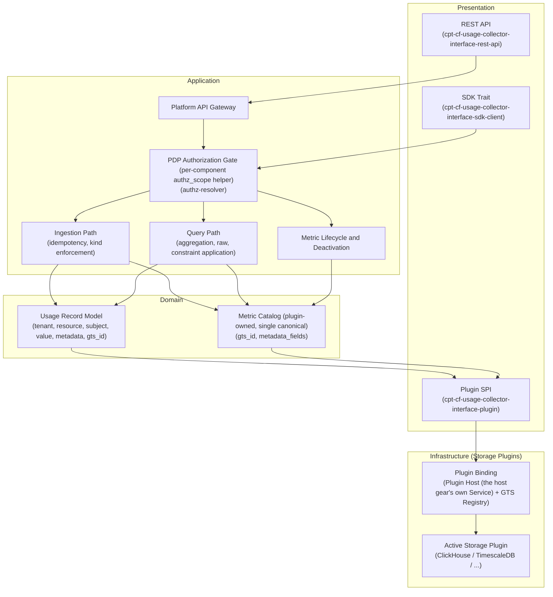
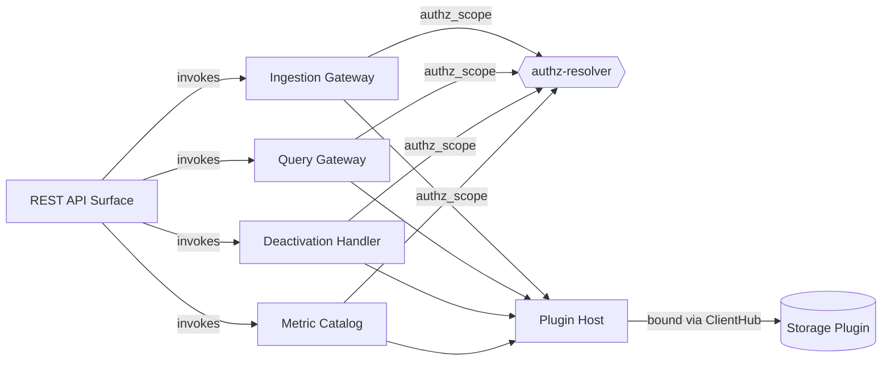
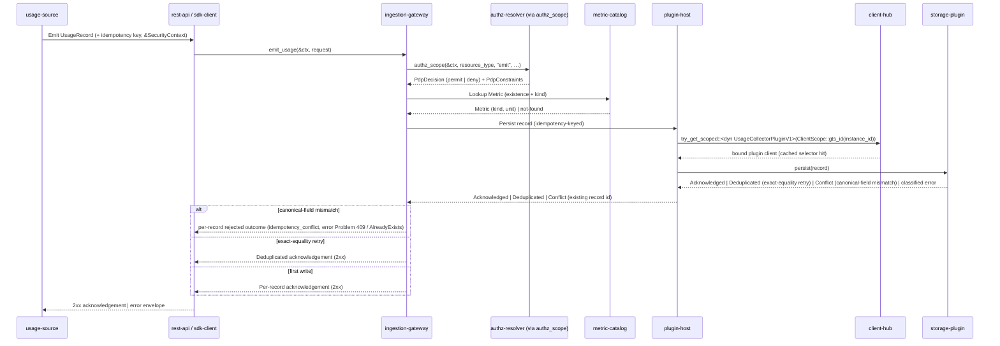
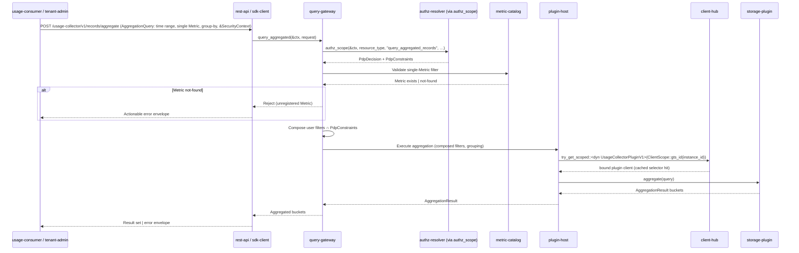
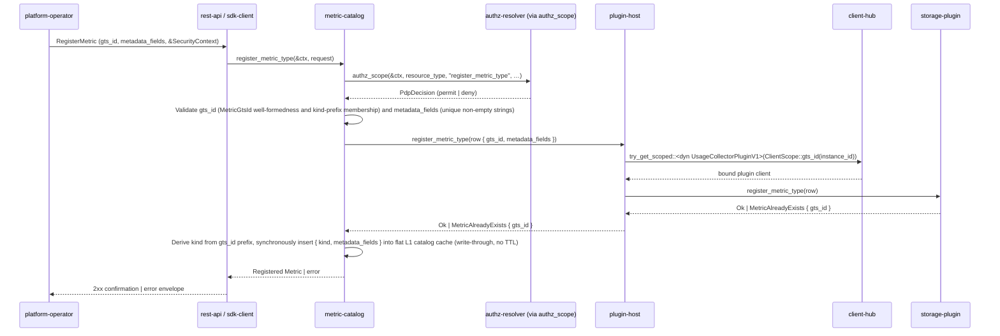
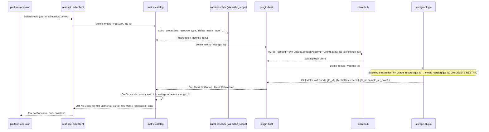
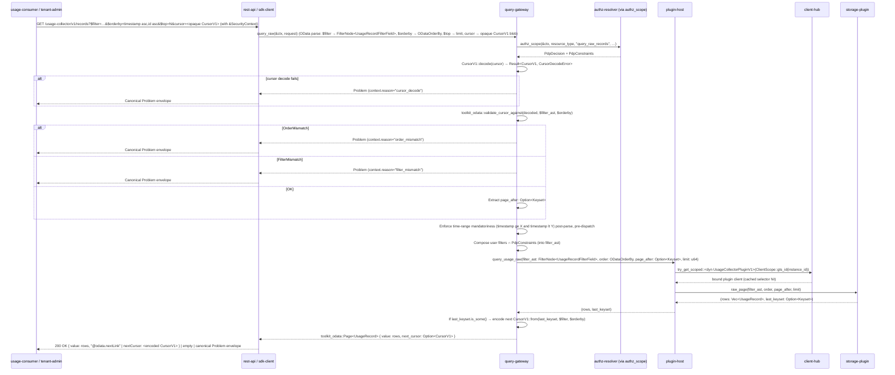
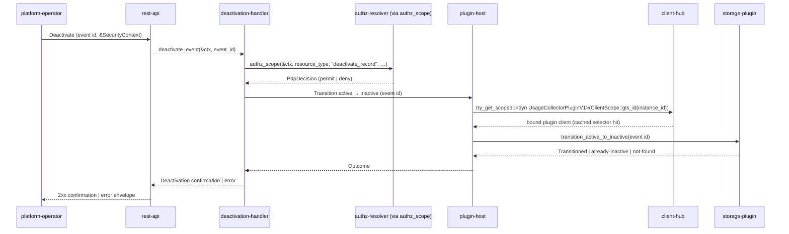
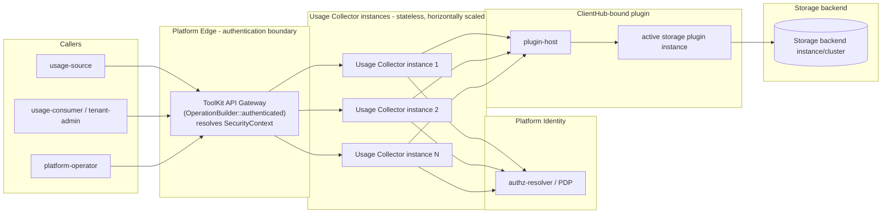

# Usage Collector — DESIGN

<!-- toc -->

- [1. Architecture Overview](#1-architecture-overview)
  - [1.1 Architectural Vision](#11-architectural-vision)
  - [1.2 Architecture Drivers](#12-architecture-drivers)
  - [1.3 Architecture Layers](#13-architecture-layers)
- [2. Principles & Constraints](#2-principles--constraints)
  - [2.1 Design Principles](#21-design-principles)
  - [2.2 Constraints](#22-constraints)
- [3. Technical Architecture](#3-technical-architecture)
  - [3.1 Domain Model](#31-domain-model)
  - [3.2 Component Model](#32-component-model)
  - [3.3 API Contracts](#33-api-contracts)
  - [3.4 Internal Dependencies](#34-internal-dependencies)
  - [3.5 External Dependencies](#35-external-dependencies)
  - [3.6 Interactions & Sequences](#36-interactions--sequences)
  - [3.7 Database schemas & tables](#37-database-schemas--tables)
  - [3.8 Deployment Topology](#38-deployment-topology)
  - [3.9 Security Architecture](#39-security-architecture)
  - [3.10 Reliability and Data Architecture](#310-reliability-and-data-architecture)
  - [3.11 Performance and Operations Architecture](#311-performance-and-operations-architecture)
  - [3.12 Maintainability, Testing, UX, and Integration Architecture](#312-maintainability-testing-ux-and-integration-architecture)
  - [3.13 Capacity, Cost, Compliance, and Documentation Architecture](#313-capacity-cost-compliance-and-documentation-architecture)
- [4. Additional context](#4-additional-context)
- [5. Traceability](#5-traceability)
  - [5.1 ADR Inventory](#51-adr-inventory)
  - [5.2 ADR Coverage by DESIGN Section](#52-adr-coverage-by-design-section)
  - [5.3 PRD → DESIGN Realization](#53-prd--design-realization)
  - [5.4 Document Changelog](#54-document-changelog)

<!-- /toc -->

- [ ] `p3` - **ID**: `cpt-cf-usage-collector-design-usage-collector`

## 1. Architecture Overview

### 1.1 Architectural Vision

The Usage Collector is the platform's centralized metering store and query engine. Its architecture is organized around a tri-surface design — an in-process SDK trait for platform gears, a Plugin SPI for pluggable storage backends, and a REST API for remote usage sources, operator tooling, and downstream consumers — all converging on a single internal core that enforces ingestion semantics, kind invariants, and idempotency before records reach the active storage plugin. Authentication is owned by the ToolKit gateway upstream of the collector and is out of scope for this gear — every REST handler receives a resolved `SecurityContext` via `Extension<SecurityContext>` populated by gateway middleware (`OperationBuilder::authenticated()`), and every SDK method takes `&SecurityContext` as its first argument. Authorization is anchored at the Policy Decision Point (PDP, `authz-resolver`): each domain component (ingestion-gateway, query-gateway, deactivation-handler, metric-catalog) calls PDP inline through a shared `authz_scope`-style helper that returns permit/deny and optional query-constraint filters used to scope reads. No business logic (pricing, billing, quota decisions) lives inside the Usage Collector; it is strictly a metering substrate.

The persistence layer is intentionally pluggable. A single active storage backend (e.g., ClickHouse, TimescaleDB) is resolved lazily on the first dispatch after the `types-registry` is consistent — via the Plugin Host (the host gear's own Service) and GTS Registry — and is reached only through the Plugin SPI. This isolation preserves the core's contract stability — the SDK trait, REST API, and Plugin SPI each version independently per the platform's major-version stability guarantees — while letting operators select the backend that best fits their workload profile and meet the analytical-query latency and ingestion-throughput thresholds via plugin-specific acceleration structures. Ingestion and query workloads are isolated so analytical queries do not degrade ingestion latency, and the system fails closed on every authentication, authorization, validation, or storage failure: there is no anonymous bypass, no cached PDP decision, no synthesized identity, and no invented storage binding.

The unifying design philosophy is contract-first, fail-closed metering with a narrow, kind-enforced ingestion contract and explicit caller-supplied attribution. Idempotency keys are mandatory on every record to make at-least-once delivery safe across counter and gauge kinds; tenant, resource, and subject attribution are caller-supplied and PDP-authorized rather than implicitly derived from the caller's SecurityContext, so platform-level forwarders and parent-to-subtenant emission scenarios share the same uniform path. Metric definitions live in **the metric catalog**, managed via the Plugin SPI and persisted in the active storage plugin's database — a single canonical catalog, with no parallel gateway-local catalog and no cross-catalog arbitration. Every metric is a **GTS type** (id ending `~`) whose `gts_id` begins with one of the two reserved kind prefixes — `gts.cf.core.usage.counter.v1~` or `gts.cf.core.usage.gauge.v1~` — from which `kind ∈ {counter, gauge}` is derived deterministically (no separate `kind` trait, no `kind` catalog column); the metric specification declares a closed list of metadata field names (`metadata_fields`, all values typed as string end-to-end). Per the ADR-0012 2026-06-02 amendment (simplifications 5 and 6), this replaces the prior open-but-typed `metadata_schema` JSON-Schema surface and the prior `traits.kind`. The catalog is mutated at runtime via the PDP-gated `POST` / `DELETE /usage-collector/v1/metric-types` (REST) and `UsageCollectorClient::register_metric_type` / `delete_metric_type` (SDK trait) surfaces per `cpt-cf-usage-collector-adr-0012-unified-plugin-catalog-and-gts-id-reference` (ADR-0012). Usage records reference metrics by `gts_id` — the same string used as the catalog identifier — and the plugin-side foreign key `usage_records.gts_id → metric_catalog(gts_id) ON DELETE RESTRICT` is enforced inside a single backend transaction. The in-plugin reference implementation (column type, index choice) is plugin-author choice and explicitly out of DESIGN scope. The gateway holds a non-durable flat L1 catalog cache keyed by `gts_id`, carrying `{kind, metadata_fields}` per metric, read-through against the catalog SoR; there is no merge core and no JSON-Schema validator. Source-gear-to-Metric authorization is owned by the PDP rather than duplicated inside the collector. The Usage Collector thus satisfies the PRD's centralized-metering, operator-self-service, and consumer-no-aggregation-layer goals while remaining a stable, minimal substrate that downstream consumers and storage authors can build against on independent release schedules.

### 1.2 Architecture Drivers

Requirements that significantly influence architecture decisions.

#### Functional Drivers

| Requirement                                           | Design Response                                                                                                                                                                                                                                                                                                                                                                                                                                                                                                                                                                                                                                                                                                                                                                 |
| ----------------------------------------------------- | ------------------------------------------------------------------------------------------------------------------------------------------------------------------------------------------------------------------------------------------------------------------------------------------------------------------------------------------------------------------------------------------------------------------------------------------------------------------------------------------------------------------------------------------------------------------------------------------------------------------------------------------------------------------------------------------------------------------------------------------------------------------------------- |
| `cpt-cf-usage-collector-fr-ingestion`                 | REST and SDK ingestion entry points funnel into a single core ingestion path; the gateway authenticates the caller and the PDP authorizes the attribution tuple before any record is forwarded to the active storage plugin via the Plugin SPI.                                                                                                                                                                                                                                                                                                                                                                                                                                                                                                                                 |
| `cpt-cf-usage-collector-fr-idempotency`               | Idempotency key is a mandatory field on the ingestion contract across SDK and REST surfaces; the core rejects keyless records with an actionable error and delegates dedup decision-making on a key collision to the active plugin behind the Plugin SPI, where an exact-equality retry (all caller-supplied canonical fields equal) is silently absorbed as a deduplicated acknowledgement and a same-key submission with any differing canonical field is surfaced as a fail-closed Conflict (`idempotency_conflict`), so retry semantics are uniform across counter and gauge kinds.                                                                                                                                                                                         |
| `cpt-cf-usage-collector-fr-record-metadata`           | An optional JSON metadata field is carried end-to-end through SDK, REST, and Plugin SPI payloads. Per `cpt-cf-usage-collector-adr-0012-unified-plugin-catalog-and-gts-id-reference` (ADR-0012, 2026-06-02 amendment), the metadata model is **closed-shape**: only keys listed in the metric's `metadata_fields` are accepted, every value is typed as String end-to-end, and any undeclared key is rejected with `unknown_metadata_key` before plugin dispatch. There is no free-form remainder and no open-extras escape hatch. The core enforces a configurable size limit at ingestion (default 8 KiB per record). Per-metric declared dimensions resolve from the catalog row's `metadata_fields` so the queryable surface grows additively as operators declare new keys. |
| `cpt-cf-usage-collector-fr-counter-semantics`         | Counter-kind enforcement lives in the core ingestion path: the core looks up the referenced Metric in the metric catalog (read-through the gateway flat L1 catalog cache; `kind` derived from the `gts_id` prefix on cache load) and rejects negative deltas before forwarding; accumulation into a signed-`SUM` net total — which `entry_type = compensation` entries MAY reduce per `cpt-cf-usage-collector-fr-usage-compensation` — is the plugin's responsibility behind the Plugin SPI.                                                                                                                                                                                                                                                                                    |
| `cpt-cf-usage-collector-fr-gauge-semantics`           | Gauge-kind records bypass monotonicity enforcement in the core and are stored as-is by the plugin; the same kind lookup that gates counters routes gauges directly to plugin persistence without delta accumulation.                                                                                                                                                                                                                                                                                                                                                                                                                                                                                                                                                            |
| `cpt-cf-usage-collector-fr-tenant-attribution`        | Tenant is a mandatory caller-supplied field on every ingestion request; the gateway performs a defense-in-depth check, and the PDP authorizes the caller's identity against the supplied tenant before the core forwards the record to the plugin.                                                                                                                                                                                                                                                                                                                                                                                                                                                                                                                              |
| `cpt-cf-usage-collector-fr-resource-attribution`      | Resource ID and resource type are mandatory ingestion-contract fields validated structurally by the core and authorized as part of the PDP attribution tuple; records missing either field are rejected before plugin dispatch.                                                                                                                                                                                                                                                                                                                                                                                                                                                                                                                                                 |
| `cpt-cf-usage-collector-fr-subject-attribution`       | Subject is an optional caller-supplied field on the ingestion contract; when present, the PDP authorizes the caller against the subject; the core never derives subject identity from the caller's SecurityContext.                                                                                                                                                                                                                                                                                                                                                                                                                                                                                                                                                             |
| `cpt-cf-usage-collector-fr-tenant-isolation`          | Tenant isolation is enforced exclusively through PDP authorization on every read and write; the core has no implicit per-tenant trust and applies PDP-returned constraint filters to all queries before the plugin executes them.                                                                                                                                                                                                                                                                                                                                                                                                                                                                                                                                               |
| `cpt-cf-usage-collector-fr-ingestion-authorization`   | The core executes a single PDP check per record against the full attribution tuple (tenant, resource, source gear, Metric) and the Metric-existence lookup against the metric catalog (via the gateway flat L1 catalog cache, read-through to the active storage plugin) before any plugin write; failures surface immediately and the core fails closed.                                                                                                                                                                                                                                                                                                                                                                                                                     |
| `cpt-cf-usage-collector-fr-pluggable-storage`         | A dedicated Plugin SPI defines persistence and query operations; the active backend is resolved lazily on the first dispatch after the `types-registry` is consistent via the Plugin Host (the host gear's own Service) and GTS Registry, and the `[usage_collector].vendor` configuration value (read once at `Gear::init`) selects which plugin identity is materialized.                                                                                                                                                                                                                                                                                                                                                                                                 |
| `cpt-cf-usage-collector-fr-query-aggregation`         | Aggregated query is exposed on both the SDK trait and REST API; the core enforces the single-metric and time-range mandatory filters, runs PDP authorization, and pushes server-side SUM / COUNT / MIN / MAX / AVG and grouping down to the plugin via the Plugin SPI.                                                                                                                                                                                                                                                                                                                                                                                                                                                                                                          |
| `cpt-cf-usage-collector-fr-query-raw`                 | Raw query uses the same PDP authorization and constraint-application pattern as aggregated query and returns cursor-paginated record pages from the plugin; user-supplied filters can only narrow within the PDP-authorized scope.                                                                                                                                                                                                                                                                                                                                                                                                                                                                                                                                              |
| `cpt-cf-usage-collector-fr-event-deactivation`        | Deactivation is a status-only transition exposed via SDK and REST; the core authorizes the operator via PDP, validates the current status, and dispatches the one-way status update to the plugin without altering any other record field.                                                                                                                                                                                                                                                                                                                                                                                                                                                                                                                                      |
| `cpt-cf-usage-collector-fr-metric-existence-and-kind` | The core holds a single canonical metric catalog — the **plugin-owned** `metric_catalog` table reached through the Plugin SPI per `cpt-cf-usage-collector-adr-0012-unified-plugin-catalog-and-gts-id-reference` (ADR-0012, 2026-06-02 amendment) — with a non-durable gateway L1 catalog cache keyed by `gts_id` carrying `{kind, metadata_fields}` per metric, read-through against it. `kind` is derived once on load from the `gts_id` prefix (`gts.cf.core.usage.counter.v1~` → counter; `gts.cf.core.usage.gauge.v1~` → gauge); it is not stored as a catalog column. Every ingestion request performs an existence and kind lookup against the cache before plugin dispatch, with kind-dependent invariants applied immediately on rejection.                             |
| `cpt-cf-usage-collector-fr-metric-registration`       | Metric registration has a single ingress path: a runtime REST / SDK call gated by PDP authorization that writes to the plugin-owned metric catalog via the Plugin SPI per `cpt-cf-usage-collector-adr-0012-unified-plugin-catalog-and-gts-id-reference` (ADR-0012, 2026-06-02 amendment). The core writes the catalog row (`gts_id`, `metadata_fields`); `kind` is NOT in the payload and is derived per lookup from the `gts_id` prefix — register-time validation requires `gts_id` to begin with one of the two reserved kind prefixes (else `invalid_kind_prefix`). Source-gear-to-Metric authorization is owned by the PDP rather than the catalog.                                                                                                                      |
| `cpt-cf-usage-collector-fr-metric-deletion`           | Metric deletion is a REST / SDK operator capability against the plugin-owned metric catalog, gated by PDP authorization per `cpt-cf-usage-collector-adr-0012-unified-plugin-catalog-and-gts-id-reference` (ADR-0012). The plugin-side foreign key `usage_records.gts_id → metric_catalog(gts_id) ON DELETE RESTRICT` blocks deletion of any metric still referenced by usage records; the gateway surfaces the structured `MetricReferenced { gts_id, sample_ref_count }` error returned by the plugin.                                                                                                                                                                                                                                                                         |
| `cpt-cf-usage-collector-fr-authn-delegation`          | Caller authentication, multi-factor, single sign-on, session, and credential-lifecycle policies are owned by the ToolKit gateway upstream of the collector; on the REST surface every handler receives an `Extension<SecurityContext>` populated by `OperationBuilder::authenticated()` middleware, and on the SDK surface every `UsageCollectorClientV1` method takes `&SecurityContext` as its first parameter. The collector accepts only platform-resolved `SecurityContext` values and `cpt-cf-usage-collector-principle-fail-closed` rejects any request lacking one; the gear NEVER consumes `authn-resolver`, NEVER stores local credentials, and NEVER synthesizes identity.                                                                                          |
| `cpt-cf-usage-collector-fr-data-classification`       | Not applicable as architecture driver because data classification is a PRD-level property realized transitively by `cpt-cf-usage-collector-constraint-pii-identity-layer` (PII delegated to platform identity layer), `cpt-cf-usage-collector-entity-record-metadata` (opaque caller-supplied metadata), `cpt-cf-usage-collector-entity-usage-record`, and `cpt-cf-usage-collector-entity-subject-ref` (opaque platform identifiers); the gear introduces no dedicated classification component.                                                                                                                                                                                                                                                                              |
| `cpt-cf-usage-collector-fr-audit-trail`               | Authoritative audit is delegated to the platform gateway access log and platform audit infrastructure; `cpt-cf-usage-collector-component-ingestion-gateway`, `cpt-cf-usage-collector-component-query-gateway`, `cpt-cf-usage-collector-component-deactivation-handler`, and `cpt-cf-usage-collector-component-metric-catalog` each propagate the request `correlation_id` read from the inbound `cpt-cf-usage-collector-entity-security-context` (resolved upstream by the ToolKit gateway) through their PDP call to `cpt-cf-usage-collector-contract-authz-resolver` and onward into structured operational events on every API operation (including `cpt-cf-usage-collector-seq-emit-usage`), and no gear-local audit log is introduced in v1.                              |
| `cpt-cf-usage-collector-fr-non-repudiation`           | Non-repudiation is anchored on the platform AuthN identity (resolved upstream of the collector by the ToolKit gateway) and the platform audit trail: each of `cpt-cf-usage-collector-component-ingestion-gateway`, `cpt-cf-usage-collector-component-query-gateway`, `cpt-cf-usage-collector-component-deactivation-handler`, and `cpt-cf-usage-collector-component-metric-catalog` binds every accepted operation to the inbound `cpt-cf-usage-collector-entity-security-context` (carried verbatim through the PDP call and into persistence), while `cpt-cf-usage-collector-principle-fail-closed` rejects anonymous or synthesized identities before the operation completes.                                                                                                |
| `cpt-cf-usage-collector-fr-privacy-controls`          | Not applicable as architecture driver because Privacy by Design properties (data minimization, purpose limitation, storage limitation, privacy-by-default, pseudonymization) are PRD-level obligations realized transitively by `cpt-cf-usage-collector-constraint-pii-identity-layer` (PII outside gear), `cpt-cf-usage-collector-constraint-no-business-logic` (purpose limitation), `cpt-cf-usage-collector-principle-pdp-centric-authorization` (deny-by-default), and `cpt-cf-usage-collector-entity-record-metadata` (opaque metadata); the gear introduces no dedicated privacy component.                                                                                                                                                                           |
| `cpt-cf-usage-collector-fr-data-ownership`            | Not applicable as architecture driver because ownership, stewardship, and sharing rules are PRD-level governance properties realized transitively by `cpt-cf-usage-collector-principle-pdp-centric-authorization` (tenant-scoped enforcement on every read/write), `cpt-cf-usage-collector-constraint-no-business-logic` (gear claims no ownership of tenant data), `cpt-cf-usage-collector-component-query-gateway` (sole sharing surface within PDP-authorized scope), and `cpt-cf-usage-collector-dbtable-usage-records` (tenant-attributed storage); the gear shapes no dedicated ownership component.                                                                                                                                                                  |
| `cpt-cf-usage-collector-fr-data-quality`              | Data quality is preserved at the ingestion contract: `cpt-cf-usage-collector-component-ingestion-gateway` performs structural and metadata-size validation, `cpt-cf-usage-collector-principle-idempotency-by-key` prevents duplicate accumulation, `cpt-cf-usage-collector-principle-monotonic-deactivation` keeps corrections monotonic via deactivation rather than mutation, and `cpt-cf-usage-collector-dbtable-usage-records` persists records as immutable rows so accepted data never silently changes.                                                                                                                                                                                                                                                                  |
| `cpt-cf-usage-collector-fr-data-lifecycle`            | Physical lifecycle (retention, archival, purging, migration, historical access) is delegated to the active storage plugin's deployment profile through `cpt-cf-usage-collector-contract-storage-plugin` and `cpt-cf-usage-collector-interface-plugin`, bound at runtime by `cpt-cf-usage-collector-component-plugin-host` per `cpt-cf-usage-collector-principle-pluggable-storage`; the gear preserves the public REST/SDK contracts across plugin migrations within a major version.                                                                                                                                                                                                                                                                                         |
| `cpt-cf-usage-collector-fr-standards-compliance`      | Standards applicability is anchored on the three stable public surfaces — `cpt-cf-usage-collector-interface-rest-api` (OpenAPI 3 conformance via `usage-collector-v1.yaml`, sibling to this DESIGN; authoritative for wire schemas), `cpt-cf-usage-collector-interface-sdk-client`, and `cpt-cf-usage-collector-interface-plugin` — each evolving under `cpt-cf-usage-collector-principle-contract-stability`; no gear-local certification claims are introduced and platform-level governance owns regulatory and residency frameworks.                                                                                                                                                                                                                                      |

#### NFR Allocation

This table maps non-functional requirements from PRD to specific design/architecture responses, demonstrating how quality attributes are realized.

| NFR ID                                                     | NFR Summary                                                                                                                                                                                                                                | Allocated To                                                                           | Design Response                                                                                                                                                                                                                                                                                                                                                                                                                                                                                                                                                             | Verification Approach                                                                                                                                                                                                                                           |
| ---------------------------------------------------------- | ------------------------------------------------------------------------------------------------------------------------------------------------------------------------------------------------------------------------------------------ | -------------------------------------------------------------------------------------- | --------------------------------------------------------------------------------------------------------------------------------------------------------------------------------------------------------------------------------------------------------------------------------------------------------------------------------------------------------------------------------------------------------------------------------------------------------------------------------------------------------------------------------------------------------------------------- | --------------------------------------------------------------------------------------------------------------------------------------------------------------------------------------------------------------------------------------------------------------- |
| `cpt-cf-usage-collector-nfr-query-latency`                 | Aggregation queries over 30-day single-tenant range complete within 500ms p95                                                                                                                                                              | Plugin SPI implementations and the query path in the core                              | The core pushes server-side aggregation and grouping into the Plugin SPI so each plugin can use backend-native acceleration structures (e.g., pre-aggregated materialized views, columnar indexes) to meet the 500ms p95 budget.                                                                                                                                                                                                                                                                                                                                            | Load testing against the bound backend with representative 30-day single-tenant workloads, measuring p95 aggregation latency.                                                                                                                                   |
| `cpt-cf-usage-collector-nfr-availability`                  | 99.95% monthly availability for ingestion endpoints                                                                                                                                                                                        | Gateway, core ingestion path, and Plugin SPI binding                                   | Stateless gateway and core processes deployed behind the platform API gateway; the active plugin binding tolerates transient GTS Registry unavailability without a parallel cache, and ingestion errors are deterministic so callers can retry idempotently.                                                                                                                                                                                                                                                                                                                | Continuous synthetic ingestion probes and uptime accounting against the 99.95% monthly budget.                                                                                                                                                                  |
| `cpt-cf-usage-collector-nfr-throughput`                    | Sustained ≥ 10,000 records/sec ingestion                                                                                                                                                                                                   | Core ingestion path and active storage plugin                                          | The core ingestion path is horizontally scalable and stateless beyond the Metrics-catalog lookup; the Plugin SPI is shaped to accept single and batched records so backends can drive their native bulk-write paths.                                                                                                                                                                                                                                                                                                                                                        | Sustained load tests producing ≥ 10,000 records/sec against representative plugin backends and measuring steady-state acceptance.                                                                                                                               |
| `cpt-cf-usage-collector-nfr-ingestion-latency`             | Ingestion p95 ≤ 200ms under the PRD §9 load envelope (sustained ≥ 10,000 records/sec per `cpt-cf-usage-collector-nfr-throughput-profile`, ±10% measurement tolerance per PRD §9)                                                           | Gateway, core ingestion path, and Plugin SPI                                           | AuthN / PDP checks and the catalog lookup are on the synchronous hot path; the Plugin SPI accepts records for durable persistence within a single call so the core can return acknowledgement once the plugin confirms acceptance.                                                                                                                                                                                                                                                                                                                                          | Latency benchmarks under the PRD §9 load envelope, recording p95 from gateway entry to plugin acceptance acknowledgement and reporting against the §9 steady-state measurement window.                                                                          |
| `cpt-cf-usage-collector-nfr-workload-isolation`            | Query workloads do not degrade ingestion p95 latency                                                                                                                                                                                       | Core scheduling and Plugin SPI separation                                              | Ingestion and query operations use independent Plugin SPI methods so plugin implementations can route them to isolated backend pools (e.g., read replicas, separate executor pools); the core does not multiplex them onto the same in-process executor.                                                                                                                                                                                                                                                                                                                    | Concurrent ingestion-plus-query load tests confirming ingestion p95 ≤ 200ms while aggregation queries execute.                                                                                                                                                  |
| `cpt-cf-usage-collector-nfr-query-freshness`               | Floor-and-ceiling consistency contract: ingestion ack durable and dedup-visible; Query SPI (raw, aggregated, catalog) eventually consistent with no upper bound at gear floor; per-plugin deployment guide ceilings                      | DESIGN §3.10.8, the Plugin SPI surface, and per-plugin deployment guides               | The gear publishes a plugin-agnostic floor and obliges every active plugin's deployment guide to publish its actual profile; no typed `consistency_profile()` SPI method in v1. Read-after-write flows use the ingestion ack; near-real-time observers poll within `cpt-cf-usage-collector-nfr-query-latency` and accept lag bounded by the active plugin's ceiling. See `cpt-cf-usage-collector-adr-consistency-contract` (ADR-0011) and DESIGN §3.10.8 for the floor wording; `plugin-spi.md` §"Consistency profile" for the SPI restatement and per-plugin obligation. | Floor verified by documentation review and `cypilot validate` PASS over DESIGN §3.10.8, `plugin-spi.md` §"Consistency profile", and the feature pointers; per-plugin ceilings verified by each plugin's release-readiness review against its published profile. |
| `cpt-cf-usage-collector-nfr-authentication`                | All API operations require authentication                                                                                                                                                                                                  | Platform ToolKit gateway (upstream of the collector)                                    | Every REST call enters through the ToolKit gateway, which authenticates the caller via `OperationBuilder::authenticated()` middleware and supplies the resolved `Extension<SecurityContext>` to the handler; every SDK call takes `&SecurityContext` as its first parameter. The collector rejects any operation that arrives without a resolved `SecurityContext` per `cpt-cf-usage-collector-principle-fail-closed`; there is no anonymous bypass and the gear NEVER consumes `authn-resolver`.                                                                          | Negative tests confirming unauthenticated calls are rejected at the gateway before any handler executes, plus negative tests confirming the collector rejects an absent `SecurityContext`.                                                                      |
| `cpt-cf-usage-collector-nfr-authorization`                 | Authorization enforced on every read and write                                                                                                                                                                                             | PDP (`authz-resolver`) contract and the core authorization gate                        | Every ingestion, query, deactivation, and Metric lifecycle operation runs a PDP check against the caller's SecurityContext and the operation's attribution tuple; PDP-returned constraints are applied as query filters before plugin dispatch.                                                                                                                                                                                                                                                                                                                             | Authorization conformance tests covering permit / deny / constraint-filtered scenarios across all operations.                                                                                                                                                   |
| `cpt-cf-usage-collector-nfr-scalability`                   | Linear horizontal scaling for ingestion and query load                                                                                                                                                                                     | Stateless gateway and core processes plus the active plugin                            | The core has no per-request shared state outside the Metrics catalog cache; instances scale horizontally behind the gateway, and the Plugin SPI lets each backend scale its own ingestion and query tiers independently.                                                                                                                                                                                                                                                                                                                                                    | Scale-out tests showing throughput increases proportionally with added core instances under fixed plugin capacity.                                                                                                                                              |
| `cpt-cf-usage-collector-nfr-graceful-degradation`          | Ingestion continues despite downstream consumer unavailability                                                                                                                                                                             | Core ingestion path independence from consumers                                        | Downstream consumers (billing, quota, dashboards) read through the SDK trait and REST API and have no synchronous coupling to ingestion; the core's ingestion path depends only on the inbound `SecurityContext`, PDP, the metric catalog (via the gateway flat L1 catalog cache), and the active plugin.                                                                                                                                                                                                                                                                   | Fault-injection tests disabling downstream consumers while ingestion continues to succeed against the plugin.                                                                                                                                                   |
| `cpt-cf-usage-collector-nfr-plugin-contract-stability`     | SDK trait, Plugin SPI, and REST API each remain stable within a major version                                                                                                                                                              | Surface versioning policy across SDK, Plugin SPI, and REST API                         | Each public surface versions independently; within a major version only additive changes are allowed; the platform supports at most one prior major version per surface concurrently to give plugin authors, in-process consumers, and remote callers a migration window.                                                                                                                                                                                                                                                                                                   | Contract compatibility tests (compile-time for SDK and Plugin SPI; schema-diff for REST) gating every release against the prior major version.                                                                                                                  |
| `cpt-cf-usage-collector-nfr-developer-operator-experience` | Predictable integration and operations: developer first-ingestion ≤ 30 min, operator Metric registration/verification ≤ 5 min, ≥ 90% routine failures mapped to documented causes                                                          | n/a                                                                                    | Not applicable as architecture driver because developer- and operator-experience targets are realized transitively by the three stable public surfaces `cpt-cf-usage-collector-interface-sdk-client`, `cpt-cf-usage-collector-interface-rest-api`, and `cpt-cf-usage-collector-interface-plugin`, which already shape the contract layout; no dedicated DX component is introduced.                                                                                                                                                                                         | Developer-experience review (manual + CI lint) using the published SDK/REST examples and operator runbook at release readiness.                                                                                                                                 |
| `cpt-cf-usage-collector-nfr-documentation-coverage`        | User, admin, API, training, and help-system documentation covering 100% of public REST/SDK operations before release candidate                                                                                                             | n/a                                                                                    | Not applicable as architecture driver because documentation coverage is a release-readiness obligation realized transitively by the stability of `cpt-cf-usage-collector-interface-rest-api`, `cpt-cf-usage-collector-interface-sdk-client`, and `cpt-cf-usage-collector-interface-plugin` against which docs are generated; no dedicated documentation component is introduced.                                                                                                                                                                                            | Documentation-coverage gate in CI plus release-candidate documentation review on every major API/SDK change.                                                                                                                                                    |
| `cpt-cf-usage-collector-nfr-support-readiness`             | Production support tiering (p1 ingestion, p2 query), SLA acknowledgement timings, self-service runbooks, diagnostic capability via correlation IDs, and documented owner routing                                                           | n/a                                                                                    | Not applicable as architecture driver because support readiness is an operations obligation realized transitively by `cpt-cf-usage-collector-interface-rest-api` (actionable error contract), `cpt-cf-usage-collector-topology-gear-runtime` (stateless instances operators can recycle), and `cpt-cf-usage-collector-constraint-nfr-thresholds` (thresholds operators alert on); no gear-local support component is introduced.                                                                                                                                        | Operations-readiness review before release candidate and after each support-impacting major change.                                                                                                                                                             |
| `cpt-cf-usage-collector-nfr-throughput-profile`            | Sustained ≥ 10,000 records/sec; burst ≥ 30,000 records/sec for ≤ 5 min/60-min window; ≥ 100 concurrent aggregation queries; ≥ 700,000,000 accepted ingestion calls per 24-hour day                                                         | Topology, ingestion gateway, query gateway, Plugin SPI, NFR-thresholds constraint      | Stateless `cpt-cf-usage-collector-topology-gear-runtime` deploys multiple instances of `cpt-cf-usage-collector-component-ingestion-gateway` and `cpt-cf-usage-collector-component-query-gateway` behind the gateway; `cpt-cf-usage-collector-interface-plugin` exposes batch ingestion and pushed-down aggregation so each plugin can drive its native bulk-write and acceleration paths inside the `cpt-cf-usage-collector-constraint-nfr-thresholds` envelope.                                                                                                          | Load testing the sustained, burst, concurrent-query, and daily-volume envelope over ≥ 30-minute steady-state windows.                                                                                                                                           |
| `cpt-cf-usage-collector-nfr-capacity-headroom`             | 3× sustained-ingestion and concurrent-query growth in 12 months and 6× in 24 months without breaking public-surface changes; ≥ 10,000 concurrent tenants; ≥ 10,000 registered Metrics                                                      | Topology, ingestion gateway, query gateway, Metrics catalog, NFR-thresholds constraint | Headroom is preserved by horizontal-scale `cpt-cf-usage-collector-topology-gear-runtime` (no per-tenant configuration), the stateless `cpt-cf-usage-collector-component-ingestion-gateway` and `cpt-cf-usage-collector-component-query-gateway`, and `cpt-cf-usage-collector-component-metric-catalog` sized for ≥ 10,000 Metrics; growth is absorbed by adding instances and tuning the active plugin within `cpt-cf-usage-collector-constraint-nfr-thresholds`.                                                                                                         | Capacity projection plus scale-out load tests at 3× and 6× the launch fleet size with concurrent-tenant and Metric-catalog scale exercises.                                                                                                                     |
| `cpt-cf-usage-collector-nfr-availability-boundary`         | 24/7 operating coverage with ≥ 7-day planned-maintenance notice counted against the 99.95% monthly availability budget; zero acknowledged-then-lost records; single region per deployment; gear-level DR delegated                       | Topology, Plugin host, Plugin SPI, NFR-thresholds constraint                           | Stateless `cpt-cf-usage-collector-topology-gear-runtime` instances behind the platform gateway support 24/7 coverage; `cpt-cf-usage-collector-component-plugin-host` requires plugin acceptance before acknowledgement so no acknowledged record can be lost at gear level; `cpt-cf-usage-collector-interface-plugin` keeps geographic and recovery semantics inside the plugin's deployment profile within `cpt-cf-usage-collector-constraint-nfr-thresholds`.                                                                                                         | Continuous synthetic ingestion probes plus chaos / fault-injection tests confirming acknowledged-record durability and 24/7 availability accounting.                                                                                                            |
| `cpt-cf-usage-collector-nfr-batch-and-report-timing`       | Batched ingestion p95 ≤ 500ms (≤ 100 records); 90-day single-tenant aggregation report p95 ≤ 5s (≤ 2 groupings, ≤ 100,000 rows); 24-hour raw-query page p95 ≤ 1s (≤ 1,000 records)                                                         | Ingestion gateway, query gateway, Plugin host, Plugin SPI, NFR-thresholds constraint   | Batch and report bounds are met by `cpt-cf-usage-collector-component-ingestion-gateway` accepting batched payloads on a single API call, `cpt-cf-usage-collector-component-query-gateway` pushing server-side aggregation and pagination down through `cpt-cf-usage-collector-interface-plugin`, and `cpt-cf-usage-collector-component-plugin-host` reaching the active backend's bulk-write and acceleration paths within `cpt-cf-usage-collector-constraint-nfr-thresholds`.                                                                                              | Load test at the documented batch sizes and report shapes with explicit p95 budgets per shape.                                                                                                                                                                  |
| `cpt-cf-usage-collector-nfr-deployment-operations`         | Release cadence ≤ 14 calendar days; rollback ≤ 10 minutes with zero acknowledged-record loss; ≥ 5% canary stage; one gear artifact across dev/stage/prod                                                                                 | Gear-runtime topology, tech stack                                                    | The stateless `cpt-cf-usage-collector-topology-gear-runtime` artifact runs identically across environments via the platform-standard deployment described by `cpt-cf-usage-collector-tech-stack`, so canary and rolling strategies plus ≤ 10-minute rollback are inherited from the platform deployment tooling without gear-specific orchestration.                                                                                                                                                                                                                    | Rollback drill and canary stage exercised on each major release; environment-parity check in CI.                                                                                                                                                                |
| `cpt-cf-usage-collector-nfr-operational-visibility`        | 7 observable signals (ingestion latency, throughput, query latency, PDP error rate, plugin error rate, plugin readiness, catalog freshness); correlation identifiers on 100% of API operations; ≥ 30-day log retention; 5 alert categories | Ingestion gateway, query gateway, deactivation handler, Metrics catalog, Plugin host   | Each user-facing component — `cpt-cf-usage-collector-component-ingestion-gateway`, `cpt-cf-usage-collector-component-query-gateway`, `cpt-cf-usage-collector-component-deactivation-handler`, `cpt-cf-usage-collector-component-metric-catalog`, and `cpt-cf-usage-collector-component-plugin-host` — emits the enumerated signals and propagates the inbound `SecurityContext.correlation_id` on every API operation; alert thresholds are anchored on the NFR IDs collected by `cpt-cf-usage-collector-constraint-nfr-thresholds`.                                        | Observability dashboard plus alerting-threshold review against the 7-signal / 5-alert set on each major release.                                                                                                                                                |
| `cpt-cf-usage-collector-nfr-error-experience`              | Actionable error categories on every API error with retryable/terminal flag; safe retry under idempotency; fail-closed degraded mode on missing-`SecurityContext` / PDP / plugin unready; documented owner escalation                      | n/a                                                                                    | Not applicable as architecture driver because error and recovery experience is realized transitively by `cpt-cf-usage-collector-interface-rest-api` (error-category taxonomy on the wire), `cpt-cf-usage-collector-component-ingestion-gateway` and `cpt-cf-usage-collector-component-query-gateway` (cause classification at the boundary), and `cpt-cf-usage-collector-principle-fail-closed` (no synthesized fallback); no dedicated error-handling component is introduced.                                                                                             | Negative-path API tests covering every documented cause category with retryability flag, plus chaos tests covering missing-`SecurityContext` / PDP / plugin unready degraded modes.                                                                             |

#### Key ADRs

| ADR ID                                                                        | Decision Summary                                                                                                                                                                                                                                                                                                                                                                                                                                                                                                                                                                                                                                                                                                                                                                                                                                      |
| ----------------------------------------------------------------------------- | ----------------------------------------------------------------------------------------------------------------------------------------------------------------------------------------------------------------------------------------------------------------------------------------------------------------------------------------------------------------------------------------------------------------------------------------------------------------------------------------------------------------------------------------------------------------------------------------------------------------------------------------------------------------------------------------------------------------------------------------------------------------------------------------------------------------------------------------------------- |
| `cpt-cf-usage-collector-adr-pdp-centric-authorization`                        | Anchor authorization at the platform PDP (authz-resolver); the core neither caches PDP decisions nor maintains its own access table.                                                                                                                                                                                                                                                                                                                                                                                                                                                                                                                                                                                                                                                                                                                  |
| `cpt-cf-usage-collector-adr-pluggable-storage`                                | Reach persistence and query exclusively through the Plugin SPI for both `usage_records` and the metric catalog; operator configuration binds the active backend.                                                                                                                                                                                                                                                                                                                                                                                                                                                                                                                                                                                                                                                                                      |
| `cpt-cf-usage-collector-adr-caller-supplied-attribution`                      | Tenant, resource, source-gear, and subject attribution are caller-supplied and PDP-authorized rather than derived from the caller's SecurityContext.                                                                                                                                                                                                                                                                                                                                                                                                                                                                                                                                                                                                                                                                                                |
| `cpt-cf-usage-collector-adr-mandatory-idempotency`                            | The ingestion contract requires a client-provided idempotency key on every record across counter and gauge kinds.                                                                                                                                                                                                                                                                                                                                                                                                                                                                                                                                                                                                                                                                                                                                     |
| `cpt-cf-usage-collector-adr-monotonic-deactivation`                           | Individual event deactivation is a one-way `active → inactive` status transition; no reactivation; no other field mutation.                                                                                                                                                                                                                                                                                                                                                                                                                                                                                                                                                                                                                                                                                                                           |
| `cpt-cf-usage-collector-adr-contract-stability`                               | REST API, SDK trait, and Plugin SPI each version independently under a major-version stability contract with at most one prior major supported.                                                                                                                                                                                                                                                                                                                                                                                                                                                                                                                                                                                                                                                                                                       |
| `cpt-cf-usage-collector-adr-usage-compensation`                               | Usage compensation primitive: counter-only, append-only, strictly-negative `entry_type = compensation` row on the unified ingestion path; reduces `SUM` without mutating the original; no dedicated compensate endpoint / SDK method / SPI call.                                                                                                                                                                                                                                                                                                                                                                                                                                                                                                                                                                                                      |
| `cpt-cf-usage-collector-adr-consistency-contract`                             | Floor-and-ceiling consistency contract: ingestion `Acknowledged` is durable and dedup-visible; the Query SPI (raw + aggregated + catalog) is eventually consistent with no upper bound at the gear floor; read-after-write flows MUST use the ingestion ack; each plugin's deployment guide MAY advertise a stronger ceiling. No typed `consistency_profile()` SPI method in v1.                                                                                                                                                                                                                                                                                                                                                                                                                                                                    |
| `cpt-cf-usage-collector-adr-0012-unified-plugin-catalog-and-gts-id-reference` | The plugin-DB metric catalog (managed via SDK/REST) is the sole catalog; usage records reference metrics by `gts_id`; the metric specification drops `parent_type_uuid`, `x-uc-indexable`, and `abstract`. **2026-06-02 amendment (simplifications 5 + 6)**: the catalog row is flat — `kind` is derived from the `gts_id` prefix (`gts.cf.core.usage.counter.v1~` / `gts.cf.core.usage.gauge.v1~`) and is NOT a stored column; `metadata_schema` is replaced by closed `metadata_fields: Vec<String>` (declared keys only; all values typed as String); the merge core and the per-metric JSON Schema (Draft-07) validator surface are removed. Supersedes `cpt-cf-usage-collector-adr-gateway-local-metric-catalog`, `cpt-cf-usage-collector-adr-catalog-plugin-referential-integrity`, and `cpt-cf-usage-collector-adr-gts-typed-metric-metadata`. |

### 1.3 Architecture Layers

- [ ] `p3` - **ID**: `cpt-cf-usage-collector-tech-stack`

| Layer          | Responsibility                                                                                                                                                                                                                                                                                         | Technology                                                                                                                                                                                                                                                                                                | Risk                                                                                                                                                                                                                                                                                          | Maintainability                                                                                                                                                                                                                             |
| -------------- | ------------------------------------------------------------------------------------------------------------------------------------------------------------------------------------------------------------------------------------------------------------------------------------------------------ | --------------------------------------------------------------------------------------------------------------------------------------------------------------------------------------------------------------------------------------------------------------------------------------------------------- | --------------------------------------------------------------------------------------------------------------------------------------------------------------------------------------------------------------------------------------------------------------------------------------------- | ------------------------------------------------------------------------------------------------------------------------------------------------------------------------------------------------------------------------------------------- |
| Presentation   | Exposes the three public surfaces — REST API, in-process SDK trait, and Plugin SPI — and accepts incoming usage submissions, queries, deactivation, and Metric lifecycle requests.                                                                                                                     | HTTP REST (wire contract authoritative in `usage-collector-v1.yaml`, sibling to this DESIGN; [§3.3](#33-api-contracts) Endpoints Overview and PRD §7 are the prose summary); in-process Rust async trait registered in ClientHub; Plugin SPI async trait registered in ClientHub with GTS instance scope. | Low — contracts are independently versioned per `cpt-cf-usage-collector-adr-contract-stability`.                                                                                                                                                                                              | Owned by usage-collector gear team; OpenAPI + trait diff gates protect against breaking change.                                                                                                                                           |
| Application    | Accepts a platform-resolved `SecurityContext`, applies PDP authorization on every operation, enforces idempotency and kind invariants, orchestrates aggregation / raw / deactivation flows, and runs Metric lifecycle operations.                                                                      | Platform ToolKit gateway (upstream; owns authentication and supplies `Extension<SecurityContext>`); `authz-resolver` PDP for authorization and query constraints; in-process orchestration in the Usage Collector core.                                                                                    | Medium — depends on stability of the ToolKit gateway contract and the `authz-resolver` platform contract; mitigated by `cpt-cf-usage-collector-principle-fail-closed`.                                                                                                                         | Co-owned by usage-collector gear team + platform identity-services team; contract-test gate on `authz-resolver`.                                                                                                                          |
| Domain         | Holds the Metric and Usage Record domain types and the in-process flat L1 catalog cache used for existence, kind, and declared-dimension validation during ingestion.                                                                                                                                  | In-process Rust domain types and a **non-durable gateway L1 catalog cache** — a flat `Map<gts_id, {kind, metadata_fields}>` over the plugin-owned metric catalog per `cpt-cf-usage-collector-adr-0012-unified-plugin-catalog-and-gts-id-reference` (2026-06-02 amendment).                                | Low — domain types are small, stable, and traceable to PRD entities.                                                                                                                                                                                                                          | Owned by usage-collector gear team; catalog-cache coherence is read-through against the plugin SoR with synchronous invalidation on register / delete per `cpt-cf-usage-collector-adr-0012-unified-plugin-catalog-and-gts-id-reference`.  |
| Infrastructure | Resolves the active storage backend lazily on the first dispatch after the `types-registry` is consistent via the Plugin Host (the host gear's own Service) and GTS Registry, and reaches it exclusively through the Plugin SPI for both `metric_catalog` and `usage_records` persistence and query. | Plugin Host (the host gear's own Service) and GTS Registry for binding lifecycle; pluggable storage backends such as ClickHouse and TimescaleDB selected by the `[usage_collector].vendor` value read once at `Gear::init`.                                                                           | Medium — operator-selected backend introduces deployment-specific risk; mitigated by `cpt-cf-usage-collector-adr-pluggable-storage` (active-plugin contract isolates the core) and the single-catalog model in `cpt-cf-usage-collector-adr-0012-unified-plugin-catalog-and-gts-id-reference`. | Co-owned by usage-collector gear team (Plugin SPI surface) + each active plugin's owning team (concrete backend impl); breaking changes flow through Plugin SPI major-version policy per `cpt-cf-usage-collector-adr-contract-stability`. |

## 2. Principles & Constraints

### 2.1 Design Principles

#### Prioritization on conflict

When two or more of the principles below appear to conflict on a given path, they are resolved in this strict order (highest priority first):

1. **`cpt-cf-usage-collector-principle-fail-closed`** — fail-closed behaviour on safety paths (AuthN, PDP, kind enforcement, plugin acceptance) overrides every other principle. A request that would otherwise be accepted under another principle MUST be rejected if any fail-closed gate is unsatisfied.
2. **`cpt-cf-usage-collector-principle-pdp-centric-authorization`** — authorization at the PDP is the next-strongest constraint; no other principle may permit a write or read that the PDP has denied or scoped away via constraints.
3. **`cpt-cf-usage-collector-principle-idempotency-by-key`** — once a request has passed fail-closed and PDP gates, idempotency-by-key governs how retries are absorbed before any other accumulation or storage semantics apply.
4. **`cpt-cf-usage-collector-principle-kind-enforcement`** — kind invariants (counter non-negative, gauge stored as-is, unknown Metric rejected) apply after idempotency dedup and before plugin dispatch.
5. **`cpt-cf-usage-collector-principle-monotonic-deactivation`** — record lifecycle is one-way `active → inactive`; no other principle may re-mutate accepted records.
6. **`cpt-cf-usage-collector-principle-pluggable-storage`** — backend selection and behaviour are deferred to the active plugin; the core never bypasses the Plugin SPI to satisfy any other principle.
7. **`cpt-cf-usage-collector-principle-contract-stability`** — the three public surfaces are last in priority on safety paths but bind every release: a fix to any of the principles above MUST still be expressible additively within the major-version stability contract, or it MUST defer to a coordinated multi-major-version release window.

Rationale: this ordering keeps safety properties (no anonymous bypass, no PDP bypass) ahead of correctness properties (no duplicate accumulation, no kind violation), correctness ahead of lifecycle (monotonic deactivation), and lifecycle ahead of substrate/contract concerns. Reviewers can use this ordering to adjudicate any ambiguous case without re-deriving the trade-offs.

#### PDP-centric authorization

- [ ] `p2` - **ID**: `cpt-cf-usage-collector-principle-pdp-centric-authorization`

All read and write operations are authorized through the platform Policy Decision Point (`authz-resolver`) against the caller's SecurityContext and the operation's full attribution tuple (tenant, resource, source gear, Metric, and optionally subject). The Usage Collector neither caches PDP decisions nor maintains its own per-tenant or per-Metric access table. For queries, PDP-returned constraint filters define the authorization boundary and are applied before any user-supplied filters narrow the result set. This keeps authorization policy in one place, eliminates duplicated access state inside the collector, and lets the platform evolve emit and read permissions without coordinated collector changes.

**ADRs**: `cpt-cf-usage-collector-adr-pdp-centric-authorization`, `cpt-cf-usage-collector-adr-caller-supplied-attribution`

#### Fail-closed behavior

- [ ] `p2` - **ID**: `cpt-cf-usage-collector-principle-fail-closed`

Every missing-`SecurityContext`, authorization, validation, and storage failure resolves to immediate rejection with a deterministic error. There is no anonymous bypass, no cached PDP decision, no synthesized identity (the collector never resolves credentials — authentication is owned by the ToolKit gateway upstream), no invented storage binding when the active plugin is unavailable, and no silent discard of denied emissions. Failing closed makes the metering substrate predictable for callers — retry semantics are governed by idempotency, not by recovering from ambiguous partial success — and prevents quiet data-quality regressions in billing-sensitive paths.

**ADRs**: `cpt-cf-usage-collector-adr-pdp-centric-authorization`

#### Idempotency-by-key

- [ ] `p2` - **ID**: `cpt-cf-usage-collector-principle-idempotency-by-key`

Every usage record carries a client-provided idempotency key, and a same-key submission resolves into exactly one of two outcomes. An exact-equality retry — where all caller-supplied canonical fields (`value`, `timestamp`, `resource`, `subject`, `source_gear`, and `metadata`) equal the stored record — is silently deduplicated and surfaced as a successful but deduplicated acknowledgement. A same-key submission with any differing canonical field (including a metadata-only difference) is a canonical-field-mismatch Conflict: it is rejected fail-closed (consistent with `cpt-cf-usage-collector-principle-fail-closed`) through the `idempotency_conflict` reason rather than silently dropped, so accidental key reuse with divergent content cannot mask data from billing and downstream consumers. This applies uniformly to counter and gauge kinds: counters cannot inflate their accumulated total on retry, and gauges cannot poison downstream rate-of-change or distinct-timestamp signals through duplicates. The idempotency window is unbounded — the key never expires, has no TTL, and is never intentionally reusable — so the `(tenant_id, metric_gts_id, idempotency_key)` uniqueness is permanent. Idempotency-by-key makes at-least-once delivery safe end-to-end and removes the need for kind-dependent retry strategies in source gears.

**ADRs**: `cpt-cf-usage-collector-adr-mandatory-idempotency`

#### Pluggable storage

- [ ] `p2` - **ID**: `cpt-cf-usage-collector-principle-pluggable-storage`

Persistence and query are accessed exclusively through the Plugin SPI; the active backend is resolved lazily on the first dispatch after the `types-registry` is consistent via the Plugin Host (the host gear's own Service) and GTS Registry, and the `[usage_collector].vendor` configuration value read once at `Gear::init` selects which plugin identity is materialized. The core does not directly couple to any backend SQL dialect, schema, or client library, so operators can choose the backend that fits their workload profile and meet the analytical latency and ingestion throughput thresholds via plugin-specific acceleration structures.

**ADRs**: `cpt-cf-usage-collector-adr-pluggable-storage`

#### Plugin resolution via ClientHub

- [ ] `p2` - **ID**: `cpt-cf-usage-collector-principle-plugin-resolution-via-client-hub`

Storage-plugin binding is resolved through the platform's `PluginV1
` GTS base type, `types-registry`, and `ClientHub` scoped registration. The Usage Collector SDK declares a unit-struct GTS spec `UsageCollectorPluginSpecV1` in `usage-collector-sdk/src/gts.rs` with `base = PluginV1` and an empty `properties = ""` (plugin instance metadata — `vendor`, `priority` — is carried by the `PluginV1
` base, not by usage-collector-specific spec data). Each plugin's `init()` calls `PluginV1::<UsageCollectorPluginSpecV1>::build_registration(...)`, publishes the instance payload through `TypesRegistryClient`, and registers a scoped `dyn UsageCollectorPluginV1` client in `ClientHub` under `ClientScope::gts_id(&instance_id)`. The host's `cpt-cf-usage-collector-component-plugin-host` holds a `GtsPluginSelector` that lazily resolves the bound plugin instance by querying `types-registry` with `UsageCollectorPluginSpecV1::gts_schema_id()` + configured vendor (lowest priority wins); per-request dispatch is an in-memory `ClientHub::try_get_scoped::<dyn UsageCollectorPluginV1>` lookup. Plugins are compiled in at the workspace level (static linkage), not dynamically loaded; the host crate has no compile-time dependency on any concrete plugin crate, and binding is settled at startup. See [§3.5](#35-external-dependencies) "Plugin Resolution and Dispatch" for the resolution flow code shape and [§3.6](#36-interactions-sequences) sequence diagrams for per-operation dispatch.

**ADRs**: `cpt-cf-usage-collector-adr-pluggable-storage`

#### Kind enforcement

- [ ] `p2` - **ID**: `cpt-cf-usage-collector-principle-kind-enforcement`

The Metrics catalog records each Metric's kind (`counter` or `gauge`) and optional unit, and the ingestion path enforces kind-dependent invariants before any record reaches the plugin — counter records with negative deltas are rejected, gauge records bypass monotonicity, and records referencing unknown Metric `gts_id`s are rejected outright. Centralizing kind enforcement in the core keeps the contract minimal (no per-Metric schema validation) while preserving the data-integrity guarantees that downstream consumers depend on.

#### Monotonic deactivation

- [ ] `p2` - **ID**: `cpt-cf-usage-collector-principle-monotonic-deactivation`

Individual event deactivation is a one-way transition from active to `inactive` on the record's `status` field; the Usage Collector does not provide a reactivation operation and rejects deactivation requests against already-inactive records. No other property of the record is modified. Monotonic deactivation gives storage plugins, query consumers, and aggregation pipelines a first-class lifecycle event to reason about without re-introducing mutable-record semantics into the substrate.

**ADRs**: `cpt-cf-usage-collector-adr-monotonic-deactivation`

#### Contract stability

- [ ] `p2` - **ID**: `cpt-cf-usage-collector-principle-contract-stability`

The three public surfaces — REST API, SDK trait, and Plugin SPI — each version independently under a major-version stability contract: within a major version only additive changes are permitted, and the platform supports at most one prior major version concurrently per surface to give plugin authors, in-process consumers, and remote callers an explicit migration window. Treating contract stability as a first-class principle decouples ecosystem release schedules from the Usage Collector's own release train.

**ADRs**: `cpt-cf-usage-collector-adr-contract-stability`

#### Cursor gateway ownership

- [ ] `p2` - **ID**: `cpt-cf-usage-collector-principle-cursor-gateway-ownership`

The Query Gateway owns, issues, decodes, and validates the opaque continuation token (`toolkit_odata::CursorV1`) for raw-record reads. Plugins **MUST NOT** mint, encode, or interpret a wire cursor — they receive the structured `(filter_ast, order_keys, page_after, limit)` tuple and return `(rows, last_keyset)`. This keeps cursor versioning, signing posture, and validation rules at a single platform-owned location. See [§3.3](#33-api-contracts) Cursor & Pagination for the lifecycle and Problem mappings.

#### Canonical error envelope

- [ ] `p2` - **ID**: `cpt-cf-usage-collector-principle-canonical-errors`

The REST surface emits errors using `toolkit_canonical_errors::Problem` plus the platform's registered standard-errors set; the gear **MUST NOT** define a bespoke `Problem` schema. `Problem.context` is a GTS-typed payload whose concrete shape is selected by the discriminator named in `context.reason`. See [§3.3](#33-api-contracts) Error Envelopes for the discriminator vocabulary.

#### Canonical page envelope

- [ ] `p2` - **ID**: `cpt-cf-usage-collector-principle-canonical-page`

The Query Gateway's raw-read response uses the canonical `toolkit_odata::Page<UsageRecord>` envelope — `{ items: [UsageRecord], page_info: { next_cursor, prev_cursor, limit } }`. The gear **MUST NOT** define a bespoke paging schema for raw reads. Aggregated reads return a non-paginated typed body (see `cpt-cf-usage-collector-principle-aggregate-asymmetry`).

#### Aggregate asymmetry

- [ ] `p2` - **ID**: `cpt-cf-usage-collector-principle-aggregate-asymmetry`

The collector exposes two read shapes that intentionally differ. `GET /usage-collector/v1/records` is an OData list endpoint with cursor pagination; `POST /usage-collector/v1/records/aggregate` is a body-shaped RPC that returns a non-paginated result set. Gears Toolkit's OData layer does not expose `$apply` (group-by / aggregate transforms), so paginating an aggregate response would add complexity without recovering safety. The asymmetry is the chosen contract.

#### OTLP push emission

- [ ] `p2` - **ID**: `cpt-cf-usage-collector-principle-otlp-push-emission`

Operational telemetry is pushed via OTLP from ToolKit's global `SdkMeterProvider`; the gear **MUST NOT** expose an HTTP scrape endpoint, **MUST NOT** instantiate its own exporter, and **MUST NOT** reintroduce the dropped `/metrics` path. Instruments are constructed via `opentelemetry::global::meter_with_scope("usage_collector", …)` at gear bootstrap. See [§3.11.5](#3115-observability-architecture-applicability-ops-design-002) for the wiring and [§3.11.7](#3117-operational-metric-inventory-ops-design-002) for the instrument inventory.

#### Gateway HTTP server instrument reuse

- [ ] `p2` - **ID**: `cpt-cf-usage-collector-principle-gateway-http-server-instrument-reuse`

The platform API gateway middleware in front of every REST handler emits a fixed set of OTel-semantic-conventions `http.server.*` instruments (request duration histogram, active requests gauge) that the gear **MUST NOT** redeclare. These instruments are exported through the same `SdkMeterProvider` and OTLP pipeline as the gear-scoped `usage_collector.*` inventory and count as part of the gear's observability contract alongside the gear-scoped instruments. See [§3.11.7](#3117-operational-metric-inventory-ops-design-002) for the inventory and labels.

### 2.2 Constraints

#### Plugin contract stability (major-version)

- [ ] `p2` - **ID**: `cpt-cf-usage-collector-constraint-plugin-contract-stability`

The Plugin SPI is bound by the platform's major-version stability contract: a plugin built against Plugin SPI version `N` must continue to function unchanged against every minor and patch release of `N.x`, and breaking changes must be expressed as a new major version that coexists with the prior major version for at least one migration window. This constrains the core's evolution of plugin-facing types — additive changes only within a major version — and forces breaking changes through a coordinated multi-major-version release cycle with every plugin implementation.

**ADRs**: `cpt-cf-usage-collector-adr-pluggable-storage`, `cpt-cf-usage-collector-adr-contract-stability`

#### No business logic in collector

- [ ] `p2` - **ID**: `cpt-cf-usage-collector-constraint-no-business-logic`

Pricing, rating, billing rules, invoice generation, and quota enforcement decisions are explicitly out of scope for the Usage Collector. The gear persists and serves usage data only; downstream consumers (billing, quota enforcement, dashboards) own all business logic and operate on the collector's aggregated and raw query results. This constraint shapes API surface design (no pricing fields, no quota-decision endpoints) and protects the metering substrate from coupling to product-level pricing models.

#### NFR thresholds (from PRD §6)

- [ ] `p2` - **ID**: `cpt-cf-usage-collector-constraint-nfr-thresholds`

The architecture must meet the PRD §6 thresholds simultaneously, evaluated against the PRD §9 load envelope and scaling-efficiency definitions: ingestion p95 ≤ 200 ms under the §9 load envelope (sustained ≥ 10,000 records/sec per `cpt-cf-usage-collector-nfr-throughput-profile`, with the §9 ±10% measurement tolerance), sustained ingestion ≥ 10,000 records/sec, aggregation queries over a 30-day single-tenant range p95 ≤ 500 ms, ingestion p95 unaffected by concurrent query workloads, and 99.95% monthly availability for ingestion endpoints. Horizontal scaling delivers "linear" throughput growth as formally defined by `cpt-cf-usage-collector-nfr-scalability` and PRD §9 linear-scaling-efficiency (per-instance ingestion efficiency ratio ≥ 0.8 of the launch single-instance baseline for fleet sizes N ∈ {1×, 2×, 3×, 4×}). These thresholds constrain plugin selection (each backend must demonstrate it can satisfy the budget under the §9 envelope), workload isolation between ingestion and query paths, and capacity planning at every deployment.

#### PII handled by identity layer (not collector)

- [ ] `p2` - **ID**: `cpt-cf-usage-collector-constraint-pii-identity-layer`

Subject IDs stored by the Usage Collector are opaque internal platform identifiers issued and managed by the platform identity layer; PII management responsibilities belong to that layer rather than the collector. The Usage Collector treats subject and tenant identifiers as opaque strings throughout the ingestion, persistence, and query paths and does not attempt to interpret, redact, or classify them. This constrains the data model (no PII-sensitive fields in the record schema beyond opaque identifiers) and the operational posture (the Privacy by Design NFR is excluded at the gear boundary; see PRD §5.8 and §6.2).

Per-bullet applicability for downstream privacy controls (COMPL-DESIGN-002):

- **Consent management**: Not applicable because handled by the platform identity layer.
- **Data-subject requests (DSR / GDPR / CCPA)**: Not applicable because handled by the platform identity layer and, for erasure specifically, by the platform legal/governance layer and the active storage plugin's purge mechanism per `cpt-cf-usage-collector-fr-data-lifecycle` (PRD §5.8 Data Lifecycle Delegation). Deactivation is intentionally not an erasure path: per `cpt-cf-usage-collector-adr-monotonic-deactivation` it is a status-only transition that keeps the record queryable. The Usage Collector does not host a gear-local DSR workflow.
- **Privacy Impact Assessment (PIA)**: Not applicable because handled by the platform identity layer; gear-level PIA is not required given the opaque-identifier-only data model.
- **Cross-border data transfer**: Not applicable because handled by the platform identity layer and by the active storage plugin's deployment posture (data residency follows the bound plugin's deployment region); see `cpt-cf-usage-collector-adr-pluggable-storage`.

**ADRs**: `cpt-cf-usage-collector-adr-caller-supplied-attribution`

#### Regulatory and certification scope (out of gear)

- [ ] `p2` - **ID**: `cpt-cf-usage-collector-constraint-regulatory-out-of-scope`

Not applicable as an active gear-owned constraint because regulatory compliance scope (HIPAA, PCI-DSS, GDPR, SOC 2, ISO 27001, NIST 800-53, FedRAMP, etc.) and certification-driven controls are platform-owned per PRD §5.8 and §6.2. The Usage Collector claims no gear-local certification posture; it contributes to platform compliance only through the access trail produced by the upstream ToolKit gateway (authentication) and the per-component PDP enforcement per `cpt-cf-usage-collector-adr-pdp-centric-authorization`, and through the opaque-identifier data model per `cpt-cf-usage-collector-constraint-pii-identity-layer`. Cross-border / data-residency residency follows the active storage plugin's deployment posture per `cpt-cf-usage-collector-adr-pluggable-storage`. Recorded here as a first-class constraint so the architecture cannot drift into gear-local compliance claims without an explicit constraint change.

#### Vendor and licensing pluggability

- [ ] `p2` - **ID**: `cpt-cf-usage-collector-constraint-vendor-pluggable`

Active constraint: no storage-vendor lock-in is permitted inside the gear. Persistence and query MUST be reached exclusively through `cpt-cf-usage-collector-interface-plugin` and `cpt-cf-usage-collector-contract-storage-plugin` per `cpt-cf-usage-collector-adr-pluggable-storage`; the core MUST NOT contain backend-specific SQL, schema, client libraries, or licensing assumptions. Active-plugin vendor (ClickHouse, TimescaleDB, …) is operator-selected at bootstrap and ships under its own license on an independent release schedule. Any gear change that would introduce a vendor-specific dependency requires a Plugin SPI major-version revision per `cpt-cf-usage-collector-adr-contract-stability`.

#### Legacy-system migration constraints

- [ ] `p2` - **ID**: `cpt-cf-usage-collector-constraint-legacy-none`

Not applicable as an active migration constraint because the Usage Collector is a net-new gear with no legacy predecessor inside the platform; there is no prior metering substrate whose data, contracts, or operational posture must be preserved during cut-over. A dedicated backfill capability (watermarks, late-data coordination, bulk-import method) is an explicit non-goal per [§4](#4-additional-context) forward-looking notes — old event timestamps are nevertheless accepted without wall-clock validation, so bulk historical import rides the normal batched ingestion path per `domain-model.md` §2.1. Recorded here as a first-class constraint so the absence of legacy obligations cannot be confused with a silent omission.

#### Resource and platform-substrate ownership

- [ ] `p2` - **ID**: `cpt-cf-usage-collector-constraint-resource-platform-owned`

Active constraint: physical resources (CPU/memory/storage/network sizing, autoscaling thresholds, secret distribution, deployment substrate) are platform-ops-owned per `cpt-cf-usage-collector-topology-gear-runtime` and `docs/REPO_PLAYBOOK.md`; the gear MUST NOT embed deployment-substrate assumptions in its code or contracts. Gear-instance resource caps and durable-storage capacity remain operator-tuned within the [§3.11.3](#3113-resource-efficiency-perf-design-004) envelope and the active plugin's deployment guide. The gear's contribution to resource economics is its stateless, horizontally scalable shape per `cpt-cf-usage-collector-nfr-scalability` and its plugin-delegated durable storage per `cpt-cf-usage-collector-adr-pluggable-storage`.

## 3. Technical Architecture

### 3.1 Domain Model

**Technology**: GTS identifier (Metric `gts_id`) + Rust type references. Per `DATA-DESIGN-NO-001` and `MAINT-DESIGN-NO-001`, this section records only type names, one-line descriptions, and inter-type relationships; field-level schemas live in the companion domain-model document (`domain-model.md`, sibling to this DESIGN) and (for the wire surface) are authoritative in the OpenAPI contract `usage-collector-v1.yaml` (sibling to this DESIGN). The SDK trait (`sdk-trait.md`), Plugin SPI (`plugin-spi.md`), OpenAPI (`usage-collector-v1.yaml`), and `domain-model.md` companion artifacts are the authoritative type-and-surface reference; the [§3.1](#31-domain-model) type catalogue here and PRD §7 capability descriptions are the prose summary used to introduce that reference.

**Location**: `domain-model.md` (sibling to this DESIGN).

**Type Identifiers** (defined here; field-level schemas documented in `domain-model.md`):

- [ ] `p3` - **ID**: `cpt-cf-usage-collector-entity-usage-record`
- [ ] `p3` - **ID**: `cpt-cf-usage-collector-entity-resource-ref`
- [ ] `p3` - **ID**: `cpt-cf-usage-collector-entity-subject-ref`
- [ ] `p3` - **ID**: `cpt-cf-usage-collector-entity-metric`
- [ ] `p3` - **ID**: `cpt-cf-usage-collector-entity-metric-kind`
- [ ] `p3` - **ID**: `cpt-cf-usage-collector-entity-entry-type`
- [ ] `p3` - **ID**: `cpt-cf-usage-collector-entity-idempotency-key`
- [ ] `p3` - **ID**: `cpt-cf-usage-collector-entity-record-metadata`
- [ ] `p3` - **ID**: `cpt-cf-usage-collector-entity-security-context`
- [ ] `p3` - **ID**: `cpt-cf-usage-collector-entity-deactivation-status`
- [ ] `p3` - **ID**: `cpt-cf-usage-collector-entity-aggregation-query`
- [ ] `p3` - **ID**: `cpt-cf-usage-collector-entity-raw-query`
- [ ] `p3` - **ID**: `cpt-cf-usage-collector-entity-aggregation-result`
- [ ] `p3` - **ID**: `cpt-cf-usage-collector-entity-usage-record-filter-field`
- [ ] `p3` - **ID**: `cpt-cf-usage-collector-entity-keyset`
- [ ] `p3` - **ID**: `cpt-cf-usage-collector-entity-pdp-decision`
- [ ] `p3` - **ID**: `cpt-cf-usage-collector-entity-pdp-constraint`
- [ ] `p3` - **ID**: `cpt-cf-usage-collector-entity-plugin-binding`

**Core Entities**:

| Entity                                                                             | Description                                                                                                                                                                                                                                                                                                                                                                                                                                                                                                                                                                                                                                                                                              | Schema            |
| ---------------------------------------------------------------------------------- | -------------------------------------------------------------------------------------------------------------------------------------------------------------------------------------------------------------------------------------------------------------------------------------------------------------------------------------------------------------------------------------------------------------------------------------------------------------------------------------------------------------------------------------------------------------------------------------------------------------------------------------------------------------------------------------------------------- | ----------------- |
| UsageRecord (`cpt-cf-usage-collector-entity-usage-record`)                         | A single attributed measurement of resource consumption — value (signed per the `(MetricKind × EntryType)` validation matrix), timestamp, attribution tuple, idempotency key, status, `entry_type` discriminator, optional `corrects_id` back-reference (set only when `entry_type = compensation`; see `cpt-cf-usage-collector-fr-usage-compensation`), and optional metadata.                                                                                                                                                                                                                                                                                                                          | `domain-model.md` |
| ResourceRef (`cpt-cf-usage-collector-entity-resource-ref`)                         | Caller-supplied composite identifying the attributed resource — `resource_id` plus `resource_type`; mandatory on every UsageRecord and an optional filter on queries.                                                                                                                                                                                                                                                                                                                                                                                                                                                                                                                                    | `domain-model.md` |
| SubjectRef (`cpt-cf-usage-collector-entity-subject-ref`)                           | Caller-supplied subject attribution — mandatory `subject_id` plus optional `subject_type`; omitted entirely for system-level consumption and available as an optional filter on queries.                                                                                                                                                                                                                                                                                                                                                                                                                                                                                                                 | `domain-model.md` |
| Metric (`cpt-cf-usage-collector-entity-metric`)                                    | Platform-global Metric definition keyed by a GTS identifier and described by a Metric Kind plus optional unit label.                                                                                                                                                                                                                                                                                                                                                                                                                                                                                                                                                                                     | `domain-model.md` |
| MetricKind (`cpt-cf-usage-collector-entity-metric-kind`)                           | Accumulation-semantics classifier for a Metric — `counter` (signed `SUM`-netting across `usage` and `compensation` entries) or `gauge` (point-in-time, stored as-is; admits only `entry_type = usage`).                                                                                                                                                                                                                                                                                                                                                                                                                                                                                                  | `domain-model.md` |
| EntryType (`cpt-cf-usage-collector-entity-entry-type`)                             | Discriminator on a UsageRecord — `usage` (default; ordinary measurement) or `compensation` (counter-only, append-only, strictly-negative `value`, references a prior `usage` row via `corrects_id`). Drives the validation matrix and the aggregation semantics; never mutated after acceptance. See `cpt-cf-usage-collector-fr-usage-compensation`.                                                                                                                                                                                                                                                                                                                                                     | `domain-model.md` |
| IdempotencyKey (`cpt-cf-usage-collector-entity-idempotency-key`)                   | Caller-supplied opaque identifier that deduplicates retried submissions uniformly across counter and gauge kinds and across `usage` and `compensation` entries.                                                                                                                                                                                                                                                                                                                                                                                                                                                                                                                                          | `domain-model.md` |
| RecordMetadata (`cpt-cf-usage-collector-entity-record-metadata`)                   | JSON object carried on a UsageRecord. Per `cpt-cf-usage-collector-adr-0012-unified-plugin-catalog-and-gts-id-reference` (2026-06-02 amendment), the metadata model is **closed-shape**: only keys listed in the metric's `metadata_fields` are accepted; every value is typed as String end-to-end; undeclared keys are rejected at the gateway with `unknown_metadata_key`. There is no free-form remainder and no open-extras escape hatch. Per-metric declared dimensions resolve from the catalog row's `metadata_fields` and define the queryable surface; the collector does not interpret metadata contents — admissibility is keyed by declared-field membership, not by JSON-Schema validation. | `domain-model.md` |
| SecurityContext (`cpt-cf-usage-collector-entity-security-context`)                 | Reference to the platform-resolved caller identity (tenant scope, principal, auxiliary claims) supplied to REST handlers by the ToolKit gateway (via `Extension<SecurityContext>` populated by `OperationBuilder::authenticated()`) and passed to SDK methods as the first parameter; consumed but not owned by this gear.                                                                                                                                                                                                                                                                                                                                                                              | `domain-model.md` |
| DeactivationStatus (`cpt-cf-usage-collector-entity-deactivation-status`)           | One-way lifecycle marker on a UsageRecord — `active` or `inactive`; monotonic transition only.                                                                                                                                                                                                                                                                                                                                                                                                                                                                                                                                                                                                           | `domain-model.md` |
| AggregationQuery (`cpt-cf-usage-collector-entity-aggregation-query`)               | Aggregation request — mandatory time range and single-Metric filter, optional tenant / subject / resource / source-gear filters, aggregation function (SUM, COUNT, MIN, MAX, AVG), and group-by dimensions.                                                                                                                                                                                                                                                                                                                                                                                                                                                                                            | `domain-model.md` |
| RawQuery (`cpt-cf-usage-collector-entity-raw-query`)                               | Raw-record request — mandatory time range, **mandatory `metric_gts_id`** (per `cpt-cf-usage-collector-adr-0012-unified-plugin-catalog-and-gts-id-reference`, required so per-metric declared dimensions can be resolved per request from the catalog row's `metadata_fields`), optional tenant / subject / resource filters and optional per-metric declared-dimension filters, cursor-paginated.                                                                                                                                                                                                                                                                                                        | `domain-model.md` |
| AggregationResult (`cpt-cf-usage-collector-entity-aggregation-result`)             | Server-side aggregation output: grouped buckets carrying the chosen aggregation values for each dimension combination.                                                                                                                                                                                                                                                                                                                                                                                                                                                                                                                                                                                   | `domain-model.md` |
| UsageRecordFilterField (`cpt-cf-usage-collector-entity-usage-record-filter-field`) | OData `$filter` / `$apply` admissibility surface for the raw and aggregated query paths. Per `cpt-cf-usage-collector-adr-0012-unified-plugin-catalog-and-gts-id-reference`, this is the union of **fixed UsageRecord fields** (`tenant`, `resource`, `subject`, `source_gear`, `timestamp`, `status`) and **per-metric declared dimensions** resolved per request from the metric referenced by `RawQuery.metric_gts_id` — specifically, the keys declared on the catalog row's `metadata_fields`. Filter admissibility is membership-driven against `metadata_fields`; the gateway rejects filters that target undeclared metadata before plugin dispatch.                                            | `domain-model.md` |
| Keyset (`cpt-cf-usage-collector-entity-keyset`)                                    | Canonical `(timestamp, id)` sort tuple consumed by the toolkit cursor envelope for raw-read pagination; produced by the plugin as `last_keyset` and consumed by the gateway to mint the next `CursorV1`.                                                                                                                                                                                                                                                                                                                                                                                                                                                                                                  | `domain-model.md` |
| PdpDecision (`cpt-cf-usage-collector-entity-pdp-decision`)                         | Permit-or-deny outcome returned by `authz-resolver` for a single read or write operation.                                                                                                                                                                                                                                                                                                                                                                                                                                                                                                                                                                                                                | `domain-model.md` |
| PdpConstraint (`cpt-cf-usage-collector-entity-pdp-constraint`)                     | Server-side query filter returned with a permit PdpDecision; defines the authorization boundary applied before any user-supplied filters narrow the result set.                                                                                                                                                                                                                                                                                                                                                                                                                                                                                                                                          | `domain-model.md` |
| PluginBinding (`cpt-cf-usage-collector-entity-plugin-binding`)                     | In-process pair `(gts_instance_id: GtsInstanceId, client: Arc<dyn UsageCollectorPluginV1>)` returned per call by the host `Service`'s lazy `GtsPluginSelector::get_or_init` + `ClientHub::try_get_scoped` path; materialized by the Plugin Host (the host gear's own Service), not by any separate orchestrator.                                                                                                                                                                                                                                                                                                                                                                                       | `domain-model.md` |

**Relationships**:

- UsageRecord → Metric: references a registered Metric by `gts_id`.
- Metric → MetricKind: classifies its accumulation semantics (`counter` or `gauge`).
- UsageRecord → IdempotencyKey: carries a mandatory caller-supplied dedup key.
- UsageRecord → ResourceRef: carries the mandatory caller-supplied resource attribution composite.
- UsageRecord → SubjectRef: optionally carries the caller-supplied subject attribution composite.
- UsageRecord → RecordMetadata: optionally carries a per-record JSON object whose keys are checked at the gateway for membership in the metric's `metadata_fields` per `cpt-cf-usage-collector-adr-0012-unified-plugin-catalog-and-gts-id-reference` (closed-shape; undeclared keys → `unknown_metadata_key`; values typed as String end-to-end; per-metric declared dimensions are the keys listed in `metadata_fields`).
- UsageRecord → DeactivationStatus: holds the record's lifecycle status (`active` or `inactive`); the deactivation transition applies to ANY `entry_type` and triggers a depth-1 cascade from a deactivated `usage` row to its referencing active compensations (`cpt-cf-usage-collector-adr-monotonic-deactivation`).
- UsageRecord → EntryType: every UsageRecord carries an `entry_type` discriminator that selects the validation matrix lane and the aggregation contract (`cpt-cf-usage-collector-entity-entry-type`).
- UsageRecord → UsageRecord: a `compensation` row references the `usage` row it offsets via `corrects_id` — a logical foreign-key reference into the same record table sharing `(tenant_id, metric_gts_id)` and `entry_type = usage`; the reference is depth-1 (compensating a compensation is a non-goal per `cpt-cf-usage-collector-fr-usage-compensation`) and is validated at ingestion time (L1), not by a backend-level constraint.
- AggregationQuery → Metric: targets exactly one Metric (mandatory single-valued filter).
- RawQuery → UsageRecord: returns paginated raw UsageRecords matching its filters.
- AggregationQuery → AggregationResult: produces grouped, aggregated buckets over its filter scope.
- RawQuery → `toolkit_odata::Page<UsageRecord>`: produces a page of UsageRecords keyset-paginated by gateway-minted `CursorV1` (see `cpt-cf-usage-collector-principle-canonical-page` and `cpt-cf-usage-collector-principle-cursor-gateway-ownership`).
- PdpDecision → PdpConstraint: a permit decision may carry zero or more constraint filters defining the authorized read scope.
- SecurityContext → PdpDecision: every PDP authorization is anchored on the caller's SecurityContext plus the operation's attribution tuple.
- PluginBinding → UsageRecord: every persistence and query operation against UsageRecord is dispatched through the bound plugin.
- PluginBinding → Metric: durable Metric reads and Metric lifecycle operations are dispatched through the same bound plugin.

### 3.2 Component Model

The Usage Collector is a multi-component gear composed of an external REST API surface, a domain core that splits into ingestion, query, and deactivation paths plus a Metric Catalog service, and a Plugin Host that resolves the active storage backend lazily on the first dispatch after the `types-registry` is consistent. The components are deployed in a single process; their boundaries are defined by responsibility scope and by the contracts they expose to each other, not by deployment artifacts. The collector NEVER consumes `authn-resolver` and NEVER synthesizes identity: authentication is owned by the ToolKit gateway upstream, and every domain component (ingestion-gateway, query-gateway, deactivation-handler, metric-catalog) receives an already-resolved `SecurityContext` and enforces PDP authorization inline through `cpt-cf-usage-collector-contract-authz-resolver` via a per-component `authz_scope`-style helper modelled on `account-management/src/domain/authz.rs::authz_scope` (no centralized adapter).

#### Ingestion Gateway

- [ ] `p2` - **ID**: `cpt-cf-usage-collector-component-ingestion-gateway`

##### Why this component exists

Centralizes the synchronous ingestion path so every usage submission — REST or SDK, single or batched — flows through one place where attribution is validated, the caller is authorized, kind invariants are enforced against the metric catalog (via the gateway flat L1 catalog cache, read-through to the active storage plugin), and the record is dispatched to the active plugin. Without this component, ingestion semantics (idempotency, kind enforcement, attribution validation, PDP authorization) would have to be re-implemented at each surface and at each call site.

##### Responsibility scope

Owns the ingestion contract end-to-end: validates the structural attribution tuple (tenant, resource, optional subject, source gear, Metric `gts_id`), requires a caller-supplied idempotency key, applies kind-dependent invariants resolved against the Metrics Catalog (rejecting negative counter deltas, accepting gauge values as-is), enforces the configurable RecordMetadata size cap (default 8 KiB per record per `cpt-cf-usage-collector-fr-record-metadata`) and rejects oversized records with an actionable error, and surfaces deterministic per-record acceptance acknowledgements. On a dedup-key collision the active plugin compares the submission's caller-supplied canonical fields (`value`, `timestamp`, `resource`, `subject`, `source_gear`, `metadata`) against the stored record for exact equality: equality yields a silently deduplicated acknowledgement, while any difference is a canonical-field mismatch that the gateway surfaces as a deterministic Conflict rejection through the error contract (the `idempotency_conflict` `context.reason`, [§3.3](#33-api-contracts)) — never a silent drop. Realizes the PRD ingestion-side FRs `cpt-cf-usage-collector-fr-ingestion`, `cpt-cf-usage-collector-fr-idempotency`, `cpt-cf-usage-collector-fr-counter-semantics`, `cpt-cf-usage-collector-fr-gauge-semantics`, `cpt-cf-usage-collector-fr-tenant-attribution`, `cpt-cf-usage-collector-fr-resource-attribution`, `cpt-cf-usage-collector-fr-subject-attribution`, `cpt-cf-usage-collector-fr-ingestion-authorization`, and `cpt-cf-usage-collector-fr-record-metadata`.

##### Responsibility boundaries

Does NOT persist records directly — persistence is delegated to the Plugin Host. Does NOT define authorization policy — every emit request is enforced inline through the `authz_scope` helper against `cpt-cf-usage-collector-contract-authz-resolver`, and the gateway acts on the returned PdpDecision and any PdpConstraints. Does NOT register or mutate Metrics — Metrics Catalog lookups are read-only from this component. Does NOT cache PDP decisions, synthesize identities, or invent storage bindings on failure (fails closed). Does NOT interpret RecordMetadata content. Does NOT perform authentication or consume `authn-resolver` — the inbound `SecurityContext` is resolved upstream by the ToolKit gateway and supplied as the first argument to every method.

##### Related components (by ID)

- `cpt-cf-usage-collector-contract-authz-resolver` — depends on directly for every ingestion PDP authorization check, invoked through a per-component `authz_scope` helper (modelled on `account-management/src/domain/authz.rs::authz_scope`) that wraps `PolicyEnforcer::access_scope_with(ctx, …)`; covers `cpt-cf-usage-collector-fr-ingestion-authorization`, `cpt-cf-usage-collector-fr-tenant-attribution`, `cpt-cf-usage-collector-fr-resource-attribution`, `cpt-cf-usage-collector-fr-subject-attribution`.
- `cpt-cf-usage-collector-component-metric-catalog` — reads from to resolve Metric existence and Metric Kind on every record; covers `cpt-cf-usage-collector-fr-counter-semantics`, `cpt-cf-usage-collector-fr-gauge-semantics`.
- `cpt-cf-usage-collector-component-plugin-host` — calls to dispatch each accepted record (with idempotency key and metadata) to the bound storage plugin, which decides the dedup outcome on a key collision by exact-equality of the caller-supplied canonical fields and returns either a deduplicated acknowledgement or a Conflict that the gateway lifts to an `idempotency_conflict` rejection; covers `cpt-cf-usage-collector-fr-ingestion`, `cpt-cf-usage-collector-fr-idempotency`, `cpt-cf-usage-collector-fr-record-metadata`.

#### Query Gateway

- [ ] `p2` - **ID**: `cpt-cf-usage-collector-component-query-gateway`

##### Why this component exists

Serves the read side of the metering substrate — aggregated and raw queries — through one component that owns query authorization, filter composition, and dispatch to the active storage plugin. Centralizing the read path keeps PDP constraint application uniform across SDK and REST entry points and prevents user-supplied filters from widening the authorized scope.

##### Responsibility scope

Owns both query paths: realizes `cpt-cf-usage-collector-fr-query-aggregation` (mandatory time range and single-Metric filter, optional tenant / subject / resource / source-gear filters, server-side SUM / COUNT / MIN / MAX / AVG with grouping) and `cpt-cf-usage-collector-fr-query-raw` (mandatory time range, optional Metric / tenant / subject / resource filters, cursor-paginated). For both, validates structural filter requirements, runs PDP authorization inline through the per-component `authz_scope` helper against `cpt-cf-usage-collector-contract-authz-resolver`, composes returned PdpConstraints with user-supplied filters such that the result set can only narrow within the authorized scope, and dispatches the composed query through the Plugin Host. Honors tenant isolation per `cpt-cf-usage-collector-fr-tenant-isolation` by anchoring every read on the inbound `SecurityContext` (resolved upstream by the ToolKit gateway) and the PDP-returned constraints.

##### Responsibility boundaries

Does NOT execute aggregation or scan records itself — server-side aggregation and pagination are pushed into the Plugin SPI so the active backend can use native acceleration structures. Does NOT widen the PDP-authorized scope under any user-supplied filter (filters can only narrow). Does NOT authenticate callers or define policy — authentication is owned by the ToolKit gateway upstream and policy evaluation is delegated to `cpt-cf-usage-collector-contract-authz-resolver` via the `authz_scope` helper. Does NOT cache query results.

##### Related components (by ID)

- `cpt-cf-usage-collector-contract-authz-resolver` — depends on directly for every query PDP decision and PdpConstraint retrieval, invoked through the per-component `authz_scope` helper that wraps `PolicyEnforcer::access_scope_with(ctx, …)`; covers `cpt-cf-usage-collector-fr-tenant-isolation`.
- `cpt-cf-usage-collector-component-plugin-host` — calls to execute aggregation and raw-pagination queries against the bound storage plugin; covers `cpt-cf-usage-collector-fr-query-aggregation`, `cpt-cf-usage-collector-fr-query-raw`.
- `cpt-cf-usage-collector-component-metric-catalog` — reads from to validate the mandatory single-Metric filter on aggregation queries before plugin dispatch; covers `cpt-cf-usage-collector-fr-metric-existence-and-kind`.

#### Metric Catalog

- [ ] `p2` - **ID**: `cpt-cf-usage-collector-component-metric-catalog`

##### Why this component exists

Holds the platform-global Metric **type** definitions (GTS type id `gts_id`, declared `metadata_fields`) used to enforce kind invariants (derived from the `gts_id` prefix) and validate declared dimensions on every ingestion call, validate Metric-type existence on every aggregation query, and gate Metric-type lifecycle operations. Without a single semantic owner of the catalog surface, kind enforcement and existence checks would have to round-trip to the storage plugin on every record, regressing ingestion latency below the NFR budget — even though the durable rows themselves live in the plugin per `cpt-cf-usage-collector-adr-0012-unified-plugin-catalog-and-gts-id-reference` (ADR-0012, 2026-06-02 amendment).

##### Responsibility scope

Owns the **single canonical metric catalog** model — durable rows live in the **plugin-owned** `metric_catalog` table alongside `usage_records`, managed via the Plugin SPI and persisted in the active storage plugin's database per `cpt-cf-usage-collector-adr-0012-unified-plugin-catalog-and-gts-id-reference` (2026-06-02 amendment) — plus the runtime Metric-type lifecycle entry points. This component is the **semantic owner** of the catalog surface (PDP authorization, structural request validation, `gts_id` prefix check, `metadata_fields` well-formedness check); the **system of record** is the plugin's backend database, reached through the Plugin SPI methods `register_metric_type`, `read_metric_type`, `list_metric_types`, and `delete_metric_type` dispatched via `cpt-cf-usage-collector-component-plugin-host`. Both the REST handler and the SDK trait impl (`UsageCollectorClientImpl`) delegate into the same `MetricCatalogService`, which holds a **non-durable in-process flat L1 catalog cache** — `Map<gts_id, {kind, metadata_fields: HashSet<String>}>` — where `kind` is derived once on cache load from the `gts_id` prefix (`gts.cf.core.usage.counter.v1~` → counter; `gts.cf.core.usage.gauge.v1~` → gauge): populated read-through against the plugin SoR on first use or miss, refreshed synchronously on every successful `register_metric_type` (insert) and `delete_metric_type` (evict) — no TTL, no reconciliation tick, no merge core, no JSON-Schema validator. The cache is a performance optimization on the latency-critical ingestion path; querying the plugin per validation remains the slow-path fallback that always works. Serves Metric-existence, Metric kind, and declared-field validation to the Ingestion Gateway and Query Gateway through a single catalog lookup keyed by `gts_id`, and realizes Metric-type lifecycle: registration (`cpt-cf-usage-collector-fr-metric-registration`), deletion (`cpt-cf-usage-collector-fr-metric-deletion`) surfacing the plugin-engine `MetricReferenced { gts_id, sample_ref_count }` rejection deterministically when the FK `usage_records.gts_id → metric_catalog(gts_id) ON DELETE RESTRICT` blocks an unsafe delete, and existence-and-kind enforcement (`cpt-cf-usage-collector-fr-metric-existence-and-kind`).

##### Responsibility boundaries

Does NOT persist any catalog row itself — durable persistence is delegated to the active storage plugin via the Plugin SPI `register_metric_type` / `delete_metric_type` calls. Does NOT own a parallel gateway catalog — the metric catalog is single and canonical, managed via the Plugin SPI and persisted in the active storage plugin's database per `cpt-cf-usage-collector-adr-0012-unified-plugin-catalog-and-gts-id-reference`. Does NOT enforce referential integrity on `usage_records → metric_catalog` itself — that invariant is enforced inside the plugin's backend transaction by an `ON DELETE RESTRICT` FK on `gts_id`; this component only surfaces the resulting `MetricReferenced` error deterministically. Does NOT run a JSON-Schema validator and does NOT compile per-metric validators — per the ADR-0012 2026-06-02 amendment, the metadata surface is the closed `metadata_fields` list; admissibility is set-membership against that list, not schema validation. Does NOT participate in any `types-registry` registration of Metric type definitions — Metric types are NOT declared as GTS Instances of any platform base type; cross-gear Metric discovery is served exclusively by `GET /usage-collector/v1/metric-types`. Does NOT enforce source-gear-to-Metric authorization — that mapping is owned by the PDP and consulted inline via the per-component `authz_scope` helper against `cpt-cf-usage-collector-contract-authz-resolver`. The in-plugin reference implementation of `usage_records.gts_id` (column type, index choice) is plugin-author choice and explicitly out of DESIGN scope per `cpt-cf-usage-collector-adr-0012-unified-plugin-catalog-and-gts-id-reference`.

##### Related components (by ID)

- `cpt-cf-usage-collector-contract-authz-resolver` — depends on directly for PDP authorization of Metric registration and deletion operator calls, invoked through the per-component `authz_scope` helper that wraps `PolicyEnforcer::access_scope_with(ctx, …)`; covers `cpt-cf-usage-collector-fr-metric-registration`, `cpt-cf-usage-collector-fr-metric-deletion`.
- `cpt-cf-usage-collector-component-ingestion-gateway` — provides read-only Metric existence and Metric Kind lookups to; covers `cpt-cf-usage-collector-fr-metric-existence-and-kind`.
- `cpt-cf-usage-collector-component-query-gateway` — provides read-only Metric existence checks for aggregation-query validation to; covers `cpt-cf-usage-collector-fr-metric-existence-and-kind`.

#### Deactivation Handler

- [ ] `p2` - **ID**: `cpt-cf-usage-collector-component-deactivation-handler`

##### Why this component exists

Owns the monotonic active→inactive status transition for individual usage records and keeps deactivation a status-only operation that does not modify any other field. Without a dedicated handler, deactivation semantics would risk leaking into the ingestion or query paths and re-introducing mutable-record patterns into the metering substrate.

##### Responsibility scope

Realizes `cpt-cf-usage-collector-fr-event-deactivation`: authorizes the operator via the per-component `authz_scope` helper against `cpt-cf-usage-collector-contract-authz-resolver`, validates that the targeted UsageRecord is currently `active`, rejects requests against already-inactive records with an actionable error, and dispatches a status-only update to the bound storage plugin. Surfaces the one-way DeactivationStatus transition as a first-class lifecycle event for downstream consumers without altering any other property of the record.

##### Responsibility boundaries

Does NOT modify any property of the record other than DeactivationStatus. Does NOT provide a reactivation operation. Does NOT delete records — inactive records remain queryable through the Query Gateway. Does NOT define authorization policy — every request is run through the per-component `authz_scope` helper against `cpt-cf-usage-collector-contract-authz-resolver`. Does NOT manage Metric lifecycle.

##### Related components (by ID)

- `cpt-cf-usage-collector-contract-authz-resolver` — depends on directly for operator-call PDP authorization, invoked through the per-component `authz_scope` helper that wraps `PolicyEnforcer::access_scope_with(ctx, …)`; covers `cpt-cf-usage-collector-fr-event-deactivation`.
- `cpt-cf-usage-collector-component-plugin-host` — calls to apply the status-only update against the bound storage plugin; covers `cpt-cf-usage-collector-fr-event-deactivation`.

#### Plugin Host (ClientHub-bound)

- [ ] `p2` - **ID**: `cpt-cf-usage-collector-component-plugin-host`

##### Why this component exists

Encapsulates the active storage backend behind the Plugin SPI so the Ingestion Gateway, Query Gateway, Deactivation Handler, and Metric Catalog dispatch through one place — and so the active plugin can be swapped via operator configuration without touching any caller. Centralizing plugin dispatch is also where graceful-degradation and contract-stability guarantees are realized.

##### Responsibility scope

Owns the PluginBinding lifecycle: resolves the configured GTS instance selector through the GTS Registry, materializes the binding lazily on first dispatch inside the host `Service` (no separate orchestrator component), and registers the bound plugin in ClientHub with GTS instance scope. Realizes `cpt-cf-usage-collector-fr-pluggable-storage` per `cpt-cf-usage-collector-adr-0012-unified-plugin-catalog-and-gts-id-reference` covering **both** `usage_records` and the `metric_catalog` table, and provides the in-process dispatch surface for `usage_records` persistence (single and batched), raw and aggregated query (`cpt-cf-usage-collector-fr-query-raw`, `cpt-cf-usage-collector-fr-query-aggregation`), individual event deactivation (`cpt-cf-usage-collector-fr-event-deactivation`), and the catalog SPI methods `register_metric_type`, `read_metric_type`, `list_metric_types`, and `delete_metric_type` — dispatched on behalf of `cpt-cf-usage-collector-component-metric-catalog`. Surfaces deterministic backend-classified errors so callers can apply retry, circuit-break, or fail-closed semantics without re-parsing backend-specific shapes; in particular, plugin-side rejections of unsafe `delete_metric_type` calls (FK `usage_records.gts_id → metric_catalog(gts_id) ON DELETE RESTRICT`) are surfaced as the structured `MetricReferenced { gts_id, sample_ref_count }` variant.

##### Responsibility boundaries

Does NOT own any policy (kind enforcement, attribution validation, authorization) — every call arrives already authorized and structurally validated. Does NOT serve a parallel cache or invent a binding when the GTS Registry is unreachable. Does NOT contain backend-specific SQL, schema, or client library code — the backend is reached only through the SPI. Does NOT split a logical operation across multiple backends — exactly one plugin instance is bound at a time.

##### Related components (by ID)

- `cpt-cf-usage-collector-component-ingestion-gateway` — invoked by for every persistence call; covers `cpt-cf-usage-collector-fr-pluggable-storage`.
- `cpt-cf-usage-collector-component-query-gateway` — invoked by for aggregated and raw query dispatch; covers `cpt-cf-usage-collector-fr-pluggable-storage`, `cpt-cf-usage-collector-fr-query-aggregation`, `cpt-cf-usage-collector-fr-query-raw`.
- `cpt-cf-usage-collector-component-deactivation-handler` — invoked by for status-only deactivation dispatch; covers `cpt-cf-usage-collector-fr-event-deactivation`.

#### PDP Authorization Posture (cross-cutting, no separate component)

PDP enforcement is realized per-domain-component, not by a centralized adapter. Each of `cpt-cf-usage-collector-component-ingestion-gateway`, `cpt-cf-usage-collector-component-query-gateway`, `cpt-cf-usage-collector-component-deactivation-handler`, and `cpt-cf-usage-collector-component-metric-catalog` calls `cpt-cf-usage-collector-contract-authz-resolver` directly through a shared `authz_scope` helper modelled on `account-management/src/domain/authz.rs::authz_scope` (which wraps `authz-resolver-sdk`'s `PolicyEnforcer::access_scope_with(ctx, resource_type, action, resource_id, &request)`). The helper is a single definition site that fixes the always-on contract (`OWNER_TENANT_ID`, optional `RESOURCE_ID`, `require_constraints(true)`); domain services pass their per-operation attribution tuple (tenant, resource, optional subject, source gear, Metric `gts_id`) plus the inbound `&SecurityContext` and receive `(cpt-cf-usage-collector-entity-pdp-decision, [cpt-cf-usage-collector-entity-pdp-constraint])` back. The collector NEVER consumes `authn-resolver` and NEVER synthesizes identity: the `SecurityContext` arrives already resolved either from the ToolKit gateway middleware (`OperationBuilder::authenticated()` → `Extension<SecurityContext>` on REST handlers) or directly from the in-process caller as the first argument to every `UsageCollectorClientV1` method. Fail-closed: PDP unavailability denies the operation deterministically with no cached decisions and no permissive fallback.

Actor cross-reference: `cpt-cf-usage-collector-actor-tenant-admin` actions reach the gear through the same REST + per-component PDP-helper path as every other caller — there is no tenant-admin-specific endpoint, sequence, or adapter; the role distinction is made entirely by the `cpt-cf-usage-collector-contract-authz-resolver` `cpt-cf-usage-collector-entity-pdp-decision` (permit / deny + tenant-scoped `cpt-cf-usage-collector-entity-pdp-constraint` filters) returned for the operation. The [§3.6](#36-interactions-sequences) query sequences (`cpt-cf-usage-collector-seq-query-aggregated`, `cpt-cf-usage-collector-seq-query-raw`) name `cpt-cf-usage-collector-actor-tenant-admin` in their Actors line for that reason.

### 3.3 API Contracts

The Usage Collector exposes three public surfaces: an in-process SDK trait consumed by platform gears, a Plugin SPI implemented by storage backends, and a REST API consumed by remote usage sources, operator tooling, and downstream consumers. Each surface versions independently per `cpt-cf-usage-collector-nfr-plugin-contract-stability`. The detailed wire and trait specifications live in the sibling artifacts named below (`sdk-trait.md`, `plugin-spi.md`, `usage-collector-v1.yaml`) and are intentionally not duplicated in this DESIGN (per `INT-DESIGN-NO-001`, `DATA-DESIGN-NO-001`, `MAINT-DESIGN-NO-001`); `usage-collector-v1.yaml` is the authoritative machine-readable wire contract for the REST surface, while `sdk-trait.md` and `plugin-spi.md` are the reference specifications for the SDK and Plugin SPI surfaces (both the SDK trait and the Plugin SPI trait live in the single `usage-collector-sdk` crate, which the references define requirements for). The capability descriptions in this section together with PRD §7 remain the prose summary.

#### SDK Trait — `cpt-cf-usage-collector-interface-sdk-client`

- **Contracts**: `cpt-cf-usage-collector-contract-downstream-usage-reader`
- **Technology**: In-process async Rust trait registered in ClientHub without scope
- **Location**: `sdk-trait.md` (sibling to this DESIGN; reference specification for the SDK trait surface — operation set, method contracts, domain types, error taxonomy, and versioning policy; the exact Rust signature lives in `usage-collector-sdk/src/api.rs`, which the reference defines requirements for)
- **Allocated To**: `cpt-cf-usage-collector-component-ingestion-gateway`, `cpt-cf-usage-collector-component-query-gateway`, `cpt-cf-usage-collector-component-deactivation-handler`

In-process surface covering ingestion (`cpt-cf-usage-collector-fr-ingestion`, `cpt-cf-usage-collector-fr-idempotency`) — the **single unified emit method** also carries `entry_type` + optional `corrects_id` + signed `value` to record compensation entries per `cpt-cf-usage-collector-fr-usage-compensation` (`cpt-cf-usage-collector-adr-usage-compensation`); no dedicated compensate method exists — plus raw query (`cpt-cf-usage-collector-fr-query-raw`), aggregated query (`cpt-cf-usage-collector-fr-query-aggregation`), individual event deactivation including depth-1 cascade response shape (`cpt-cf-usage-collector-fr-event-deactivation`, `cpt-cf-usage-collector-adr-monotonic-deactivation`), and — per `cpt-cf-usage-collector-adr-0012-unified-plugin-catalog-and-gts-id-reference` (ADR-0012, 2026-06-02 amendment) — metric catalog management exposing the four methods `register_metric_type`, `read_metric_type`, `list_metric_types`, and `delete_metric_type`. `register_metric_type` carries `gts_id` (must begin with one of the two reserved kind prefixes) and the closed `metadata_fields` list; `kind` is NOT in the payload (derived from the `gts_id` prefix per lookup); `read_metric_type` returns a `MetricTypeRecord` carrying those same fields plus `created_at`. The Metric Catalog component (`cpt-cf-usage-collector-component-metric-catalog`) is the **semantic owner** of the catalog surface — PDP authorization plus structural validation (`gts_id` well-formedness, `gts_id` kind-prefix membership, `metadata_fields` well-formedness) all run here at L1 — but the **system of record** lives on the active storage plugin and is reached through the Plugin SPI per ADR-0012. REST handlers and the SDK trait impl share a single `MetricCatalogService`: the REST handler delegates into `MetricCatalogService` and the SDK trait impl (`UsageCollectorClientImpl`) delegates into the same `MetricCatalogService`, mirroring the `account-management` pattern (REST handler → domain service ← SDK trait impl); `MetricCatalogService` in turn dispatches durable reads, writes, and deletes through the Plugin SPI. Catalog-method error variants surfaced by the SDK include `MetricAlreadyExists { gts_id }`, `MetricNotFound { gts_id }`, `InvalidKindPrefix { gts_id }`, `UnknownMetadataKey { gts_id, key }`, and `MetricReferenced { gts_id, sample_ref_count }` (when the plugin's in-database `ON DELETE RESTRICT` FK blocks an unsafe delete). Health and metrics scrape remain REST-only. The capability list here is the prose summary; `sdk-trait.md` is the reference specification for the trait surface (the SDK trait lives in `usage-collector-sdk/src/api.rs`, which the reference defines requirements for).

#### Plugin SPI — `cpt-cf-usage-collector-interface-plugin`

- **Contracts**: `cpt-cf-usage-collector-contract-storage-plugin`
- **Technology**: Async Rust SPI trait registered in ClientHub with GTS instance scope
- **Location**: `plugin-spi.md` (sibling to this DESIGN; reference specification for the Plugin SPI surface — operation set, method contracts, domain types, error taxonomy, trace-context propagation, and versioning policy; the exact Rust signature lives in `usage-collector-sdk/src/plugin_api.rs`, which the reference defines requirements for)
- **Allocated To**: `cpt-cf-usage-collector-component-plugin-host`

Storage plugin SPI implemented by each backend (e.g., ClickHouse, TimescaleDB) for **both** `usage_records` and `metric_catalog` persistence per `cpt-cf-usage-collector-fr-pluggable-storage` and `cpt-cf-usage-collector-adr-0012-unified-plugin-catalog-and-gts-id-reference` (ADR-0012, 2026-06-02 amendment) — both tables are co-located on the active plugin's backend DB so the FK `usage_records.gts_id → metric_catalog(gts_id) ON DELETE RESTRICT` can be enforced natively inside a single backend transaction. The **single unified persist call** carries `entry_type` + optional `corrects_id` + signed `value` so compensation entries are persisted through the same SPI method as ordinary `usage` rows (`cpt-cf-usage-collector-fr-usage-compensation`, `cpt-cf-usage-collector-adr-usage-compensation`); raw and aggregated query (`cpt-cf-usage-collector-fr-query-raw`, `cpt-cf-usage-collector-fr-query-aggregation`) where `SUM` nets across both entry types and `COUNT` / `MIN` / `MAX` / `AVG` operate over `entry_type = usage` rows only; and individual event deactivation including the depth-1 cascade response shape (`cpt-cf-usage-collector-fr-event-deactivation`, `cpt-cf-usage-collector-adr-monotonic-deactivation`). Catalog reads, writes, and deletes are routed through the SPI via four dedicated methods — `register_metric_type`, `read_metric_type`, `list_metric_types`, and `delete_metric_type` — per ADR-0012. The plugin persists the `metadata_fields` array byte-for-byte and **MUST NOT** validate metadata semantics — declared-key admissibility runs only at the gateway L1 against the per-metric `metadata_fields`. Backend-classified catalog errors surfaced through the SPI include `MetricAlreadyExists { gts_id }` (duplicate `gts_id`), `MetricNotFound { gts_id }` (missing target row), and `MetricReferenced { gts_id, sample_ref_count }` (raised when the in-database `ON DELETE RESTRICT` FK blocks an unsafe `delete_metric_type`, which the gateway lifts to HTTP 409). The active plugin per GTS instance scope is selected by operator configuration and bound through `cpt-cf-usage-collector-contract-gts-registry`. The capability list here remains the prose summary; `plugin-spi.md` is the reference specification for the SPI surface (the Plugin trait lives in `usage-collector-sdk/src/plugin_api.rs`, which the reference defines requirements for).

#### REST API — `cpt-cf-usage-collector-interface-rest-api`

- **Contracts**: `cpt-cf-usage-collector-contract-downstream-usage-reader`
- **Technology**: HTTP REST + OpenAPI 3 (major version reflected in the URL prefix)
- **Location**: `usage-collector-v1.yaml` (sibling **reference contract** to this DESIGN; the production OpenAPI document is emitted at runtime by `OpenApiRegistryImpl` from `OperationBuilder` calls in `gears/system/usage-collector/src/api/rest/routes.rs`, and a CI drift-check diffs the runtime-emitted OAS against this YAML to fail the build on any divergence in paths, methods, operationIds, tags, parameters, or response schemas)
- **Allocated To**: `cpt-cf-usage-collector-component-ingestion-gateway`, `cpt-cf-usage-collector-component-query-gateway`, `cpt-cf-usage-collector-component-deactivation-handler`, `cpt-cf-usage-collector-component-metric-catalog`

Full HTTP REST operation surface for the gear, served behind the platform API gateway. Covers every capability the SDK trait exposes plus the operator and lifecycle capabilities that are intentionally REST-only. Caller authentication is owned by the ToolKit gateway upstream of the collector: every REST route is registered with `OperationBuilder::authenticated()` so handlers receive a resolved `Extension<SecurityContext>` and never parse credentials themselves. PDP authorization (`cpt-cf-usage-collector-contract-authz-resolver`) is on the critical path of every operation with no anonymous bypass and no cached decisions; PDP enforcement is realized inside `UsageCollectorClientV1` (the SDK trait implementation, D11) via the per-component `authz_scope` helper used by `cpt-cf-usage-collector-component-ingestion-gateway`, `cpt-cf-usage-collector-component-query-gateway`, `cpt-cf-usage-collector-component-deactivation-handler`, and `cpt-cf-usage-collector-component-metric-catalog` (no centralized adapter). REST handlers are thin pass-throughs that map DTOs to/from domain entities, forward `&SecurityContext` as the first SDK argument, and delegate to the SDK trait. All REST routes carry `.no_license_required()` (D5) since usage-collection is a platform-internal substrate; per-route rate limits are NOT configured at the gear — the platform API gateway owns rate limiting (D4). Endpoint paths, request/response schemas, operationIds, tags, and the canonical error envelope are mirrored in `usage-collector-v1.yaml` as a reference contract; the production OAS is emitted at runtime by `OpenApiRegistryImpl` and the YAML is kept honest by a CI drift-check (D1). Query result and batch caps (batched ingestion ≤ 100 records; raw-query page ≤ 1,000 records over a 24-hour window; aggregation result ≤ 100,000 rows over a 90-day single-tenant window with ≤ 2 groupings) are governed by `cpt-cf-usage-collector-nfr-batch-and-report-timing` in PRD §6.1, and the yaml restates them as wire-level enforcement.

#### Aggregate Asymmetry

Per `cpt-cf-usage-collector-principle-aggregate-asymmetry` ([§2.1](#21-design-principles)), the collector exposes two read shapes that intentionally differ. `GET /usage-collector/v1/records` is an OData list endpoint (filter / order / cursor) that satisfies open-ended raw exploration with stable keyset pagination over `(timestamp, id)`. `POST /usage-collector/v1/records/aggregate` is a body-shaped RPC that takes a typed aggregation request and returns a non-paginated result set. Gears Toolkit's OData layer does not expose `$apply` (group-by / aggregate transforms), and the aggregate response is bounded by `group_by` cardinality rather than by row volume, so paginating it would add complexity without recovering safety. Therefore aggregate stays body-shaped while raw stays OData, and this asymmetry is the chosen contract.

**Endpoints Overview**:

| Path                                          | Method   | OperationId                                | Tag              |
| --------------------------------------------- | -------- | ------------------------------------------ | ---------------- |
| `/usage-collector/v1/records`                 | `POST`   | `usage_collector.ingest_usage_records`     | `Ingestion`      |
| `/usage-collector/v1/records`                 | `GET`    | `usage_collector.query_raw_records`        | `Query`          |
| `/usage-collector/v1/records/aggregate`       | `POST`   | `usage_collector.query_aggregated_records` | `Query`          |
| `/usage-collector/v1/records/{id}/deactivate` | `POST`   | `usage_collector.deactivate_record`        | `Deactivation`   |
| `/usage-collector/v1/metric-types`            | `GET`    | `usage_collector.list_metric_types`        | `Metric Catalog` |
| `/usage-collector/v1/metric-types`            | `POST`   | `usage_collector.register_metric_type`     | `Metric Catalog` |
| `/usage-collector/v1/metric-types/{gts_id}`   | `GET`    | `usage_collector.read_metric_type`         | `Metric Catalog` |
| `/usage-collector/v1/metric-types/{gts_id}`   | `DELETE` | `usage_collector.delete_metric_type`       | `Metric Catalog` |

All data paths are namespaced under `/usage-collector/v1/`. Raw query is implemented as `GET /usage-collector/v1/records` with OData query parameters `$filter`, `$orderby`, `$top`, and `cursor`; aggregate is implemented as `POST /usage-collector/v1/records/aggregate` with a typed body. OperationIds follow `gear.snake_case` (`usage_collector.<verb_object>`); tags use Title Case drawn from `Ingestion`, `Query`, `Deactivation`, `Metric Catalog`. Platform-level liveness and readiness probes are handled by the ToolKit host outside this gear; the collector does not expose gear-local health endpoints.

**Unified ingestion request shape (single emit path; no dedicated compensate endpoint)**: per `cpt-cf-usage-collector-fr-usage-compensation` and `cpt-cf-usage-collector-adr-usage-compensation`, `POST /usage-collector/v1/records` (`usage_collector.ingest_usage_records`) is the **single ingestion path** for both ordinary measurements and counter compensations. Each record in the request body carries `entry_type` (`usage` | `compensation`; defaults to `usage` for backward compatibility), an optional `corrects_id` (record-id reference; required when `entry_type = compensation`, MUST be omitted otherwise), and a signed `value`. The `(MetricKind × entry_type)` validation matrix is enforced at ingestion: `counter + usage` requires `value >= 0`; `counter + compensation` requires `value < 0`; `gauge + usage` accepts any signed value; `gauge + compensation` is rejected before persistence. When `entry_type = compensation`, the L1 `corrects_id` check rejects the record unless the referenced row exists, has `entry_type = usage`, shares `(tenant_id, metric_gts_id)`, and is `active`. The mandatory idempotency key (`cpt-cf-usage-collector-fr-idempotency`) applies uniformly to both entry types. Same PDP attribution as ordinary ingestion. **No dedicated `/compensate` REST path, SDK method, or Plugin SPI call exists — compensation rides the existing ingestion path everywhere.**

**Deactivate response shape (depth-1 cascade)**: per `cpt-cf-usage-collector-fr-event-deactivation` and `cpt-cf-usage-collector-adr-monotonic-deactivation`, the response to `POST /usage-collector/v1/records/{id}/deactivate` carries the deactivated record's `id` (the record targeted by the call), a `status` field that is always `inactive` on success, and `cascaded_compensation_ids` — the list of record ids of the active `compensation` rows whose `corrects_id` referenced the primary record and that were flipped to `inactive` as part of the same one-shot operation. The list is empty when the primary record is a `compensation` row (no row references a compensation — depth-1 by structural rule) or when no active compensations reference the primary. The cascade is strictly **depth-1** by construction — compensations are not themselves compensable, so no second hop is possible. The cascade-list field — `cascaded_compensation_ids` — is identical across the SDK trait `DeactivationAck`, the Plugin SPI `DeactivationOutcome::Transitioned` return variant, and the REST `DeactivateRecordResponse` body. The surrounding envelope differs intentionally per surface: the Plugin SPI variant names the primary-id field `primary_id` and encodes the resulting status via the `Transitioned` enum variant tag itself; the SDK trait and REST response name the primary-id field `id` and carry an explicit `status` field.

**Error responses**: every endpoint above surfaces its non-2xx responses through the canonical `toolkit_canonical_errors::Problem` schema published in `usage-collector-v1.yaml`. The handler for each endpoint returns `Result<DtoT, UsageCollectorError>` (where `DtoT` is the endpoint's success DTO); the host's `From<UsageCollectorError> for toolkit_canonical_errors::CanonicalError` lift in `usage-collector/src/infra/sdk_error_mapping.rs` drives the wire envelope, and `CanonicalError`'s built-in `IntoResponse` emits the RFC-9457 `Problem` body. Handlers do **not** call `.map_err(|e| problem(...))` per-route — the `?` operator plus the `From` impl plus `IntoResponse` carry the contract. See "Error Envelopes" below for the variant → AIP-193 → HTTP mapping table.

#### Cursor & Pagination

Per `cpt-cf-usage-collector-principle-cursor-gateway-ownership` ([§2.1](#21-design-principles)), the Query Gateway uses ToolKit's canonical cursor envelope, `toolkit_odata::CursorV1`, as the opaque continuation token for raw-record reads (`cpt-cf-usage-collector-fr-query-raw`). The cursor is **owned, issued, decoded, and validated at the gateway**; the downstream Plugin SPI never sees the wire-level token — it receives a structured `(filter_ast, order_keys, page_after, limit)` tuple and returns `(rows, last_keyset)`. The gateway constructs the next `CursorV1` from `last_keyset` for the response.

- **Lifecycle (gateway-owned)**: On the first page request, the gateway parses `$filter` and `$orderby`, validates `$orderby` is a prefix of the canonical keyset `(timestamp, id)`, dispatches to the plugin via the SDK trait, and — if the plugin returns a `last_keyset` — encodes a `CursorV1` payload binding the recorded `$filter` shape, the recorded `$orderby`, and the keyset position. On every subsequent page request, the gateway decodes the inbound `cursor` parameter, calls `toolkit_odata::validate_cursor_against(cursor, $filter, $orderby)` to confirm both the recorded `$orderby` and the recorded `$filter` shape match the new request, and only then proceeds to plugin dispatch.
- **Canonical Problem mappings**: cursor decode failure → `400 cursor_decode`; recorded `$orderby` does not match request `$orderby` → `400 order_mismatch`; recorded `$filter` shape does not match request `$filter` → `400 filter_mismatch`. All three are discriminator names of `toolkit_canonical_errors::Problem` (see Error Envelopes below).
- **Keyset stability**: Pagination order is the canonical keyset `(timestamp, id)`. `timestamp` is the UTC event timestamp; `id` is the opaque record identifier that breaks ties. The monotonic-tiebreaker invariant guarantees that successive page boundaries do not skip or repeat rows within a stable filter scope. The Plugin SPI MUST emit `rows` in this order and return the `(timestamp, id)` of the last emitted row as `last_keyset`.
- **No plugin-minted cursors**: Plugins MUST NOT mint, encode, or interpret a wire cursor. This keeps cursor versioning, signing posture, and validation rules at a single platform-owned location (`toolkit_odata`).

#### Canonical Page Envelope

Per `cpt-cf-usage-collector-principle-canonical-page` ([§2.1](#21-design-principles)), the Query Gateway's raw-read response uses the canonical `toolkit_odata::Page<UsageRecord>` envelope — `{ items: [UsageRecord], page_info: { next_cursor, prev_cursor, limit } }`. `next_cursor` and `prev_cursor` are opaque `CursorV1` tokens minted by the gateway from the plugin-returned last-row `Keyset`; the gear **MUST NOT** define a bespoke paging schema for raw reads. Aggregated reads return a non-paginated typed body and do not use this envelope (see `cpt-cf-usage-collector-principle-aggregate-asymmetry`).

#### Error Envelopes

Per `cpt-cf-usage-collector-principle-canonical-errors` ([§2.1](#21-design-principles)), the Usage Collector's REST surface emits errors using the canonical `toolkit_canonical_errors::Problem` envelope plus the platform's registered standard-errors set; the gear does not define its own bespoke `Problem` schema. The envelope's `context.reason` field is the GTS-typed discriminator that names the concrete shape of `context`.

**Error-handling contract (three-line summary)**:

1. The SDK crate (`usage-collector-sdk`) exposes a flat, transport-agnostic `UsageCollectorError` enum (defined in `usage-collector-sdk/src/error.rs`, derived from `thiserror::Error`) with **no dependency on `toolkit-canonical-errors`**. Consumers pattern-match `UsageCollectorError` variants directly. See `sdk-trait.md` "Error Taxonomy" for the full variant catalog.
2. The host crate's `usage-collector/src/infra/sdk_error_mapping.rs` provides `From<UsageCollectorError> for toolkit_canonical_errors::CanonicalError`, lifting each SDK variant onto a specific AIP-193 category. `CanonicalError`'s built-in `IntoResponse` produces the canonical RFC-9457 `Problem` envelope on the wire.
3. REST handlers in `usage-collector/src/api/rest/handlers.rs` return `Result<DtoT, UsageCollectorError>`. The `?` operator, the `From` impl, and `CanonicalError`'s `IntoResponse` together drive the wire envelope — no per-handler `.map_err(|e| problem(...))` calls are needed. The SDK never returns a `ProblemResponse` directly.

**AIP-193 mapping (`UsageCollectorError` variant → AIP-193 category → HTTP status)**: this table is the host-crate lift contract; the SDK variant catalog itself is owned by `sdk-trait.md` "Error Taxonomy".

| Variant               | AIP-193 category                                                                     | HTTP      |
| --------------------- | ------------------------------------------------------------------------------------ | --------- |
| `Authentication`      | `Unauthenticated`                                                                    | 401       |
| `Authorization`       | `PermissionDenied`                                                                   | 403       |
| `Validation`          | `InvalidArgument`                                                                    | 400       |
| `UnknownMetric`       | `NotFound`                                                                           | 404       |
| `NotFound`            | `NotFound`                                                                           | 404       |
| `AlreadyInactive`     | `FailedPrecondition`                                                                 | 400       |
| `MetricAlreadyExists` | `AlreadyExists`                                                                      | 409       |
| `IdempotencyConflict` | `AlreadyExists`                                                                      | 409       |
| `PluginUnavailable`   | `ServiceUnavailable`                                                                 | 503       |
| `PluginTimeout`       | `DeadlineExceeded`                                                                   | 504       |
| `PluginFailure`       | `Internal` (or `ServiceUnavailable` when the plugin classifies as backend transient) | 500 / 503 |
| `ServiceUnavailable`  | `ServiceUnavailable`                                                                 | 503       |
| `Internal`            | `Internal`                                                                           | 500       |

The AIP-193 → HTTP mapping is owned by `toolkit-canonical-errors::CanonicalError::IntoResponse`. The gear-specific `context.reason` discriminator names (`cursor_decode`, `order_mismatch`, `filter_mismatch`, `unknown_metric`, `kind_invariant`, `idempotency`, `idempotency_conflict`, …) are produced by the host's lift from `UsageCollectorError` variants — they are **not** variants of `toolkit_canonical_errors::Problem`. The discriminator names come from the gear; the envelope shape comes from the platform crate.

- **Broad-category names (`Problem.type` URI)**: the AIP-193 categories enumerated in the table above (`Unauthenticated`, `PermissionDenied`, `InvalidArgument`, `NotFound`, `FailedPrecondition`, `AlreadyExists`, `ServiceUnavailable`, `DeadlineExceeded`, `Internal`) are carried in the canonical `Problem.type` URI, not in `context.reason`. They identify the broad category across platform gears and remain available for the ingestion, deactivation, query, and metric-catalog paths exactly as before.
- **Added `context.reason` discriminators (cursor lifecycle)**: `cursor_decode` (raised when the gateway fails to decode the toolkit `CursorV1` payload — malformed base64, corrupt structure, signature mismatch), `order_mismatch` (raised when the cursor's recorded `$orderby` does not match the request's `$orderby`, per `toolkit_odata::validate_cursor_against`), `filter_mismatch` (raised when the cursor's recorded `$filter` shape does not match the request's `$filter`, per `toolkit_odata::validate_cursor_against`).
- **`Problem.context` is GTS-typed**: The concrete shape of `context` is selected by the discriminator named in `context.reason`. Downstream consumers MUST treat the discriminator as the authoritative selector; new discriminators are additive within the major-version stability contract of `cpt-cf-usage-collector-adr-contract-stability`.
- **Idempotency reasons (`idempotency` vs `idempotency_conflict`)**: two distinct `context.reason` discriminators carry the two idempotency rejection cases and MUST NOT be conflated. `idempotency` is the keyless-record rejection — a record submitted without the mandatory idempotency key — and lifts to `InvalidArgument` / `400`. `idempotency_conflict` is the canonical-field-mismatch rejection — a same-key submission whose caller-supplied canonical fields (`value`, `timestamp`, `resource`, `subject`, `source_gear`, `metadata`) differ from the stored record — and lifts to `AlreadyExists` / `409`. An exact-equality retry is NOT an error and produces no `context.reason`: it is a deduplicated success acknowledgement, never a Conflict.
- **`context.reason` values documented in the OAS**: the complete set of Usage-Collector `context.reason` values is documented in `usage-collector-v1.yaml` under `Problem.context` (description prose; the `context` schema itself remains `additionalProperties: true` because `Problem.context` is GTS-typed and the concrete payload shape is selected by the discriminator at runtime). The documented values are `unknown_metric`, `invalid_metric_filter`, `invalid_gts_id`, `authn`, `authz`, `kind_invariant`, `metadata_size`, `plugin_readiness`, `latency_budget`, `idempotency`, `idempotency_conflict`, `metric_already_exists`, `metric_referenced`, `already_inactive`, `cursor_decode`, `order_mismatch`, `filter_mismatch`. These are gear-specific `context.reason` values produced by the host's lift from `UsageCollectorError` variants; the broad-category names listed above belong to `Problem.type`, not to this set.

#### Startup-time plugin binding

Per `cpt-cf-usage-collector-principle-plugin-resolution-via-client-hub`, the host crate's binding to a concrete plugin is **settled at startup**, not per request. The Plugin Host (`cpt-cf-usage-collector-component-plugin-host`) holds a `GtsPluginSelector` that resolves the bound plugin instance once — by querying `types-registry` with `UsageCollectorPluginSpecV1::gts_schema_id()` for the pattern `gts.cf.toolkit.plugins.plugin.v1~cf.core.usage_collector.plugin.v1~*` and selecting on the host's configured `[usage_collector].vendor` (lowest `PluginV1.priority` wins among matching vendors). The resolved `GtsInstanceId` is cached in the selector for the `Service`'s lifetime; per-request dispatch is an in-memory `ClientHub::try_get_scoped::<dyn UsageCollectorPluginV1>(ClientScope::gts_id(&instance_id))` lookup with no `types-registry` round-trip on the warm path. Configuration changes to `[usage_collector].vendor` take effect at gear restart (the host's `Service` reads `[usage_collector].vendor` once via `ctx.config_or_default()?` in `Gear::init` and never re-reads it), as documented under [§3.5](#35-external-dependencies) "Plugin Host (the host gear's own Service) / GTS Registry" (availability posture) and [§3.5](#35-external-dependencies) "Plugin Resolution and Dispatch" (resolution code shape and `GtsPluginSelector` adoption), plus the foundation feature's `cpt-cf-usage-collector-flow-foundation-plugin-host-binding` flow, never per request. Plugins are compiled in at the workspace level (static linkage); the host crate has no compile-time dependency on any concrete plugin crate, so binding is purely a runtime concern resolved through `types-registry` + `ClientHub`.

### 3.4 Internal Dependencies

In-process platform gears consumed by the Usage Collector. All inter-gear communication goes through platform SDK clients exposed via ClientHub; the Usage Collector never reaches into other gears' internal types. The Usage Collector's outbound integration to these gears is decentralised: the four domain components (`cpt-cf-usage-collector-component-ingestion-gateway`, `cpt-cf-usage-collector-component-query-gateway`, `cpt-cf-usage-collector-component-deactivation-handler`, `cpt-cf-usage-collector-component-metric-catalog`) each call `cpt-cf-usage-collector-contract-authz-resolver` directly through a per-component `authz_scope` helper (no centralized adapter), and `cpt-cf-usage-collector-component-plugin-host` owns the GTS Registry plugin-resolution lifecycle, per PRD §10. The collector NEVER consumes `authn-resolver`: authentication is owned by the ToolKit gateway upstream of the collector, which populates `Extension<SecurityContext>` on REST handlers via `OperationBuilder::authenticated()`; in-process callers supply a `&SecurityContext` directly as the first argument to every `UsageCollectorClientV1` method.

| Dependency Gear                                                                             | Interface Used                                                        | Purpose                                                                                                                                                                                                                                                                                                                                                                                                                                                                                                                                                                                                              |
| ------------------------------------------------------------------------------------------ | --------------------------------------------------------------------- | -------------------------------------------------------------------------------------------------------------------------------------------------------------------------------------------------------------------------------------------------------------------------------------------------------------------------------------------------------------------------------------------------------------------------------------------------------------------------------------------------------------------------------------------------------------------------------------------------------------------- |
| `authz-resolver`                                                                           | SDK client realizing `cpt-cf-usage-collector-contract-authz-resolver` | Issues PDP permit/deny decisions and `PdpConstraint` filters for every ingestion, query, deactivation, and Metric lifecycle operation; consumed directly by each of `cpt-cf-usage-collector-component-ingestion-gateway`, `cpt-cf-usage-collector-component-query-gateway`, `cpt-cf-usage-collector-component-deactivation-handler`, and `cpt-cf-usage-collector-component-metric-catalog` through a shared `authz_scope` helper that wraps `authz-resolver-sdk`'s `PolicyEnforcer::access_scope_with(ctx, …)` (no centralized adapter). Fail-closed on unreachable; no cached decisions and no permissive fallback. |
| `gts-registry` (GTS Registry, consumed by the Plugin Host (the host gear's own Service)) | SDK clients realizing `cpt-cf-usage-collector-contract-gts-registry`  | Resolves the configured GTS instance selector to a concrete plugin identity; the `PluginBinding` is then materialized lazily inside the host `Service` via `GtsPluginSelector::get_or_init` + `ClientHub::try_get_scoped` (no separate orchestrator). Consumed by `cpt-cf-usage-collector-component-plugin-host` to bind the active storage plugin per `cpt-cf-usage-collector-fr-pluggable-storage`. Fail-to-start when no `PluginV1<UsageCollectorPluginSpecV1>` instance matches at first dispatch; an already-resolved binding keeps operating during transient registry unavailability.                         |

**Dependency Rules** (per project conventions):

- No circular dependencies
- Always use SDK modules for inter-gear communication
- No cross-category sideways deps except through contracts
- Only integration/adapter modules talk to external systems
- `SecurityContext` must be propagated across all in-process calls

### 3.5 External Dependencies

External integration contracts the Usage Collector either consumes from the platform or provides outward to plugin authors and downstream readers. Direction, protocol, availability/fallback, and breaking-change posture follow PRD §7.2 verbatim; no new normative content is introduced.

#### Platform PDP

- **Contract**: `cpt-cf-usage-collector-contract-authz-resolver`

| Dependency Gear                        | Interface Used                                                        | Purpose                                                                                                                                                                                                                                                                                                                                                                                                                                                                                                                                                                                                                                                                                                                                                                                                                                                                                                                                                                                                                                                                                                                                                                                                                                                                                                                                                                                                                                                                                |
| ------------------------------------- | --------------------------------------------------------------------- | -------------------------------------------------------------------------------------------------------------------------------------------------------------------------------------------------------------------------------------------------------------------------------------------------------------------------------------------------------------------------------------------------------------------------------------------------------------------------------------------------------------------------------------------------------------------------------------------------------------------------------------------------------------------------------------------------------------------------------------------------------------------------------------------------------------------------------------------------------------------------------------------------------------------------------------------------------------------------------------------------------------------------------------------------------------------------------------------------------------------------------------------------------------------------------------------------------------------------------------------------------------------------------------------------------------------------------------------------------------------------------------------------------------------------------------------------------------------------------------- |
| `authz-resolver` (required, consumed) | Platform PDP authorization decisions and per-query constraint filters | **Direction**: required from `authz-resolver`. **Protocol/Format**: Platform PDP authorization decisions for every ingestion, query, and operator-write operation, returning permit/deny with optional query-constraint filters. **Consumed / Provided Data**: `SecurityContext` (resolved upstream by the ToolKit gateway) carrying caller identity, target tenant, resource (`resource_id` + `resource_type`), optional subject (`subject_id` and optional `subject_type`), source gear, and referenced Metric `gts_id`; receives permit/deny decisions and per-query constraint filters used to scope reads. **Availability / Fallback**: PDP authorization is on the critical path; there is no fallback or cached-decision path. When the PDP is unreachable, all authorized operations fail closed (denied) with a deterministic platform-authorization error; the Usage Collector does not serve cached decisions or invent a permissive fallback. **Compatibility**: Contract follows the platform authorization protocol; changes require coordinated release. **Consumed directly by** `cpt-cf-usage-collector-component-ingestion-gateway`, `cpt-cf-usage-collector-component-query-gateway`, `cpt-cf-usage-collector-component-deactivation-handler`, and `cpt-cf-usage-collector-component-metric-catalog`, each through a shared `authz_scope` helper that wraps `authz-resolver-sdk`'s `PolicyEnforcer::access_scope_with(ctx, …)` (no centralized adapter component). |

**Dependency Rules** (per project conventions):

- No circular dependencies
- Always use SDK modules for inter-gear communication
- No cross-category sideways deps except through contracts
- Only integration/adapter modules talk to external systems
- `SecurityContext` must be propagated across all in-process calls

#### Plugin Host (the host gear's own Service) / GTS Registry

- **Contract**: `cpt-cf-usage-collector-contract-gts-registry`

| Dependency Gear                          | Interface Used                                                      | Purpose                                                                                                                                                                                                                                                                                                                                                                                                                                                                                                                                                                                                                                                                                                                                                                                                                                                                                                                                                                                                                                                                                                                                                                                                                                                                                                                                                                                                                                                                                                                                                                                                                                                                                              |
| --------------------------------------- | ------------------------------------------------------------------- | ---------------------------------------------------------------------------------------------------------------------------------------------------------------------------------------------------------------------------------------------------------------------------------------------------------------------------------------------------------------------------------------------------------------------------------------------------------------------------------------------------------------------------------------------------------------------------------------------------------------------------------------------------------------------------------------------------------------------------------------------------------------------------------------------------------------------------------------------------------------------------------------------------------------------------------------------------------------------------------------------------------------------------------------------------------------------------------------------------------------------------------------------------------------------------------------------------------------------------------------------------------------------------------------------------------------------------------------------------------------------------------------------------------------------------------------------------------------------------------------------------------------------------------------------------------------------------------------------------------------------------------------------------------------------------------------------------- |
| `gts-registry` (GTS Registry, required) | SDK client realizing `cpt-cf-usage-collector-contract-gts-registry` | **Direction**: required from client (plugin identifier resolution consumed by the Usage Collector). **Protocol/Format**: the GTS Registry owns identifier resolution — it maps the configured GTS instance selector to the concrete plugin identity used by the binding. Binding materialization is decentralised: the host gear's own `Service` constructor materializes the `GtsPluginSelector`, and the plugin gear's `init()` registers the scoped client in `ClientHub`; there is no separate orchestrator component. **Consumed / Provided Data**: GTS instance identifier and plugin selector (resolved by GTS Registry); the bound plugin's scoped trait object is registered by the plugin gear under `ClientScope::gts_id(&instance_id)` and looked up by the host via `ClientHub::try_get_scoped::<dyn UsageCollectorPluginV1>` (see `cpt-cf-usage-collector-fr-pluggable-storage`). **Availability / Fallback**: resolved lazily on first dispatch via `GtsPluginSelector::get_or_init`. When no matching instance exists at first dispatch, the Usage Collector surfaces `PluginUnavailable` per `cpt-cf-usage-collector-principle-fail-closed`; an already-resolved binding continues to operate during transient registry unavailability without a parallel cache or invented binding. The `[usage_collector].vendor` configuration value is read once at `Gear::init` and rebinding requires a gear restart. **Compatibility**: Selector identifiers and binding shape follow the platform GTS Registry protocol; changes require a coordinated release with the registry and every plugin implementation. **Consumed by** `cpt-cf-usage-collector-component-plugin-host`. |

**Dependency Rules** (per project conventions):

- No circular dependencies
- Always use SDK modules for inter-gear communication
- No cross-category sideways deps except through contracts
- Only integration/adapter modules talk to external systems
- `SecurityContext` must be propagated across all in-process calls

#### Storage Plugin Contract

- **Contract**: `cpt-cf-usage-collector-contract-storage-plugin`

| Dependency Gear                                                           | Interface Used                                               | Purpose                                                                                                                                                                                                                                                                                                                                                                                                                                                                                                                                                                                                                                                                                                                                                                                                                                                                                                                                                                                                                                                                                                                                                                                                                                                                                                                                                                                                                                                                                                                                                                                                                                                                                                                                                                                                                                                                                                                                                                                                                                                                                                                                                                                                                                                                                                                                                                                                                                                                                                                                                                                                                                                                                                                                                                                                                                                                                                                                                                                                                                                                                                |
| ------------------------------------------------------------------------ | ------------------------------------------------------------ | ------------------------------------------------------------------------------------------------------------------------------------------------------------------------------------------------------------------------------------------------------------------------------------------------------------------------------------------------------------------------------------------------------------------------------------------------------------------------------------------------------------------------------------------------------------------------------------------------------------------------------------------------------------------------------------------------------------------------------------------------------------------------------------------------------------------------------------------------------------------------------------------------------------------------------------------------------------------------------------------------------------------------------------------------------------------------------------------------------------------------------------------------------------------------------------------------------------------------------------------------------------------------------------------------------------------------------------------------------------------------------------------------------------------------------------------------------------------------------------------------------------------------------------------------------------------------------------------------------------------------------------------------------------------------------------------------------------------------------------------------------------------------------------------------------------------------------------------------------------------------------------------------------------------------------------------------------------------------------------------------------------------------------------------------------------------------------------------------------------------------------------------------------------------------------------------------------------------------------------------------------------------------------------------------------------------------------------------------------------------------------------------------------------------------------------------------------------------------------------------------------------------------------------------------------------------------------------------------------------------------------------------------------------------------------------------------------------------------------------------------------------------------------------------------------------------------------------------------------------------------------------------------------------------------------------------------------------------------------------------------------------------------------------------------------------------------------------------------------ |
| Storage plugin implementations (e.g., ClickHouse, TimescaleDB; provided) | Storage Plugin SPI `cpt-cf-usage-collector-interface-plugin` | **Direction**: provided by library (Plugin SPI offered to plugin authors implementing storage backends). **Protocol/Format**: Plugins are registered in ClientHub with GTS instance scope; the active backend per scope is selected by the operator via configuration (`cpt-cf-usage-collector-fr-pluggable-storage`) and bound through `cpt-cf-usage-collector-contract-gts-registry`. **Consumed / Provided Data**: the Usage Collector dispatches `usage_records` persistence commands (records with idempotency keys), raw and aggregated query commands (filters, group-by, cursor tokens), individual deactivation commands (`cpt-cf-usage-collector-fr-event-deactivation`), and `metric_catalog` lifecycle commands via the four catalog SPI methods `register_metric_type`, `read_metric_type`, `list_metric_types`, and `delete_metric_type` per `cpt-cf-usage-collector-adr-0012-unified-plugin-catalog-and-gts-id-reference` (2026-06-02 amendment). Plugins return persisted-record acknowledgements, raw record pages with continuation cursors, aggregated query results, catalog rows, and structured backend-classified errors including `MetricNotFound { gts_id }`, `MetricAlreadyExists { gts_id }`, and — when the in-database FK `usage_records.gts_id → metric_catalog(gts_id) ON DELETE RESTRICT` blocks an unsafe delete — `MetricReferenced { gts_id, sample_ref_count }`. Plugins **MUST NOT** invent records, **MUST NOT** validate metadata-key semantics against the metric's `metadata_fields` (declared-key admissibility runs at L1 in the gateway; plugins persist the `metadata_fields` array byte-for-byte), and **MUST** classify backend errors so the gateway can apply retry, circuit-break, or fail-closed behaviour without backend-specific parsing. **Availability / Fallback**: a plugin's availability is its own concern; the Usage Collector treats plugin unavailability per `cpt-cf-usage-collector-nfr-availability` and `cpt-cf-usage-collector-nfr-graceful-degradation`. There is no parallel local cache or invented binding in the Usage Collector; the gateway's non-durable flat L1 catalog cache is a performance optimization read-through against the plugin SoR, not a fallback substitute for plugin reachability. Plugin authors **MUST** preserve idempotency semantics on retries. **Compatibility**: follows `cpt-cf-usage-collector-nfr-plugin-contract-stability` — a plugin built against the initial released major version continues working against every minor and patch release of the same major version; breaking changes are expressed as a new major version that coexists with the prior major version during a migration window. Plugins ship on independent release schedules from the Usage Collector itself. **Dispatched by** `cpt-cf-usage-collector-component-plugin-host` on behalf of `cpt-cf-usage-collector-component-ingestion-gateway`, `cpt-cf-usage-collector-component-query-gateway`, `cpt-cf-usage-collector-component-deactivation-handler`, and `cpt-cf-usage-collector-component-metric-catalog`. |

**Dependency Rules** (per project conventions):

- No circular dependencies
- Always use SDK modules for inter-gear communication
- No cross-category sideways deps except through contracts
- Only integration/adapter modules talk to external systems
- `SecurityContext` must be propagated across all in-process calls

#### Plugin Resolution and Dispatch

Per `cpt-cf-usage-collector-principle-plugin-resolution-via-client-hub`, plugin discovery and per-request dispatch follow the platform-standard `PluginV1
` + `types-registry` + `ClientHub` pattern shared with `credstore`, `authn-resolver`, and `authz-resolver`. The SDK declares the GTS spec; each plugin registers an instance through `types-registry` and a scoped client in `ClientHub`; the host's `cpt-cf-usage-collector-component-plugin-host` caches the resolved instance id in a `GtsPluginSelector` and per-request dispatch is a single in-memory scoped lookup.

The SDK declares the plugin GTS spec `UsageCollectorPluginSpecV1` (a `PluginV1
` instance with schema id `gts.cf.toolkit.plugins.plugin.v1~cf.core.usage_collector.plugin.v1~`); the concrete struct declaration lives in `usage-collector-sdk/src/gts.rs`. Plugin instance metadata (`vendor`, `priority`) is carried by the `PluginV1
` base type and is not duplicated in the usage-collector-specific spec. See [plugin-spi.md §GTS spec](plugin-spi.md#gts-spec) for the concrete SDK type declaration.

Each `usage-collector-plugin-<backend>` crate's `init()` registers the spec instance through `types-registry` (gated by `RegisterResult::ensure_all_ok`) and then registers a scoped `dyn UsageCollectorPluginV1` client in `ClientHub` keyed by `ClientScope::gts_id(&instance_id)`. See [plugin-spi.md §Plugin-side `init()` flow](plugin-spi.md#plugin-side-init-flow) for the four-step registration sequence.

The host (`usage-collector/src/domain/service.rs`, invoked by `cpt-cf-usage-collector-component-plugin-host`) resolves the plugin at first dispatch by listing `types-registry` instances matching `UsageCollectorPluginSpecV1::gts_schema_id()`, choosing one by configured vendor (lowest `PluginV1.priority` wins among matching vendors), and looking the scoped client up in `ClientHub`. The resolved `instance_id` is cached in a `GtsPluginSelector` for the `Service`'s lifetime; warm-path dispatch reuses the cached id and the `ClientHub::try_get_scoped` call is a single in-memory lookup. The host's configured vendor (field on `usage-collector`'s `config.rs`, populated from the `[usage_collector].vendor` config key) drives the choice; plugins are compiled in at the workspace level — the host crate has no compile-time dependency on any concrete plugin crate, and binding is settled purely at runtime through `types-registry` + `ClientHub`. See [plugin-spi.md §Host-side resolution flow](plugin-spi.md#host-side-resolution-flow) for the resolution code shape, [§3.6](#36-interactions-sequences) sequence diagrams for the per-operation dispatch step, and [§3.3](#33-api-contracts) "Startup-time plugin binding" for the binding lifecycle.

#### Downstream Usage Reader Contract

- **Contract**: `cpt-cf-usage-collector-contract-downstream-usage-reader`

| Dependency Gear                                                                             | Interface Used                                                                                                                                                         | Purpose                                                                                                                                                                                                                                                                                                                                                                                                                                                                                                                                                                                                                                                                                                                                                                                                                                                                                                                                                                                                                                                                                                                                                                                                                                                                                                                                                                                                                                                                                                                                                                                                                                                                                                                                                                                                                                                                                                                                                                                                                                                                                                                                                                                                                                                                                                                                                                                                                                                                                                                                                                                                                                                                                                                                                                                                                                                                                                                                                                                             |
| ------------------------------------------------------------------------------------------ | ---------------------------------------------------------------------------------------------------------------------------------------------------------------------- | --------------------------------------------------------------------------------------------------------------------------------------------------------------------------------------------------------------------------------------------------------------------------------------------------------------------------------------------------------------------------------------------------------------------------------------------------------------------------------------------------------------------------------------------------------------------------------------------------------------------------------------------------------------------------------------------------------------------------------------------------------------------------------------------------------------------------------------------------------------------------------------------------------------------------------------------------------------------------------------------------------------------------------------------------------------------------------------------------------------------------------------------------------------------------------------------------------------------------------------------------------------------------------------------------------------------------------------------------------------------------------------------------------------------------------------------------------------------------------------------------------------------------------------------------------------------------------------------------------------------------------------------------------------------------------------------------------------------------------------------------------------------------------------------------------------------------------------------------------------------------------------------------------------------------------------------------------------------------------------------------------------------------------------------------------------------------------------------------------------------------------------------------------------------------------------------------------------------------------------------------------------------------------------------------------------------------------------------------------------------------------------------------------------------------------------------------------------------------------------------------------------------------------------------------------------------------------------------------------------------------------------------------------------------------------------------------------------------------------------------------------------------------------------------------------------------------------------------------------------------------------------------------------------------------------------------------------------------------------------------------- |
| Downstream readers (billing, quota enforcement, dashboards, platform monitoring; provided) | Public REST API `cpt-cf-usage-collector-interface-rest-api` (out-of-process) and SDK trait `cpt-cf-usage-collector-interface-sdk-client` (in-process platform gears) | **Direction**: provided by library (read-only usage views consumed by downstream readers). **Protocol/Format**: public REST API for out-of-process readers and the SDK trait for in-process platform gears. The detailed wire contract for the REST surface is mirrored as a reference contract in `usage-collector-v1.yaml` (sibling to this DESIGN); the production OAS is emitted at runtime by `OpenApiRegistryImpl` and the [§3.3](#33-api-contracts) Endpoints Overview is the prose summary. **Consumed / Provided Data**: downstream readers submit raw reads as `GET /usage-collector/v1/records` with OData query parameters (`$filter` over `UsageRecordFilterField`, `$orderby` over the canonical keyset `(timestamp, id)`, `$top`, opaque toolkit `CursorV1` `cursor`) per `cpt-cf-usage-collector-fr-query-raw`, and aggregated reads as `POST /usage-collector/v1/records/aggregate` with a typed `AggregationRequest` body per `cpt-cf-usage-collector-fr-query-aggregation`; the Usage Collector returns `toolkit_odata::Page<UsageRecord>` envelopes (items plus a continuation `CursorV1`) for raw and single non-paginated result envelopes for aggregate. Business logic (pricing, rating, invoice generation, quota enforcement decisions) **MUST NOT** be performed inside the Usage Collector; it is the responsibility of the downstream reader. **Availability / Fallback**: query availability and latency follow `cpt-cf-usage-collector-nfr-query-latency` and `cpt-cf-usage-collector-nfr-availability`. PDP authorization is on the critical path per `cpt-cf-usage-collector-contract-authz-resolver` and is fail-closed (no cached decisions, no permissive fallback). Downstream readers **MUST NOT** invent usage state when the Usage Collector is unavailable; they may continue operating on previously synchronized snapshots where platform policy allows, but new usage-dependent reads fail until the Usage Collector is reachable again. Recommended client retry posture follows the REST API entry above; query result and batch caps (batched ingestion ≤ 100 records; raw-query page ≤ 1,000 records over a 24-hour window; aggregation result ≤ 100,000 rows over a 90-day single-tenant window with ≤ 2 groupings) are governed by `cpt-cf-usage-collector-nfr-batch-and-report-timing` in PRD §6.1, with `usage-collector-v1.yaml` (sibling to this DESIGN) restating them as wire-level enforcement. **Compatibility**: read shapes follow the Usage Collector's public versioning policy per `cpt-cf-usage-collector-nfr-plugin-contract-stability` — at most one prior major version of the REST API and SDK trait is supported concurrently to give downstream readers a migration window. Additive changes within a major version do not break existing readers. **Served by** `cpt-cf-usage-collector-component-query-gateway` (raw and aggregated reads) and `cpt-cf-usage-collector-component-metric-catalog` (Metric list / get reads). |

**Dependency Rules** (per project conventions):

- No circular dependencies
- Always use SDK modules for inter-gear communication
- No cross-category sideways deps except through contracts
- Only integration/adapter modules talk to external systems
- `SecurityContext` must be propagated across all in-process calls

### 3.6 Interactions & Sequences

The sequences below document the runtime interaction shape for every PRD use case
(§8). Each diagram threads the caller through the public surface
(`cpt-cf-usage-collector-interface-rest-api` or
`cpt-cf-usage-collector-interface-sdk-client`) carrying an already-resolved
`SecurityContext` (populated upstream by the ToolKit gateway on the REST surface
via `OperationBuilder::authenticated()` / `Extension<SecurityContext>`, or
supplied directly by the in-process caller on the SDK surface), into the bound
domain component which calls `cpt-cf-usage-collector-contract-authz-resolver`
inline through the shared `authz_scope` helper (no centralized adapter), then
onward through the Plugin Host (`cpt-cf-usage-collector-component-plugin-host`)
to the active Storage Plugin reached through
`cpt-cf-usage-collector-contract-storage-plugin`. Authentication is owned by the
ToolKit gateway upstream and is not modeled inside the diagrams; authorization is
fail-closed on every path per `cpt-cf-usage-collector-principle-fail-closed`.

**Plugin instance resolution (shared step)**: Every sequence below includes a
plugin-dispatch step rendered as `PH ->> SP: <op>`. Per
`cpt-cf-usage-collector-principle-plugin-resolution-via-client-hub` and [§3.5](#35-external-dependencies)
"Plugin Resolution and Dispatch", the Plugin Host first obtains the active
`dyn UsageCollectorPluginV1` client through
`ClientHub::try_get_scoped(ClientScope::gts_id(&instance_id))`, where
`instance_id` is the resolved `UsageCollectorPluginSpecV1` instance id. On the
warm path (cached selector hit) this is a single in-memory lookup; on the cold
path (first dispatch after the `types-registry` is consistent) the selector queries `types-registry` once with
`UsageCollectorPluginSpecV1::gts_schema_id()` + configured vendor, picks the
lowest-priority match via `choose_plugin_instance`, caches the resolved id, and
then proceeds with the in-memory lookup. The diagrams render the resolution as
a single `PH ->> Hub: resolve UsageCollectorPluginSpecV1 instance + scoped
lookup` arrow for readability; the `types-registry` round-trip is shown only
on the cold (first-dispatch) path and is not repeated per request — there is
no refresh path because there is no runtime configuration-change channel;
binding changes require a gear restart.

#### Emit Usage Record

**ID**: `cpt-cf-usage-collector-seq-emit-usage`

**Use cases**: `cpt-cf-usage-collector-usecase-emit`

**Actors**: `cpt-cf-usage-collector-actor-usage-source`

**Description**: Realizes PRD §8 `cpt-cf-usage-collector-usecase-emit`. The
Ingestion Gateway calls `cpt-cf-usage-collector-contract-authz-resolver` inline
through the shared `authz_scope` helper to authorize the caller against the
full attribution tuple (tenant, resource, optional subject, source gear,
Metric `gts_id`) before any record is accepted; it then enforces Metric
existence and kind invariants through the Metric Catalog and dispatches to the
bound plugin. The `SecurityContext` arrives already resolved from the ToolKit
gateway (REST surface) or directly from the in-process caller (SDK surface).
**Compensation ingestion rides this same sequence**: when an incoming record
carries `entry_type = compensation`, the Ingestion Gateway runs the L1
`corrects_id` check before plugin dispatch (the referenced row MUST exist,
MUST have `entry_type = usage`, MUST share `(tenant_id, metric_gts_id)`, and
MUST be `active` — see [§3.7](#37-database-schemas-tables) "L1 `corrects_id`
referential integrity" and [§3.10.3](#3103-recovery-architecture-rel-design-004)
correction posture); the persist call to the bound plugin carries
`entry_type` and `corrects_id` through the unified persist path, triggering
an L1-cache rewrite/invalidation against the referenced primary row.
There is no dedicated compensate sequence — the unified ingestion path is
the single ingestion seam per
`cpt-cf-usage-collector-adr-usage-compensation`. On authorization denial,
validation failure, or unknown Metric the surface returns an actionable
error immediately and no record is persisted. On a dedup-key collision the
plugin decides the outcome by exact equality of the caller-supplied
canonical fields: an exact-equality retry is silently absorbed as a
Deduplicated acknowledgement, while a canonical-field mismatch returns a
Conflict carrying the existing record id that the core surfaces as that
record's deterministic per-record `rejected` outcome whose `error` is a `409` /
AlreadyExists `Problem` with `context.reason="idempotency_conflict"`
([§3.3](#33-api-contracts)) — never a whole-request `409` envelope, and the
second, divergent write is never silently dropped. A single-record emit is a
one-item batch, so its sole conflicting record returns `207 Multi-Status`
carrying that one `rejected` outcome, consistent with the batch ingest path.

#### Query Aggregated Usage

**ID**: `cpt-cf-usage-collector-seq-query-aggregated`

**Use cases**: `cpt-cf-usage-collector-usecase-query-aggregated`

**Actors**: `cpt-cf-usage-collector-actor-usage-consumer`, `cpt-cf-usage-collector-actor-tenant-admin`

**Description**: Realizes PRD §8 `cpt-cf-usage-collector-usecase-query-aggregated`.
The Query Gateway anchors every read on the SecurityContext plus
PDP-returned constraints, intersecting them with user-supplied filters so the
authorized scope can only narrow, never widen. PDP denial or empty constraints
fail closed immediately. If the mandatory single-Metric filter resolves to an
unregistered Metric, the Query Gateway rejects the request with an actionable
error before plugin dispatch (`cpt-cf-usage-collector-fr-metric-existence-and-kind`);
a query that references a registered Metric but resolves to no matching records
within the authorized scope returns an empty result set rather than an error.

#### Register Metric

**ID**: `cpt-cf-usage-collector-seq-register-metric`

**Use cases**: `cpt-cf-usage-collector-usecase-register-metric`

**Actors**: `cpt-cf-usage-collector-actor-platform-operator`

**Description**: Realizes PRD §8 `cpt-cf-usage-collector-usecase-register-metric`
per `cpt-cf-usage-collector-adr-0012-unified-plugin-catalog-and-gts-id-reference`
(ADR-0012, 2026-06-02 amendment). Reachable through both `POST /usage-collector/v1/metric-types`
(REST) and `UsageCollectorClient::register_metric_type` (SDK trait); both
surfaces converge on the same `MetricCatalogService`, which dispatches the
durable insert through the Plugin SPI `register_metric_type` call against
the plugin-owned `metric_catalog` table — the sole canonical catalog,
managed via the Plugin SPI and persisted in the active storage plugin's
database. The Metric Catalog calls `cpt-cf-usage-collector-contract-authz-resolver`
inline through the shared `authz_scope` helper to authorize the operator,
then validates `gts_id` well-formedness, that the `gts_id` begins with one
of the two reserved kind prefixes (`gts.cf.core.usage.counter.v1~` or
`gts.cf.core.usage.gauge.v1~`; a non-conforming prefix is rejected as
`invalid_kind_prefix`), and that `metadata_fields` is a well-formed list of
unique non-empty strings. It then dispatches `register_metric_type` to the
plugin via the Plugin Host. The plugin enforces the `gts_id` UNIQUE
constraint inside its backend transaction and returns
`MetricAlreadyExists { gts_id }` on collision. Once acknowledged, the
non-durable flat L1 catalog cache is synchronously updated — `kind` is
derived once from the `gts_id` prefix and the `{kind, metadata_fields}`
entry is inserted — and the new Metric is immediately available for
ingestion across all tenants. Invalid `gts_id`, `invalid_kind_prefix`,
malformed `metadata_fields`, `MetricAlreadyExists` from the plugin, or PDP
denial reject the request before any cache mutation;
source-gear-to-Metric emit authorization is configured by the operator
in the PDP and is not stored inside the Usage Collector.

#### Delete Metric

**ID**: `cpt-cf-usage-collector-seq-delete-metric`

**Use cases**: `cpt-cf-usage-collector-usecase-delete-metric`

**Actors**: `cpt-cf-usage-collector-actor-platform-operator`

**Description**: Realizes PRD §8 `cpt-cf-usage-collector-usecase-delete-metric`
per `cpt-cf-usage-collector-adr-0012-unified-plugin-catalog-and-gts-id-reference`
(ADR-0012) with the **3-step delete protocol**: (1) PDP authorize; (2)
dispatch `delete_metric_type(gts_id)` to the active plugin via the Plugin
Host — the plugin's backend transaction enforces the FK
`usage_records.gts_id → metric_catalog(gts_id) ON DELETE RESTRICT`
natively and atomically: a `MetricNotFound { gts_id }` is surfaced as
`404`, a referencing-records rejection is surfaced as the structured
`MetricReferenced { gts_id, sample_ref_count }` (`409`), and on success
the row is removed inside the same transaction with no cross-replica
protocol or distributed coordination needed; (3) on success, synchronously
evict the corresponding L1 catalog-cache entry and return `204` (REST) or
`Ok(())` (SDK trait). No tombstone, no state column, no second transaction,
no gateway-side probe of `usage_records` — the in-database
`ON DELETE RESTRICT` is the referential gate; on success the corresponding
L1 catalog-cache entry is synchronously evicted (no cascade-invalidation
through an ancestor chain — there is no chain). Reachable through both
`DELETE /usage-collector/v1/metric-types/{gts_id}` (REST) and
`UsageCollectorClient::delete_metric_type` (SDK trait); both surfaces converge
on the same `MetricCatalogService`, which dispatches via the Plugin Host.
`MetricNotFound`, `MetricReferenced`, and PDP denials all surface
deterministic errors without mutating cache state, and a successfully
deleted `gts_id` becomes available for re-registration.

#### Query Raw Usage Records

**ID**: `cpt-cf-usage-collector-seq-query-raw`

**Use cases**: `cpt-cf-usage-collector-usecase-query-raw`

**Actors**: `cpt-cf-usage-collector-actor-usage-consumer`, `cpt-cf-usage-collector-actor-tenant-admin`

**Description**: Realizes PRD §8 `cpt-cf-usage-collector-usecase-query-raw`
via the OData-shaped `GET /usage-collector/v1/records`
(`usage_collector.query_raw_records`, tag `Query`) per
`cpt-cf-usage-collector-interface-rest-api`. The Query Gateway owns the
full cursor lifecycle per
`cpt-cf-usage-collector-principle-cursor-gateway-ownership`: it decodes the
opaque `CursorV1` blob, validates it against the current `$filter` / `$orderby`
via `toolkit_odata::validate_cursor_against`, and rejects mismatches with the
canonical Problem discriminators (`cursor_decode`, `order_mismatch`,
`filter_mismatch`) from `cpt-cf-usage-collector-principle-canonical-errors`. It
also enforces the mandatory `(timestamp ge X) and (timestamp lt Y)` window
on `$filter` after OData parsing and before plugin dispatch. The plugin
receives the structured tuple `(filter_ast, order, page_after, limit)` —
never the encoded `CursorV1` blob — and returns `(rows, last_keyset)` against the
canonical `(timestamp, id)` keyset (`cpt-cf-usage-collector-entity-keyset`).
When `last_keyset` is present the Gateway encodes the next `CursorV1` from
it and embeds it in the `toolkit_odata::Page<UsageRecord>` envelope; when
absent the page is final. PDP denial, empty constraints, time-range absence,
and the cursor-validation discriminators above each return deterministic
canonical Problem envelopes; an empty match within the authorized scope
returns an empty `value` (not an error). Plugins never mint cursors and
never see the opaque blob.

#### Deactivate Usage Event

**ID**: `cpt-cf-usage-collector-seq-deactivate-event`

**Use cases**: `cpt-cf-usage-collector-usecase-deactivate-event`

**Actors**: `cpt-cf-usage-collector-actor-platform-operator`

**Description**: Realizes PRD §8 `cpt-cf-usage-collector-usecase-deactivate-event`.
The Deactivation Handler authorizes the operator and issues a single atomic
status-only transition through the Plugin SPI's
`transition_active_to_inactive` capability; the plugin enforces the
`active → inactive` monotonicity at the storage layer
(`cpt-cf-usage-collector-adr-monotonic-deactivation`) so two concurrent
deactivation requests cannot both observe `active` and both proceed — the
plugin returns `Transitioned` for the first call and `already-inactive` for
the second, which the Deactivation Handler surfaces as the actionable error
required by PRD §5.6 and §8. **Depth-1 cascade**: when the deactivated row
is an `entry_type = usage` record, the same one-shot plugin step atomically
flips every currently-active `compensation` row whose `corrects_id`
references it to `inactive` and returns the cascaded ids as
`cascaded_compensation_ids` ([§3.3](#33-api-contracts) deactivate response
shape; [§3.10.3](#3103-recovery-architecture-rel-design-004) correction
posture). The cascade is strictly depth-1 by construction
(`cpt-cf-usage-collector-adr-usage-compensation`): compensations are not
themselves compensable, so no second hop is possible. No property other
than `status` is modified, satisfying
`cpt-cf-usage-collector-principle-monotonic-deactivation`. Already-inactive
targets, not-found events, and PDP denials all reject before any state
change, and inactive records remain queryable through the Query Gateway.

### 3.7 Database schemas & tables

- [ ] `p3` - **ID**: `cpt-cf-usage-collector-db-gear-store`

Persistent state for the Usage Collector is **wholly plugin-owned** per
`cpt-cf-usage-collector-adr-0012-unified-plugin-catalog-and-gts-id-reference`
(ADR-0012). Both the `metric_catalog` and the `usage_records` tables live
inside the active storage plugin's backend database and are reached
exclusively through the Plugin SPI (`cpt-cf-usage-collector-interface-plugin`).
Both tables are described here as **logical contracts** — column shapes,
primary keys, foreign keys, and the architectural indexes that satisfy NFRs
— not as DDL; concrete physical layout (column types beyond the logical
type stated below, indexes beyond the architectural ones called out,
partitioning, retention, materialized views, and acceleration structures)
is plugin-owned and implementation-detail per
`cpt-cf-usage-collector-principle-pluggable-storage` and `DATA-DESIGN-NO-001`.

**Catalog ownership and physical location**: the metric catalog is single
and canonical, managed via the Plugin SPI and persisted in the active
storage plugin's database per
`cpt-cf-usage-collector-adr-0012-unified-plugin-catalog-and-gts-id-reference`.
The `usage_records → metric_catalog` reference is enforced by a real
in-database `ON DELETE RESTRICT` foreign key on `gts_id` inside a single
backend transaction — no cross-replica protocol, no distributed
coordination. The gateway is the **semantic** owner of catalog operations
(PDP authorization, structural request validation, `gts_id` kind-prefix
check, `metadata_fields` well-formedness) but holds **no durable catalog
state**: it operates a non-durable, in-process **flat gateway catalog
cache** — `Map<gts_id, {kind, metadata_fields}>` where `kind` is derived
once on load from the `gts_id` prefix — for the ingest hot path; the cache
is populated read-through against the plugin SoR, invalidated
synchronously on register / delete (no cascade-invalidation through an
ancestor chain because there is no chain), and a miss is satisfied by a
plugin SPI fetch — the slow-path fallback queries the plugin per
validation. The in-plugin reference
implementation of `usage_records.gts_id` (column type, index choice) is
plugin-author choice and explicitly out of DESIGN scope.

#### Plugin-owned tables

The Usage Collector gear reaches both plugin-owned tables exclusively
through `cpt-cf-usage-collector-interface-plugin`. The two plugin-owned
tables are:

#### Table: metric_catalog

**ID**: `cpt-cf-usage-collector-dbtable-metric-catalog`

**Ownership**: plugin-owned per
`cpt-cf-usage-collector-adr-0012-unified-plugin-catalog-and-gts-id-reference`
(ADR-0012, 2026-06-02 amendment). Semantic ownership of catalog operations
(PDP, structural validation, `gts_id` kind-prefix check, `metadata_fields`
well-formedness) remains with the gateway; durable rows live in the
plugin's backend database alongside `usage_records` so that referential
integrity between the two tables is enforced natively by the backend.

**Schema** (per `cpt-cf-usage-collector-adr-0012-unified-plugin-catalog-and-gts-id-reference`, 2026-06-02 amendment):

| Column          | Type                    | Description                                                                                                                                                                                                                                                                                                                           |
| --------------- | ----------------------- | ------------------------------------------------------------------------------------------------------------------------------------------------------------------------------------------------------------------------------------------------------------------------------------------------------------------------------------- |
| gts_id          | string (GTS identifier) | Primary key. Human-readable platform-global Metric GTS type id (suffixed `~` per the metric-as-type rule); deployment-unique; MUST begin with one of the two reserved kind prefixes `gts.cf.core.usage.counter.v1~` or `gts.cf.core.usage.gauge.v1~`. The same string is stored on every `usage_records` row referencing this metric. |
| metadata_fields | text[]                  | Closed, declared list of allowed metadata key names for this metric. All values are typed as String end-to-end at the SPI / validation layer; undeclared keys are rejected at ingest with `unknown_metadata_key`. Defines the per-metric declared-dimension surface.                                                                  |
| created_at      | timestamp (UTC)         | Catalog-write timestamp captured by the plugin on accept.                                                                                                                                                                                                                                                                             |

**PK**: `gts_id`

**Note on `kind`**: there is no `kind` column on `metric_catalog`. `kind ∈ {counter, gauge}` is **derived** from the leftmost `~`-separated base-type segment of `gts_id` (per the ADR-0012 2026-06-02 amendment, simplification 5). The gateway resolves `kind` once on cache load and rejects registrations whose `gts_id` does not begin with one of the two reserved kind prefixes as `invalid_kind_prefix`.

**Constraints**: `gts_id`, `metadata_fields`, and `created_at`
are NOT NULL; `gts_id` is UNIQUE (the PK). `metadata_fields` is an array
of unique non-empty strings, validated by the gateway against the
metric-catalog rules (`cpt-cf-usage-collector-adr-0012-unified-plugin-catalog-and-gts-id-reference`)
before the row is forwarded for persistence. **Referential delete
semantics**: deletion of a `metric_catalog` row is rejected by the plugin
engine inside the same transaction as the delete attempt when any
`usage_records.gts_id` still references it (see the `ON DELETE RESTRICT`
FK on `usage_records`); the plugin returns a structured
`MetricReferenced { gts_id, sample_ref_count }` error and the gateway
surfaces it as a deterministic REST / SDK error response.

**Additional info**: Lookup-only table on the ingestion latency-critical
path; expected small cardinality (Metrics are platform-global, registered
by operators) and bounded by `cpt-cf-usage-collector-nfr-capacity-headroom`
(≥ 10,000 registered Metrics). Rows are mutated at runtime via PDP-gated
`POST` / `DELETE /usage-collector/v1/metric-types` (REST) or
`UsageCollectorClient::register_metric_type` / `delete_metric_type` (SDK
trait), both converging on the gateway's metric-catalog service which
dispatches to the plugin via the catalog SPI methods
`register_metric_type`, `read_metric_type`, `list_metric_types`,
`delete_metric_type` per
`cpt-cf-usage-collector-adr-0012-unified-plugin-catalog-and-gts-id-reference`.
The in-process Metric Catalog component
(`cpt-cf-usage-collector-component-metric-catalog`) holds a non-durable
**flat L1 gateway catalog cache** — `Map<gts_id, {kind, metadata_fields}>`
keyed by `gts_id`, where `kind` is derived once on load from the `gts_id`
prefix and `metadata_fields` is a set of declared keys; the cache is
populated read-through against the plugin SoR, refreshed synchronously on
register / delete, and a miss is satisfied by a plugin SPI fetch. There is
no merge core and no JSON-Schema validator. Invalidation operates on the
flat `gts_id` keyspace — no cascade-invalidation through an ancestor chain
(there is no chain). The cache is a performance optimization, not the
system of record — querying the plugin per validation remains the slow-path
fallback that always works. No tenant scoping — Metrics are not owned by
tenants.

**Example**:

| gts_id                                                            | metadata_fields | created_at             |
| ----------------------------------------------------------------- | --------------- | ---------------------- |
| `gts.cf.core.usage.counter.v1~cf.mini_chat._.tokens_consumed.v1~` | `["model"]`     | `2026-05-30T00:01:00Z` |

#### Gear-owned tables

None. The Usage Collector gear owns no durable tables in this design;
both `metric_catalog` and `usage_records` are plugin-owned per
`cpt-cf-usage-collector-adr-0012-unified-plugin-catalog-and-gts-id-reference`.
The non-durable gateway flat L1 catalog cache described above is in-process
state, not a database table.

#### Table: usage_records

**ID**: `cpt-cf-usage-collector-dbtable-usage-records`

**Schema**:

| Column          | Type                             | Description                                                                                                                                                                                                                                                                                                                                                                                                                                                                                   |
| --------------- | -------------------------------- | --------------------------------------------------------------------------------------------------------------------------------------------------------------------------------------------------------------------------------------------------------------------------------------------------------------------------------------------------------------------------------------------------------------------------------------------------------------------------------------------- |
| id              | opaque identifier                | Per-record identifier minted by the plugin on accept.                                                                                                                                                                                                                                                                                                                                                                                                                                         |
| tenant_id       | string                           | Mandatory tenant attribution (`cpt-cf-usage-collector-fr-tenant-attribution`).                                                                                                                                                                                                                                                                                                                                                                                                                |
| resource_id     | string                           | Mandatory resource identifier (`cpt-cf-usage-collector-fr-resource-attribution`).                                                                                                                                                                                                                                                                                                                                                                                                             |
| resource_type   | string                           | Mandatory resource type.                                                                                                                                                                                                                                                                                                                                                                                                                                                                      |
| subject_id      | string (optional)                | Subject identifier; when present, subject attribution is supplied (`cpt-cf-usage-collector-fr-subject-attribution`).                                                                                                                                                                                                                                                                                                                                                                          |
| subject_type    | string (optional)                | Optional subject type qualifier; may be omitted when the source system has no meaningful subject type.                                                                                                                                                                                                                                                                                                                                                                                        |
| source_gear   | string                           | Emitting gear identity (used by PDP source-gear-to-Metric authorization).                                                                                                                                                                                                                                                                                                                                                                                                                 |
| gts_id          | string (GTS identifier)          | Foreign key to `metric_catalog(gts_id)` with `ON DELETE RESTRICT` per `cpt-cf-usage-collector-adr-0012-unified-plugin-catalog-and-gts-id-reference`. The same GTS identifier string used in the catalog — no UUID derivation, no separate column. The in-plugin reference implementation (column type, index choice) is plugin-author choice and explicitly out of DESIGN scope.                                                                                                              |
| value           | numeric (signed)                 | Recorded measurement; sign is governed jointly by `kind` (derived from the referenced metric's `gts_id` prefix per the ADR-0012 2026-06-02 amendment) and `entry_type` per the conditional value constraint stated below — see also `cpt-cf-usage-collector-entity-entry-type`.                                                                                                                                                                                                               |
| timestamp       | timestamp (UTC)                  | Event timestamp supplied by the usage source.                                                                                                                                                                                                                                                                                                                                                                                                                                                 |
| idempotency_key | string                           | Caller-supplied dedup key (`cpt-cf-usage-collector-fr-idempotency`).                                                                                                                                                                                                                                                                                                                                                                                                                          |
| status          | enum (`active` \| `inactive`)    | One-way DeactivationStatus marker (`cpt-cf-usage-collector-fr-event-deactivation`).                                                                                                                                                                                                                                                                                                                                                                                                           |
| entry_type      | enum (`usage` \| `compensation`) | Record discriminator per `cpt-cf-usage-collector-entity-entry-type`. Drives the validation matrix and the aggregation semantics. Defaults to `usage` for backward compatibility. Never mutated after acceptance. See `cpt-cf-usage-collector-fr-usage-compensation` and `cpt-cf-usage-collector-adr-usage-compensation`.                                                                                                                                                                      |
| corrects_id     | record-id reference (nullable)   | Logical foreign-key reference to a `usage`-kind row in this same `usage_records` table sharing `(tenant_id, gts_id)`. Required when `entry_type = compensation`; MUST be NULL when `entry_type = usage`. Referential integrity is enforced at ingestion (L1) — see Constraints — not as a backend-level constraint.                                                                                                                                                                           |
| metadata        | json                             | Per-record metadata persisted as-is per `cpt-cf-usage-collector-fr-record-metadata` and `cpt-cf-usage-collector-adr-0012-unified-plugin-catalog-and-gts-id-reference` (2026-06-02 amendment): keys MUST be members of the referenced metric's declared `metadata_fields`; undeclared keys are rejected at the gateway with `unknown_metadata_key`; values are typed as String end-to-end; per-metric declared dimensions on the catalog row's `metadata_fields` define the queryable surface. |

**PK**: `id`

**Constraints**: `id`, `tenant_id`, `resource_id`, `resource_type`,
`source_gear`, `gts_id`, `value`, `timestamp`, `idempotency_key`,
`entry_type`, and `status` are NOT NULL. `subject_id`, `subject_type`, and
`corrects_id` are nullable;
`subject_type` must not be supplied without `subject_id`, but `subject_id` may
be supplied without `subject_type`. **Foreign key**:
`gts_id REFERENCES metric_catalog(gts_id) ON DELETE RESTRICT`
per `cpt-cf-usage-collector-adr-0012-unified-plugin-catalog-and-gts-id-reference`,
with the FK enforced inside the plugin's backend database in the same
transaction as any delete attempt — no cross-replica protocol, no
distributed coordination. UNIQUE on the composite
`(tenant_id, gts_id, idempotency_key)` enforces deduplication of
resubmitted records — `tenant_id` is part of the composite so that two
independently authorized tenants emitting the same idempotency key for the
same Metric do not collide and silently drop a legitimate record. On a
collision the dedup decision is by exact equality of the caller-supplied
canonical fields (`value`, `timestamp`, `resource_id`/`resource_type`,
`subject_id`/`subject_type`, `source_gear`, `metadata`; the match-key tuple
`(tenant_id, gts_id, idempotency_key)` and the server-owned `id`
and `status` are excluded from the comparison): an exact-equality retry is
the absorbed duplicate, while a collision with any differing canonical
field — including a metadata-only difference — is a Conflict surfaced to the
caller as `idempotency_conflict` ([§3.3](#33-api-contracts)), not an absorbed
duplicate. The idempotency window is unbounded — the key never expires, has
no TTL, and is never intentionally reusable — so this UNIQUE constraint is
permanent; the active plugin MUST preserve the
`(tenant_id, gts_id, idempotency_key)` tuple permanently even when
record bodies are purged or archived by retention, so a purge MUST NOT free
a dedup key (see [§3.10](#310-reliability-and-data-architecture)).
`source_gear` is intentionally NOT part of the dedup composite: the dedup
boundary is per-(tenant, Metric), so two source gears emitting under the
same tenant and Metric share a single idempotency-key namespace. Operators
authorizing multiple source gears to emit for the same (tenant, Metric)
pair (e.g., a primary emitter and a platform forwarder per
`cpt-cf-usage-collector-adr-caller-supplied-attribution`) MUST coordinate
idempotency-key allocation across those gears — typically through a
key-prefix convention scoped per source gear — because uncoordinated key
reuse across emitting gears is structurally indistinguishable from a
retry: an identical-content collision is absorbed as a duplicate and a
divergent-content collision surfaces as an `idempotency_conflict` rejection
attributable to the offending gears. The cross-table reference
`usage_records.gts_id → metric_catalog(gts_id)` is enforced
natively as a backend FK with `ON DELETE RESTRICT`; the plugin engine
rejects an unsafe metric delete and returns a structured "metric referenced"
error that the gateway surfaces deterministically.

**Conditional value constraint (logical, backend-agnostic)** per
`cpt-cf-usage-collector-entity-entry-type`,
`cpt-cf-usage-collector-fr-counter-semantics`,
`cpt-cf-usage-collector-fr-usage-compensation`, and
`cpt-cf-usage-collector-adr-usage-compensation`: (a) when `entry_type = usage`
and the referenced Metric is `kind = counter`, `value` MUST be non-negative
(unchanged invariant); (b) when `entry_type = compensation` (which is
counter-only), `value` MUST be strictly negative (`value < 0`); (c) when the
referenced Metric is `kind = gauge`, `entry_type` MUST be `usage` — `gauge +
compensation` is rejected at the ingestion boundary (L1) and never reaches
persistence. The constraint is described logically; the chosen storage
backend MAY realise it via a native check constraint, an application-level
guard inside the Plugin SPI persist call, or both. **L1 `corrects_id`
referential integrity** (enforced at ingestion, not as a backend-level
constraint): when `entry_type = compensation`, the row referenced by
`corrects_id` MUST exist, MUST have `entry_type = usage`, MUST share
`(tenant_id, gts_id)` with the incoming row, and MUST be `status =
active`; failure of any of these rejects the record before persistence and
keeps the cross-row reference acyclic and depth-1.

**Additional info**: Architectural index on `(tenant_id, gts_id,
timestamp)` to serve the `cpt-cf-usage-collector-nfr-query-latency` 500ms p95
30-day single-tenant aggregation threshold; an additional **logical index
hint on `(tenant_id, gts_id, corrects_id)`** supports the depth-1
cascade lookup performed by the deactivate operation (`cpt-cf-usage-collector-adr-monotonic-deactivation`)
when it flips active referencing compensations alongside a deactivated
`usage` row. Further acceleration structures (pre-aggregations, materialized
rollups) are plugin-owned. Partitioning, retention, and physical layout are
plugin-owned and not specified here. `status` is transitioned exclusively by
the Deactivation Handler via a status-only update (including the depth-1
cascade set-flip on referencing compensations); `entry_type`, `corrects_id`,
and all other non-status columns are immutable after acceptance per
`cpt-cf-usage-collector-fr-usage-compensation` and
`cpt-cf-usage-collector-adr-usage-compensation`. `metadata`
is persisted and returned verbatim; the Usage Collector does not interpret
its contents.

**Example**:

| id            | tenant_id     | resource_id | resource_type | subject_id | subject_type | source_gear | gts_id                                                           | value | timestamp              | idempotency_key   | status | entry_type   | corrects_id   | metadata                 |
| ------------- | ------------- | ----------- | ------------- | ---------- | ------------ | ------------- | ---------------------------------------------------------------- | ----- | ---------------------- | ----------------- | ------ | ------------ | ------------- | ------------------------ |
| `rec-01HZ...` | `tenant-acme` | `vm-42`     | `compute.vm`  | `user-7`   | `iam.user`   | `llm-gateway` | `gts.cf.core.usage.metric.v1~cf.mini_chat._.tokens_consumed.v1~` | 1280  | `2026-05-22T11:14:03Z` | `key-9f3e...`     | active | usage        | `NULL`        | `{"model":"opus-4-7"}`   |
| `rec-01J0...` | `tenant-acme` | `vm-42`     | `compute.vm`  | `user-7`   | `iam.user`   | `llm-gateway` | `gts.cf.core.usage.metric.v1~cf.mini_chat._.tokens_consumed.v1~` | -240  | `2026-05-22T11:18:11Z` | `key-9f3e...comp` | active | compensation | `rec-01HZ...` | `{"reason":"give-back"}` |

### 3.8 Deployment Topology

- [ ] `p3` - **ID**: `cpt-cf-usage-collector-topology-gear-runtime`

Deployment topology is driven by four PRD NFRs:
`cpt-cf-usage-collector-nfr-availability` (99.95% monthly availability for
ingestion endpoints), `cpt-cf-usage-collector-nfr-throughput` (≥ 10,000
records/sec sustained), `cpt-cf-usage-collector-nfr-scalability` (linear
horizontal scaling without architectural changes), and
`cpt-cf-usage-collector-nfr-workload-isolation` (aggregation workloads must
not degrade ingestion p95 latency). These drivers — combined with
`cpt-cf-usage-collector-nfr-graceful-degradation` — shape the gear as a set
of stateless Usage Collector instances behind the ToolKit API gateway (which
owns authentication upstream), with the PDP (`authz-resolver`) on the critical
path of every domain operation, and reaching durable state exclusively through
the ClientHub-bound plugin and its storage backend. No infrastructure code
(Terraform, Kubernetes manifests, shell) is reproduced here per
`OPS-DESIGN-NO-001`; concrete deployment artifacts live in platform operations
docs.

**Drivers**: every Usage Collector instance is identical and stateless so the
fleet can scale linearly behind the platform API gateway
(`cpt-cf-usage-collector-nfr-scalability`,
`cpt-cf-usage-collector-nfr-throughput`). Multiple instances served behind
the gateway absorb instance-level failure without dropping ingestion traffic,
realizing `cpt-cf-usage-collector-nfr-availability`. Authentication is owned
by the ToolKit gateway upstream of the collector (the gear never consumes
`authn-resolver`); PDP (`cpt-cf-usage-collector-contract-authz-resolver`) is
on the critical path for every call, called per-domain-component via the
`authz_scope` helper, fail-closed, with no cached decisions. Durable state is
reached exclusively through `cpt-cf-usage-collector-component-plugin-host`
and the ClientHub-bound plugin per
`cpt-cf-usage-collector-contract-storage-plugin`; the storage backend
provides its own scaling and HA posture. Workload isolation per
`cpt-cf-usage-collector-nfr-workload-isolation` is achieved at the storage
tier — pre-aggregation, read/write workload separation, or replica routing
is plugin-owned and operator-tuned; the gear itself does not mix ingestion
and query traffic on shared in-process state because both gateways are
stateless. Downstream consumer unavailability does not affect ingestion per
`cpt-cf-usage-collector-nfr-graceful-degradation` — the topology has no
synchronous outbound dependency on billing, monitoring, or dashboards.

**Out of scope**: concrete instance counts, autoscaling thresholds, network
zoning, secret distribution, observability pipelines, and storage backend HA
configuration belong to platform operations docs and to the active plugin's
deployment guide.

### 3.9 Security Architecture

- [ ] `p2` - **ID**: `cpt-cf-usage-collector-design-security-architecture`

The Usage Collector is a platform-internal metering substrate; most security mechanisms are owned by surrounding platform layers (ToolKit gateway, `authz-resolver`, platform identity layer, active storage plugin). This section names each mechanism's owner explicitly so that no security requirement is silently omitted.

#### 3.9.1 Authentication Architecture (SEC-DESIGN-001)

Authentication on every REST call is owned by the ToolKit gateway upstream of the collector: REST routes are registered with `OperationBuilder::authenticated()` so the gateway middleware resolves the caller and supplies the resulting `Extension<SecurityContext>` to the handler. The SDK trait (`UsageCollectorClientV1`) takes `&SecurityContext` as the first parameter on every method; in-process callers supply it directly. The collector NEVER consumes `authn-resolver`, NEVER parses or mints tokens, NEVER synthesizes identity, and `cpt-cf-usage-collector-principle-fail-closed` rejects any operation that arrives without a resolved `SecurityContext`. Per missing sub-bullet:

- **Token format**: handled by the ToolKit gateway / platform identity layer — the Usage Collector does not parse or mint tokens; it consumes the already-resolved `SecurityContext`.
- **Session management**: Not applicable because the gear's HTTP and SDK paths are stateless beyond the resolved `SecurityContext`; session lifecycle is handled by the platform identity layer.
- **MFA / SSO**: handled by the platform identity layer behind the ToolKit gateway; the Usage Collector neither evaluates factors nor performs SSO redirection.
- **Credential storage**: Not applicable because the Usage Collector does not store credentials; identifiers it persists (tenant, resource, subject) are opaque per `cpt-cf-usage-collector-constraint-pii-identity-layer`.
- **Authentication timeout**: handled by the platform identity layer; the Usage Collector accepts only resolved `SecurityContext` values and fails closed on missing or expired contexts per `cpt-cf-usage-collector-principle-fail-closed`.

#### 3.9.2 Data Protection (SEC-DESIGN-003)

Data-protection posture for `metric_catalog`, `usage_records.subject_id`, `usage_records.metadata`, and other persisted fields documented in [§3.7](#37-database-schemas-tables) is layered between the platform gateway, the Usage Collector gear, and the active storage plugin:

- **In-transit (TLS)**: Required on all wire paths (REST, SDK gRPC if applicable, Plugin SPI when the active plugin is out-of-process). TLS termination is owned by the platform API gateway; plugin-host-to-plugin transport security is owned by the active storage plugin's deployment posture and not reproduced in this gear.
- **At-rest encryption**: Not applicable as a gear-owned concern because durable state is plugin-owned through `cpt-cf-usage-collector-contract-storage-plugin` and `cpt-cf-usage-collector-adr-pluggable-storage`. Each active plugin's deployment guide MUST document its at-rest encryption posture.
- **Key management**: Not applicable to the Usage Collector gear because it stores no cryptographic material. Key management for the active plugin's encryption-at-rest is plugin-owned and operator-configured.
- **Classification**: Persisted identifiers (`tenant_id`, `resource_id`, `subject_id`, `source_gear`) are opaque per `cpt-cf-usage-collector-constraint-pii-identity-layer` and `cpt-cf-usage-collector-adr-caller-supplied-attribution`. The Usage Collector classifies them as platform-internal opaque identifiers and does not interpret, redact, or further classify them. `metadata` is treated as opaque caller-supplied content with a size cap (`cpt-cf-usage-collector-fr-record-metadata`).
- **Masking**: Not applicable as a gear-owned mechanism — identifiers are already opaque per the identity layer; consumer-side masking belongs to downstream readers (billing, dashboards) per `cpt-cf-usage-collector-constraint-no-business-logic`.
- **Disposal**: Not applicable as a gear-owned concern — record disposal / retention / archival is plugin-owned per `cpt-cf-usage-collector-adr-pluggable-storage`; the monotonic deactivation lifecycle (`cpt-cf-usage-collector-adr-monotonic-deactivation`) does not delete records, by design.

#### 3.9.3 Security Boundaries (SEC-DESIGN-004)

- **Output encoding**: REST responses are produced by the platform API gateway with the encoding declared by the OpenAPI contract `usage-collector-v1.yaml` (sibling to this DESIGN); the gear does not produce HTML or untrusted client-facing content, so XSS-shape escaping does not arise.
- **CORS**: CORS is enforced by the platform API gateway on every request, as noted in the `usage-collector-v1.yaml` server description (which restates that the gateway terminates TLS and enforces CORS) per `cpt-cf-usage-collector-adr-contract-stability`. The Usage Collector gear does not implement its own CORS handling and the OpenAPI contract does not pin specific CORS headers — those are gateway-deployment-owned.
- **Network segmentation / firewall / zoning**: Not applicable as a gear-owned concern — network zoning is platform-operations-owned per the existing [§3.8](#38-deployment-topology) "Out of scope" paragraph. The gear assumes deployment behind the platform API gateway and an internal network from gateway to plugin-host and from plugin-host to active storage plugin.

#### 3.9.4 Threat Modeling (SEC-DESIGN-005)

The Usage Collector's threat surface is small, but five explicit threats and their mitigations are recorded so reviewers can audit each independently:

- **Forged attribution** — a caller submits records claiming a tenant / resource / subject it does not own.
  - Mitigation: every ingestion call carries a resolved `SecurityContext` supplied by the ToolKit gateway (REST) or by the in-process caller (SDK), and the PDP (`authz-resolver`) authorizes the full attribution tuple before persistence per `cpt-cf-usage-collector-adr-caller-supplied-attribution`, `cpt-cf-usage-collector-adr-pdp-centric-authorization`, and `cpt-cf-usage-collector-fr-tenant-attribution`.
- **PDP bypass** — request reaches plugin persistence without a permit decision.
  - Mitigation: the core authorization gate is on the synchronous hot path of every read and write; absence of a permit decision causes immediate fail-closed rejection per `cpt-cf-usage-collector-principle-fail-closed`. No cached PDP decisions.
- **Plugin supply-chain compromise** — a malicious or compromised storage plugin is loaded into the process and matches the configured `[usage_collector].vendor`.
  - Mitigation: plugin selection is operator-configured (`[usage_collector].vendor` read once at `Gear::init`) and resolved lazily on the first dispatch after the `types-registry` is consistent through the GTS Registry per `cpt-cf-usage-collector-contract-gts-registry` and `cpt-cf-usage-collector-adr-pluggable-storage`. Plugin provenance, signature verification, and supply-chain attestation are platform-ownership concerns covered by the platform plugin-trust posture; the Usage Collector consumes only the bound plugin.
- **Idempotency-key replay across tenants** — a caller reuses an idempotency key under a tenant it is not authorized for, or two independently authorized tenants happen to choose the same key.
  - Mitigation: the dedup UNIQUE is on `(tenant_id, metric_gts_id, idempotency_key)` per [§3.7](#37-database-schemas-tables), so the dedup boundary is per-tenant — a key reused under a different tenant is a distinct row, not a silent drop; the PDP attribution check also runs before dedup and rejects cross-tenant submissions a caller is not authorized for. Within a single tenant, a same-key collision with differing canonical fields is surfaced as an `idempotency_conflict` rejection ([§3.3](#33-api-contracts)) rather than silently absorbed, so a divergent re-emission is never quietly dropped. Combined with `cpt-cf-usage-collector-adr-mandatory-idempotency`, cross-tenant replay cannot promote unauthorized writes and legitimate cross-tenant key reuse cannot lose records.
- **Idempotency-key collision across source gears within a tenant** — two source gears authorized to emit for the same `(tenant, Metric)` pick the same idempotency key, so one gear's record collides with the other's.
  - Mitigation: the dedup boundary is intentionally per-(tenant, Metric) per [§3.7](#37-database-schemas-tables), not per-(tenant, Metric, source_gear), so this collision is a coordination requirement, not a security boundary. A collision whose canonical fields match the stored record is absorbed as an exact-equality duplicate; a collision with differing canonical fields (which now includes `source_gear` itself in the comparison) is surfaced as an `idempotency_conflict` rejection ([§3.3](#33-api-contracts)), not a silent drop. Operators authorizing multiple emitting gears under the same `(tenant, Metric)` MUST coordinate idempotency-key allocation across those gears (typically a source-gear-scoped key prefix), as documented in [§3.7](#37-database-schemas-tables) and `cpt-cf-usage-collector-adr-caller-supplied-attribution`. The [§3.6](#36-interactions-sequences) Ingest Usage Records sequence persists `source_gear` on every accepted record, so collisions discovered downstream can be attributed to the offending gears from `usage_records.source_gear` plus the operational events emitted on the dedup-decision path.

Security assumptions: the ToolKit gateway and `authz-resolver` are trusted platform components (the gateway owns authentication; `authz-resolver` owns PDP decisions); the platform API gateway terminates TLS; the active storage plugin is operator-trusted at bootstrap. The Usage Collector does not perform input fuzz-resistance or denial-of-service mitigation in-process — those concerns are gateway-owned.

#### 3.9.5 Audit Architecture (SEC-DESIGN-006)

- **Audit emission**: per `cpt-cf-usage-collector-fr-audit-trail`, every read and write operation produces an access trail. In v1 the access trail is composed at the ToolKit API gateway (which owns the authentication boundary) and at the `authz-resolver` PDP decision point (invoked per-domain-component via `authz_scope`); the Usage Collector itself emits structured operational events on the ingestion, query, deactivation, and Metric-lifecycle paths (operator-visible), each carrying the inbound `SecurityContext.correlation_id`, and a dedicated audit-emission capability inside the gear is deferred per the [§4](#4-additional-context) forward-looking note.
- **Retention**: Not applicable as a gear-owned concern — audit retention is owned by the platform audit infrastructure; the gear's own structured events are retained per the platform observability pipeline.
- **Tamper-proofing**: Not applicable as a gear-owned mechanism — append-only and signing posture is owned by the platform audit infrastructure and by the active storage plugin's persistence guarantees per `cpt-cf-usage-collector-adr-pluggable-storage`.
- **Monitoring**: Operational metrics for ingestion success / failure, PDP permit / deny ratios, plugin call latency, and Metric-lifecycle operations are emitted to the platform observability pipeline ([§3.8](#38-deployment-topology) deployment notes); thresholds and alerting are documented in [§3.11.9](#3119-alerting-and-error-budget-architecture-ops-design-005) Alerting and Error Budget.
- **IR (incident-response) hooks**: Not applicable as a gear-owned mechanism — IR runbooks, paging integration, and on-call rotation are platform-ops-owned; the gear's role is to emit the structured events IR runbooks consume.

#### 3.9.6 Authorization Architecture (SEC-DESIGN-002)

The Usage Collector's authorization model is **attribute-based access control (ABAC) anchored at the platform PDP**, not a gear-local role/permission table. Every read and write — ingestion, raw query, aggregated query, deactivation, Metric registration, Metric deletion, Metric list/get — is enforced inline by the handling domain component (`cpt-cf-usage-collector-component-ingestion-gateway`, `cpt-cf-usage-collector-component-query-gateway`, `cpt-cf-usage-collector-component-deactivation-handler`, or `cpt-cf-usage-collector-component-metric-catalog`) per [§3.6](#36-interactions-sequences) sequences via a shared `authz_scope` helper that wraps `authz-resolver-sdk`'s `PolicyEnforcer::access_scope_with(ctx, …)`; the helper returns a `PdpDecision` plus any `PdpConstraint` filters from `cpt-cf-usage-collector-contract-authz-resolver` before any plugin dispatch. There is no centralized adapter component. The authorization principle is anchored by `cpt-cf-usage-collector-principle-pdp-centric-authorization` ([§2.1](#21-design-principles)) and the resolver contract is realized by `cpt-cf-usage-collector-contract-authz-resolver` ([§3.4](#34-internal-dependencies) Internal Dependencies and [§3.5](#35-external-dependencies) External Dependencies).

- **Authorization model**: ABAC via PDP. Attributes evaluated per operation are the caller's SecurityContext (`cpt-cf-usage-collector-entity-security-context`) plus the operation's attribution tuple (tenant, resource, optional subject, source gear, Metric `gts_id`). The PDP returns `cpt-cf-usage-collector-entity-pdp-decision` (permit | deny) and zero or more `cpt-cf-usage-collector-entity-pdp-constraint` filters that scope reads.
- **Roles and permission matrix**: Not applicable as a gear-owned mechanism because all roles (`cpt-cf-usage-collector-actor-usage-source`, `cpt-cf-usage-collector-actor-usage-consumer`, `cpt-cf-usage-collector-actor-tenant-admin`, `cpt-cf-usage-collector-actor-platform-operator`, `cpt-cf-usage-collector-actor-platform-developer`) and their permissions are operator-configured in the platform PDP policy store, not in this gear. The role-to-permission mapping is owned by `authz-resolver` and the platform identity/policy layer; the Usage Collector neither caches nor mirrors it.
- **Resource-level access control**: Every operation carries the full attribution tuple to the PDP, so resource-level scoping (per-tenant, per-resource, per-subject) is enforced by PDP `cpt-cf-usage-collector-entity-pdp-constraint` filters intersected with caller-supplied filters in `cpt-cf-usage-collector-component-query-gateway` — user filters can only **narrow** within the PDP-authorized scope, never widen. Counter-, gauge-, and lifecycle-side resource control is enforced in `cpt-cf-usage-collector-component-ingestion-gateway`, `cpt-cf-usage-collector-component-deactivation-handler`, and `cpt-cf-usage-collector-component-metric-catalog` on the same path.
- **API endpoint authorization**: All REST endpoints in [§3.3](#33-api-contracts) (Endpoints Overview) and every SDK method enter the PDP gate through the [§3.6](#36-interactions-sequences) sequences `cpt-cf-usage-collector-seq-emit-usage`, `cpt-cf-usage-collector-seq-query-aggregated`, `cpt-cf-usage-collector-seq-query-raw`, `cpt-cf-usage-collector-seq-register-metric`, `cpt-cf-usage-collector-seq-delete-metric`, and `cpt-cf-usage-collector-seq-deactivate-event`. There is no anonymous bypass and no PDP-skipping path. The gear exposes no platform-operations endpoints of its own — platform liveness, readiness, and metrics scrape (where applicable) are handled by the ToolKit host outside the gear surface. There is no gear-local `/metrics` scrape endpoint — operational telemetry is pushed via OTLP from ToolKit's global `SdkMeterProvider` ([§3.11](#311-performance-and-operations-architecture)).
- **License gate**: All REST routes register with `.no_license_required()` (D5). Usage-collection is a platform-internal substrate that runs across every licensed surface, so the gear does not gate any route on a per-license check; license-driven feature gating lives in the calling product surfaces, not in the metering layer.
- **Rate limiting**: Per-route rate limits are NOT configured at the Usage Collector (D4). The platform API gateway owns rate limiting for every public route; the gear does not declare per-route quotas. This keeps the rate-limit policy surface single-owner and avoids drift between gateway policy and gear configuration.
- **Handler / SDK trait split (D11)**: REST handlers are thin pass-throughs that decode wire DTOs, call the SDK trait implementation (`UsageCollectorClientV1`), and map the trait's domain result back to a wire DTO. PDP enforcement, Metric-existence validation, and plugin dispatch all live inside `UsageCollectorClientV1`; they are NOT implemented as `OperationBuilder` middleware. This anchors authorization, validation, and dispatch at the SDK trait so both in-process callers and REST callers traverse the same code path.
- **Least-privilege application**: Per `cpt-cf-usage-collector-principle-pdp-centric-authorization` the gear holds **no implicit trust**: every operation is independently authorized; no per-tenant cached permits exist; no constraint-default-allow path exists. The Plugin SPI receives only the already-authorized + constraint-narrowed query, so plugins cannot expand scope.
- **Privilege-escalation prevention**: `cpt-cf-usage-collector-entity-pdp-constraint` filters are composed with user filters via set intersection in `cpt-cf-usage-collector-component-query-gateway`, so user-supplied filters cannot widen the authorized scope. Caller-supplied attribution is never derived from `cpt-cf-usage-collector-entity-security-context` (per `cpt-cf-usage-collector-adr-caller-supplied-attribution`), eliminating "elevate via implicit attribution" as a class. Forged attribution and PDP-bypass attack surfaces are explicitly enumerated and mitigated in [§3.9.4](#394-threat-modeling-sec-design-005) Threat Modeling.

This subsection is the canonical gear-side answer to SEC-DESIGN-002; downstream review MUST treat the PDP and `authz-resolver` policy store as the authoritative location for any role/permission matrix change.

### 3.10 Reliability and Data Architecture

- [ ] `p2` - **ID**: `cpt-cf-usage-collector-design-reliability-data-architecture`

The Usage Collector gear is intentionally stateless; durable state is owned by the active storage plugin reached through `cpt-cf-usage-collector-contract-storage-plugin` per `cpt-cf-usage-collector-adr-pluggable-storage` (ADR-0002, "Pluggable storage via Plugin SPI for Usage Collector" — Status: Accepted). The following subsections name, per checklist bullet, which reliability and data concerns the gear owns and which are delegated to specific layers. ADR title and status for every ADR cited in this section are also listed in [§5.1](#51-adr-inventory).

#### 3.10.1 Fault Tolerance Defaults (REL-DESIGN-001)

- **Circuit breakers**: Not applicable as a gear-owned mechanism. Inbound circuit-breaking for REST callers is owned by the platform API gateway; outbound circuit-breaking against the active storage plugin is plugin-host-owned (`cpt-cf-usage-collector-component-plugin-host`) and configured by the plugin's deployment guide.
- **Retries**: Caller-owned at the source-gear side, made safe by `cpt-cf-usage-collector-adr-mandatory-idempotency`. The gear does NOT silently retry plugin failures — failures surface to callers as deterministic errors per `cpt-cf-usage-collector-principle-fail-closed`.
- **Timeouts**: Inbound HTTP timeouts are gateway-owned; the SDK trait declares per-call timeouts; the Plugin SPI declares per-method timeouts which each active plugin must honour. The Usage Collector does not impose multi-level adaptive timeouts in-process.
- **Bulkheads**: Workload isolation between ingestion and query is enforced at the Plugin SPI per `cpt-cf-usage-collector-nfr-workload-isolation` ([§1.2](#12-architecture-drivers)). In-process bulkheading (separate executor pools, semaphore caps) is not gear-owned; each plugin implementation owns its bulkhead posture.

#### 3.10.2 DLQ and Poison-Message Applicability (REL-DESIGN-002)

- **Dead-letter queues**: Not applicable because ingestion is synchronous and fail-closed ([§3.2](#32-component-model) ingestion path; `cpt-cf-usage-collector-principle-fail-closed`). Records that fail authN, PDP, kind enforcement, or plugin acceptance are rejected immediately to the caller; nothing is persisted under a "to be processed" state, so there is no message reservoir to drain.
- **Poison-message handling**: Not applicable for the same reason — there are no asynchronous handlers in the gear. Misshapen requests are rejected at the gateway or by the core's structural validators before plugin dispatch.
- **Compensation / saga**: Not applicable because the gear performs no multi-step distributed transactions; persistence is a single Plugin SPI call.

#### 3.10.3 Recovery Architecture (REL-DESIGN-004)

The Usage Collector gear is intentionally stateless on the gateway side:
both the `metric_catalog` and the `usage_records` tables are **plugin-owned
and co-located on the active storage plugin's backend DB** per
`cpt-cf-usage-collector-adr-0012-unified-plugin-catalog-and-gts-id-reference`
(ADR-0012, 2026-06-02 amendment). Usage Collector retains **semantic**
ownership of the catalog (registration API, PDP, `gts_id` kind-prefix
check, `metadata_fields` well-formedness), but the durable rows live on
the plugin so the FK `usage_records.gts_id → metric_catalog(gts_id) ON
DELETE RESTRICT` can be enforced natively inside a single backend
transaction. The only gateway-side state is the **non-durable in-process
flat L1 catalog cache** (`Map<gts_id, {kind, metadata_fields}>` keyed by
`gts_id`, with `kind` derived once on load from the `gts_id` prefix) held
by `cpt-cf-usage-collector-component-metric-catalog` per ADR-0012 — it is
a write-through performance optimization rebuilt read-through from the
plugin SoR via `read_metric_type` and carries no independent durable
state. Therefore:

- **Backup**: Both `metric_catalog` and `usage_records` are
  **plugin-owned** per
  `cpt-cf-usage-collector-adr-0012-unified-plugin-catalog-and-gts-id-reference`
  and `cpt-cf-usage-collector-contract-storage-plugin` /
  `cpt-cf-usage-collector-adr-pluggable-storage`; backup cadence, snapshot
  retention, and restore procedure for both tables are documented in each
  active plugin's deployment guide. The Usage Collector gear carries no
  gateway-side durable store, so the gateway side has nothing to back up —
  the flat L1 catalog cache is process memory only and is rebuilt from the
  plugin on gear start.
- **Point-in-time recovery (PITR)**: Plugin-owned for both
  `metric_catalog` and `usage_records` and inherited from the plugin's
  backend DB PITR posture; gateway-side state is non-durable and out of
  PITR scope.
- **Disaster recovery (DR) / Business continuity (BC)**: Gear instances
  are stateless and can be redeployed against the recovered plugin backend
  without state migration; durable-state DR for both `metric_catalog` and
  `usage_records` is plugin-owned and platform-topology-owned. On startup
  against a recovered plugin, the flat L1 catalog cache hydrates lazily
  (read-through on first ingestion validation, or eagerly via
  `list_metric_types`) per
  `cpt-cf-usage-collector-adr-0012-unified-plugin-catalog-and-gts-id-reference`.
- **Replication**: Plugin-owned for both `metric_catalog` and
  `usage_records`, inherited from the active plugin's backend DB
  replication topology; the gateway-side flat L1 catalog cache is per-instance
  in-process state and is not replicated — it converges by invalidation on
  the next `register_metric_type` / `delete_metric_type` or by a slow-path
  plugin fetch.
- **Correction posture (two-primitive taxonomy)**: The Usage Collector exposes **two complementary correction primitives** — `cpt-cf-usage-collector-adr-monotonic-deactivation` and `cpt-cf-usage-collector-adr-usage-compensation` — and never mutates a stored row in place. Together they constrain the recovery semantics each plugin must support.
  - **Deactivation (cross-kind error retraction)** per `cpt-cf-usage-collector-adr-monotonic-deactivation` and `cpt-cf-usage-collector-fr-event-deactivation`: a whole-row, one-way `active → inactive` status latch that applies to **any** `entry_type` (both `usage` rows and `compensation` rows can be deactivated through the same operation), is the **only** correction primitive for `kind = gauge` records and for the `COUNT` / `MIN` / `MAX` / `AVG` aggregations on any kind, is operator-only (PDP-gated), and carries a **depth-1 cascade**: deactivating a `usage` row atomically flips every currently-active `compensation` row whose `corrects_id` references it to `inactive` in the same one-shot set-flip step, so the post-cascade `SUM` returns to the state held before either the usage record or its compensations were accepted. The cascade is strictly depth-1 by construction — compensating a compensation is a non-goal per `cpt-cf-usage-collector-adr-usage-compensation`, so no second hop is possible.
  - **Compensation (counter value-reversal)** per `cpt-cf-usage-collector-adr-usage-compensation` and `cpt-cf-usage-collector-fr-usage-compensation`: an **append-only**, strictly-negative-`value` entry that reduces the running `SUM(value)` without retracting the original event. Counter-only (`gauge + compensation` is rejected at L1). Source-gear-emitted via the **single unified ingestion path** ([§3.3](#33-api-contracts)) with the same PDP attribution and the same mandatory idempotency key (`cpt-cf-usage-collector-fr-idempotency`) as ordinary ingestion — there is no dedicated compensate endpoint, SDK method, or Plugin SPI call. L1 ingestion checks reject the entry unless the referenced row exists, has `entry_type = usage`, shares `(tenant_id, metric_gts_id)`, and is `active`. A compensation referencing a row that is concurrently being deactivated is rejected by the L1 "must be active" check; no additional locking semantics are added here (those live in the Plugin SPI doc).
  - **Un-policed net (carried here per the locked design decision)**: the Usage Collector does **NOT** validate non-negative net at write time and does **NOT** emit a negative-net detection signal. A negative `SUM(value)` is an ordinary aggregation result — `SUM` is the signed net total that nets across `entry_type = usage` and `entry_type = compensation` rows — and downstream consumers (billing, quota, FinOps) own any "net can't be negative" policy. Recording a caller-supplied signed value is recording, not computing; DESIGN preserves this stance and does NOT introduce per-record remaining-amount tracking, refund / credit computation, or quota-enforcement logic inside the collector.
  - **Non-goals (explicit)**: compensating a compensation; positive or otherwise-signed compensations beyond the locked `value < 0` rule for `counter + compensation`; L2 enforcement of per-record remaining amounts, outstanding balances, or lot / FIFO-LIFO tracking; negative-net detection, alerting, or rejection inside the Usage Collector; computing refunds, credits, credit-notes, or quota inside the Usage Collector.

#### 3.10.4 Resilience Patterns (REL-DESIGN-005)

- **Feature flags / progressive delivery / canary / blue-green / rollback**: Not applicable as a gear-owned mechanism — the deployment substrate (Kubernetes operators, canary controllers, traffic shaping) is operator-owned and documented in platform operations docs, anchored to `cpt-cf-usage-collector-topology-gear-runtime`. The Usage Collector is shaped to be flag-friendly: surfaces version independently per `cpt-cf-usage-collector-adr-contract-stability`, plugin binding is dynamic per `cpt-cf-usage-collector-adr-pluggable-storage`, and stateless instances make rollback safe by replacement.
- **Graceful shutdown**: Gear instances drain in-flight requests on shutdown; the Plugin SPI's `flush` method is invoked before exit (binding-owned). Drain timeout is operator-tuned.

#### 3.10.5 Data Governance (DATA-DESIGN-003)

- **Lineage**: Records carry `source_gear` attribution per [§3.7](#37-database-schemas-tables) and `cpt-cf-usage-collector-adr-caller-supplied-attribution`, enabling downstream lineage. Inter-gear lineage tracking itself is downstream-consumer-owned (billing, dashboards).
- **Catalog**: The Metrics catalog (`cpt-cf-usage-collector-component-metric-catalog`, `cpt-cf-usage-collector-dbtable-metric-catalog`) is the source of truth for Metric definitions. A broader data catalog (Atlas / DataHub-shape) is platform-data-platform-owned and out of scope.
- **Master data management (MDM)**: Not applicable — the Usage Collector does not master tenant / resource / subject identities; they are caller-supplied per `cpt-cf-usage-collector-adr-caller-supplied-attribution` and mastered by their respective owning gears.
- **Data quality**: Idempotency-by-key (`cpt-cf-usage-collector-adr-mandatory-idempotency`), monotonic deactivation (`cpt-cf-usage-collector-adr-monotonic-deactivation`), the compensation primitive (`cpt-cf-usage-collector-adr-usage-compensation`), and kind-enforcement (`cpt-cf-usage-collector-principle-kind-enforcement`) together constitute the gear's data-quality guarantees. The correction surface now has **two complementary primitives** (deactivation, compensation) — see [§3.10.3](#3103-recovery-architecture-rel-design-004). Aggregation: `SUM` is the signed net total and nets across `entry_type ∈ {usage, compensation}`; `COUNT` / `MIN` / `MAX` / `AVG` operate over `entry_type = usage` rows only (compensation entries adjust `SUM`; they are not events). A negative `SUM(value)` is an ordinary aggregation result and MUST NOT be treated as a data-quality defect inside the Usage Collector — downstream consumers own any "net can't be negative" policy. `corrects_id` referential integrity is enforced at ingestion (L1) — `exists ∧ entry_type = usage ∧ same (tenant_id, metric_gts_id) ∧ active` — not as a backend-level constraint. Idempotency-by-key absorbs exact-equality retries silently but surfaces a same-key submission with divergent canonical fields as an `idempotency_conflict` rejection ([§3.3](#33-api-contracts)) rather than a silent drop, so a key-reuse bug cannot quietly mask divergent data from downstream consumers. Cross-path freshness (ingestion ack ↔ Query SPI visibility) is governed separately by the consistency contract in [§3.10.8](#3108-consistency-contract) per `cpt-cf-usage-collector-adr-consistency-contract`; the within-transaction invariants documented in this bullet are NOT cross-path guarantees against subsequent Query-SPI reads. Cross-gear quality / reconciliation belongs to downstream consumers.
- **Glossary / data dictionary**: The authoritative data dictionary for shared entity field semantics lives in `domain-model.md` (sibling to this DESIGN), with `usage-collector-v1.yaml`, `sdk-trait.md`, and `plugin-spi.md` specifying each surface's operation set, types, and wire schemas on top of those domain semantics. The [§3.1](#31-domain-model) type catalogue and PRD §7 capability descriptions remain the prose summary used to introduce the dictionary.

#### 3.10.6 Data Tiering and Archival Applicability (DATA-DESIGN-001)

Per `cpt-cf-usage-collector-adr-pluggable-storage` and `DATA-DESIGN-NO-001`, the Usage Collector gear does not own durable storage. The following per-bullet sentences make each tiering / archival concern explicit, complementing the existing [§3.7](#37-database-schemas-tables) plugin-ownership paragraph (which is NOT mutated by this phase):

- **Hot / warm / cold tiering**: Not applicable as a gear-owned concern because record persistence is plugin-owned. Each active plugin's deployment guide owns the tiering posture.
- **Retention windows**: Not applicable as a gear-owned concern; plugin-owned per `cpt-cf-usage-collector-adr-pluggable-storage`. The gear does not delete records ([§3.10.3](#3103-recovery-architecture-rel-design-004) correction posture) — physical retention is plugin-owned. This plugin ownership of retention is refined, not contradicted, by a strict key-preservation obligation: because the idempotency window is unbounded ([§3.7](#37-database-schemas-tables), `cpt-cf-usage-collector-adr-mandatory-idempotency`), the active plugin MUST preserve the `(tenant_id, metric_gts_id, idempotency_key)` dedup-key tuple permanently even when it purges or archives the corresponding record bodies under its own retention policy — a retention purge or archive MUST NOT free a dedup key, so a later reuse of a key whose body was purged still collides and is still resolved by exact-equality (deduplicated) or canonical-field mismatch (`idempotency_conflict`).
- **Archival**: Not applicable as a gear-owned concern; plugin-owned.
- **Compression / encoding choices**: Not applicable as a gear-owned concern; plugin-owned.
- **Partitioning**: Not applicable as a gear-owned concern; plugin-owned (the architectural index on `(tenant_id, gts_id, timestamp)` from [§3.7](#37-database-schemas-tables) is the only gear-imposed acceleration structure).
- **Multi-region durability**: Not applicable in v1 per the [§4](#4-additional-context) forward-looking note; remains a platform-topology and plugin-deployment concern.

#### 3.10.7 Schema Versioning (DATA-DESIGN-004)

- **Logical table schema versioning**: Schema-versioning ownership is unified under the Plugin SPI surface per `cpt-cf-usage-collector-adr-0012-unified-plugin-catalog-and-gts-id-reference` (ADR-0012, 2026-06-02 amendment). Both the `metric_catalog` and the `usage_records` tables are **plugin-owned** and their logical record shapes documented in [§3.7](#37-database-schemas-tables) are architectural contracts owned by the Plugin SPI surface; additions to either (new optional columns on `usage_records`; appending new well-known kind prefixes or new declared metadata keys on `metric_catalog.metadata_fields`; new enum members on `entry_type` or `status`) are additive within the Plugin SPI major version per `cpt-cf-usage-collector-adr-contract-stability` (ADR-0006, "Independent major-version stability for REST, SDK, and Plugin SPI" — Status: Accepted); removals or semantic changes require a new Plugin SPI major version. Per-metric **`metadata_fields` evolution is operator-managed** through the runtime catalog lifecycle (register a new metric with the evolved declared-key list; the flat L1 catalog cache picks up the change synchronously on register / delete), not through a backend migration — the plugin persists `metadata_fields` opaquely and never re-checks key admissibility against historical values.
- **Physical migration**: Both `metric_catalog` and `usage_records` are plugin-owned per `cpt-cf-usage-collector-adr-pluggable-storage` (ADR-0002, "Pluggable storage via Plugin SPI for Usage Collector" — Status: Accepted) and `cpt-cf-usage-collector-adr-0012-unified-plugin-catalog-and-gts-id-reference` (ADR-0012). Concrete DDL, column-type evolution, index changes, the FK `usage_records.gts_id → metric_catalog(gts_id) ON DELETE RESTRICT`, and online-migration tooling ship with each active plugin's deployment guide. The Usage Collector gear carries no gear-owned migration ratchet.
- **Compatibility window**: Both tables fall under the single Plugin SPI surface, so the compatibility-window rule applies uniformly — at most one prior Plugin SPI major version is supported concurrently per `cpt-cf-usage-collector-adr-contract-stability` (ADR-0006) and `cpt-cf-usage-collector-nfr-plugin-contract-stability`, giving plugin authors a documented migration window across both table contracts. The non-durable flat L1 catalog cache held by the Metric Catalog component is in-process state, carries no schema-versioning contract of its own, and is rebuilt read-through from the plugin SoR on each gear start; therefore there is no cross-version coexistence requirement on the gateway side beyond what the Plugin SPI major-version contract already provides.

#### 3.10.8 Consistency contract

- [ ] `p1` - **ID**: `cpt-cf-usage-collector-design-consistency-contract`

This subsection publishes the single plugin-agnostic consistency contract SDK, REST, and feature consumers code against. It exists because `cpt-cf-usage-collector-nfr-workload-isolation` ([§1.2](#12-architecture-drivers)) routes ingestion and query to isolated backend pools (read replicas, separate executor pools), and that isolation creates queryability lag between the synchronous ingestion ack path and the subsequent Query SPI path that nothing else in DESIGN names. The architectural decision is recorded in `cpt-cf-usage-collector-adr-consistency-contract` (ADR-0011, "Consistency contract for usage-collector read/write paths" — Status: Accepted; see [§5.1](#51-adr-inventory)) and follows a **floor-and-ceiling split**: the floor below lives at the gear surface so consumers get one plugin-agnostic contract; per-plugin deployment guides MAY publish a stronger **ceiling** that consumers MAY opt into by coupling to that plugin (`plugin-spi.md` §"Consistency profile" carries the SPI-side floor and the plugin-author obligation).

**Floor (gear-level, normative).** The floor is the strongest guarantee every plugin on the v1 roadmap honours under default deployment posture; it is not the strongest guarantee plugins can offer.

- **Ingestion ack (`Acknowledged`)** — once `cpt-cf-usage-collector-interface-rest-api` or `cpt-cf-usage-collector-interface-sdk-client` returns `Acknowledged` for a usage record, the record is durable per `cpt-cf-usage-collector-adr-pluggable-storage`; the `(tenant_id, metric_gts_id, idempotency_key)` dedup tuple is permanently visible to every subsequent ingestion attempt on the ingestion path per `cpt-cf-usage-collector-adr-mandatory-idempotency` and the strict dedup-key-preservation obligation in `plugin-spi.md` §"Cross-entity invariants"; and a subsequent `deactivate` of that record commits atomically with its depth-1 compensation cascade in a single plugin backend transaction per `cpt-cf-usage-collector-adr-monotonic-deactivation` and `cpt-cf-usage-collector-adr-usage-compensation`. These are the same intra-plugin invariants already documented in [§3.10.3](#3103-recovery-architecture-rel-design-004) and [§3.10.5](#3105-data-governance-data-design-003); the floor restates them so the ingestion-side guarantee is named in one place alongside the read-side guarantee below.
- **Query SPI (raw + aggregated + catalog)** — every read through the Plugin SPI (`cpt-cf-usage-collector-interface-plugin` — `query_aggregated`, `query_raw_keyset`, `read_metric_type`, `list_metric_types`) is **eventually consistent with no upper bound** relative to a same-tenant ingestion `Acknowledged`. The same record MAY be invisible to raw, aggregated, and catalog reads for an indeterminate window after acknowledgement; the window is driven by the active plugin's replication topology and the workload-isolation routing the plugin chose, not by Usage Collector. **No monotonic-reads guarantee at the floor:** a consumer that has observed record R on one read MAY legitimately fail to observe R on a subsequent read against the same `(tenant_id, metric_gts_id)` if the second read lands on a less-converged replica; flows that cannot tolerate observed-then-disappeared records MUST consume a plugin whose deployment guide advertises a stronger ceiling. The floor is scoped to **`usage_records` and the plugin-owned `metric_catalog`** reached through the Plugin SPI per `cpt-cf-usage-collector-adr-0012-unified-plugin-catalog-and-gts-id-reference`; the non-durable gateway flat L1 catalog cache from [§3.11.1](#3111-performance-patterns-perf-design-001) is an ingestion-path internal optimization, not a public read surface, and is out of scope here. **The floor is per-`(tenant_id, metric_gts_id)`**; UC publishes no cross-tenant or cross-metric ordering claim.

**Consumer rules (normative consequence).**

- **Read-after-write flows MUST NOT be designed on the Query SPI.** Admission control, post-emit summary, immediate-readback dashboards, and any source-gear flow that needs same-request outcome MUST consume the ingestion ack: the synchronous `Acknowledged` outcome carries the durable result and is the only surface the floor binds for write-derived state.
- **Near-real-time observers poll within the query-latency NFR and tolerate lag.** Consumers that watch usage in near-real-time poll the Query SPI within `cpt-cf-usage-collector-nfr-query-latency` and accept that the visible state lags the ingestion-acked state by the active plugin's profile (`plugin-spi.md` §"Consistency profile"). This is the content of the [§3.12.7](#3127-event-architecture-applicability-int-design-003) polling redirect.
- **Defend against observed-then-disappeared.** Consumers that iterate over Query-SPI results (e.g., cursor pagination, repeated aggregations during reporting) MUST tolerate that a record observed in one page or one window MAY be missing from a subsequent page or window read against a different replica; flows that cannot tolerate this MUST consume a plugin whose deployment guide advertises a monotonic-reads or stronger ceiling.
- **Deactivate cascade atomicity is a plugin-transaction invariant, not a cross-path guarantee.** When `deactivate` returns success, the primary row and every active referencing compensation row have been flipped together in a single backend transaction per [§3.10.3](#3103-recovery-architecture-rel-design-004) and `plugin-spi.md` §"Cross-entity invariants"; this is what the plugin commits, NOT a promise that a subsequent Query-SPI read against any replica observes the post-cascade state. Consumers that need the post-cascade state for an immediate decision MUST use the deactivate ack, not a follow-up query.

**Plugin SPI floor parity.** The Plugin SPI's floor is the same floor stated above; `plugin-spi.md` §"Consistency profile" carries it on the SPI side and obliges every active plugin's deployment guide to publish its actual profile (e.g., "sync, single-node", "bounded staleness ≤ N ms", "eventual, no bound"). A typed `consistency_profile()` SPI method is **deferred for v1**: the Plugin SPI surface does not change in this ADR, and the method MAY be added additively under `cpt-cf-usage-collector-adr-contract-stability` (ADR-0006) once a real consumer demand surfaces.

**Tie-back to the NFR.** This contract is the read-side consequence of `cpt-cf-usage-collector-nfr-workload-isolation`: the isolated-pool routing the NFR allocates is the structural source of the queryability lag the floor names. The NFR's load-test verification (ingestion p95 ≤ 200ms under concurrent query) verifies the workload-isolation posture; the floor here covers what the workload-isolation posture COSTS on the read side, and that cost is paid by consumers in the form of the rules above rather than by the gear in the form of cross-path synchronization.

### 3.11 Performance and Operations Architecture

- [ ] `p2` - **ID**: `cpt-cf-usage-collector-design-performance-operations-architecture`

This subsection makes explicit, per checklist bullet, which performance and operations concerns the Usage Collector gear owns and which are delegated to surrounding layers (platform API gateway, platform-ops docs, active storage plugin, downstream consumers).

#### 3.11.1 Performance Patterns (PERF-DESIGN-001)

- **Caching**: The only gear-owned cache is the **non-durable in-process flat L1 catalog cache** held by `cpt-cf-usage-collector-component-metric-catalog`, keyed by `gts_id`, carrying `{kind, metadata_fields}` per metric (with `kind` derived once on load from the `gts_id` prefix) per `cpt-cf-usage-collector-adr-0012-unified-plugin-catalog-and-gts-id-reference` (ADR-0012, 2026-06-02 amendment). The system of record is the **plugin-owned** `metric_catalog` table reached through the Plugin SPI; the cache is populated read-through on first use or miss via a `read_metric_type` SPI fetch and refreshed synchronously on every successful `register_metric_type` (insert) and `delete_metric_type` (evict). There is **no TTL** and **no reconciliation tick**; invalidation operates on the flat `gts_id` keyspace (no cascade-invalidation through an ancestor chain — there is no chain); a cache miss is satisfied by a slow-path plugin fetch that always works — the cache is purely a performance optimization on the latency-critical ingestion path, not the durable source of truth. There is no merge core and no JSON-Schema validator. The cache is bounded in size because Metrics are platform-global and small-cardinality. No request-level result caching is performed in-process. Per-request caches inside the active plugin (for `usage_records` ingestion / query and for catalog reads) are plugin-owned per `cpt-cf-usage-collector-adr-pluggable-storage`.
- **N+1 query avoidance**: Query semantics are server-side aggregation through the Plugin SPI per [§3.3](#33-api-contracts) + [§3.4](#34-internal-dependencies); the core never fans out per-row reads. Aggregation pushdown is a Plugin SPI contract.
- **Async / concurrency model**: Gear instances are async (Rust async runtime per the [§1.3](#13-architecture-layers) tech stack); ingestion and query paths are independently scheduled. No async hand-off to background queues — [§3.10.2](#3102-dlq-and-poison-message-applicability-rel-design-002).
- **Connection / resource pooling**: Pooling against the active storage plugin is plugin-host-owned (`cpt-cf-usage-collector-component-plugin-host`) and tuned by the plugin's deployment guide. HTTP connection pooling at the gateway side is gateway-owned.
- **Memory management**: Per-request memory bounds are governed by the metadata size limit (`cpt-cf-usage-collector-fr-record-metadata`, default 8 KiB) and the query result and batch caps fixed by `cpt-cf-usage-collector-nfr-batch-and-report-timing` in PRD §6.1 (batched ingestion ≤ 100 records; raw-query page ≤ 1,000 records over a 24-hour window; aggregation result ≤ 100,000 rows over a 90-day single-tenant window with ≤ 2 groupings). `usage-collector-v1.yaml` (sibling to this DESIGN) restates those caps as wire-level enforcement, but the PRD NFR remains the authoritative source for per-request memory bounds. Long-lived gear memory is dominated by the Metrics-catalog projection (bounded by Metric cardinality).

#### 3.11.2 Latency Budgets (PERF-DESIGN-003)

Per-component allocation of the canonical NFR p95 budgets:

| Operation                               | NFR ID                                         | Total p95 | Gateway (AuthN) | PDP helper (per-component) | Core (catalog + kind + idempotency) | Plugin SPI |
| --------------------------------------- | ---------------------------------------------- | --------- | --------------- | -------------------------- | ----------------------------------- | ---------- |
| Ingestion                               | `cpt-cf-usage-collector-nfr-ingestion-latency` | 200 ms    | 25 ms           | 75 ms                      | 25 ms                               | 75 ms      |
| Aggregated query (30-day single-tenant) | `cpt-cf-usage-collector-nfr-query-latency`     | 500 ms    | 25 ms           | 25 ms                      | 25 ms                               | 425 ms     |

The Plugin SPI allocation dominates query latency because aggregation pushdown is plugin-owned per `cpt-cf-usage-collector-adr-pluggable-storage`; ingestion latency is dominated by the PDP helper call (one `authz_scope` invocation per record) per `cpt-cf-usage-collector-adr-pdp-centric-authorization`. AuthN cost belongs to the ToolKit gateway upstream of the collector and is included in the gateway column. Plugins MUST publish their own SPI-internal budgets in their deployment guide; budgets above are the maxima the gear assumes.

#### 3.11.3 Resource Efficiency (PERF-DESIGN-004)

- **CPU**: Gear instances are stateless and CPU-bound by per-component PDP enforcement (one `authz_scope` call per operation) plus JSON encoding; authentication CPU cost is owned upstream by the ToolKit gateway. Horizontal scale-out is the canonical lever (`cpt-cf-usage-collector-nfr-scalability`).
- **Memory**: Bounded by Metrics-catalog projection + per-request metadata caps ([§3.11.1](#3111-performance-patterns-perf-design-001)).
- **Storage**: Not applicable as a gear-owned concern — durable storage is plugin-owned per `cpt-cf-usage-collector-adr-pluggable-storage`. Plugin storage sizing is operator-tuned.
- **Network**: Inbound bandwidth is gateway-shaped; egress to the active plugin is plugin-host-shaped. The gear does not introduce additional fanout.
- **Cost**: Not applicable as a gear-owned concern — cost optimization is owned by platform operations (deployment-substrate sizing) and by the active plugin's deployment posture; [§3.13.1](#3131-capacity-and-cost-architecture-arch-design-010) Capacity and Cost.
- **Vertical-scaling limits and horizontal-scale-out preference**: A single Usage Collector instance is bounded to a per-instance vertical envelope of **≤ 4 CPU cores** and **≤ 8 GiB resident memory** as the architectural cap; beyond this envelope, additional capacity MUST be obtained by adding instances behind the platform API gateway per `cpt-cf-usage-collector-topology-gear-runtime`, not by vertically scaling a single instance. Rationale: (a) the synchronous per-component PDP-helper call per request makes the workload inherently parallel across requests, so adding instances yields near-linear throughput per `cpt-cf-usage-collector-nfr-scalability` (per-instance ingestion-efficiency ratio ≥ 0.8 in `cpt-cf-usage-collector-constraint-nfr-thresholds`), while a single beefier instance still serializes on the same per-request gates; (b) the Metrics-catalog projection and per-request metadata are small (cardinality ≤ 10,000 Metrics × ≤ 8 KiB metadata per record), so growing per-instance memory beyond the cap buys no additional working-set headroom; (c) availability under instance failure (`cpt-cf-usage-collector-nfr-availability` 99.95% monthly) requires ≥ 2 instances behind the gateway irrespective of per-instance size — vertical scaling cannot satisfy this driver. Operators MAY tune within the per-instance cap for in-development environments; production fleets MUST scale horizontally past the cap.

#### 3.11.4 Deployment Architecture Applicability (OPS-DESIGN-001)

Not applicable as a gear-owned mechanism: concrete deployment topology (Kubernetes manifests, helm charts, autoscaling thresholds, secret distribution, multi-AZ posture) is covered by platform-ops doc `docs/REPO_PLAYBOOK.md` and by the active storage plugin's deployment guide (`<active-plugin>/deployment.md`). The Usage Collector itself is shaped per `cpt-cf-usage-collector-topology-gear-runtime` — stateless instances behind the platform API gateway, reaching durable state exclusively through the ClientHub-bound plugin.

#### 3.11.5 Observability Architecture Applicability (OPS-DESIGN-002)

Per `cpt-cf-usage-collector-principle-otlp-push-emission` ([§2.1](#21-design-principles)), operational telemetry is pushed via OTLP from ToolKit's global `SdkMeterProvider`; the gear **MUST NOT** expose an HTTP scrape endpoint, **MUST NOT** instantiate its own exporter, and **MUST NOT** reintroduce `/metrics` path. Instruments are constructed via `opentelemetry::global::meter_with_scope("usage_collector", …)` at gear bootstrap (`init_metrics_provider` at `libs/toolkit/src/telemetry/init.rs`, wired at `libs/toolkit/src/bootstrap/run.rs:299-325`).

The gear emits structured operational events on ingestion, query, deactivation, and Metric-lifecycle paths (per the [§3.5](#35-external-dependencies) / [§3.6](#36-interactions-sequences) component-level emissions and `cpt-cf-usage-collector-nfr-operational-visibility`). Operational metrics are constructed via `opentelemetry::global::meter_with_scope("usage_collector", …)` at gear bootstrap and exported through ToolKit's global `SdkMeterProvider` (`init_metrics_provider` at `libs/toolkit/src/telemetry/init.rs`, wired at `libs/toolkit/src/bootstrap/run.rs:299-325`); the carrier protocol is **OTLP push** — there is no in-gear exporter, no scrape endpoint, and the `/metrics` HTTP path is not introduced (`cpt-cf-usage-collector-principle-otlp-push-emission`). The gear owns instrument declaration and emission; downstream pipeline concerns (log shippers, trace exporters, OTLP collector and backend selection, dashboards, retention) are Not applicable as a gear-owned concern and are governed by the `[opentelemetry]` config block in the platform configuration and by the telemetry surface at `libs/toolkit/src/telemetry/`.

**Distributed tracing pattern** (gear-architected): Every public surface propagates a **W3C Trace Context** correlation identifier (`traceparent` plus optional `tracestate` headers per [W3C Trace Context Level 1](https://www.w3.org/TR/trace-context/)) across the three boundaries:

- **REST surface (`cpt-cf-usage-collector-interface-rest-api`)**: The platform API gateway injects `traceparent` and `tracestate` on every inbound request before reaching the gear; if the caller already supplied a `traceparent`, the gateway preserves the upstream `trace-id` and starts a new child `span-id`. The gear reads both headers, creates a server span scoped to the operation (one of the [§3.6](#36-interactions-sequences) sequences), and reflects the resulting `traceparent` on the outbound response.
- **SDK surface (`cpt-cf-usage-collector-interface-sdk-client`)**: In-process callers attach the current trace context to each SDK call via the platform's tracing-context propagation utilities; the gear continues that span without re-rooting. SDK callers that have no active span MUST start one before invocation so the gear's child spans always have a valid parent.
- **Plugin SPI surface (`cpt-cf-usage-collector-interface-plugin`)**: The active `traceparent` (and `tracestate` when present) is propagated to every Plugin SPI call via the ambient `tracing::Span` / OpenTelemetry context the Plugin Host opens around each dispatch — there is no explicit `TraceContext` parameter on any SPI method (the reference plugin traits in `credstore`, `authn-resolver`, and `authz-resolver` carry no such parameter); plugins MUST continue the span over their backend dispatch so end-to-end traces span gateway → core → plugin → backend.

The `trace-id` is also recorded on every structured operational event emitted by the gear so logs, metrics, and traces can be cross-referenced from any one signal. Correlation identifiers required by `cpt-cf-usage-collector-nfr-operational-visibility` are satisfied by the same `trace-id` / `request-id` pair. Trace sampling policy, exporter selection, and trace storage are platform-ops-owned and covered by `docs/REPO_PLAYBOOK.md`; the gear emits standards-conformant context regardless of which exporter is bound.

**Platform health probes** (host-provided): The Usage Collector does **not** expose gear-local liveness or readiness HTTP endpoints. Platform liveness and readiness probes are handled by the ToolKit host above the gear boundary; the collector contributes only the internal structural-readiness facts that surface as the gauges `usage_collector.plugin.ready` and `usage_collector.pdp.ready` in [§3.11.7](#3117-operational-metric-inventory-ops-design-002), pushed via OTLP. Operators consume those gauges (and the alert sources in [§3.11.9](#3119-alerting-and-error-budget-architecture-ops-design-005)) rather than a per-gear health URL.

#### 3.11.6 Metric Catalog Configuration (OPS-DESIGN-003)

> Removed in ADR 0012: the prior gateway-local "declared catalog" seeded
> from `[[gears.usage_collector.config.metrics]]` is removed. The metric
> catalog is single and canonical, managed via the Plugin SPI and
> persisted in the active storage plugin's database.

The metric catalog is mutated exclusively at runtime via the PDP-gated REST
surface (`POST` / `DELETE /usage-collector/v1/metric-types`) and the SDK
trait (`UsageCollectorClient::register_metric_type` /
`delete_metric_type`); both ingress paths converge on the same
`MetricCatalogService` and dispatch to the active storage plugin through
the Plugin SPI per `cpt-cf-usage-collector-adr-0012-unified-plugin-catalog-and-gts-id-reference`
(ADR-0012). The `MetricGtsId` newtype guards `gts_id` well-formedness on
both surfaces. Operators bringing up the platform from scratch run the
register-metric flow as part of platform provisioning; there is no
deploy-time TOML catalog and no boot-time reconciliation step.

`MetricGtsId`'s parent type id `gts.cf.core.usage.metric.v1~` is a string
constant in the usage-collector SDK / contracts crate. It is **not** declared
as a GTS Type Schema (no `#[gts_type_schema(…)]` annotation) and is **not**
registered with `types-registry`, because no consumer needs to look it up
there under this design. Cross-gear Metric discovery is served by
`GET /usage-collector/v1/metric-types`, which any gear with a
`UsageCollectorClient` can call; there is no parallel mirror in
`types-registry` and no `gts_instance! { MetricV1 { … } }`-style compile-time
declaration anywhere in the platform.

#### 3.11.7 Operational Metric Inventory (OPS-DESIGN-002)

The gear emits the operational metrics inventoried below to realize the seven observable signals mandated by `cpt-cf-usage-collector-nfr-operational-visibility` plus the two architecture-derived alert sources named in [§3.11.9](#3119-alerting-and-error-budget-architecture-ops-design-005) (workload-isolation, PDP unavailability). All instruments are declared on the gear's `Meter` (constructed at bootstrap via `opentelemetry::global::meter_with_scope("usage_collector", …)`) and are pushed to the configured OTLP endpoint by ToolKit's global `SdkMeterProvider` per [§3.11.5](#3115-observability-architecture-applicability-ops-design-002) (`cpt-cf-usage-collector-principle-otlp-push-emission`). Instrument names use the **OTel-native dot-separated** form under the `usage_collector.` namespace; units are expressed via `with_unit(...)` (e.g., `with_unit("s")`) rather than as part of the instrument name, and cumulative-counter semantics are carried by instrument kind (`counter`, `up_down_counter`) rather than by a name suffix. Histogram bucket layouts bracket the NFR p95 budgets in [§3.11.2](#3112-latency-budgets-perf-design-003); bucket layouts and label vocabularies are part of the architectural contract. OTLP exporter target, batch parameters, and resource attributes are platform-config-owned through the `[opentelemetry]` block and the telemetry surface at `libs/toolkit/src/telemetry/`.

##### Counters

| Instrument (OTel-native)               | Kind    | Unit | Labels                                                                                                                                                                                                                                               | Emitting component                                                                                                                                                                                                                                                   | Emitted when                                                                                                                                                                                                                                                                                                        |
| -------------------------------------- | ------- | ---- | ---------------------------------------------------------------------------------------------------------------------------------------------------------------------------------------------------------------------------------------------------- | -------------------------------------------------------------------------------------------------------------------------------------------------------------------------------------------------------------------------------------------------------------------- | ------------------------------------------------------------------------------------------------------------------------------------------------------------------------------------------------------------------------------------------------------------------------------------------------------------------- |
| `usage_collector.ingestion.requests`   | counter | —    | `outcome` (`accepted`, `rejected`), `error_category` (`none`, `missing_security_context`, `authz`, `unknown_metric`, `kind_invariant`, `metadata_size`, `plugin_error`)                                                                              | `cpt-cf-usage-collector-component-ingestion-gateway`                                                                                                                                                                                                                 | Every record-submission attempt completes; `error_category="none"` is emitted only when `outcome="accepted"`                                                                                                                                                                                                        |
| `usage_collector.query.requests`       | counter | —    | `query_kind` (`aggregated`, `raw`), `outcome` (`success`, `denied`, `error`), `error_category` (`none`, `missing_security_context`, `authz`, `unknown_metric`, `cursor_decode`, `order_mismatch`, `filter_mismatch`, `query_budget`, `plugin_error`) | `cpt-cf-usage-collector-component-query-gateway`                                                                                                                                                                                                                     | Every query attempt completes; `error_category="none"` is emitted only when `outcome="success"`, aligning the query path with the cause-category contract from `cpt-cf-usage-collector-nfr-error-experience` and with the canonical Problem discriminators from `cpt-cf-usage-collector-principle-canonical-errors` |
| `usage_collector.pdp.failures`         | counter | —    | `cause` (`unreachable`, `timeout`)                                                                                                                                                                                                                   | any domain component performing PDP enforcement (`cpt-cf-usage-collector-component-ingestion-gateway`, `cpt-cf-usage-collector-component-query-gateway`, `cpt-cf-usage-collector-component-deactivation-handler`, `cpt-cf-usage-collector-component-metric-catalog`) | PDP authorization call against `authz-resolver` (via the `authz_scope` helper) fails or times out; PDP denials are not failures and are surfaced via `outcome="denied"` on the ingestion / query counters                                                                                                           |
| `usage_collector.plugin.accept_errors` | counter | —    | `error_category` (`unready`, `backend_error`, `timeout`, `contract_violation`)                                                                                                                                                                       | `cpt-cf-usage-collector-component-plugin-host`                                                                                                                                                                                                                       | Active plugin returns a deterministic backend-classified error on persistence, query, deactivation, or Metric-lifecycle dispatch                                                                                                                                                                                    |

##### Histograms

| Instrument (OTel-native)            | Kind      | Unit             | Labels                             | Buckets                                          | Emitting component                                   | Emitted when                                                                                                                                                     |
| ----------------------------------- | --------- | ---------------- | ---------------------------------- | ------------------------------------------------ | ---------------------------------------------------- | ---------------------------------------------------------------------------------------------------------------------------------------------------------------- |
| `usage_collector.ingestion.latency` | histogram | `with_unit("s")` | —                                  | 0.01, 0.025, 0.05, 0.1, 0.15, 0.2, 0.3, 0.5, 1.0 | `cpt-cf-usage-collector-component-ingestion-gateway` | Ingestion request completes; bucket layout brackets the `cpt-cf-usage-collector-nfr-ingestion-latency` 200 ms p95 budget                                         |
| `usage_collector.query.latency`     | histogram | `with_unit("s")` | `query_kind` (`aggregated`, `raw`) | 0.05, 0.1, 0.25, 0.5, 0.75, 1.0, 2.0, 5.0        | `cpt-cf-usage-collector-component-query-gateway`     | Query completes; bucket layout brackets the `cpt-cf-usage-collector-nfr-query-latency` 500 ms p95 budget for the canonical 30-day single-tenant aggregated query |

##### Gauges

| Instrument (OTel-native)              | Kind  | Unit | Labels                             | Emitting component                                                                                                                                                                                                                                                   | Update trigger                                                                                                                                                                                                                                                                                                                                                                                                             |
| ------------------------------------- | ----- | ---- | ---------------------------------- | -------------------------------------------------------------------------------------------------------------------------------------------------------------------------------------------------------------------------------------------------------------------- | -------------------------------------------------------------------------------------------------------------------------------------------------------------------------------------------------------------------------------------------------------------------------------------------------------------------------------------------------------------------------------------------------------------------------- |
| `usage_collector.plugin.ready`        | gauge | —    | —                                  | `cpt-cf-usage-collector-component-plugin-host`                                                                                                                                                                                                                       | Set to `1` iff the active plugin binding is resolved structurally — the host's `GtsPluginSelector` has cached an instance id AND `ClientHub::try_get_scoped::<dyn UsageCollectorPluginV1>` returns `Some` under `ClientScope::gts_id(&instance_id)` per `cpt-cf-usage-collector-contract-storage-plugin`; set to `0` otherwise. This is a structural check, not a plugin-side probe (the SPI exposes no `ready()` method). |
| `usage_collector.pdp.ready`           | gauge | —    | —                                  | any domain component performing PDP enforcement (`cpt-cf-usage-collector-component-ingestion-gateway`, `cpt-cf-usage-collector-component-query-gateway`, `cpt-cf-usage-collector-component-deactivation-handler`, `cpt-cf-usage-collector-component-metric-catalog`) | Set to `1` while `ClientHub::try_get_scoped::<dyn AuthZResolverClient>` returns `Some` for the resolved AuthZ scope per `cpt-cf-usage-collector-contract-authz-resolver`; set to `0` otherwise. Structural check, not a plugin-side probe.                                                                                                                                                                                 |
| `usage_collector.query.inflight`      | gauge | —    | `query_kind` (`aggregated`, `raw`) | `cpt-cf-usage-collector-component-query-gateway`                                                                                                                                                                                                                     | Incremented on query-gateway entry once authorization composes, decremented on query completion or failure; gives a current-state in-flight count for the workload-isolation alert in [§3.11.9](#3119-alerting-and-error-budget-architecture-ops-design-005)                                                                                                                                                               |
| `usage_collector.metric_catalog.size` | gauge | —    | —                                  | `cpt-cf-usage-collector-component-metric-catalog`                                                                                                                                                                                                                    | Set to the current entry count of the plugin-owned `metric_catalog` table as observed by the gateway via the Plugin SPI per `cpt-cf-usage-collector-adr-0012-unified-plugin-catalog-and-gts-id-reference`; refreshed synchronously after every successful `register_metric_type` / `delete_metric_type` dispatch and seeded at boot from `list_metric_types`                                                               |

##### PRD signal → metric mapping

Every signal enumerated by `cpt-cf-usage-collector-nfr-operational-visibility` is realized by at least one inventory metric:

| PRD signal                   | Realizing metric(s)                                                                                                                                                                                                                                                                                              |
| ---------------------------- | ---------------------------------------------------------------------------------------------------------------------------------------------------------------------------------------------------------------------------------------------------------------------------------------------------------------- |
| Ingestion latency            | `usage_collector.ingestion.latency`                                                                                                                                                                                                                                                                              |
| Ingestion throughput         | rate(`usage_collector.ingestion.requests{outcome="accepted"}`)                                                                                                                                                                                                                                                   |
| Query latency                | `usage_collector.query.latency`                                                                                                                                                                                                                                                                                  |
| PDP error rate               | rate(`usage_collector.pdp.failures`)                                                                                                                                                                                                                                                                             |
| Plugin acceptance error rate | rate(`usage_collector.plugin.accept_errors`)                                                                                                                                                                                                                                                                     |
| Plugin readiness             | `usage_collector.plugin.ready`                                                                                                                                                                                                                                                                                   |
| Metric-catalog freshness     | Not applicable — the non-durable flat L1 catalog cache is read-through against the plugin-owned `metric_catalog` SoR with synchronous invalidation on register / delete per `cpt-cf-usage-collector-adr-0012-unified-plugin-catalog-and-gts-id-reference`; there is no async refresh and no staleness to report. |

##### Capacity-monitoring projections

The same NFR also requires that capacity-utilization trends be projectable from the exposed signals. The three PRD-named projections are realized as follows:

| PRD projection                   | Realizing metric(s)                                                                                  |
| -------------------------------- | ---------------------------------------------------------------------------------------------------- |
| 90-day sustained-ingestion trend | rate(`usage_collector.ingestion.requests{outcome="accepted"}`) computed over a 90-day rolling window |
| Concurrent-query trend           | `usage_collector.query.inflight`                                                                     |
| Registered-Metric count trend    | `usage_collector.metric_catalog.size`                                                                |

##### Label cardinality

All labels are bounded to the enumerated value sets above. Unbounded identifiers — `tenant_id`, `resource_id`, `subject_id`, Metric `gts_id`, `request_id`, `trace_id`, idempotency keys — **MUST NOT** be used as metric labels: they belong in structured logs and distributed traces (the `trace_id` propagation contract is in [§3.11.5](#3115-observability-architecture-applicability-ops-design-002)), not in metric dimensions. The upper bound on **OpenTelemetry time-series per gear instance** at full label coverage is approximately **124 series** — composed of ≈ 70 counter attribute-combinations (`usage_collector.ingestion.requests` 14, `usage_collector.query.requests` 52 at upper bound after the expanded `error_category` enum, `usage_collector.pdp.failures` 2, `usage_collector.plugin.accept_errors` 4), ≈ 45 histogram series after bucket-plus-`_count`-plus-`_sum` expansion by the OTLP exporter (`usage_collector.ingestion.latency` 12, `usage_collector.query.latency` 22), and ≈ 9 gauge series across the four inventoried gauges. Many counter combinations are unreachable by construction (for example `outcome="accepted"` on the ingestion counter and `outcome="success"` on the query counter only emit with `error_category="none"`), so the in-practice emitted-series count is closer to ~95 — well within the per-instance memory envelope set in [§3.11.3](#3113-resource-efficiency-perf-design-004). `MetricsConfig.cardinality_limit` in the `[opentelemetry]` configuration block acts as the SDK-level safety net: the `SdkMeterProvider` caps unique attribute combinations per instrument and drops further series rather than letting an unexpected attribute explode the time-series space.

Plugins MAY expose additional backend-internal metrics under their own prefix (for example `usage_collector.clickhouse.*` for an active ClickHouse plugin); those series are owned by the active plugin's deployment guide and are not part of this gear's contract.

##### Gateway-inherited instruments

Per `cpt-cf-usage-collector-principle-gateway-http-server-instrument-reuse` ([§2.1](#21-design-principles)), the platform API gateway middleware in front of every REST handler already emits a fixed set of OTel-semantic-conventions `http.server.*` instruments that the gear **MUST NOT** redeclare. These instruments are exported through the same `SdkMeterProvider` and OTLP pipeline as the gear-scoped `usage_collector.*` inventory above, and they count as part of the gear's observability contract alongside the gear-scoped instruments (per the keep-both decision):

| Instrument (gateway-emitted)   | Kind            | Unit             | Labels (subset)                                                                  | Source                 |
| ------------------------------ | --------------- | ---------------- | -------------------------------------------------------------------------------- | ---------------------- |
| `http.server.request.duration` | histogram       | `with_unit("s")` | `http.route`, `http.request.method`, `http.response.status_code`, `service.name` | api-gateway middleware |
| `http.server.active_requests`  | up-down counter | —                | `http.route`, `service.name`                                                     | api-gateway middleware |
|                                |                 |                  |                                                                                  |                        |

These give per-route HTTP-shape latency and concurrency without duplicating instrumentation in the gear. Gear-scoped instruments (`usage_collector.ingestion.latency`, `usage_collector.query.latency`, `usage_collector.query.inflight`) coexist with them because the gear instruments measure post-PDP / post-OData-parse work and carry domain attributes (`query_kind`, `outcome`, `error_category`) that the HTTP-layer instruments do not; the [§3.11.9](#3119-alerting-and-error-budget-architecture-ops-design-005) alert table uses both layers (the gateway-emitted instruments are the canonical sources for HTTP-shape SLOs; the gear-scoped instruments are the canonical sources for domain-shape SLOs).

#### 3.11.8 Infrastructure-as-Code Applicability (OPS-DESIGN-004)

Not applicable as a gear-owned concern: Terraform, Kubernetes manifests, helm charts, and shell tooling are out-of-scope per `OPS-DESIGN-NO-001` and are covered by platform-ops doc `docs/REPO_PLAYBOOK.md` and the active storage plugin's deployment guide (`<active-plugin>/deployment.md`). The [§3.8](#38-deployment-topology) "Out of scope" paragraph identifies the categories deferred; this subsection records the canonical applicability statement.

#### 3.11.9 Alerting and Error-Budget Architecture (OPS-DESIGN-005)

Alerting thresholds are aligned to the NFR SLOs already in [§1.2](#12-architecture-drivers) and consume the metrics inventoried in [§3.11.7](#3117-operational-metric-inventory-ops-design-002). The first five rows are the PRD-mandated alert categories from `cpt-cf-usage-collector-nfr-operational-visibility`; the remaining two are architecture-derived alerts added to cover workload-isolation and fail-closed posture:

| Signal                                           | NFR / Principle ID                                                                               | Alert threshold                                                                                                                                                                      | Backing metric(s) from [§3.11.7](#3117-operational-metric-inventory-ops-design-002)                                                                                                   | Burn-rate window                                                     |
| ------------------------------------------------ | ------------------------------------------------------------------------------------------------ | ------------------------------------------------------------------------------------------------------------------------------------------------------------------------------------ | ------------------------------------------------------------------------------------------------------------------------------------------------------------------------------------- | -------------------------------------------------------------------- |
| Ingestion-latency breach                         | `cpt-cf-usage-collector-nfr-ingestion-latency`                                                   | p95 > 200 ms over 5 min                                                                                                                                                              | `usage_collector.ingestion.latency`                                                                                                                                                   | n/a — latency SLO has no error budget; alert on SLO breach           |
| Throughput cliff                                 | `cpt-cf-usage-collector-nfr-throughput-profile`                                                  | sustained drop ≥ 50% from trailing 1-hour baseline                                                                                                                                   | rate(`usage_collector.ingestion.requests{outcome="accepted"}`)                                                                                                                        | n/a — capacity-drop signal, paged when sustained                     |
| Availability-budget burn                         | `cpt-cf-usage-collector-nfr-availability`                                                        | ≥ 25% of monthly budget consumed in any 24-hour window                                                                                                                               | `usage_collector.plugin.ready` AND rate(`usage_collector.plugin.accept_errors`)                                                                                                       | 99.95% monthly availability budget — fast-burn 14.4×, slow-burn 1.0× |
| Query-latency breach                             | `cpt-cf-usage-collector-nfr-query-latency`                                                       | p95 > 500 ms over 15 min, 30-day single-tenant range                                                                                                                                 | `usage_collector.query.latency{query_kind="aggregated"}`                                                                                                                              | n/a — latency SLO has no error budget                                |
| Plugin-unready                                   | `cpt-cf-usage-collector-nfr-availability`                                                        | host's structural readiness fact (`GtsPluginSelector` cached AND `ClientHub::try_get_scoped` returns `Some`) fails to hold for ≥ 1 minute (structural condition, not a plugin probe) | `usage_collector.plugin.ready`                                                                                                                                                        | n/a — readiness signal                                               |
| Workload-isolation breach (architecture-derived) | `cpt-cf-usage-collector-nfr-workload-isolation`, `cpt-cf-usage-collector-nfr-throughput-profile` | ingestion p95 > 200 ms over a ≥ 5-minute window while ≥ 100 concurrent aggregation queries are active (±10% tolerance per PRD §9)                                                    | `usage_collector.ingestion.latency` AND `usage_collector.query.inflight{query_kind="aggregated"}`                                                                                     | n/a — isolation signal                                               |
| PDP unavailability (architecture-derived)        | `cpt-cf-usage-collector-principle-fail-closed`                                                   | > 1% PDP timeouts over 5 min                                                                                                                                                         | rate(`usage_collector.pdp.failures`) over rate(`usage_collector.ingestion.requests` + `usage_collector.query.requests`); current-state corroboration from `usage_collector.pdp.ready` | n/a — fail-closed signal                                             |

Error-budget governance: the 99.95% monthly availability budget yields ~21.6 minutes of unavailability per month; burn-rate alerting follows the platform-ops error-budget policy referenced in `docs/REPO_PLAYBOOK.md` and is realized over the OTLP-exported metrics from [§3.11.7](#3117-operational-metric-inventory-ops-design-002). Threshold tuning is owned by the platform observability + on-call rotation, not by the gear itself.

### 3.12 Maintainability, Testing, UX, and Integration Architecture

- [ ] `p2` - **ID**: `cpt-cf-usage-collector-design-maintainability-testing-ux-integration`

This subsection captures, per checklist bullet, the gear's maintainability posture, test strategy, UX applicability, and integration-versioning policy. The [§1.3](#13-architecture-layers) tech-stack table above is now extended with Risk and Maintainability columns; [§3.12.1](#3121-technology-stack-risk-and-maintainability-rationale-arch-design-009) records the rationale for each cell.

#### 3.12.1 Technology-Stack Risk and Maintainability Rationale (ARCH-DESIGN-009)

For each layer in [§1.3](#13-architecture-layers):

- **Presentation**: independently versioned per `cpt-cf-usage-collector-adr-contract-stability`; risk Low because additive-only within a major; maintainability protected by OpenAPI diff and Rust-trait compatibility tests. Aligns with team capability — the platform-developer audience consumes generated SDKs and OpenAPI artefacts.
- **Application**: risk Medium because behaviour depends on the stable ToolKit gateway authentication contract (upstream) and the `authz-resolver` PDP contract. Mitigation: fail-closed posture + contract tests on the `authz-resolver` surface and gateway-supplied `SecurityContext` shape. Aligns with team capability — co-owned with the platform identity-services team. Long-term-maintainable because the orchestration logic is small and is anchored by the ADRs listed in [§1.2](#12-architecture-drivers).
- **Domain**: risk Low because the domain types are small, additive, and traceable to PRD entities; the Metrics-catalog cache is bounded by Metric cardinality. Long-term-maintainable because no business logic lives here (`cpt-cf-usage-collector-constraint-no-business-logic`).
- **Infrastructure**: risk Medium because the backend is operator-selected per deployment; mitigation is the Plugin SPI contract per `cpt-cf-usage-collector-adr-pluggable-storage`. Aligns with team capability — each active plugin (ClickHouse, TimescaleDB, …) is owned by the plugin's authoring team; the gear team owns only the SPI surface. Choices support NFRs because plugin selection is the lever for `cpt-cf-usage-collector-nfr-query-latency` and `cpt-cf-usage-collector-nfr-throughput`.

#### 3.12.2 Testability Boundary (TEST-DESIGN-001)

The Plugin SPI (`cpt-cf-usage-collector-interface-plugin`) is the canonical testability seam: the core ingestion / query / deactivation / Metric-lifecycle paths run unchanged against an in-memory test plugin, isolating gear logic from any real storage backend. The per-component PDP-helper call (`authz_scope` against `cpt-cf-usage-collector-contract-authz-resolver`) is a secondary seam: test doubles for `cpt-cf-usage-collector-contract-authz-resolver` are injected via ClientHub, and tests construct fixture `SecurityContext` values directly (no AuthN double is required — authentication is owned upstream by the ToolKit gateway and is out of scope for gear tests). Test environments are co-deployed with the gear crate (`cargo test` + integration target); test data uses canonical PRD-aligned tenant / resource / Metric IDs and per-test idempotency keys per `cpt-cf-usage-collector-adr-mandatory-idempotency`.

#### 3.12.3 Test Strategy (TEST-DESIGN-002)

| Test category    | Owner                       | Scope                                                                                                                                         | Environment / Tooling                                                                                                     |
| ---------------- | --------------------------- | --------------------------------------------------------------------------------------------------------------------------------------------- | ------------------------------------------------------------------------------------------------------------------------- |
| Unit             | usage-collector gear team | Core orchestration: kind enforcement, idempotency check, attribution validation, query-constraint application.                                | `cargo test`; mock PDP + in-memory plugin.                                                                                |
| Integration      | usage-collector gear team | End-to-end through REST + SDK against an in-memory plugin.                                                                                    | Integration target in the gear crate; `docs/toolkit_unified_system/12_unit_testing.md` and `13_e2e_testing.md` patterns. |
| End-to-end (E2E) | platform-integration team   | Cross-gear: source-gear → ToolKit gateway → usage-collector → downstream-consumer.                                                         | `testing/e2e/` per project convention; live ToolKit gateway (supplying `SecurityContext`) + live `authz-resolver` double.  |
| Performance      | platform-perf team          | Sustained-throughput + p95-latency conformance against `cpt-cf-usage-collector-nfr-throughput`, `nfr-ingestion-latency`, `nfr-query-latency`. | Load-generator targeting the gateway; representative active plugin.                                                       |
| Security         | platform-security team      | Negative tests for unauthenticated calls, cross-tenant attribution, forged metric ownership; supply-chain checks on plugin provenance.        | CI security gate + manual review against [§3.9](#39-security-architecture) Threat Modeling.                               |
| Contract         | usage-collector gear team | OpenAPI diff (REST), Rust trait diff (SDK), Plugin SPI compatibility (compile-time).                                                          | Diff-on-PR gate per `cpt-cf-usage-collector-adr-contract-stability`.                                                      |

#### 3.12.4 Known Technical Debt Register (MAINT-DESIGN-002)

| Debt entry                                                                                    | Why deferred                                                                                                                                                                                                                       | Owner                       | Remediation target                                                                                                               |
| --------------------------------------------------------------------------------------------- | ---------------------------------------------------------------------------------------------------------------------------------------------------------------------------------------------------------------------------------- | --------------------------- | -------------------------------------------------------------------------------------------------------------------------------- |
| Gear-emitted audit events for operator-write paths (Metric register / delete / deactivate). | v1 access trail is composed at the ToolKit gateway (authentication boundary) and at the per-component PDP call. Dedicated audit-emission inside the gear is a forward-looking item per [§4](#4-additional-context).               | usage-collector gear team | Track for a follow-up release once platform audit infrastructure stabilizes contract for gear-side emission.                   |
| Multi-region deployment story.                                                                | Not a v1 capability per [§4](#4-additional-context); depends on platform topology.                                                                                                                                                 | platform-topology team      | After platform multi-region milestone lands.                                                                                     |
| Rate limiting and watermarks.                                                                 | Caller- and operator-tuned at gateway + source-gear layers per [§4](#4-additional-context).                                                                                                                                      | platform-edge team          | After traffic-shaping product decision.                                                                                          |
| Dedicated backfill capability (watermarks, late-data coordination, bulk-import method).       | Explicit non-goal in v1 per [§4](#4-additional-context); old event timestamps are still accepted without wall-clock validation and bulk historical import rides the normal batched ingestion path per `domain-model.md` §2.1.      | usage-collector gear team | Re-evaluate when downstream consumers require coordinated historical re-emission beyond what batched ingestion already supports. |
| Individual record amendment beyond deactivation.                                              | Intentionally omitted per `cpt-cf-usage-collector-adr-monotonic-deactivation`.                                                                                                                                                     | usage-collector gear team | Not planned — deactivation + re-emission is the canonical pattern. (Listed for traceability, not for remediation.)               |
| Gear-specific runbook at `gears/system/usage-collector/docs/RUNBOOK.md`.                  | v1 on-call procedures follow the platform-wide playbook plus the active plugin's deployment guide; a gear-specific runbook is authored once operational signals stabilize and the active plugin's deployment guide is finalized. | usage-collector gear team | Before v1 GA.                                                                                                                    |

Owners are roles, not individuals; remediation targets are release-bound, not date-bound (avoiding stale dates per `STALE-DOC-001`).

#### 3.12.5 Runbook Reference (MAINT-DESIGN-003)

Operational runbook for the Usage Collector is anchored to platform-ops doc `docs/REPO_PLAYBOOK.md`; a gear-specific runbook at `gears/system/usage-collector/docs/RUNBOOK.md` is planned but not yet authored — its absence is tracked in [§3.12.4](#3124-known-technical-debt-register-maint-design-002) as a debt entry. Until the gear-specific runbook exists, on-call procedures follow the platform-wide playbook plus the active plugin's deployment guide (`<active-plugin>/deployment.md`).

**Developer- and operator-experience thresholds** (`cpt-cf-usage-collector-nfr-developer-operator-experience`): the PRD §6.1 quantitative targets are realized transitively through the maintainability surfaces below; each threshold is owned by a concrete artefact so a regression has a single accountable owner:

| Threshold (PRD §6.1)                                  | DESIGN-side owner                                                                                                                                                                                                                                                                                                                                                                                                                                                                   | Verification artefact                                                              |
| ----------------------------------------------------- | ----------------------------------------------------------------------------------------------------------------------------------------------------------------------------------------------------------------------------------------------------------------------------------------------------------------------------------------------------------------------------------------------------------------------------------------------------------------------------------- | ---------------------------------------------------------------------------------- |
| First-ingestion-by-developer ≤ 30 min                 | The SDK example shipped with `cpt-cf-usage-collector-interface-sdk-client` (`sdk-trait.md`, sibling to this DESIGN) plus the [§3.12.9](#3129-package-and-namespace-conventions-maint-design-001) single-`usage-collector-sdk` crate layout that lets a source gear add one dependency to call `emit_usage`.                                                                                                                                                                       | Developer-experience review using the published SDK example on release-readiness.  |
| Operator Metric register / verify ≤ 5 min             | The REST endpoints `POST /usage-collector/v1/metric-types` and `GET /usage-collector/v1/metric-types/{type_uuid}` listed in [§3.3](#33-api-contracts) Endpoints Overview, served by `cpt-cf-usage-collector-component-metric-catalog` per the `cpt-cf-usage-collector-seq-register-metric` sequence, plus the gear-specific runbook at `gears/system/usage-collector/docs/RUNBOOK.md` (planned per [§3.12.4](#3124-known-technical-debt-register-maint-design-002) debt entry). | Operator-experience review (manual + CI) using the runbook quickstart.             |
| ≥ 90% of routine failures mapped to documented causes | Actionable error-category taxonomy on `cpt-cf-usage-collector-interface-rest-api` per `cpt-cf-usage-collector-nfr-error-experience`, with cause discriminators surfaced by `cpt-cf-usage-collector-component-ingestion-gateway` and `cpt-cf-usage-collector-component-query-gateway`, anchored to the same runbook quickstart.                                                                                                                                                      | Negative-path API-test suite walked through the runbook map on each major release. |

These three thresholds are tracked at the gear level even though no dedicated DX component is introduced (per the [§1.2](#12-architecture-drivers) N-A note on `cpt-cf-usage-collector-nfr-developer-operator-experience`); the artefacts above are the canonical owners.

#### 3.12.6 User-Experience Applicability (UX-DESIGN-001)

Not applicable because the Usage Collector gear is a backend service exposing REST + SDK + Plugin SPI surfaces only and has no end-user UI. UX concerns for the platform consoles that read from this gear belong to those consoles' own DESIGN documents.

#### 3.12.7 Event Architecture Applicability (INT-DESIGN-003)

Event architecture is Not applicable in v1 because the gear is intentionally synchronous request/response on every public surface ([§3.6](#36-interactions-sequences) sequences confirm this end-to-end). Push / subscribe / outbox / CDC surfaces are a deliberate v1 non-goal, not an oversight: near-real-time consumers (admission control, live dashboards, rate-of-change alerting) are served either by polling within the query-latency NFR (`cpt-cf-usage-collector-nfr-query-latency`) — subject to the freshness floor and consumer rules carried by [§3.10.8](#3108-consistency-contract) and `cpt-cf-usage-collector-adr-consistency-contract` (the polled Query SPI surface is eventually consistent with no upper bound at the gear floor, so read-after-write flows MUST use the ingestion ack rather than the Query SPI; per-plugin deployment guides MAY advertise a stronger ceiling) — or by subscribing at the source-gear layer where the underlying event originates, not at the Usage Collector. The forward-looking shape if push is ever added — and the reasons it is reserved-not-built — is documented in [§4](#4-additional-context) and is additive within REST v1 / SDK v1 under `cpt-cf-usage-collector-adr-contract-stability` (ADR-0006), so introducing it later does not force a major-version bump on either surface. The gear emits operational telemetry events for observability ([§3.11.5](#3115-observability-architecture-applicability-ops-design-002)) but does not publish or subscribe to a business event bus.

#### 3.12.8 Versioning and Deprecation Policy (INT-DESIGN-004)

Each public surface — REST API, SDK trait, Plugin SPI — versions independently under a major-version stability contract per `cpt-cf-usage-collector-adr-contract-stability` and `cpt-cf-usage-collector-nfr-plugin-contract-stability`. Within a major version only additive changes are permitted (new endpoints / new optional fields / new optional methods); breaking changes require a new major version and at most one prior major is supported concurrently per surface. Deprecation flow: mark the affected element `deprecated` in OpenAPI / Rust trait docs at least one minor release before the next major bump, then remove in the next major release. Compatibility tests gate every PR against the prior major per surface.

#### 3.12.9 Package and Namespace Conventions (MAINT-DESIGN-001)

Code organization for the Usage Collector follows the platform's Cargo workspace conventions so any gear can adopt the pattern uniformly. The conventions below are normative for new code in this gear and recommended for any gear sharing the same `gears/system/<system>/` layout.

- **Workspace root and gear path**: All gear crates live under `gears/system/usage-collector/`; the system slug `usage-collector` (kebab-case) is the canonical identity and is reused verbatim everywhere — Cargo crate prefix, Rust gear path stem, REST URL prefix segment when applicable, and `cpt-*` ID hierarchy prefix (`cpt-cf-usage-collector-*`).
- **Cargo crate naming**: The Usage Collector ships exactly two first-party crates, following the platform-standard `<gear>` + `<gear>-sdk` two-crate layout used by `credstore`, `authn-resolver`, `authz-resolver`, and other reference gears. There is no separate `-contracts` crate and no separate `-plugin-api` crate.
  - `usage-collector` — host gear crate exposing the `#[toolkit::gear]` entrypoint and wiring REST routes, ClientHub registrations, plugin resolution, and the in-process `UsageCollectorLocalClient` implementation of the SDK trait.
  - `usage-collector-sdk` — public contract crate that owns the SDK trait (`cpt-cf-usage-collector-interface-sdk-client`), the Plugin trait (`cpt-cf-usage-collector-interface-plugin`), the GTS spec for plugin discovery, the domain models (`UsageRecord`, `Metric`, `AggregationQuery`, `AggregationResult`, `UsageRecordFilterField`, `Keyset`, `PdpDecision`, `PdpConstraint`, `PluginBinding`, etc.), and the public error enum. Consumed in-process by source gears and downstream readers AND by plugin authors.
  - One concrete-plugin crate per supported backend, named `usage-collector-plugin-<backend>` (e.g., `usage-collector-plugin-clickhouse`, `usage-collector-plugin-timescaledb`); these live under `gears/system/usage-collector/plugins/<backend>/`, depend on `usage-collector-sdk` only (never on the host crate), are compiled in at the workspace level, and are owned by each plugin's authoring team.
- **Wire layer / domain layer split (D8)**: REST request and response types live in the host gear crate at `gears/system/usage-collector/src/api/rest/dto.rs`, suffixed `Dto` (e.g., `UsageRecordDto`, `IngestRecordsRequestDto`, `MetricDto`), and derive `utoipa::ToSchema + serde::Serialize + serde::Deserialize`. DTOs MUST NOT leak into the SDK trait or downstream Plugin SPI. Domain entities live in `usage-collector-sdk/src/models.rs` and MUST NOT derive `utoipa::ToSchema`. Conversion between `*Dto` types and domain entities is handled by explicit `From`/`TryFrom` mappers in `gears/system/usage-collector/src/api/rest/mappers.rs`. REST handlers MUST call the mappers; they MUST NOT manually transcribe fields. This two-layer split keeps wire stability decoupled from domain refactors.
- **Platform deps**: The Usage Collector takes the following ToolKit platform crates as required dependencies — `toolkit-odata` (canonical `CursorV1`, `Page<T>`, `PageInfo`, `FilterNode<F>`, `ODataOrderBy`, and `validate_cursor_against`), `toolkit-canonical-errors` (canonical `Problem` envelope and the registered standard-errors set), and `toolkit-gts` (GTS `PluginV1
` base type and the `gts_type_schema` derive consumed by `usage-collector-sdk/src/gts.rs` to declare `UsageCollectorPluginSpecV1` per `cpt-cf-usage-collector-principle-plugin-resolution-via-client-hub`). Cursor lifecycle, error envelopes, and the plugin GTS spec are owned by these crates, not by gear-local code. `toolkit-gts` is an SDK-crate dependency consumed by `usage-collector-sdk`; the host `usage-collector` crate consumes it transitively and additionally depends on `types-registry-sdk` for `TypesRegistryClient::list_instances` at plugin-resolution time. `toolkit-canonical-errors` is taken by the host crate (`usage-collector`) **only**, for the REST response envelope. The SDK crate (`usage-collector-sdk`) **MUST NOT** depend on `toolkit-canonical-errors`; consumers pattern-match `UsageCollectorError` variants directly ([§3.3](#33-api-contracts) Error Envelopes and `sdk-trait.md` Error Taxonomy for the flat SDK error enum and the host's `From<UsageCollectorError> for CanonicalError` lift).
- **REST naming conventions**: OpenAPI tags use **Title Case** strings drawn from `Ingestion`, `Query`, `Deactivation`, `Metrics Catalog`, `Operations`. OperationIds use the **`gear.snake_case`** pattern `usage_collector.<verb_object>` (e.g., `usage_collector.ingest_usage_records`, `usage_collector.query_raw_records`, `usage_collector.query_aggregated_records`). No camelCase operationIds are used.
- **Rust module path stems**: Internal modules use snake_case names that mirror the kebab-case crate suffixes (`usage_collector`, `usage_collector_sdk`). Per-layer internal gears follow the [§1.3](#13-architecture-layers) architecture-layer names: `presentation`, `application`, `domain`, `infrastructure`. Component-scoped gears use the [§3.2](#32-component-model) component slug (e.g., `ingestion_gateway`, `query_gateway`, `metric_catalog`, `plugin_host`, `deactivation_handler`). The shared PDP-helper definition site lives under `domain::authz` (mirroring `account-management/src/domain/authz.rs::authz_scope`) and is consumed by every domain component.
- **Type and trait naming**: Types follow Rust API guidelines (`UpperCamelCase` for types and traits, `lower_snake_case` for fields and functions). The [§3.1](#31-domain-model) domain entities map 1:1 onto Rust types of the same name (`UsageRecord`, `Metric`, `MetricKind`, `IdempotencyKey`, `RecordMetadata`, `SecurityContext`, `DeactivationStatus`, `AggregationQuery`, `RawQuery`, `AggregationResult`, `UsageRecordFilterField`, `Keyset`, `PdpDecision`, `PdpConstraint`, `PluginBinding`). Pagination uses the canonical `toolkit_odata::Page<UsageRecord>` envelope rather than a gear-local page type. Rust trait names mirror the user-facing role of each [§3.3](#33-api-contracts) interface ID — e.g., `cpt-cf-usage-collector-interface-sdk-client` → `SdkClient`, `cpt-cf-usage-collector-interface-plugin` → `Plugin`, `cpt-cf-usage-collector-interface-rest-api` → `RestApi`.
- **`cpt-*` ID prefix and slug rules**: New IDs in this gear use the pattern `cpt-cf-usage-collector-<kind>-<slug>` per the project hierarchy in `{cypilot_path}/config/artifacts.toml`; `<kind>` is one of `principle|constraint|component|interface|contract|entity|seq|usecase|actor|fr|nfr|adr|dbtable|topology|design|tech-stack|policy`. Slugs are kebab-case and SHOULD echo the user-facing concept they identify so the ID stays self-descriptive without expansion.
- **Cross-gear imports**: Code in the Usage Collector imports other gears' SDK crates only through ClientHub (e.g., the `authz-resolver-sdk` `PolicyEnforcer` consumed by the per-component `authz_scope` helper); direct path dependencies on another gear's internal crates are forbidden. The gear deliberately does NOT take a path or ClientHub dependency on `authn-resolver` — authentication is owned by the ToolKit gateway upstream and the collector only ever sees a resolved `SecurityContext`. The reverse rule applies to downstream consumers — they depend on `usage-collector-sdk`, never on `usage-collector`.
- **Test crate layout**: Per-crate unit tests live alongside source in `tests/` files following the `*_tests.rs` pattern; cross-crate integration tests live at `gears/system/usage-collector/tests/` and E2E tests live under the workspace root `testing/e2e/` per `docs/toolkit_unified_system/13_e2e_testing.md`.

These conventions are codified at the DESIGN level so any new gear under `gears/system/<system>/` can mirror them by substituting its own system slug; they are deliberately additive within the major-version stability contract of `cpt-cf-usage-collector-adr-contract-stability` and impose no constraint on the active storage plugin's internal organization.

### 3.13 Capacity, Cost, Compliance, and Documentation Architecture

- [ ] `p2` - **ID**: `cpt-cf-usage-collector-design-capacity-cost-compliance-doc-architecture`

This subsection closes the remaining checklist categories — capacity & cost, business (time-to-market + cost-implications), compliance applicability, and a final documentation sweep — and is the last architectural block before [§4](#4-additional-context) forward-looking notes.

#### 3.13.1 Capacity and Cost Architecture (ARCH-DESIGN-010)

- **Planning approach**: Capacity planning is anchored to `cpt-cf-usage-collector-nfr-throughput` (≥ 10 000 records/sec sustained), `cpt-cf-usage-collector-nfr-capacity-headroom`, and `cpt-cf-usage-collector-nfr-availability` (99.95% monthly). Gear-instance capacity (CPU, memory) is operator-tuned via the platform deployment substrate; durable-state capacity is plugin-owned per `cpt-cf-usage-collector-adr-pluggable-storage`.
- **Estimation approach**: Gear-instance throughput is estimated from load-test baselines verifying `cpt-cf-usage-collector-nfr-throughput`. Plugin throughput + storage growth is estimated per the active plugin's deployment guide.
- **Budget allocation strategy**: Not applicable as a gear-owned mechanism — cost budgeting (per-tenant, per-region, per-environment) is owned by the platform finance + operations functions referenced from `docs/REPO_PLAYBOOK.md`. The gear supplies the throughput / availability signals; budget allocation consumes those signals.
- **Cost optimization patterns**: Not applicable as a gear-owned mechanism — cost-optimization levers (right-sizing, autoscaling thresholds, plugin-specific storage tiering) are platform-ops-owned and active-plugin-owned per `cpt-cf-usage-collector-adr-pluggable-storage`. The gear's contribution is its stateless-horizontal-scaling shape (`cpt-cf-usage-collector-nfr-scalability`).

#### 3.13.2 Time-to-Market and Cost-Implications (BIZ-DESIGN-001)

- **Time-to-market**: The Usage Collector's tri-surface design (REST, SDK trait, Plugin SPI) is shaped to let source gears adopt the SDK trait incrementally — adoption is opt-in per gear without coordinated platform releases. Plugin authors release on independent schedules per `cpt-cf-usage-collector-adr-contract-stability`. Critical-path time-to-market for v1 is bounded by the active storage plugin's readiness.
- **Cost-implications**: Gear-instance cost is dominated by per-component PDP overhead on the synchronous hot path (every record / query / deactivation pays one `authz_scope` call) per `cpt-cf-usage-collector-adr-pdp-centric-authorization`. Authentication cost is owned upstream by the ToolKit gateway and does not contribute to the gear's per-request budget. Storage cost is plugin-owned per `cpt-cf-usage-collector-adr-pluggable-storage`. The gear's cost story is therefore predictable per-request + plugin-dependent for storage.

#### 3.13.3 Compliance Mapping Applicability (COMPL-DESIGN-001)

The Usage Collector claims no gear-owned compliance scope per PRD §5.8 + §6.2 — compliance (HIPAA, PCI-DSS, GDPR, SOC 2, etc.) is platform-owned. The gear's contribution to platform compliance posture is:

- **Access audit**: Every read and write passes through authentication at the ToolKit gateway (upstream of the collector) and PDP (`cpt-cf-usage-collector-contract-authz-resolver`) per `cpt-cf-usage-collector-adr-pdp-centric-authorization`, producing an access trail consumed by the platform audit infrastructure ([§3.9.5](#395-audit-architecture-sec-design-006)).
- **Control mapping**: Not applicable as a gear-owned mechanism — concrete control mapping (e.g., NIST 800-53 AC-3, ISO 27001 A.9, GDPR Art. 32) is platform-compliance-owned. The gear exposes the access trail; the mapping is downstream.
- **Evidence**: Not applicable as a gear-owned mechanism — evidence packaging (control-test artefacts, audit reports) is platform-compliance-owned.
- **Monitoring**: Gear-level operational monitoring per [§3.11.5](#3115-observability-architecture-applicability-ops-design-002) is the compliance-relevant signal; compliance-specific monitoring (control-failure detection, drift) is platform-owned.

#### 3.13.4 Privacy and Cross-Border Applicability (COMPL-DESIGN-002)

See the appended list inside [§2.2](#22-constraints) `cpt-cf-usage-collector-constraint-pii-identity-layer` for per-bullet applicability of consent / DSR / PIA / cross-border-transfer. Each is "Not applicable because handled by the platform identity layer", with cross-border-transfer additionally constrained by the active plugin's deployment region per `cpt-cf-usage-collector-adr-pluggable-storage`.

#### 3.13.5 Documentation Sweep and Silent-Omission Audit (DOC-DESIGN-001)

The DOC-001 sweep audits the DESIGN for any remaining silent omission across the following categories. Each is either resolved by a [§3.9](#39-security-architecture)–[§3.12](#312-maintainability-testing-ux-and-integration-architecture) section or by an explicit applicability line below.

- **Regulatory**: Addressed by [§3.13.3](#3133-compliance-mapping-applicability-compl-design-001) + [§3.13.4](#3134-privacy-and-cross-border-applicability-compl-design-002) (gear claims no compliance scope; downstream platform-compliance owns mapping).
- **Platform**: Addressed by [§3.11.4](#3114-deployment-architecture-applicability-ops-design-001) + [§3.11.5](#3115-observability-architecture-applicability-ops-design-002) + [§3.11.8](#3118-infrastructure-as-code-applicability-ops-design-004) + [§3.12.5](#3125-runbook-reference-maint-design-003) (canonical "Not applicable because covered by platform-ops doc &lt;anchor&gt;" wording — where &lt;anchor&gt; is the concrete platform-ops document path used in each subsection: `docs/REPO_PLAYBOOK.md` and the active plugin's `<active-plugin>/deployment.md`).
- **Vendor**: Addressed by [§3.11.8](#3118-infrastructure-as-code-applicability-ops-design-004) (vendor-specific IaC / tooling is platform-ops-owned). Active storage plugin vendor (ClickHouse, TimescaleDB, …) is operator-selected at bootstrap per `cpt-cf-usage-collector-adr-pluggable-storage` — no vendor lock-in inside the gear.
- **Legacy**: Not applicable because the Usage Collector is a new gear with no legacy predecessor; no migration constraints from a prior system.
- **Data-residency**: Addressed by [§3.13.4](#3134-privacy-and-cross-border-applicability-compl-design-002) (cross-border) and [§3.10.6](#3106-data-tiering-and-archival-applicability-data-design-001) (multi-region not in v1).
- **Capacity**: Addressed by [§3.13.1](#3131-capacity-and-cost-architecture-arch-design-010).
- **Cost**: Addressed by [§3.13.1](#3131-capacity-and-cost-architecture-arch-design-010) + [§3.13.2](#3132-time-to-market-and-cost-implications-biz-design-001).
- **Resource**: Addressed by [§3.11.3](#3113-resource-efficiency-perf-design-004) (CPU / memory / storage / network / cost).

No silent omission remains in [§1.2](#12-architecture-drivers), [§2.2](#22-constraints), or [§4](#4-additional-context) after this audit. The [§4](#4-additional-context) Additional context paragraphs document v1 deferrals as forward-looking notes — [§3.12.4](#3124-known-technical-debt-register-maint-design-002) carries them as tracked Known Debt entries with role-based owners and release-bound remediation targets.

## 4. Additional context

The Usage Collector is intentionally scoped as a metering substrate; several
operationally relevant concerns are documented here as forward-looking notes
that are out of scope for the initial gear but anchored to PRD-acknowledged
deferred items. **Retention policy** (lifecycle, tiering, archival) is
plugin-owned in v1 — the gear persists records indefinitely from its own
perspective and defers physical retention to the active plugin's deployment
profile (see PRD §4.2 "Out of Scope" and §11 Assumptions). **Multi-region deployment** is
not a v1 capability of the Usage Collector itself; cross-region durability,
read locality, and conflict resolution remain a platform topology concern, and
the gear's stateless, plugin-backed shape (`cpt-cf-usage-collector-topology-gear-runtime`)
is the foundation on which a future multi-region story can be layered without
contract breaks. **Audit events** for operator-write paths (Metric
registration, Metric deletion, individual event deactivation) are not emitted
from the Usage Collector in v1 — gateway-level access logging and platform
audit infrastructure cover the access trail until a dedicated audit-emission
capability is added. **Rate limiting and watermarks** for high-cardinality
ingestion bursts and low-watermark coordination for late-arriving usage are
explicit non-goals and remain caller- and operator-tuned at the gateway and
source-gear layers. A **push / subscribe surface for downstream readers**
is not built in v1: the Downstream Usage Reader Contract
([§3.5](#35-external-dependencies)) is pull-only by design — `GET /usage-collector/v1/records`
and `POST /usage-collector/v1/records/aggregate` on the REST surface and the
matching SDK trait methods. Near-real-time consumers (admission control, live
dashboards, rate-of-change alerting) in v1 either poll within the
query-latency NFR (`cpt-cf-usage-collector-nfr-query-latency`) or subscribe at
the source-gear layer where the underlying event originates — the Usage
Collector is the durable ledger of record, not a real-time event bus. The
additive path if the surface is built later is a server-sent-events stream on
the REST surface (for example `GET /usage-collector/v1/records/stream` with
the same filter parameters) and an additional `Stream`-returning method on
the SDK trait; both fit inside `cpt-cf-usage-collector-adr-contract-stability`
(ADR-0006) as additive changes within REST v1 / SDK v1 and do not force a
major-version bump on either surface. It is reserved-not-built because a
Usage-Collector-owned push surface must preserve
`cpt-cf-usage-collector-nfr-graceful-degradation` (downstream consumer outages
must not couple back into ingestion) and must respect
`cpt-cf-usage-collector-adr-pluggable-storage` (backends differ in
change-feed capability — TimescaleDB has LISTEN/NOTIFY, ClickHouse does not
have a native change-feed); the two implementation options — teeing in the
ingestion gateway or pushing into the Plugin SPI — each carry architectural
cost that v1 does not absorb, so the surface is reserved so it can be added
additively once a concrete consumer requirement and a fan-out design land
together. A **dedicated backfill capability** (watermarks,
late-data coordination, or a bulk-import method beyond the existing batched
ingestion path) is likewise an explicit non-goal in v1; old event timestamps
are accepted without wall-clock validation per `domain-model.md` §2.1, so bulk
historical import rides the normal batched ingestion path with each record's
true event timestamp. **Individual
amendment** of a record's `value`, attribution, or `metadata` is intentionally
omitted — within-record value mutation remains out of scope. The only
post-acceptance mutation is the one-way `active → inactive` DeactivationStatus
transition (`cpt-cf-usage-collector-principle-monotonic-deactivation`), and
corrections are realised by the two complementary primitives recorded in
[§3.10.3](#3103-recovery-architecture-rel-design-004): **counter
value-reversal** rides the compensation primitive
(`cpt-cf-usage-collector-adr-usage-compensation` /
`cpt-cf-usage-collector-fr-usage-compensation`) — an append-only,
strictly-negative `entry_type = compensation` row on the unified ingestion path
that reduces the netted `SUM` without rewriting the original record — while
**cross-kind error retraction** rides deactivation
(`cpt-cf-usage-collector-adr-monotonic-deactivation` /
`cpt-cf-usage-collector-fr-event-deactivation`) with its depth-1 cascade to
active referencing compensations. Future work, if any, points at refinements
of the compensation primitive and at downstream consumers, not at mutating
stored rows.

The detailed wire contract for `cpt-cf-usage-collector-interface-rest-api`
— including endpoint paths, request and response schemas, and the canonical error
envelope — is authored in the OpenAPI 3 document
`usage-collector-v1.yaml` (sibling to this DESIGN). Per
`INT-DESIGN-NO-001`, this DESIGN does not duplicate the full API
specification; the `Endpoints Overview` table in [§3.3](#33-api-contracts) together with PRD §7
remains the prose summary of the public endpoint surface, while the yaml is
the single source of truth for wire shapes consumed by remote callers and
code-generation tooling. Query result caps and batch caps are governed by
`cpt-cf-usage-collector-nfr-batch-and-report-timing` in PRD §6.1; the yaml
restates them as wire-level enforcement. SDK trait and Plugin SPI signatures
are similarly authored in `sdk-trait.md` and `plugin-spi.md` (both siblings
to this DESIGN); the trio versions independently under
`cpt-cf-usage-collector-nfr-plugin-contract-stability`.

Storage-backend specifics — physical schema (column types, indexes beyond the
architectural `(tenant_id, metric_gts_id, timestamp)` index called out in [§3.7](#37-database-schemas-tables)),
partitioning, retention windows, materialized rollups, pre-aggregations,
read/write workload separation, cluster sizing, and HA topology — are
**plugin-owned**, not part of the Usage Collector gear itself. The gear's
contract with the storage tier is `cpt-cf-usage-collector-contract-storage-plugin`
realized through `cpt-cf-usage-collector-interface-plugin`; each plugin (e.g.,
ClickHouse, TimescaleDB) ships its own implementation, deployment guide, and
operational runbook on an independent release schedule from the Usage
Collector per `cpt-cf-usage-collector-principle-pluggable-storage` and
`cpt-cf-usage-collector-principle-contract-stability`. Operators select the
active plugin per GTS instance via configuration; the gear itself is
intentionally backend-agnostic.

## 5. Traceability

- **PRD**: [PRD.md](./PRD.md)
- **ADRs**: [ADR/](./ADR/)

### 5.1 ADR Inventory

The twelve ADRs cited throughout this DESIGN are listed below with their title and frontmatter `status` so reviewers can verify each citation without leaving the document. None of these IDs is net-new in DESIGN — every ID below is also a PRD-side reference target (carried indirectly for ADRs because PRD-to-ADR ID references are prohibited by the kit constraints; DESIGN is the canonical place for backticked ADR ID cross-links). Status values are sourced from the ADR file frontmatter and SHOULD be revisited at every release.

| ADR ID                                                                        | ADR file                                                  | Title                                                             | Status                                                                                          |
| ----------------------------------------------------------------------------- | --------------------------------------------------------- | ----------------------------------------------------------------- | ----------------------------------------------------------------------------------------------- |
| `cpt-cf-usage-collector-adr-pdp-centric-authorization`                        | `ADR/0001-pdp-centric-authorization.md`                   | PDP-centric authorization for Usage Collector                     | Accepted                                                                                        |
| `cpt-cf-usage-collector-adr-pluggable-storage`                                | `ADR/0002-pluggable-storage.md`                           | Pluggable storage via Plugin SPI for Usage Collector              | Accepted                                                                                        |
| `cpt-cf-usage-collector-adr-caller-supplied-attribution`                      | `ADR/0003-caller-supplied-attribution.md`                 | Caller-supplied attribution for ingestion records                 | Accepted                                                                                        |
| `cpt-cf-usage-collector-adr-mandatory-idempotency`                            | `ADR/0004-mandatory-idempotency.md`                       | Mandatory idempotency key on every ingestion record               | Accepted                                                                                        |
| `cpt-cf-usage-collector-adr-monotonic-deactivation`                           | `ADR/0005-monotonic-deactivation.md`                      | Monotonic deactivation for individual usage events                | Accepted                                                                                        |
| `cpt-cf-usage-collector-adr-contract-stability`                               | `ADR/0006-contract-stability.md`                          | Independent major-version stability for REST, SDK, and Plugin SPI | Accepted                                                                                        |
| `cpt-cf-usage-collector-adr-gateway-local-metric-catalog`                     | `ADR/0007-gateway-local-metric-catalog.md`                | Gateway-local catalog DB with one-step SPI referential check      | **Superseded** by `cpt-cf-usage-collector-adr-0012-unified-plugin-catalog-and-gts-id-reference` |
| `cpt-cf-usage-collector-adr-usage-compensation`                               | `ADR/0008-usage-compensation.md`                          | Usage compensation primitive (counter value-reversal)             | Accepted                                                                                        |
| `cpt-cf-usage-collector-adr-catalog-plugin-referential-integrity`             | `ADR/0009-catalog-plugin-referential-integrity.md`        | Catalog returns to plugin + referential integrity                 | **Superseded** by `cpt-cf-usage-collector-adr-0012-unified-plugin-catalog-and-gts-id-reference` |
| `cpt-cf-usage-collector-adr-gts-typed-metric-metadata`                        | `ADR/0010-gts-typed-metric-metadata.md`                   | GTS-typed metric metadata + declared dimensions                   | **Superseded** by `cpt-cf-usage-collector-adr-0012-unified-plugin-catalog-and-gts-id-reference` |
| `cpt-cf-usage-collector-adr-consistency-contract`                             | `ADR/0011-consistency-contract.md`                        | Consistency contract for usage-collector read/write paths         | Accepted                                                                                        |
| `cpt-cf-usage-collector-adr-0012-unified-plugin-catalog-and-gts-id-reference` | `ADR/0012-unified-plugin-catalog-and-gts-id-reference.md` | Unified plugin-DB metric catalog and `gts_id` reference model     | Accepted                                                                                        |

### 5.2 ADR Coverage by DESIGN Section

This table records which ADR IDs are cited (and so MUST be revisitable) per DESIGN section, so exhaustive ADR coverage can be verified mechanically. Cited ADRs appear in [§5.1](#51-adr-inventory) above and are not re-defined here.

| DESIGN section                                                                                                                                                                                                                                                                                                                                                                                                    | ADRs cited                                                                                                                                                                                                                                                                                                                                                                                                                                                                                                    |
| ----------------------------------------------------------------------------------------------------------------------------------------------------------------------------------------------------------------------------------------------------------------------------------------------------------------------------------------------------------------------------------------------------------------- | ------------------------------------------------------------------------------------------------------------------------------------------------------------------------------------------------------------------------------------------------------------------------------------------------------------------------------------------------------------------------------------------------------------------------------------------------------------------------------------------------------------- |
| [§1.2](#12-architecture-drivers) Architecture Drivers (Key ADRs)                                                                                                                                                                                                                                                                                                                                                  | `cpt-cf-usage-collector-adr-pdp-centric-authorization`, `cpt-cf-usage-collector-adr-pluggable-storage`, `cpt-cf-usage-collector-adr-caller-supplied-attribution`, `cpt-cf-usage-collector-adr-mandatory-idempotency`, `cpt-cf-usage-collector-adr-monotonic-deactivation`, `cpt-cf-usage-collector-adr-contract-stability`, `cpt-cf-usage-collector-adr-usage-compensation`, `cpt-cf-usage-collector-adr-consistency-contract`, `cpt-cf-usage-collector-adr-0012-unified-plugin-catalog-and-gts-id-reference` |
| [§1.3](#13-architecture-layers) Architecture Layers (tech-stack risk rationale)                                                                                                                                                                                                                                                                                                                                   | `cpt-cf-usage-collector-adr-contract-stability`, `cpt-cf-usage-collector-adr-pluggable-storage`, `cpt-cf-usage-collector-adr-0012-unified-plugin-catalog-and-gts-id-reference`                                                                                                                                                                                                                                                                                                                                |
| [§3.2](#32-component-model) Component Model (Metric Catalog, Plugin Host)                                                                                                                                                                                                                                                                                                                                         | `cpt-cf-usage-collector-adr-0012-unified-plugin-catalog-and-gts-id-reference`                                                                                                                                                                                                                                                                                                                                                                                                                                 |
| [§3.3](#33-api-contracts) API Contracts (REST handler ↔ MetricCatalogService ← SDK trait impl; unified ingestion path; deactivate cascade response)                                                                                                                                                                                                                                                               | `cpt-cf-usage-collector-adr-0012-unified-plugin-catalog-and-gts-id-reference`, `cpt-cf-usage-collector-adr-usage-compensation`, `cpt-cf-usage-collector-adr-monotonic-deactivation`                                                                                                                                                                                                                                                                                                                           |
| [§3.7](#37-database-schemas-tables) Plugin-owned tables (`metric_catalog` keyed by `gts_id`, with `metadata_fields TEXT[]`; `kind` derived from `gts_id` prefix; `usage_records.gts_id` FK with `ON DELETE RESTRICT`; `entry_type`, `corrects_id`, conditional value constraint); non-durable gateway flat L1 catalog cache                                                                                       | `cpt-cf-usage-collector-adr-0012-unified-plugin-catalog-and-gts-id-reference`, `cpt-cf-usage-collector-adr-pluggable-storage`, `cpt-cf-usage-collector-adr-usage-compensation`, `cpt-cf-usage-collector-adr-monotonic-deactivation`                                                                                                                                                                                                                                                                           |
| [§2.1](#21-design-principles) Design Principles (per-principle ADRs footers)                                                                                                                                                                                                                                                                                                                                      | `cpt-cf-usage-collector-adr-pdp-centric-authorization`, `cpt-cf-usage-collector-adr-caller-supplied-attribution`, `cpt-cf-usage-collector-adr-pluggable-storage`, `cpt-cf-usage-collector-adr-mandatory-idempotency`, `cpt-cf-usage-collector-adr-monotonic-deactivation`, `cpt-cf-usage-collector-adr-contract-stability`                                                                                                                                                                                    |
| [§2.2](#22-constraints) Constraints                                                                                                                                                                                                                                                                                                                                                                               | `cpt-cf-usage-collector-adr-pluggable-storage`, `cpt-cf-usage-collector-adr-contract-stability`, `cpt-cf-usage-collector-adr-caller-supplied-attribution`                                                                                                                                                                                                                                                                                                                                                     |
| [§3.6](#36-interactions-sequences) Interactions & Sequences                                                                                                                                                                                                                                                                                                                                                       | `cpt-cf-usage-collector-adr-caller-supplied-attribution`, `cpt-cf-usage-collector-adr-monotonic-deactivation`                                                                                                                                                                                                                                                                                                                                                                                                 |
| [§3.7](#37-database-schemas-tables) Database schemas & tables                                                                                                                                                                                                                                                                                                                                                     | `cpt-cf-usage-collector-adr-caller-supplied-attribution`                                                                                                                                                                                                                                                                                                                                                                                                                                                      |
| [§3.9](#39-security-architecture) Security Architecture (incl. [§3.9.4](#394-threat-modeling-sec-design-005) Threat Modeling, [§3.9.5](#395-audit-architecture-sec-design-006) Audit, [§3.9.6](#396-authorization-architecture-sec-design-002) Authorization)                                                                                                                                                     | `cpt-cf-usage-collector-adr-pdp-centric-authorization`, `cpt-cf-usage-collector-adr-caller-supplied-attribution`, `cpt-cf-usage-collector-adr-mandatory-idempotency`, `cpt-cf-usage-collector-adr-pluggable-storage`, `cpt-cf-usage-collector-adr-contract-stability`                                                                                                                                                                                                                                         |
| [§3.10](#310-reliability-and-data-architecture) Reliability and Data Architecture (incl. [§3.10.7](#3107-schema-versioning-data-design-004) Schema Versioning, [§3.10.3](#3103-recovery-architecture-rel-design-004) Backup posture and Correction posture taxonomy, [§3.10.5](#3105-data-governance-data-design-003) Data Governance / Data quality, [§3.10.8](#3108-consistency-contract) Consistency contract) | `cpt-cf-usage-collector-adr-mandatory-idempotency`, `cpt-cf-usage-collector-adr-monotonic-deactivation`, `cpt-cf-usage-collector-adr-usage-compensation`, `cpt-cf-usage-collector-adr-pluggable-storage`, `cpt-cf-usage-collector-adr-contract-stability`, `cpt-cf-usage-collector-adr-caller-supplied-attribution`, `cpt-cf-usage-collector-adr-consistency-contract`, `cpt-cf-usage-collector-adr-0012-unified-plugin-catalog-and-gts-id-reference`                                                         |
| [§3.11](#311-performance-and-operations-architecture) Performance and Operations Architecture (incl. [§3.11.1](#3111-performance-patterns-perf-design-001) Caching, [§3.11.7](#3117-operational-metric-inventory-ops-design-002) Observability)                                                                                                                                                                   | `cpt-cf-usage-collector-adr-pluggable-storage`, `cpt-cf-usage-collector-adr-pdp-centric-authorization`, `cpt-cf-usage-collector-adr-0012-unified-plugin-catalog-and-gts-id-reference`                                                                                                                                                                                                                                                                                                                         |
| [§3.12](#312-maintainability-testing-ux-and-integration-architecture) Maintainability, Testing, UX, and Integration Architecture                                                                                                                                                                                                                                                                                  | `cpt-cf-usage-collector-adr-contract-stability`, `cpt-cf-usage-collector-adr-pluggable-storage`, `cpt-cf-usage-collector-adr-monotonic-deactivation`, `cpt-cf-usage-collector-adr-mandatory-idempotency`                                                                                                                                                                                                                                                                                                      |
| [§3.13](#313-capacity-cost-compliance-and-documentation-architecture) Capacity, Cost, Compliance, and Documentation Architecture                                                                                                                                                                                                                                                                                  | `cpt-cf-usage-collector-adr-pdp-centric-authorization`, `cpt-cf-usage-collector-adr-pluggable-storage`, `cpt-cf-usage-collector-adr-contract-stability`                                                                                                                                                                                                                                                                                                                                                       |

All twelve ADR IDs are exercised across DESIGN. The active set (`cpt-cf-usage-collector-adr-pdp-centric-authorization`, `cpt-cf-usage-collector-adr-pluggable-storage`, `cpt-cf-usage-collector-adr-caller-supplied-attribution`, `cpt-cf-usage-collector-adr-mandatory-idempotency`, `cpt-cf-usage-collector-adr-monotonic-deactivation`, `cpt-cf-usage-collector-adr-contract-stability`, `cpt-cf-usage-collector-adr-usage-compensation`, `cpt-cf-usage-collector-adr-consistency-contract`, `cpt-cf-usage-collector-adr-0012-unified-plugin-catalog-and-gts-id-reference`) is mirrored as PRD reference targets enumerated in the parent PRD's traceability section; the three superseded ADRs (`cpt-cf-usage-collector-adr-gateway-local-metric-catalog`, `cpt-cf-usage-collector-adr-catalog-plugin-referential-integrity`, `cpt-cf-usage-collector-adr-gts-typed-metric-metadata`) are retained for historical context and pointer-resolution only.

### 5.3 PRD → DESIGN Realization

The table below maps every PRD-defined functional requirement, non-functional
requirement, actor, use case, public interface, and external contract to the
DESIGN element(s) (component, sequence, contract, table, interface,
principle, constraint, or topology) that realizes it. Multiple DESIGN
elements per PRD ID are listed when the realization spans more than one
construct.

| PRD ID                                                                | Kind      | Realized by (DESIGN elements)                                                                                                                                                                                                                                                                                                                                                                                                                                                                        |
| --------------------------------------------------------------------- | --------- | ---------------------------------------------------------------------------------------------------------------------------------------------------------------------------------------------------------------------------------------------------------------------------------------------------------------------------------------------------------------------------------------------------------------------------------------------------------------------------------------------------- |
| `cpt-cf-usage-collector-fr-ingestion`                                 | FR        | `cpt-cf-usage-collector-component-ingestion-gateway`, `cpt-cf-usage-collector-component-plugin-host`, `cpt-cf-usage-collector-interface-rest-api`, `cpt-cf-usage-collector-interface-sdk-client`, `cpt-cf-usage-collector-seq-emit-usage`, `cpt-cf-usage-collector-design-consistency-contract` ([§3.10.8](#3108-consistency-contract))                                                                                                                                                              |
| `cpt-cf-usage-collector-fr-idempotency`                               | FR        | `cpt-cf-usage-collector-component-ingestion-gateway`, `cpt-cf-usage-collector-component-plugin-host`, `cpt-cf-usage-collector-entity-idempotency-key`, `cpt-cf-usage-collector-dbtable-usage-records`, `cpt-cf-usage-collector-principle-idempotency-by-key`                                                                                                                                                                                                                                         |
| `cpt-cf-usage-collector-fr-record-metadata`                           | FR        | `cpt-cf-usage-collector-component-ingestion-gateway`, `cpt-cf-usage-collector-entity-record-metadata`, `cpt-cf-usage-collector-dbtable-usage-records`                                                                                                                                                                                                                                                                                                                                                |
| `cpt-cf-usage-collector-fr-counter-semantics`                         | FR        | `cpt-cf-usage-collector-component-ingestion-gateway`, `cpt-cf-usage-collector-component-metric-catalog`, `cpt-cf-usage-collector-entity-metric-kind`, `cpt-cf-usage-collector-principle-kind-enforcement`                                                                                                                                                                                                                                                                                            |
| `cpt-cf-usage-collector-fr-gauge-semantics`                           | FR        | `cpt-cf-usage-collector-component-ingestion-gateway`, `cpt-cf-usage-collector-component-metric-catalog`, `cpt-cf-usage-collector-entity-metric-kind`, `cpt-cf-usage-collector-principle-kind-enforcement`                                                                                                                                                                                                                                                                                            |
| `cpt-cf-usage-collector-fr-tenant-attribution`                        | FR        | `cpt-cf-usage-collector-component-ingestion-gateway`, `cpt-cf-usage-collector-contract-authz-resolver`, `cpt-cf-usage-collector-dbtable-usage-records`                                                                                                                                                                                                                                                                                                                                               |
| `cpt-cf-usage-collector-fr-resource-attribution`                      | FR        | `cpt-cf-usage-collector-component-ingestion-gateway`, `cpt-cf-usage-collector-contract-authz-resolver`, `cpt-cf-usage-collector-entity-resource-ref`, `cpt-cf-usage-collector-dbtable-usage-records`                                                                                                                                                                                                                                                                                                 |
| `cpt-cf-usage-collector-fr-subject-attribution`                       | FR        | `cpt-cf-usage-collector-component-ingestion-gateway`, `cpt-cf-usage-collector-contract-authz-resolver`, `cpt-cf-usage-collector-entity-subject-ref`, `cpt-cf-usage-collector-dbtable-usage-records`                                                                                                                                                                                                                                                                                                  |
| `cpt-cf-usage-collector-fr-tenant-isolation`                          | FR        | `cpt-cf-usage-collector-component-query-gateway`, `cpt-cf-usage-collector-contract-authz-resolver`, `cpt-cf-usage-collector-entity-pdp-constraint`, `cpt-cf-usage-collector-principle-pdp-centric-authorization`                                                                                                                                                                                                                                                                                     |
| `cpt-cf-usage-collector-fr-ingestion-authorization`                   | FR        | `cpt-cf-usage-collector-component-ingestion-gateway`, `cpt-cf-usage-collector-contract-authz-resolver`, `cpt-cf-usage-collector-entity-pdp-decision`, `cpt-cf-usage-collector-principle-pdp-centric-authorization`                                                                                                                                                                                                                                                                                   |
| `cpt-cf-usage-collector-fr-pluggable-storage`                         | FR        | `cpt-cf-usage-collector-component-plugin-host`, `cpt-cf-usage-collector-interface-plugin`, `cpt-cf-usage-collector-contract-storage-plugin`, `cpt-cf-usage-collector-contract-gts-registry`, `cpt-cf-usage-collector-entity-plugin-binding`, `cpt-cf-usage-collector-principle-pluggable-storage`, `cpt-cf-usage-collector-principle-plugin-resolution-via-client-hub`                                                                                                                               |
| `cpt-cf-usage-collector-fr-query-aggregation`                         | FR        | `cpt-cf-usage-collector-component-query-gateway`, `cpt-cf-usage-collector-component-plugin-host`, `cpt-cf-usage-collector-entity-aggregation-query`, `cpt-cf-usage-collector-entity-aggregation-result`, `cpt-cf-usage-collector-seq-query-aggregated`, `cpt-cf-usage-collector-design-consistency-contract` ([§3.10.8](#3108-consistency-contract))                                                                                                                                                 |
| `cpt-cf-usage-collector-fr-query-raw`                                 | FR        | `cpt-cf-usage-collector-component-query-gateway`, `cpt-cf-usage-collector-component-plugin-host`, `cpt-cf-usage-collector-entity-raw-query`, `cpt-cf-usage-collector-entity-usage-record-filter-field`, `cpt-cf-usage-collector-entity-keyset`, `cpt-cf-usage-collector-principle-canonical-page`, `cpt-cf-usage-collector-principle-cursor-gateway-ownership`, `cpt-cf-usage-collector-seq-query-raw`, `cpt-cf-usage-collector-design-consistency-contract` ([§3.10.8](#3108-consistency-contract)) |
| `cpt-cf-usage-collector-fr-event-deactivation`                        | FR        | `cpt-cf-usage-collector-component-deactivation-handler`, `cpt-cf-usage-collector-component-plugin-host`, `cpt-cf-usage-collector-entity-deactivation-status`, `cpt-cf-usage-collector-seq-deactivate-event`, `cpt-cf-usage-collector-principle-monotonic-deactivation`, `cpt-cf-usage-collector-design-consistency-contract` ([§3.10.8](#3108-consistency-contract))                                                                                                                                 |
| `cpt-cf-usage-collector-fr-usage-compensation`                        | FR        | `cpt-cf-usage-collector-component-ingestion-gateway`, `cpt-cf-usage-collector-component-plugin-host`, `cpt-cf-usage-collector-entity-entry-type`, `cpt-cf-usage-collector-entity-usage-record`, `cpt-cf-usage-collector-dbtable-usage-records`, `cpt-cf-usage-collector-interface-rest-api`, `cpt-cf-usage-collector-interface-sdk-client`, `cpt-cf-usage-collector-interface-plugin`, `cpt-cf-usage-collector-seq-emit-usage`                                                                       |
| `cpt-cf-usage-collector-fr-metric-existence-and-kind`                 | FR        | `cpt-cf-usage-collector-component-metric-catalog`, `cpt-cf-usage-collector-component-ingestion-gateway`, `cpt-cf-usage-collector-component-query-gateway`, `cpt-cf-usage-collector-dbtable-metric-catalog`, `cpt-cf-usage-collector-principle-kind-enforcement`, `cpt-cf-usage-collector-design-consistency-contract` ([§3.10.8](#3108-consistency-contract))                                                                                                                                        |
| `cpt-cf-usage-collector-fr-metric-registration`                       | FR        | `cpt-cf-usage-collector-component-metric-catalog`, `cpt-cf-usage-collector-component-plugin-host`, `cpt-cf-usage-collector-contract-authz-resolver`, `cpt-cf-usage-collector-dbtable-metric-catalog`, `cpt-cf-usage-collector-seq-register-metric`                                                                                                                                                                                                                                                   |
| `cpt-cf-usage-collector-fr-metric-deletion`                           | FR        | `cpt-cf-usage-collector-component-metric-catalog`, `cpt-cf-usage-collector-component-plugin-host`, `cpt-cf-usage-collector-contract-authz-resolver`, `cpt-cf-usage-collector-dbtable-metric-catalog`, `cpt-cf-usage-collector-seq-delete-metric`                                                                                                                                                                                                                                                     |
| `cpt-cf-usage-collector-nfr-query-latency`                            | NFR       | `cpt-cf-usage-collector-component-query-gateway`, `cpt-cf-usage-collector-component-plugin-host`, `cpt-cf-usage-collector-interface-plugin`, `cpt-cf-usage-collector-dbtable-usage-records`, `cpt-cf-usage-collector-constraint-nfr-thresholds`                                                                                                                                                                                                                                                      |
| `cpt-cf-usage-collector-nfr-availability`                             | NFR       | `cpt-cf-usage-collector-topology-gear-runtime`, `cpt-cf-usage-collector-component-ingestion-gateway`, `cpt-cf-usage-collector-component-plugin-host`, `cpt-cf-usage-collector-constraint-nfr-thresholds`                                                                                                                                                                                                                                                                                           |
| `cpt-cf-usage-collector-nfr-throughput`                               | NFR       | `cpt-cf-usage-collector-topology-gear-runtime`, `cpt-cf-usage-collector-component-ingestion-gateway`, `cpt-cf-usage-collector-interface-plugin`, `cpt-cf-usage-collector-constraint-nfr-thresholds`                                                                                                                                                                                                                                                                                                |
| `cpt-cf-usage-collector-nfr-ingestion-latency`                        | NFR       | `cpt-cf-usage-collector-component-ingestion-gateway`, `cpt-cf-usage-collector-contract-authz-resolver`, `cpt-cf-usage-collector-component-metric-catalog`, `cpt-cf-usage-collector-interface-plugin`, `cpt-cf-usage-collector-constraint-nfr-thresholds`                                                                                                                                                                                                                                             |
| `cpt-cf-usage-collector-nfr-workload-isolation`                       | NFR       | `cpt-cf-usage-collector-component-query-gateway`, `cpt-cf-usage-collector-component-ingestion-gateway`, `cpt-cf-usage-collector-interface-plugin`, `cpt-cf-usage-collector-topology-gear-runtime`, `cpt-cf-usage-collector-constraint-nfr-thresholds`                                                                                                                                                                                                                                              |
| `cpt-cf-usage-collector-nfr-query-freshness`                          | NFR       | `cpt-cf-usage-collector-design-consistency-contract` ([§3.10.8](#3108-consistency-contract)), `cpt-cf-usage-collector-interface-plugin`, `cpt-cf-usage-collector-component-query-gateway`, `cpt-cf-usage-collector-component-ingestion-gateway`, `cpt-cf-usage-collector-component-plugin-host`                                                                                                                                                                                                      |
| `cpt-cf-usage-collector-nfr-authentication`                           | NFR       | `cpt-cf-usage-collector-interface-rest-api`, `cpt-cf-usage-collector-interface-sdk-client`, `cpt-cf-usage-collector-entity-security-context`, `cpt-cf-usage-collector-principle-fail-closed`                                                                                                                                                                                                                                                                                                         |
| `cpt-cf-usage-collector-nfr-authorization`                            | NFR       | `cpt-cf-usage-collector-component-ingestion-gateway`, `cpt-cf-usage-collector-component-query-gateway`, `cpt-cf-usage-collector-component-deactivation-handler`, `cpt-cf-usage-collector-component-metric-catalog`, `cpt-cf-usage-collector-contract-authz-resolver`, `cpt-cf-usage-collector-entity-pdp-decision`, `cpt-cf-usage-collector-entity-pdp-constraint`, `cpt-cf-usage-collector-principle-pdp-centric-authorization`                                                                     |
| `cpt-cf-usage-collector-nfr-scalability`                              | NFR       | `cpt-cf-usage-collector-topology-gear-runtime`, `cpt-cf-usage-collector-component-ingestion-gateway`, `cpt-cf-usage-collector-component-query-gateway`, `cpt-cf-usage-collector-constraint-nfr-thresholds`                                                                                                                                                                                                                                                                                         |
| `cpt-cf-usage-collector-nfr-graceful-degradation`                     | NFR       | `cpt-cf-usage-collector-topology-gear-runtime`, `cpt-cf-usage-collector-component-ingestion-gateway`, `cpt-cf-usage-collector-contract-downstream-usage-reader`                                                                                                                                                                                                                                                                                                                                    |
| `cpt-cf-usage-collector-nfr-plugin-contract-stability`                | NFR       | `cpt-cf-usage-collector-interface-rest-api`, `cpt-cf-usage-collector-interface-sdk-client`, `cpt-cf-usage-collector-interface-plugin`, `cpt-cf-usage-collector-principle-contract-stability`, `cpt-cf-usage-collector-constraint-plugin-contract-stability`                                                                                                                                                                                                                                          |
| `cpt-cf-usage-collector-actor-usage-source`                           | actor     | `cpt-cf-usage-collector-seq-emit-usage`, `cpt-cf-usage-collector-component-ingestion-gateway`, `cpt-cf-usage-collector-interface-rest-api`, `cpt-cf-usage-collector-interface-sdk-client`                                                                                                                                                                                                                                                                                                            |
| `cpt-cf-usage-collector-actor-usage-consumer`                         | actor     | `cpt-cf-usage-collector-seq-query-aggregated`, `cpt-cf-usage-collector-seq-query-raw`, `cpt-cf-usage-collector-component-query-gateway`, `cpt-cf-usage-collector-contract-downstream-usage-reader`                                                                                                                                                                                                                                                                                                   |
| `cpt-cf-usage-collector-actor-tenant-admin`                           | actor     | `cpt-cf-usage-collector-seq-query-aggregated`, `cpt-cf-usage-collector-seq-query-raw`, `cpt-cf-usage-collector-component-query-gateway`                                                                                                                                                                                                                                                                                                                                                              |
| `cpt-cf-usage-collector-actor-platform-operator`                      | actor     | `cpt-cf-usage-collector-seq-register-metric`, `cpt-cf-usage-collector-seq-delete-metric`, `cpt-cf-usage-collector-seq-deactivate-event`, `cpt-cf-usage-collector-component-metric-catalog`, `cpt-cf-usage-collector-component-deactivation-handler`                                                                                                                                                                                                                                                  |
| `cpt-cf-usage-collector-actor-platform-developer`                     | actor     | `cpt-cf-usage-collector-interface-sdk-client`, `cpt-cf-usage-collector-interface-plugin`, `cpt-cf-usage-collector-contract-storage-plugin`, `cpt-cf-usage-collector-contract-downstream-usage-reader`                                                                                                                                                                                                                                                                                                |
| `cpt-cf-usage-collector-actor-storage-backend`                        | actor     | `cpt-cf-usage-collector-interface-plugin`, `cpt-cf-usage-collector-contract-storage-plugin`, `cpt-cf-usage-collector-component-plugin-host`                                                                                                                                                                                                                                                                                                                                                          |
| `cpt-cf-usage-collector-usecase-emit`                                 | use case  | `cpt-cf-usage-collector-seq-emit-usage`, `cpt-cf-usage-collector-component-ingestion-gateway`                                                                                                                                                                                                                                                                                                                                                                                                        |
| `cpt-cf-usage-collector-usecase-query-aggregated`                     | use case  | `cpt-cf-usage-collector-seq-query-aggregated`, `cpt-cf-usage-collector-component-query-gateway`                                                                                                                                                                                                                                                                                                                                                                                                      |
| `cpt-cf-usage-collector-usecase-query-raw`                            | use case  | `cpt-cf-usage-collector-seq-query-raw`, `cpt-cf-usage-collector-component-query-gateway`                                                                                                                                                                                                                                                                                                                                                                                                             |
| `cpt-cf-usage-collector-usecase-register-metric`                      | use case  | `cpt-cf-usage-collector-seq-register-metric`, `cpt-cf-usage-collector-component-metric-catalog`                                                                                                                                                                                                                                                                                                                                                                                                      |
| `cpt-cf-usage-collector-usecase-delete-metric`                        | use case  | `cpt-cf-usage-collector-seq-delete-metric`, `cpt-cf-usage-collector-component-metric-catalog`                                                                                                                                                                                                                                                                                                                                                                                                        |
| `cpt-cf-usage-collector-usecase-deactivate-event`                     | use case  | `cpt-cf-usage-collector-seq-deactivate-event`, `cpt-cf-usage-collector-component-deactivation-handler`                                                                                                                                                                                                                                                                                                                                                                                               |
| `cpt-cf-usage-collector-usecase-compensate-previously-reported-usage` | use case  | `cpt-cf-usage-collector-seq-emit-usage`, `cpt-cf-usage-collector-component-ingestion-gateway`, `cpt-cf-usage-collector-entity-entry-type`, `cpt-cf-usage-collector-fr-usage-compensation`                                                                                                                                                                                                                                                                                                            |
| `cpt-cf-usage-collector-interface-rest-api`                           | interface | `cpt-cf-usage-collector-component-ingestion-gateway`, `cpt-cf-usage-collector-component-query-gateway`, `cpt-cf-usage-collector-component-deactivation-handler`, `cpt-cf-usage-collector-component-metric-catalog`                                                                                                                                                                                                                                                                                   |
| `cpt-cf-usage-collector-interface-sdk-client`                         | interface | `cpt-cf-usage-collector-component-ingestion-gateway`, `cpt-cf-usage-collector-component-query-gateway`, `cpt-cf-usage-collector-component-deactivation-handler`                                                                                                                                                                                                                                                                                                                                      |
| `cpt-cf-usage-collector-interface-plugin`                             | interface | `cpt-cf-usage-collector-component-plugin-host`, `cpt-cf-usage-collector-contract-storage-plugin`                                                                                                                                                                                                                                                                                                                                                                                                     |
| `cpt-cf-usage-collector-contract-authz-resolver`                      | contract  | `cpt-cf-usage-collector-component-ingestion-gateway`, `cpt-cf-usage-collector-component-query-gateway`, `cpt-cf-usage-collector-component-deactivation-handler`, `cpt-cf-usage-collector-component-metric-catalog`                                                                                                                                                                                                                                                                                   |
| `cpt-cf-usage-collector-contract-gts-registry`                        | contract  | `cpt-cf-usage-collector-component-plugin-host`, `cpt-cf-usage-collector-entity-plugin-binding`                                                                                                                                                                                                                                                                                                                                                                                                       |
| `cpt-cf-usage-collector-contract-storage-plugin`                      | contract  | `cpt-cf-usage-collector-component-plugin-host`, `cpt-cf-usage-collector-interface-plugin`                                                                                                                                                                                                                                                                                                                                                                                                            |
| `cpt-cf-usage-collector-contract-downstream-usage-reader`             | contract  | `cpt-cf-usage-collector-interface-rest-api`, `cpt-cf-usage-collector-interface-sdk-client`, `cpt-cf-usage-collector-component-query-gateway`, `cpt-cf-usage-collector-component-metric-catalog`                                                                                                                                                                                                                                                                                                      |
| `cpt-cf-usage-collector-fr-authn-delegation`                          | FR        | `cpt-cf-usage-collector-interface-rest-api`, `cpt-cf-usage-collector-interface-sdk-client`, `cpt-cf-usage-collector-entity-security-context`, `cpt-cf-usage-collector-principle-fail-closed`                                                                                                                                                                                                                                                                                                         |
| `cpt-cf-usage-collector-fr-data-classification`                       | FR        | `cpt-cf-usage-collector-constraint-pii-identity-layer`, `cpt-cf-usage-collector-entity-record-metadata`, `cpt-cf-usage-collector-entity-usage-record`, `cpt-cf-usage-collector-entity-subject-ref`                                                                                                                                                                                                                                                                                                   |
| `cpt-cf-usage-collector-fr-audit-trail`                               | FR        | `cpt-cf-usage-collector-component-ingestion-gateway`, `cpt-cf-usage-collector-component-query-gateway`, `cpt-cf-usage-collector-component-deactivation-handler`, `cpt-cf-usage-collector-component-metric-catalog`, `cpt-cf-usage-collector-contract-authz-resolver`, `cpt-cf-usage-collector-entity-security-context`, `cpt-cf-usage-collector-seq-emit-usage`                                                                                                                                      |
| `cpt-cf-usage-collector-fr-non-repudiation`                           | FR        | `cpt-cf-usage-collector-component-ingestion-gateway`, `cpt-cf-usage-collector-component-query-gateway`, `cpt-cf-usage-collector-component-deactivation-handler`, `cpt-cf-usage-collector-component-metric-catalog`, `cpt-cf-usage-collector-entity-security-context`, `cpt-cf-usage-collector-principle-fail-closed`                                                                                                                                                                                 |
| `cpt-cf-usage-collector-fr-privacy-controls`                          | FR        | `cpt-cf-usage-collector-constraint-pii-identity-layer`, `cpt-cf-usage-collector-constraint-no-business-logic`, `cpt-cf-usage-collector-principle-pdp-centric-authorization`, `cpt-cf-usage-collector-entity-record-metadata`                                                                                                                                                                                                                                                                         |
| `cpt-cf-usage-collector-fr-data-ownership`                            | FR        | `cpt-cf-usage-collector-principle-pdp-centric-authorization`, `cpt-cf-usage-collector-constraint-no-business-logic`, `cpt-cf-usage-collector-component-query-gateway`, `cpt-cf-usage-collector-dbtable-usage-records`                                                                                                                                                                                                                                                                                |
| `cpt-cf-usage-collector-fr-data-quality`                              | FR        | `cpt-cf-usage-collector-component-ingestion-gateway`, `cpt-cf-usage-collector-principle-idempotency-by-key`, `cpt-cf-usage-collector-principle-monotonic-deactivation`, `cpt-cf-usage-collector-dbtable-usage-records`                                                                                                                                                                                                                                                                               |
| `cpt-cf-usage-collector-fr-data-lifecycle`                            | FR        | `cpt-cf-usage-collector-component-plugin-host`, `cpt-cf-usage-collector-contract-storage-plugin`, `cpt-cf-usage-collector-interface-plugin`, `cpt-cf-usage-collector-principle-pluggable-storage`                                                                                                                                                                                                                                                                                                    |
| `cpt-cf-usage-collector-fr-standards-compliance`                      | FR        | `cpt-cf-usage-collector-interface-rest-api`, `cpt-cf-usage-collector-interface-sdk-client`, `cpt-cf-usage-collector-interface-plugin`, `cpt-cf-usage-collector-principle-contract-stability`                                                                                                                                                                                                                                                                                                         |
| `cpt-cf-usage-collector-nfr-developer-operator-experience`            | NFR       | `cpt-cf-usage-collector-interface-sdk-client`, `cpt-cf-usage-collector-interface-rest-api`, `cpt-cf-usage-collector-interface-plugin`                                                                                                                                                                                                                                                                                                                                                                |
| `cpt-cf-usage-collector-nfr-documentation-coverage`                   | NFR       | `cpt-cf-usage-collector-interface-rest-api`, `cpt-cf-usage-collector-interface-sdk-client`, `cpt-cf-usage-collector-interface-plugin`                                                                                                                                                                                                                                                                                                                                                                |
| `cpt-cf-usage-collector-nfr-support-readiness`                        | NFR       | `cpt-cf-usage-collector-interface-rest-api`, `cpt-cf-usage-collector-topology-gear-runtime`, `cpt-cf-usage-collector-constraint-nfr-thresholds`                                                                                                                                                                                                                                                                                                                                                    |
| `cpt-cf-usage-collector-nfr-throughput-profile`                       | NFR       | `cpt-cf-usage-collector-topology-gear-runtime`, `cpt-cf-usage-collector-component-ingestion-gateway`, `cpt-cf-usage-collector-component-query-gateway`, `cpt-cf-usage-collector-interface-plugin`, `cpt-cf-usage-collector-constraint-nfr-thresholds`                                                                                                                                                                                                                                              |
| `cpt-cf-usage-collector-nfr-capacity-headroom`                        | NFR       | `cpt-cf-usage-collector-topology-gear-runtime`, `cpt-cf-usage-collector-component-ingestion-gateway`, `cpt-cf-usage-collector-component-query-gateway`, `cpt-cf-usage-collector-component-metric-catalog`, `cpt-cf-usage-collector-constraint-nfr-thresholds`                                                                                                                                                                                                                                      |
| `cpt-cf-usage-collector-nfr-availability-boundary`                    | NFR       | `cpt-cf-usage-collector-topology-gear-runtime`, `cpt-cf-usage-collector-component-plugin-host`, `cpt-cf-usage-collector-interface-plugin`, `cpt-cf-usage-collector-constraint-nfr-thresholds`                                                                                                                                                                                                                                                                                                      |
| `cpt-cf-usage-collector-nfr-batch-and-report-timing`                  | NFR       | `cpt-cf-usage-collector-component-ingestion-gateway`, `cpt-cf-usage-collector-component-query-gateway`, `cpt-cf-usage-collector-component-plugin-host`, `cpt-cf-usage-collector-interface-plugin`, `cpt-cf-usage-collector-constraint-nfr-thresholds`                                                                                                                                                                                                                                                |
| `cpt-cf-usage-collector-nfr-deployment-operations`                    | NFR       | `cpt-cf-usage-collector-topology-gear-runtime`, `cpt-cf-usage-collector-tech-stack`                                                                                                                                                                                                                                                                                                                                                                                                                |
| `cpt-cf-usage-collector-nfr-operational-visibility`                   | NFR       | `cpt-cf-usage-collector-component-ingestion-gateway`, `cpt-cf-usage-collector-component-query-gateway`, `cpt-cf-usage-collector-component-deactivation-handler`, `cpt-cf-usage-collector-component-metric-catalog`, `cpt-cf-usage-collector-component-plugin-host`                                                                                                                                                                                                                                   |
| `cpt-cf-usage-collector-nfr-error-experience`                         | NFR       | `cpt-cf-usage-collector-interface-rest-api`, `cpt-cf-usage-collector-component-ingestion-gateway`, `cpt-cf-usage-collector-component-query-gateway`, `cpt-cf-usage-collector-principle-fail-closed`                                                                                                                                                                                                                                                                                                  |

### 5.4 Document Changelog

| Version | Date              | Change                                                                                                                                                                                                                                                                                                                                                                                                                                                                                                                                                                                                                                                                                                                                                                                                                                                                                                                                                                                                                                                                                                                                                                                                                                                                                                                                                                                                                                                                                                                                                                                                                                                                                                                                                                                                                                                                                                                                                                                                                                                                                                                                                                                                                                                                                                                                                                                                                                                                                                                                                                                                                                                                                                                                                                                                                                                                                                                                                                                                                                                                                                                                                                                                                                                                                                                                                                                                                                               |
| ------- | ----------------- | ---------------------------------------------------------------------------------------------------------------------------------------------------------------------------------------------------------------------------------------------------------------------------------------------------------------------------------------------------------------------------------------------------------------------------------------------------------------------------------------------------------------------------------------------------------------------------------------------------------------------------------------------------------------------------------------------------------------------------------------------------------------------------------------------------------------------------------------------------------------------------------------------------------------------------------------------------------------------------------------------------------------------------------------------------------------------------------------------------------------------------------------------------------------------------------------------------------------------------------------------------------------------------------------------------------------------------------------------------------------------------------------------------------------------------------------------------------------------------------------------------------------------------------------------------------------------------------------------------------------------------------------------------------------------------------------------------------------------------------------------------------------------------------------------------------------------------------------------------------------------------------------------------------------------------------------------------------------------------------------------------------------------------------------------------------------------------------------------------------------------------------------------------------------------------------------------------------------------------------------------------------------------------------------------------------------------------------------------------------------------------------------------------------------------------------------------------------------------------------------------------------------------------------------------------------------------------------------------------------------------------------------------------------------------------------------------------------------------------------------------------------------------------------------------------------------------------------------------------------------------------------------------------------------------------------------------------------------------------------------------------------------------------------------------------------------------------------------------------------------------------------------------------------------------------------------------------------------------------------------------------------------------------------------------------------------------------------------------------------------------------------------------------------------------------------------------------- |
| 0.4.1   | 2026-06-03        | Trim-residual cleanup of the PRD 0.9.0 restructure cascade — backfilled the missing §5.3 PRD → DESIGN realization row for `cpt-cf-usage-collector-usecase-compensate-previously-reported-usage` (mapping to `cpt-cf-usage-collector-seq-emit-usage`, `cpt-cf-usage-collector-component-ingestion-gateway`, `cpt-cf-usage-collector-entity-entry-type`, `cpt-cf-usage-collector-fr-usage-compensation`) so §5.3's "every PRD-defined … use case" coverage contract holds. No structural rewrite; no other §5.3 row touched.                                                                                                                                                                                                                                                                                                                                                                                                                                                                                                                                                                                                                                                                                                                                                                                                                                                                                                                                                                                                                                                                                                                                                                                                                                                                                                                                                                                                                                                                                                                                                                                                                                                                                                                                                                                                                                                                                                                                                                                                                                                                                                                                                                                                                                                                                                                                                                                                                                                                                                                                                                                                                                                                                                                                                                                                                                                                                                                           |
| 0.4.0   | 2026-06-03        | PRD 0.9.0 restructure cascade — absorbed schema/error/framework details into §3.x; PRD now points to DESIGN §5 ADR Inventory for ADR traceability. Phase 6 of plan `restructure-usage-collector-prd` (`absorb-or-confirm`) reviewed 45 inventory entries with `destination = DESIGN§*` across §3.1 Domain Model (`gts_id`, `metadata_fields`, `entry_type`, `corrects_id`, `status` — all confirmed present in Core Entities + Relationships), §3.3 Endpoints Overview (full 8-row path/method/operationId/tag table mirrors deleted PRD §7.3), §3.6 Interactions & Sequences (additive notes appended to Emit and Deactivate descriptions naming the unified compensation ingestion path with the L1 `corrects_id` check, and the depth-1 deactivation cascade with `cascaded_compensation_ids`), §3.7 Database schemas & tables (`usage_records.gts_id → metric_catalog(gts_id) ON DELETE RESTRICT` FK + rationale — confirmed), §3.9 Security Architecture (`OperationBuilder::authenticated()`, `Extension<SecurityContext>`, `&SecurityContext` first-parameter SDK shape, `correlation_id` propagation — all confirmed), §3.10 Reliability and Data Architecture (depth-1 cascade, L1 cache write-through, `corrects_id` L1 contract, dedup-key tuple `(tenant_id, metric_gts_id, idempotency_key)` — all confirmed), and §5.3 PRD → DESIGN Realization (full FR/NFR ID coverage against trimmed PRD 0.9.0 — confirmed). No structural rewrite; PRD no longer carries DB schemas, error-code tables, framework coupling, ADR cross-refs, or the §7.3 endpoint table — those concerns are now hosted here. Active ADRs (`cpt-cf-usage-collector-adr-pluggable-storage` / ADR-0002, `cpt-cf-usage-collector-adr-usage-compensation` / ADR-0008, `cpt-cf-usage-collector-adr-consistency-contract` / ADR-0011, `cpt-cf-usage-collector-adr-0012-unified-plugin-catalog-and-gts-id-reference` / ADR-0012) remain the documented set for PRD → DESIGN cross-artifact ADR traceability.                                                                                                                                                                                                                                                                                                                                                                                                                                                                                                                                                                                                                                                                                                                                                                                                                                                                                                                                                                                                                                                                                                                                                                                                                                                                                                                                                                                                                                                              |
| 0.3.0   | 2026-06-02        | ADR-0012 2026-06-02 amendment cascade (Phase 3 of plan `update-usage-collector-flatten-metadata-and-kind-prefix`): two simplifications applied. (5) **`kind` derived from `gts_id` prefix** — the catalog row carries no `kind` column and the metric specification declares no `kind` trait; `kind ∈ {counter, gauge}` is derived from the leftmost `~`-separated base-type segment of the metric's `gts_id`, where the two reserved kind prefixes are `gts.cf.core.usage.counter.v1~` and `gts.cf.core.usage.gauge.v1~`; a non-conforming prefix is rejected as `invalid_kind_prefix`. (6) **Closed `metadata_fields: Vec<String>` replaces open `metadata_schema`** — the catalog declares a closed list of metadata keys per metric; undeclared keys are rejected at ingest as `unknown_metadata_key`; all values are typed as String end-to-end; the Draft-07 JSON-Schema surface and the `jsonschema` runtime dependency are removed. Edits land in [§1.1](#11-architectural-vision) Architectural Vision (closed-shape `metadata_fields` + kind-from-prefix; flat L1 catalog cache; no merge core; no JSON-Schema validator), [§1.2](#12-architecture-drivers) Architecture Drivers (`fr-record-metadata`, `fr-metric-existence-and-kind`, `fr-metric-registration`, `fr-counter-semantics`, `fr-ingestion-authorization`, `nfr-graceful-degradation` rows + ADR-0012 Key-ADRs row), [§1.3](#13-architecture-layers) Architecture Layers diagram + tech-stack Domain row (validator cache → flat catalog cache), [§3.1](#31-domain-model) Domain Model (RecordMetadata, RawQuery, UsageRecordFilterField, UsageRecord→RecordMetadata relationship), [§3.2](#32-component-model) Metric Catalog component (Why / Responsibility scope / Responsibility boundaries — no JSON-Schema validator; flat `Map<gts_id, {kind, metadata_fields}>` L1 cache), [§3.3](#33-api-contracts) SDK Trait + Plugin SPI paragraphs (payload `gts_id` + `metadata_fields`; `InvalidKindPrefix` / `UnknownMetadataKey` SDK error variants; plugin MUST NOT validate metadata semantics), [§3.5](#35-external-dependencies) Storage Plugin Contract row, [§3.6](#36-interactions-sequences) Register Metric / Delete Metric sequences (payload + cache shape; catalog-cache eviction), [§3.7](#37-database-schemas-tables) `metric_catalog` row schema (`metadata_schema JSONB` + `traits JSONB` removed; `metadata_fields TEXT[]` added; explicit note on derived `kind`; example table rewritten), and §3.7 `usage_records` `value` and `metadata` column descriptions, [§3.10.3](#3103-recovery-architecture-rel-design-004) Recovery (gateway-side state description; cache hydration; replication), [§3.10.7](#3107-schema-versioning-data-design-004) Schema Versioning (`metadata_fields` evolution narrative; compatibility window — flat L1 catalog cache), [§3.10.8](#3108-consistency-contract) Consistency contract (validator → catalog cache wording), [§3.11.1](#3111-performance-patterns-perf-design-001) Caching, [§3.12.7](#3127-event-architecture-applicability-int-design-003)-adjacent metric-catalog freshness signal, and [§5.2](#52-adr-coverage-by-design-section) ADR coverage row for §3.7. Preserved: ADR-0011 consistency contract; gateway-as-semantic-owner / plugin-as-SoR split; `usage_records.gts_id` FK with `ON DELETE RESTRICT`; idempotency tuple; compensation invariants; observability signals (`metric_catalog.size`). |
| 0.2.0   | 2026-06-02        | Metric-catalog simplification cascade (Phase 3 of plan `update-usage-collector-simplify-metric-catalog`) citing [ADR/0012-unified-plugin-catalog-and-gts-id-reference.md](./ADR/0012-unified-plugin-catalog-and-gts-id-reference.md), which supersedes ADR/0007, ADR/0009, and ADR/0010. Four simplifications: (a) the plugin-DB metric catalog (managed via the Plugin SPI, persisted in the active storage plugin's database) is the sole catalog — the gateway-local catalog component, the boot-seed declared-catalog path, and every cross-catalog arbitration are removed; (b) usage records reference metrics by `gts_id` — the prior `usage_records.metric_type_uuid` FK column is renamed to `usage_records.gts_id` and the FK becomes `usage_records.gts_id → metric_catalog(gts_id) ON DELETE RESTRICT`; the in-plugin reference implementation is plugin-author choice and explicitly out of DESIGN scope; (c) the metric model drops `parent_type_uuid` — metric types are flat for v1; (d) the metric model drops `x-uc-indexable` and `abstract` — every catalog metric is concrete and queryable on its declared shape. Edits land in [§1.1](#11-architectural-vision) Architectural Vision, [§1.2](#12-architecture-drivers) Architecture Drivers (FR rows + Key ADRs), [§1.3](#13-architecture-layers) Architecture Layers diagram + tech-stack table, [§3.1](#31-domain-model) Domain Model (RecordMetadata, RawQuery, UsageRecordFilterField rewritten), [§3.2](#32-component-model) Metric Catalog and Plugin Host components, [§3.3](#33-api-contracts) SDK Trait / Plugin SPI / REST endpoints (catalog SPI reduced from five methods to four; REST path renamed to `/metric-types/{gts_id}`; `/chain` endpoint removed), [§3.5](#35-external-dependencies) Storage Plugin Contract, [§3.6](#36-interactions-sequences) Register Metric / Delete Metric sequences (Boot Seed Declared Metrics sequence deleted), [§3.7](#37-database-schemas-tables) `metric_catalog` and `usage_records` table schemas (FK column renamed; `parent_type_uuid` / `abstract` / `x-uc-indexable` columns dropped), [§3.10.3](#3103-recovery-architecture-rel-design-004) Recovery, [§3.10.7](#3107-schema-versioning-data-design-004) Schema Versioning, [§3.10.8](#3108-consistency-contract) Consistency contract (SPI method list trimmed), [§3.11.1](#3111-performance-patterns-perf-design-001) Caching, [§3.11.6](#3116-metric-catalog-configuration-ops-design-003) (renamed from "Declared Metrics Configuration"; deploy-time TOML catalog removed), [§3.11.7](#3117-operational-metric-inventory-ops-design-002) metric_catalog.size gauge, and [§5.1](#51-adr-inventory) ADR Inventory (ADR/0012 added; ADR/0009 + ADR/0010 flipped to Superseded). Preserved: ADR-0011 consistency contract (floor/ceiling, late-arrival), GTS schema framing, per-metric typed dimensions, idempotency tuple (rekeyed to `gts_id`), compensation invariants and `metric_gts_id` references in §3.10.3 correction posture, observability signals.                                                                                                                                                                                                                                                                                                                                                                                                   |
| 0.1.0   | Before 2026-06-02 | Pre-simplification DESIGN baseline.                                                                                                                                                                                                                                                                                                                                                                                                                                                                                                                                                                                                                                                                                                                                                                                                                                                                                                                                                                                                                                                                                                                                                                                                                                                                                                                                                                                                                                                                                                                                                                                                                                                                                                                                                                                                                                                                                                                                                                                                                                                                                                                                                                                                                                                                                                                                                                                                                                                                                                                                                                                                                                                                                                                                                                                                                                                                                                                                                                                                                                                                                                                                                                                                                                                                                                                                                                                                                  |
